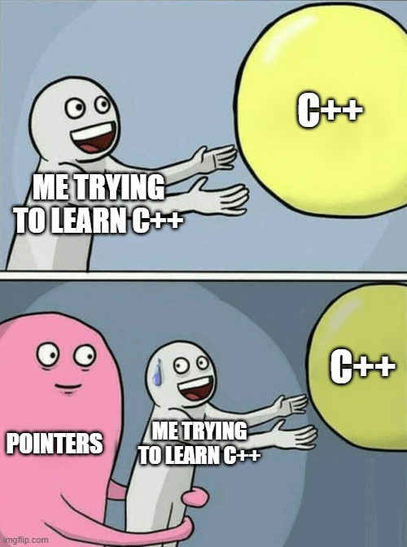
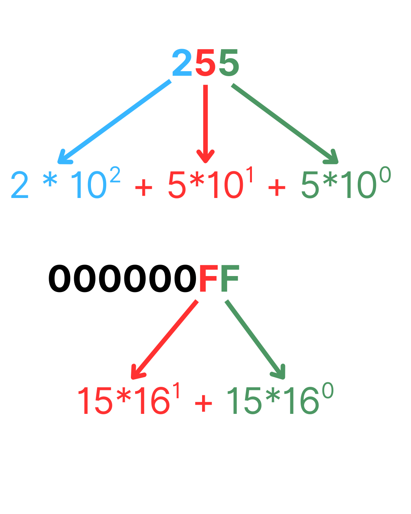
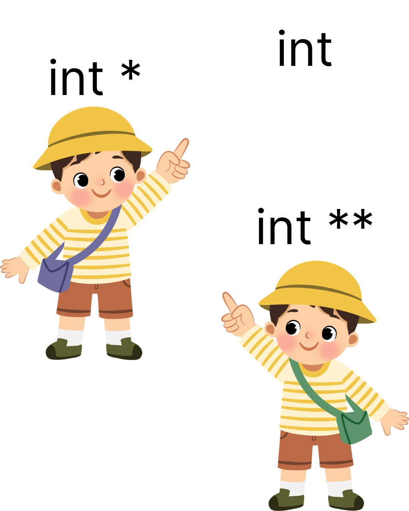
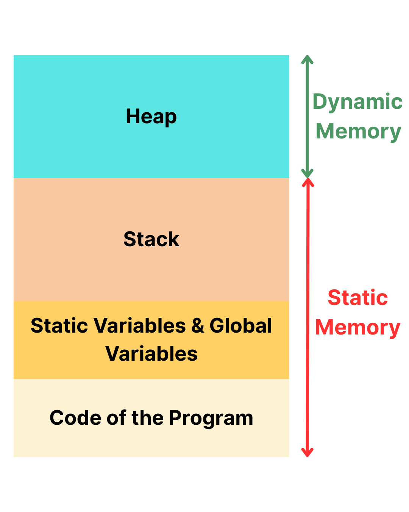
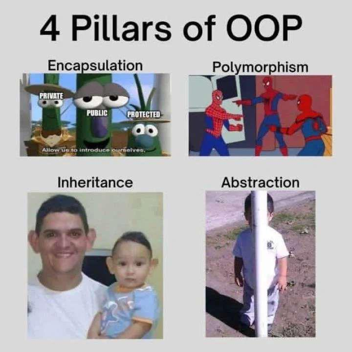
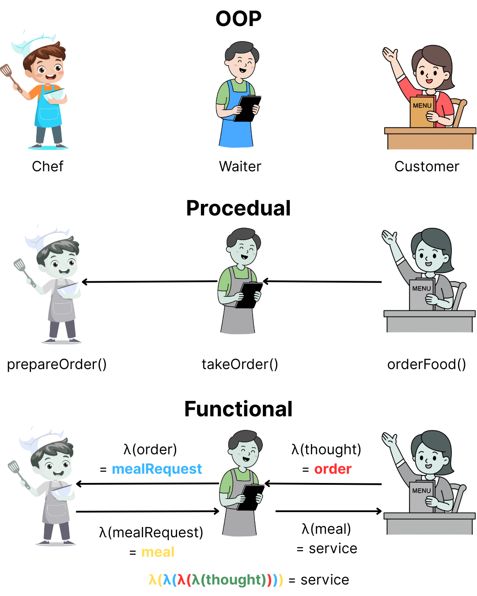

# YZM2031

## Data Structures and Algorithms

### Week 1: C++ Programming Fundamentals and Classes

**Instructor:** Ekrem Çetinkaya
**Date:** 01.10.2025

---

# Course Overview

<div class="two-columns">
<div class="column">

## What Will We Learn?

- **Analysis of algorithms** and complexity theory
- **Fundamental data structures** (array, linked list, stack, queue)
- **Tree structures** (binary tree, binary search tree, AVL tree, heap)
- **Hash table**
- **Graph structures** and algorithms
- **Sorting algorithms**
- **Searching algorithms**
- **Greedy algorithms**
- **Basic string algorithms**
</div>

<div class="column">

## Textbook

**Mark Allen Weiss, Data Structures and Algorithm Analysis in C++ (4th Edition)**

</div>

---

# Grading


## Assessment

- **Laboratory Work**: 30%
- **Midterm Exam**: 30%
- **Final Exam**: 40%

## Assessment Approach

**All exams are open-book**:

- ✅ Internet access allowed
- ✅ LLM tools (ChatGPT, Claude, etc.) permitted
- ✅ Course materials and notes encouraged
- **Focus**: Problem-solving ability, not memorization

---

# Course Policies

## Lecture Format


**🍅 Pomodoro Lectures**:

- 20-minute sessions followed by 5-minute breaks
- During breaks: stretch, chat, check phones, or step out - completely **your choice**
- **Why?** We all have attention span of a goldfish

## Attendance Philosophy

**No attendance tracking** - You're adults making your own educational choices

- Feel free to leave if the class isn't serving you that day
- No explanations needed, no penalties
- Your presence should be **by choice, not obligation**

---

# Weekly Schedule

<div class="two-columns">
<div class="column">

## Weeks 1-8

1. **C++ Programming Basics and Classes**
2. **Lists and Linked List**
3. **Stack and Queue**
4. **Queue and Chars/Strings**
5. **Algorithm Analysis**
6. **Trees**
7. **Binary Search Tree**
8. **Midterm 1 / Practice or Review**

</div>
<div class="column">

## Weeks 9-16

9. **Balanced Tree (AVL)**
10. **Heap Data Structure**
11. **Sorting Algorithms**
12. **Disjoint Sets**
13. **Hash Tables**
14. **Graph Data Structures**
15. **Algorithm Design Techniques**
16. **Final**

</div>
</div>

---

# Why Data Structures and Algorithms?

> "Algorithms + Data Structures = Programs"
>
> — Niklaus Wirth

## The Foundation of Computer Science

- **Problem Solving**: Breaking down complex problems into manageable parts
- **Efficiency**: Writing code that performs well at scale
- **Software Engineering**: Building maintainable and scalable systems

---

# Real-World Impact: Performance Matters

## Example: Social Media Timeline

```cpp
// Naive approach - O(n^2) for n users
for (each user) {
    for (each post) {
        if (post.timestamp > user.last_visit) {
            show_in_timeline(post);
        }
    }
}
```

**Problem**: 1 billion users × 1 million posts = 10<sup>15</sup> operations!

**Solution**: Efficient data structures + algorithms

- **Result**: Sub-second response times

---

# Real-World Impact: Google Search

<div class="two-columns">
<div class="column">

## The Challenge

- **30 trillion** web pages indexed
- **8.5 billion** searches per day
- **<0.5 seconds** average response time

</div>
<div class="column">

## The Solutions

- **Hash tables** for instant lookups
- **Trees** for organized data storage
- **Graph algorithms** for PageRank
- **Sorting algorithms** for result ranking

</div>
</div>

**Without efficient data structures and algorithms, Google wouldn't exist!**

---

# Why This Course in C++?



### Performance

- **Compiled language** - fast execution
- **Manual memory management** - optimal resource usage

### Industry Standard

- **System programming**: Operating systems, embedded systems
- **Performance-critical applications**: Games, HFT, scientific computing

### Learning Value

- **Understanding fundamentals**: Pointers, memory management
- **Foundation for other languages**: Java, C#, etc.

**Once you learn C++ rest will be childs play**

---

# C++ Programming Fundamentals

### Basic Program Structure

```cpp
#include <iostream>
using namespace std;

int main() {
    cout << "Hello, Data Structures!" << endl;
    return 0;
}
```

### Key Components

- **Preprocessor directives**: `#include`
- **Namespaces**: `using namespace std;`
- **Main function**: Entry point of program
- **Input/Output**: `cin`, `cout`

---

# Variables and Data Types

### Primitive Data Types

```cpp
// Integer types
short score = 95;
int age = 25;
long studentId = 20210001;

// Floating point types
float height = 5.9f;
double gpa = 3.85;

// Character and boolean
char grade = 'A';
bool isPassing = true;
```

### String Type

```cpp
#include <string>
string studentName = "John Doe";
string course = "Data Structures";
```

---

# Arrays and Vectors

### Static Arrays

```cpp
// Fixed size array
int scores[5] = {85, 92, 78, 95, 88};

// Access elements
cout << "First score: " << scores[0] << endl;

// Iterate through array
for (int i = 0; i < 5; i++) {
    cout << scores[i] << " ";
}
```

### Dynamic Arrays (Vectors)

```cpp
#include <vector>

vector<int> grades;
grades.push_back(85);
grades.push_back(92);

cout << "Size: " << grades.size() << endl;
```

---

# Multi-dimensional Arrays

### 2D Arrays (Static)

```cpp
// 2D array declaration
int matrix[3][4];  // 3 rows, 4 columns

// Initialize 2D array
int grid[2][3] = {
    {1, 2, 3},
    {4, 5, 6}
};

// Access elements
cout << grid[0][1] << endl;  // Prints: 2

// Iterate through 2D array
for (int i = 0; i < 2; i++) {
    for (int j = 0; j < 3; j++) {
        cout << grid[i][j] << " ";
    }
    cout << endl;
}
```

---

# Dynamic 2D Arrays

### Using Vectors of Vectors

```cpp
#include <vector>

// Create 2D vector (3x4 matrix)
vector<vector<int>> matrix(3, vector<int>(4, 0));

// Access and modify
matrix[1][2] = 10;

// Add a new row
matrix.push_back({7, 8, 9, 10});

// Iterate through 2D vector
for (int i = 0; i < matrix.size(); i++) {
    for (int j = 0; j < matrix[i].size(); j++) {
        cout << matrix[i][j] << " ";
    }
    cout << endl;
}
```

---

# Pass by Value vs Pass by Reference

### Pass by Value (Copy)

```cpp
void modifyValue(int x) {
    x = 100;  // Only modifies the copy
}

int main() {
    int num = 5;
    modifyValue(num);
    cout << num << endl;  // Still prints: 5
}
```

### Pass by Reference

```cpp
void modifyReference(int& x) {
    x = 100;  // Modifies the original
}

int main() {
    int num = 5;
    modifyReference(num);
    cout << num << endl;  // Prints: 100
}
```

---

# Arrays and Functions

### Passing Arrays to Functions

```cpp
// Array parameter (automatically becomes pointer)
void printArray(int arr[], int size) {
    for (int i = 0; i < size; i++) {
        cout << arr[i] << " ";
    }
}

// Alternative syntax (same thing)
void printArray2(int* arr, int size) {
    for (int i = 0; i < size; i++) {
        cout << arr[i] << " ";
    }
}

int main() {
    int numbers[5] = {1, 2, 3, 4, 5};
    printArray(numbers, 5);
}
```

**Important**: Arrays are always passed by reference (address)!

---

# Recursion Fundamentals

### What is Recursion?

A function that calls itself to solve smaller subproblems.

```cpp
// Factorial example
int factorial(int n) {
    // Base case
    if (n <= 1) {
        return 1;
    }
    // Recursive case
    return n * factorial(n - 1);
}

// Fibonacci example
int fibonacci(int n) {
    if (n <= 1) {
        return n;
    }
    return fibonacci(n - 1) + fibonacci(n - 2);
}
```

**Key Components**: Base case + Recursive case

---

# Struct - Simple Data Grouping

### Basic Structure

```cpp
struct Point {
    int x;
    int y;
};

struct Student {
    string name;
    int id;
    double gpa;
};

int main() {
    Point p1 = {10, 20};
    Student s1 = {"Alice", 123, 3.8};
    
    cout << "Point: (" << p1.x << ", " << p1.y << ")" << endl;
    cout << "Student: " << s1.name << endl;
}
```

**Note**: In C++, `struct` is almost identical to `class` (default public access)
* We will go into details of `class` structure later on

---

# Operators in C++

### Arithmetic Operators

```cpp
int a = 10, b = 3;
cout << "Addition: " << a + b << endl;       // 13
cout << "Subtraction: " << a - b << endl;    // 7
cout << "Multiplication: " << a * b << endl; // 30
cout << "Division: " << a / b << endl;       // 3 (integer division)
cout << "Modulus: " << a % b << endl;        // 1
```

### Comparison Operators

```cpp
cout << (a == b) << endl;  // 0 (false)
cout << (a != b) << endl;  // 1 (true)
cout << (a > b) << endl;   // 1 (true)
cout << (a < b) << endl;   // 0 (false)
cout << (a >= b) << endl;  // 1 (true)
cout << (a <= b) << endl;  // 0 (false)
```

---

# Logical and Assignment Operators

### Logical Operators

```cpp
bool x = true, y = false;
cout << (x && y) << endl;  // 0 (false) - AND
cout << (x || y) << endl;  // 1 (true)  - OR
cout << (!x) << endl;      // 0 (false) - NOT
```

### Assignment Operators

```cpp
int num = 5;
num += 3;  // num = num + 3 → num = 8
num -= 2;  // num = num - 2 → num = 6
num *= 4;  // num = num * 4 → num = 24
num /= 3;  // num = num / 3 → num = 8
num++;     // num = num + 1 → num = 9
```

---

# Control Structures: Conditional Statements

<div class="two-columns">
<div class="column">

### if-else Statement

```cpp
int score = 85;

if (score >= 90) {
    cout << "Grade: A" << endl;
} else if (score >= 80) {
    cout << "Grade: B" << endl;
} else if (score >= 70) {
    cout << "Grade: C" << endl;
} else {
    cout << "Grade: F" << endl;
}
```

</div>

<div class="column">

### switch Statement

```cpp
char grade = 'B';
switch (grade) {
    case 'A':
        cout << "Excellent!" << endl;
        break;
    case 'B':
        cout << "Good!" << endl;
        break;
    default:
        cout << "Invalid grade" << endl;
}
```
</div>
</div>

---

# Control Structures: Loops

<div class="two-columns">
<div class="column">

### for Loop

```cpp
// Print numbers 1 to 5
for (int i = 1; i <= 5; i++) {
    cout << i << " ";
}
// Output: 1 2 3 4 5

// Array traversal
int arr[4] = {10, 20, 30, 40};
for (int i = 0; i < 4; i++) {
    cout << arr[i] << " ";
}

// Output: 10 20 30 40 
```

</div>

<div class="column">

### while and do-while Loops

```cpp
// while loop
int count = 1;
while (count <= 3) {
    cout << "Count: " << count << endl;
    count++;
}

// do-while loop
int num;
do {
    cout << "Enter a positive number: ";
    cin >> num;
} while (num <= 0);
```

</div>
</div>

---

# Functions

### Function Declaration and Definition

```cpp
// Function declaration
int calculateSum(int a, int b);

// Function definition
int calculateSum(int a, int b) {
    return a + b;
}

// Function with default parameters
int power(int base, int exponent = 2) {
    int result = 1;
    for (int i = 0; i < exponent; i++) {
        result *= base;
    }
    return result;
}
```

---

# Input and Output Operations

<div class="two-columns">
<div class="column">

### Basic Input/Output

```cpp
#include <iostream>
using namespace std;

int main() {
    string name;
    int age;

    cout << "Enter your name: ";
    cin >> name;

    cout << "Enter your age: ";
    cin >> age;

    cout << "Hello " << name << ", you are " << age << " years old!" << endl;

    return 0;
}
```

</div>
<div class="column">

### Reading Multiple Values

```cpp
int a, b, c;
cout << "Enter three numbers: ";
cin >> a >> b >> c;

cout << "Sum: " << (a + b + c) << endl;
cout << "Average: " << (a + b + c) / 3.0 << endl;
```
</div>
</div>

---

# Representation of Data

## Data is represented as a sequence of bits

- **Bits**: the smallest unit of storage
  - Can be either 0 or 1
  - Similar to electric charge - transistors
- **Byte** = the smallest addressable data size (8 bits)
  - e.g. 0 1 0 1 1 0 1 0
- **1 char = 1 byte**
  - How many distinct patterns can a byte have?
    - 256 (2<sup>8</sup>)
    - N bit yields 2<sup>n</sup> patterns

---

# Hexadecimals

## Base 16 - 4 binary digits

<style scoped>
.two-columns-table {
  display: flex;
  gap: 32px;
  justify-content: center;
  font-size: 20px;
  text-align: center;
}
.two-columns-table table {
  border-collapse: collapse;
  margin: 0;
}
.two-columns-table th, .two-columns-table td {
  border: 1px solid #ccc;
  padding: 2px 8px;
}
</style>

<div class="two-columns-table">
  <table>
    <thead>
      <tr>
        <th>decimal</th>
        <th>hexadecimal</th>
        <th>binary</th>
      </tr>
    </thead>
    <tbody>
      <tr><td>0</td><td>0</td><td>0000</td></tr>
      <tr><td>1</td><td>1</td><td>0001</td></tr>
      <tr><td>2</td><td>2</td><td>0010</td></tr>
      <tr><td>3</td><td>3</td><td>0011</td></tr>
      <tr><td>4</td><td>4</td><td>0100</td></tr>
      <tr><td>5</td><td>5</td><td>0101</td></tr>
      <tr><td>6</td><td>6</td><td>0110</td></tr>
      <tr><td>7</td><td>7</td><td>0111</td></tr>
    </tbody>
  </table>
  <table>
    <thead>
      <tr>
        <th>decimal</th>
        <th>hexadecimal</th>
        <th>binary</th>
      </tr>
    </thead>
    <tbody>
      <tr><td>8</td><td>8</td><td>1000</td></tr>
      <tr><td>9</td><td>9</td><td>1001</td></tr>
      <tr><td>10</td><td>A</td><td>1010</td></tr>
      <tr><td>11</td><td>B</td><td>1011</td></tr>
      <tr><td>12</td><td>C</td><td>1100</td></tr>
      <tr><td>13</td><td>D</td><td>1101</td></tr>
      <tr><td>14</td><td>E</td><td>1110</td></tr>
      <tr><td>15</td><td>F</td><td>1111</td></tr>
    </tbody>
  </table>
</div>

---

# Memory Layout and Addresses

## Memory is organized as a sequence of bytes

- Each byte has a unique **memory address**
- Addresses are typically shown in **hexadecimal** format
- Variables are stored at specific memory locations

## Example: Variable Declaration

```cpp
int anInt = 255;
```

What happens:

1. Compiler allocates 4 bytes of memory (for `int`)
2. Assigns a memory address (e.g., `0x1000`)
3. Stores the value `255` at that address
4. Associates the name `anInt` with that address

---

# Memory Addressing

## Address vs Value

```cpp
int anInt = 255;
cout << "Value: " << anInt << endl;        // Prints: 255
cout << "Address: " << &anInt << endl;     // Prints: 0x1000
```

- **`&` operator**: Gets the address of a variable
- **Memory addresses** are unique identifiers for memory locations

---

# Data Types and Memory

## Different Types, Different Sizes

```cpp
char c = 'A';        // 1 byte
int i = 42;          // 4 bytes 
double d = 3.14;     // 8 bytes 
```

## Memory Layout Example

```
Variable | Address | Size | Value
---------|---------|------|-------
c        | 0x1000  | 1    | 'A'
i        | 0x1001  | 4    | 42
d        | 0x1005  | 8    | 3.14
```

**Important**: Exact sizes may vary by system, but relationships remain consistent.

---

# Memory Allocation

## What happens when we define variables?

When we declare variables in our programs, the computer needs to:

1. **Allocate memory space** for the variable
2. **Assign a memory address** to that space
3. **Store the value** in that memory location
4. **Keep track** of the variable name and its address

Let's explore how this works in detail...

---

# What happens when we define variables?

## Example: Variable Declaration

```cpp
int anInt = 255;
```

<div class="two-columns">
<div class="column">

**Memory Layout:**

<table>
    <thead>
        <tr>
            <th>Address</th>
            <th>Content</th>
            <th>Name</th>
            <th>Type</th>
            <th>Value</th>
        </tr>
    </thead>
    <tbody>
        <tr>
            <td>0x1000</td>
            <td>00</td>
            <td rowspan=4>anInt</td>
            <td rowspan=4>int</td>
            <td rowspan=4>000000FF(255<sub>10</sub>)</td>
        </tr>
        <tr>
            <td>0x1001</td>
            <td>00</td>
        </tr>
        <tr>
            <td>0x1002</td>
            <td>00</td>
        </tr>
        <tr>
            <td>0x1003</td>
            <td>FF</td>
        </tr>
    </tbody>
</table>

</div>
<div class="column">

**Key Points:**

- **int: 4 bytes**
- **oeach content is one byte**
- **each byte of memory has an address**

</div>
</div>

---

# How 255 becomes 000000FF ?



- 000000FF = 8-digit hexadecimal number (Base-16)
- FF = 15 in decimal (base-10)
- (15 * 16<sup>0</sup>) + (15 * 16<sup>1</sup>) = 255

**`0x`indicates it's in hexadecimal format, so most of the time you will see notations like 0xFF for 255**

---

# Variable Assignment and Lookup

## How the compiler tracks variables

```cpp
int anInt = 255;
```

<div class="two-columns">
<div class="column">

**Memory Layout:**

<table>
    <thead>
        <tr>
            <th>Address</th>
            <th>Content</th>
            <th>Name</th>
            <th>Type</th>
            <th>Value</th>
        </tr>
    </thead>
    <tbody>
        <tr>
            <td>0x1000</td>
            <td>00</td>
            <td rowspan=4>anInt</td>
            <td rowspan=4>int</td>
            <td rowspan=4>000000FF(255<sub>10</sub>)</td>
        </tr>
        <tr>
            <td>0x1001</td>
            <td>00</td>
        </tr>
        <tr>
            <td>0x1002</td>
            <td>00</td>
        </tr>
        <tr>
            <td>0x1003</td>
            <td>FF</td>
        </tr>
    </tbody>
</table>

</div>
<div class="column">

**Lookup Table 🔍**

<table>
    <tbody>
       <tr>
        <td>anInt</td>
        <td>int</td>
        <td>0x1000</td>
        </tr>
    </tbody>
</table>

- This table stores the address for the value
- This not a _pointer_, we will come to them
</div>
</div>

---

# Variable Assignment and Lookup

## What if we add a new variable?

```cpp
int anInt = 255;
short aShort = -1;
```

<div class="two-columns">
<div class="column">

**Memory Layout:**

<table>
    <thead>
        <tr>
            <th>Address</th>
            <th>Content</th>
            <th>Name</th>
            <th>Type</th>
            <th>Value</th>
        </tr>
    </thead>
    <tbody>
        <tr>
            <td>0x1000</td>
            <td>00</td>
            <td rowspan=4>anInt</td>
            <td rowspan=4>int</td>
            <td rowspan=4>000000FF(255<sub>10</sub>)</td>
        </tr>
        <tr>
            <td>0x1001</td>
            <td>00</td>
        </tr>
        <tr>
            <td>0x1002</td>
            <td>00</td>
        </tr>
        <tr>
            <td>0x1003</td>
            <td>FF</td>
        </tr>
        <tr>
            <td>0x1004</td>
            <td>FF</td>
            <td rowspan=2>aShort</td>
            <td rowspan=2>short</td>
            <td rowspan=2>FFFF(-1<sub>10</sub>)
        </tr>
        <tr>
            <td>0x1005</td>
            <td>FF</td>
        </tr>
    </tbody>
</table>

</div>
<div class="column">

**Lookup Table 🔍**

<table>
    <tbody>
       <tr>
            <td>anInt</td>
            <td>int</td>
            <td>0x1000</td>
        </tr>
        <tr>
            <td>aShort</td>
            <td>short</td>
            <td>0x1004</td>
        </tr>
    </tbody>
</table>

- Lookup table is updated with the new variable address
</div>
</div>

---

# Variable Reassignment

## What happens when we change the value?

```cpp
int anInt = 300;
short aShort = -1;
```

<div class="two-columns">
<div class="column">

**Memory Layout:**

<table>
    <thead>
        <tr>
            <th>Address</th>
            <th>Content</th>
            <th>Name</th>
            <th>Type</th>
            <th>Value</th>
        </tr>
    </thead>
    <tbody>
        <tr>
            <td>0x1000</td>
            <td>00</td>
            <td rowspan=4>anInt</td>
            <td rowspan=4>int</td>
            <td rowspan=4>0000012C(300<sub>10</sub>)</td>
        </tr>
        <tr>
            <td>0x1001</td>
            <td>00</td>
        </tr>
        <tr>
            <td>0x1002</td>
            <td>00</td>
        </tr>
        <tr>
            <td>0x1003</td>
            <td>FF</td>
        </tr>
        <tr>
            <td>0x1004</td>
            <td>FF</td>
            <td rowspan=2>aShort</td>
            <td rowspan=2>short</td>
            <td rowspan=2>FFFF(-1<sub>10</sub>)
        </tr>
        <tr>
            <td>0x1005</td>
            <td>FF</td>
        </tr>
    </tbody>
</table>

</div>
<div class="column">

**Lookup Table 🔍**

<table>
    <tbody>
       <tr>
            <td>anInt</td>
            <td>int</td>
            <td>0x1000</td>
        </tr>
        <tr>
            <td>aShort</td>
            <td>short</td>
            <td>0x1004</td>
        </tr>
    </tbody>
</table>

- Lookup table is **not changed**
- **Key Point**: The address stays the same, only the content changes!
</div>
</div>

---

# Pointers and References

## Pointers

```cpp
int value = 42;
int* ptr = &value;  // Pointer to value

cout << "Value: " << value << endl;        // 42
cout << "Address: " << &value << endl;     // Memory address
cout << "Pointer: " << ptr << endl;        // Same address
cout << "Dereferenced: " << *ptr << endl;  // 42
```

## References

```cpp
int original = 100;
int& ref = original;  // Reference to original

ref = 200;  // Changes original to 200
cout << original << endl;  // Prints 200
```

---

# Pointers
<div class="two-columns">
<div class="column">

## A Pointer is also a variable

```cpp
int anInt = 300;
short aShort = -1;
int* ptrAnInt = &anInt;
```

### Lookup Table 🔍

<table>
    <tbody>
       <tr>
            <td>anInt</td>
            <td>int</td>
            <td>0x1000</td>
        </tr>
        <tr>
            <td>aShort</td>
            <td>short</td>
            <td>0x1004</td>
        </tr>
        <tr>
            <td>ptrAnInt</td>
            <td>int*</td>
            <td>0x1006</td>
        </tr>
    </tbody>
</table>

</div>

<div class="column">

**Memory Layout:**

<table>
    <thead>
        <tr>
            <th>Address</th>
            <th>Content</th>
            <th>Name</th>
            <th>Type</th>
            <th>Value</th>
        </tr>
    </thead>
    <tbody>
        <tr>
            <td>0x1000</td>
            <td>00</td>
            <td rowspan=4>anInt</td>
            <td rowspan=4>int</td>
            <td rowspan=4>0000012C(300<sub>10</sub>)</td>
        </tr>
        <tr>
            <td>0x1001</td>
            <td>00</td>
        </tr>
        <tr>
            <td>0x1002</td>
            <td>00</td>
        </tr>
        <tr>
            <td>0x1003</td>
            <td>FF</td>
        </tr>
        <tr>
            <td>0x1004</td>
            <td>FF</td>
            <td rowspan=2>aShort</td>
            <td rowspan=2>short</td>
            <td rowspan=2>FFFF(-1<sub>10</sub>)
        </tr>
        <tr>
            <td>0x1005</td>
            <td>FF</td>
        </tr>
        <tr>
            <td>0x1006</td>
            <td>00</td>
            <td rowspan=4>ptrAnInt</td>
            <td rowspan=4>int*</td>
            <td rowspan=4>0x1000</td>
        </tr>
        <tr>
            <td>0x1007</td>
            <td>10</td>
        </tr>
        <tr>
            <td>0x1008</td>
            <td>00</td>
        </tr>
        <tr>
            <td>0x1009</td>
            <td>00</td>
        </tr>
    </tbody>
</table>

</div>

</div>

---

# Double Pointers



```cpp
int value = 42;
int* ptr = &value;      // Pointer
int** doublePtr = &ptr; // Pointer to pointer

cout << "Value: " << **doublePtr << endl;  // 42
cout << "Single ptr: " << *doublePtr << endl;   // Address of value
cout << "Double ptr: " << doublePtr << endl;    // Address of ptr
```

**Use case**: Dynamic 2D arrays, modifying pointers in functions

```cpp
// Dynamic 2D array (e.g., a 3x4 matrix)
int rows = 3, cols = 4;
int** matrix = new int*[rows];
for (int i = 0; i < rows; ++i) {
    matrix[i] = new int[cols];
}
matrix[1][2] = 100; // Set value
```

---

# Dynamic 2D Arrays: Two Approaches

<div class="two-columns">
<div class="column">

### 1. Array of Pointers (`int**`)

This is the "classic" way. You have an array of pointers, and each of those pointers points to a row array.

```cpp
int** matrix = new int*[rows];
for (int i = 0; i < rows; i++) {
    matrix[i] = new int[cols];
}
```

- **Pros**:
  - Intuitive access: `matrix[i][j]`
  - Supports "jagged arrays" (rows of different lengths).
- **Cons**:
  - Memory is not contiguous (rows can be anywhere).
  - Slightly more memory overhead.
  - Deallocation requires a loop.

</div>
<div class="column">

### 2. Single Pointer (`int*`)

This approach allocates one large, contiguous block of memory and simulates 2D access.

```cpp
int* matrix = new int[rows * cols];

// Access requires manual calculation
matrix[i * cols + j] = 100;
```

- **Pros**:
  - Contiguous memory (often better for cache performance).
  - Simpler deallocation (`delete[] matrix`).
- **Cons**:
  - Less intuitive access: `matrix[i * cols + j]`
  - Doesn't naturally support jagged arrays.

</div>
</div>

---


<style scoped>
p { text-align: center}
img {text-align: center}
h1 {text-align: center; margin-bottom: -4px}
</style>

# Memory Map of the Program



---

# Static vs Dynamic Memory

<div class="two-columns">
<div class="column">

### Static Memory
- Allocated at compile time
- Size determined before program runs
- Stored in stack or data segment

```cpp
int staticArray[100];  // Size fixed at compile time
char buffer[256];      // Cannot change size
```

**Characteristics:**

- Automatic management
- Fast allocation/deallocation
- Limited size
- **LIFO** order

</div>

<div class="column">

### Dynamic Memory
- Allocated at runtime
- Size determined during execution
- Stored in heap

```cpp
int size = getUserInput();
int* dynamicArray = new int[size];  // Size determined at runtime
```

**Characteristics:**

- Manual management
- Larger memory space
- Slower allocation
- Risk of memory leaks

</div>
</div>


---

# When to Use Stack vs Heap

<div class="two-columns">
<div class="column">

### Use Stack When:
- **Small data** (few KB)
- **Known size** at compile time
- **Short lifetime** (function scope)
- **Fast access** needed

```cpp
void processData() {
    int buffer[1024];  // Small, temporary buffer
    // Automatic cleanup
}
```

</div>
<div class="column">

### Use Heap When:
- **Large data** (MB or more)
- **Unknown size** until runtime
- **Long lifetime** (beyond function scope)
- **Shared between functions**

```cpp
int* createLargeArray(int size) {
    return new int[size];  // Size determined at runtime
    // Caller responsible for delete[]
}
```
</div>
</div>

---

# Variable Scope and Lifetime

### Local vs Global Variables

```cpp
int globalVar = 100;  // Global variable

void function() {
    int localVar = 50;  // Local variable
    
    cout << globalVar << endl;  // Accessible
    cout << localVar << endl;   // Accessible
}

int main() {
    cout << globalVar << endl;  // Accessible
    cout << localVar << endl;  // ERROR: Not accessible
    
    function();
    return 0;
}
```

| Type | Scope | Lifetime | Memory Location |
|------|-------|----------|-----------------|
| **Global** | Entire program | Program duration | Data segment |
| **Local** | Function only | Function duration | Stack |

---

# Memory Deallocation

### The `delete` Operator

```cpp
// Single variable
int* ptr = new int(42);
delete ptr;           // Free single object
ptr = nullptr;        // Good practice: avoid dangling pointer

// Arrays
int* arr = new int[10];
delete[] arr;         // Free array (note the [])
arr = nullptr;

// Objects
Student* s = new Student("Bob", 456, 3.5);
delete s;             // Calls destructor, then frees memory
s = nullptr;
```

**Critical Rules:**
- Every `new` must have a matching `delete`
- Use `delete[]` for arrays allocated with `new[]`
- Set pointer to `nullptr` after deletion

---

# Memory Management Best Practices

### Common Mistakes

```cpp
// ❌ Memory leak
void badFunction() {
    int* ptr = new int(100);
    return;  // Memory never freed!
}

// ❌ Double deletion
int* ptr = new int(50);
delete ptr;
delete ptr;  // Undefined behavior!

// ❌ Using after deletion
int* ptr = new int(25);
delete ptr;
cout << *ptr << endl;  // Undefined behavior!

// ❌ Wrong delete for arrays
int* arr = new int[10];
delete arr;  // Should be delete[]
```

---

# Memory Management Best Practices

### Good Practices

```cpp
// ✅ Proper cleanup
void goodFunction() {
    int* ptr = new int(100);
    delete ptr;
    ptr = nullptr;
}

// ✅ RAII (Resource Acquisition Is Initialization)
class SafeArray {
private:
    int* data;
    int size;
public:
    SafeArray(int s) : size(s) {
        data = new int[size];
    }
    ~SafeArray() {
        delete[] data;  // Automatic cleanup
    }
};
```

---

# Object-Oriented Programming



**OOP** is a programming paradigm based on the concept of `objects`

- **Objects** contain data (attributes) and code (methods)
- **Encapsulation**: Bundling data and methods together
- **Abstraction**: Hiding complex implementation details
- **Modularity**: Breaking programs into manageable pieces

## Why Use OOP?

- **Code Reusability**: Write once, use many times
- **Maintainability**: Easier to modify and debug
- **Real-world Modeling**: Represent real-world entities
- **Data Security**: Control access to data through methods

---

# OOP is not the Best !!



Some problems are best expressed using **functional** concepts
Some problems are best expressed using **OO** concepts
Some problems are best expressed using **procedural** concepts
No problem is best expressed using **logic programming** concepts

### Use the right paradigm for the problem at hand

---

# Introduction to Classes

## What is a Class?

- **Blueprint** or **template** for creating objects
- **Encapsulation** of data (attributes) and methods (functions)
- **Foundation** of Object-Oriented Programming
- Defines the **structure** and **behavior** of objects

## Class vs Object

<div class="two-columns">
<div class="column">

### Class

- **Template/Blueprint**
- Defines structure
- No memory allocated
- Example: `Student` class

</div>
<div class="column">

### Object

- **Instance** of a class
- Actual entity in memory
- Has specific values
- Example: `student1`, `student2`

</div>
</div>

---

# Basic Class Structure

```cpp
class Student {
private:
    string name;
    int id;
    double gpa;

public:
    // Constructor
    Student(string n, int i, double g);

    // Methods
    void displayInfo();
    double getGPA();
    void setGPA(double newGPA);
};
```

---

# Class Implementation

### Constructor and Methods

```cpp
// Constructor implementation
Student::Student(string n, int i, double g) {
    name = n;
    id = i;
    gpa = g;
}

// Method implementations
void Student::displayInfo() {
    cout << "Name: " << name << endl;
    cout << "ID: " << id << endl;
    cout << "GPA: " << gpa << endl;
}

double Student::getGPA() {
    return gpa;
}

void Student::setGPA(double newGPA) {
    if (newGPA >= 0.0 && newGPA <= 4.0) {
        gpa = newGPA;
    }
}
```

---

# Using Classes

### Creating and Using Objects

```cpp
int main() {
    // Create objects
    Student student1("Alice Johnson", 20210001, 3.85);
    Student student2("Bob Smith", 20210002, 3.42);

    // Use methods
    student1.displayInfo();

    // Modify object
    student1.setGPA(3.90);
    cout << "Updated GPA: " << student1.getGPA() << endl;

    return 0;
}
```

### Dynamic Object Creation

```cpp
Student* studentPtr = new Student("Charlie Brown", 20210003, 3.67);
studentPtr->displayInfo();
delete studentPtr; 
```

---

# Object Lifecycle

### Creation, Usage, and Destruction

```cpp
// 1. Object Creation (Constructor called)
Student alice("Alice Johnson", 12345, 3.8);

// 2. Object Usage
alice.displayInfo();
alice.setGPA(3.9);

// 3. Object goes out of scope (Destructor called automatically)
```

### Memory Management with Objects

<div class="two-columns">
<div class="column">

### Stack Objects

```cpp
void function() {
    Student s("John", 123, 3.5);
    // Automatic cleanup when function ends
}
```

</div>
<div class="column">

### Heap Objects

```cpp
void function() {
    Student* s = new Student("John", 123, 3.5);
    // Must manually delete
    delete s;
}
```

</div>
</div>

---

# Constructors and Destructors

### Multiple Constructors

```cpp
class Rectangle {
private:
    double width, height;

public:
    // Default constructor
    Rectangle() : width(1.0), height(1.0) {}

    // Parameterized constructor
    Rectangle(double w, double h) : width(w), height(h) {}

    // Copy constructor
    Rectangle(const Rectangle& other) : width(other.width), height(other.height) {}

    // Destructor
    ~Rectangle() {
        cout << "Rectangle destroyed" << endl;
    }

    double getArea() { return width * height; }
};
```

---

# Access Specifiers - Encapsulation

### Public, Private, Protected

```cpp
class BankAccount {
private:
    double balance;      // Can only be accessed within class
    string accountNumber;

protected:
    int accountType;     // Accessible in derived classes

public:
    // Public interface
    BankAccount(string accNum, double initialBalance);
    void deposit(double amount);
    bool withdraw(double amount);
    double getBalance() const;  // const method

private:
    bool validateTransaction(double amount);  // Helper method
};
```

**Benefits**: Data validation, controlled access, internal state protection

---

# Operator Overloading

### Making Classes Work with Operators

```cpp
class Complex {
private:
    double real, imag;

public:
    Complex(double r = 0, double i = 0) : real(r), imag(i) {}

    // Operator overloading
    Complex operator+(const Complex& other) const {
        return Complex(real + other.real, imag + other.imag);
    }

    Complex operator-(const Complex& other) const {
        return Complex(real - other.real, imag - other.imag);
    }

    // Stream operators
    friend ostream& operator<<(ostream& out, const Complex& c) {
        out << c.real << " + " << c.imag << "i";
        return out;
    }
};
```

---

# Templates: Generic Programming

<div class="two-columns">
<div class="column">

### Function Templates

```cpp
template <typename T>
T getMax(T a, T b) {
    return (a > b) ? a : b;
}

int main() {
    cout << getMax(10, 20) << endl;        // Works with int
    cout << getMax(3.14, 2.71) << endl;    // Works with double
    cout << getMax('a', 'z') << endl;      // Works with char
    return 0;
}
```

</div>
<div class="column">

### Class Templates

```cpp
template <typename T>
class Stack {
private:
    vector<T> elements;

public:
    void push(T element) { elements.push_back(element); }
    T pop() {
        T top = elements.back();
        elements.pop_back();
        return top;
    }
    bool isEmpty() { return elements.empty(); }
};
```
</div>
</div>

---

# Advanced Class Features

<div class="two-columns">
<div class="column">

### Static Members

```cpp
class Student {
private:
    string name;
    static int totalStudents;  // Shared by all instances

public:
    Student(string n) : name(n) {
        totalStudents++;  // Increment for each new student
    }

    static int getTotalStudents() {
        return totalStudents;  // Static method
    }
};

// Static member definition
int Student::totalStudents = 0;
```

</div>
<div class="column">

### Usage

```cpp
Student s1("Alice");
Student s2("Bob");
cout << Student::getTotalStudents() << endl;  // Prints: 2
```
</div>
</div>

---

# Friend Functions and Classes

<div class="two-columns">
<div class="column">

### Friend Functions

```cpp
class Rectangle {
private:
    double width, height;

public:
    Rectangle(double w, double h) : width(w), height(h) {}

    // Friend function can access private members
    friend double calculateArea(const Rectangle& rect);
};

// Friend function implementation
double calculateArea(const Rectangle& rect) {
    return rect.width * rect.height;  // Direct access to private members
}
```

</div>
<div class="column">

### When to Use Friends

- **Operator overloading** (e.g., `<<` operator)
- **Performance-critical** operations
- **Related classes** that need to share data
- **Use sparingly** - breaks encapsulation

</div>
</div>

---

# Inheritance Preview

```cpp
// Base class
class Person {
protected:
    string name;
    int age;

public:
    Person(string n, int a) : name(n), age(a) {}
    void displayBasicInfo() {
        cout << "Name: " << name << ", Age: " << age << endl;
    }
};

// Derived class
class Student : public Person {
private:
    double gpa;

public:
    Student(string n, int a, double g) : Person(n, a), gpa(g) {}
    void displayStudentInfo() {
        displayBasicInfo();  // Inherited method
        cout << "GPA: " << gpa << endl;
    }
};
```

---

# Composition vs Inheritance

<div class="two-columns">
<div class="column">

### Composition ("Has-a")

```cpp
class Engine {
public:
    void start() { /* ... */ }
    void stop() { /* ... */ }
};

class Car {
private:
    Engine engine;  // Car HAS an Engine
    string brand;

public:
    void startCar() {
        engine.start();
    }
};
```

**Use when**: Object contains another object

</div>
<div class="column">

### Inheritance ("Is-a")

```cpp
class Vehicle {
public:
    void move() { /* ... */ }
};

class Car : public Vehicle {
    // Car IS a Vehicle
public:
    void honk() { /* ... */ }
};
```

**Use when**: Object is a specialized version of another

</div>
</div>

---

# STL (Standard Template Library)

### Common Containers

```cpp
#include <vector>
#include <list>
#include <map>
#include <set>

// Vector - dynamic array
vector<int> numbers = {1, 2, 3, 4, 5};

// List - doubly linked list
list<string> names = {"Alice", "Bob", "Charlie"};

// Map - key-value pairs
map<string, int> grades;
grades["Alice"] = 95;
grades["Bob"] = 87;

// Set - unique elements
set<int> uniqueNumbers = {3, 1, 4, 1, 5, 9};  // {1, 3, 4, 5, 9}
```

---

# Common C++ Pitfalls

## Memory Management

```cpp
// ❌ WRONG - Memory leak
Student* createStudent() {
    Student* s = new Student("John", 123, 3.5);
    return s;  // Who will delete this?
}

// ✅ CORRECT - Use smart pointers
unique_ptr<Student> createStudent() {
    return make_unique<Student>("John", 123, 3.5);
}
```

## Array Bounds

```cpp
int arr[5] = {1, 2, 3, 4, 5};
arr[10] = 100;  // ❌ Undefined behavior!

vector<int> vec = {1, 2, 3, 4, 5};
vec.at(10) = 100;  // ✅ Throws exception
```

---

# Best Practices

## Coding Style

- **Consistent naming**: Use camelCase or snake_case consistently
- **Meaningful names**: `studentCount` not `n`
- **Comments**: Explain why, not what
- **Const correctness**: Use `const` when data shouldn't change

## Design Principles

- **Single Responsibility**: Each class should have one job
- **Encapsulation**: Keep data private, provide public interface
- **RAII**: Resource Acquisition Is Initialization
- **DRY**: Don't Repeat Yourself

---

# Next Week Preview

## Week 2: Lists and Linked Lists

We'll explore:

- **Array-based lists** vs **linked lists**
- **Singly linked lists** implementation
- **Doubly linked lists**
- **Performance comparison**
- **When to use each data structure**

## Reading Assignment

- **Weiss Chapter 3.1-3.5**: Lists and Linked List
- **Review**: C++ pointers and dynamic memory allocation

---

# Questions & Discussion

## Today's Key Takeaways

1. **C++ fundamentals** are essential for implementing data structures
2. **Classes and objects** provide organization and encapsulation
3. **Memory management** is crucial for efficient programs
4. **Templates** enable generic, reusable code
5. **Algorithm efficiency** matters at scale

## Questions?

- About C++ concepts?
- About class design?
- About the course structure?
- About laboratory work?

---

# Thank You!

## Contact Information

- **Email:** ekrem.cetinkaya@yildiz.edu.tr
- **Office Hours:** Tuesday 14:00-16:00 - Room F-B21
- **Book a slot before coming to the office hours:** [Booking Link](https://calendar.app.google/aBKvBqNAqG12oD2B9)
- **Course Repository:** [GitHub Link](https://github.com/ekremcet/yzm2031-data-structures-and-algorithms)

## Next Class

- **Date:** 08.10.2025
- **Topic:** Lists and Linked Lists
- **Reading:** Weiss Chapter 3.1-3.5

**Get ready to dive deep into data structures!**
