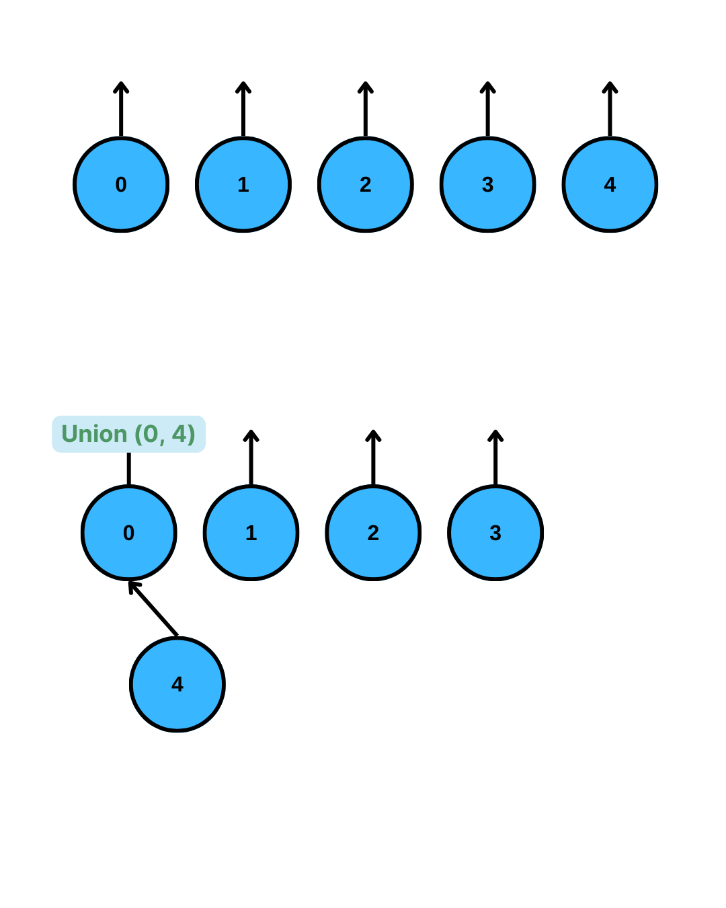
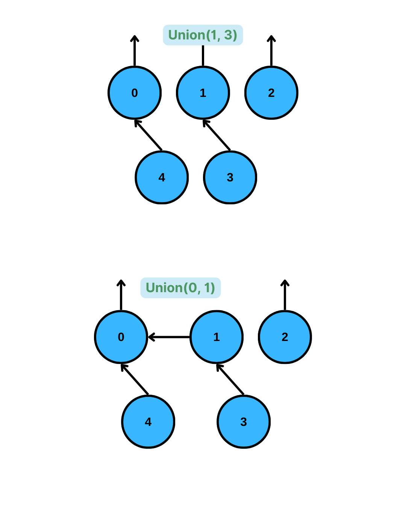

# YZM2031

## Data Structures and Algorithms

### Week 10: Disjoint Sets

**Instructor:** Ekrem Çetinkaya
**Date:** 17.12.2025

---

# Recap

## Sorting Algorithms

<div class="columns">

<div>

**Elementary Sorts ($O(N^2)$)**

- Bubble Sort: Swap adjacent pairs
- Selection Sort: Find min, swap to front
- Insertion Sort: Insert into sorted portion
- Shell Sort: Gap-based insertion sort

</div>

<div>

**Efficient Sorts ($O(N \log N)$)**

- Merge Sort: Divide, sort, merge
- Quick Sort: Partition around pivot
- Heap Sort: Build heap, extract max

**Key Properties:**

- Stability, In-place, Adaptivity

</div>

</div>

---

# Today's Agenda

1. **Motivation:** Why do we need disjoint sets?
2. **The Equivalence Problem:** Mathematical foundation
3. **Disjoint Set ADT:** Operations and interface
4. **Naive Implementations:** Quick-Find and Quick-Union
5. **Optimizations:** Union by Rank/Size, Path Compression
6. **Applications:** MST, Network Connectivity, Maze Generation

---

# The Grouping Problem

### Imagine you're building a social network

You have millions of users. You need to answer questions like:

- Are Alice and Bob in the same friend group?
- How many separate friend groups exist?
- If Alice befriends Charlie, how do we merge their groups?

### The Challenge

- Users can be connected through **chains** of friendships
- Groups can **merge dynamically** as new friendships form
- We need **fast** operations on potentially millions of elements
- Cannot afford to traverse entire groups for each query

---

# Real-World Examples

<div class="columns">

<div>

### Computer Networks

- Are two computers on the same network?
- Merge networks when a cable is connected
- Count number of isolated networks

### Pixels in an Image

- Which pixels belong to the same object?
- Segment image into connected regions
- Count distinct objects in a photo

</div>

<div>

### Electrical Circuits

- Are two components electrically connected?
- What happens when we add a wire?

### Road Networks

- Can we drive from city A to city B?
- Which cities are reachable from each other?
- What if we build a new road?

</div>

</div>

---

# The Core Problem

### We need a data structure that can:

1. **Track membership:** Which group does element X belong to?
2. **Merge groups:** Combine two groups into one
3. **Query connectivity:** Are X and Y in the same group?

### Performance Requirements

- Elements: Potentially **millions**
- Operations: Potentially **millions**
- Each operation should be **nearly constant time**

**This is exactly what the Disjoint Set data structure provides**

---

<!-- _footer: "" -->
<!-- _header: "" -->
<!-- _paginate: false -->

<style scoped>
p { text-align: center}
h1 {text-align: center; font-size: 72px}
</style>

# The Equivalence Problem

---

# Equivalence Relations

An **equivalence relation** $\sim$ on a set $S$ must satisfy three properties:

### 1. Reflexive

Every element is related to itself: $a \sim a$ for all $a \in S$

### 2. Symmetric

If $a$ is related to $b$, then $b$ is related to $a$: $a \sim b \Rightarrow b \sim a$

### 3. Transitive

If $a \sim b$ and $b \sim c$, then $a \sim c$

---

# Practice - Identify Equivalence Relations

### Which of these are equivalence relations?

1. **"Has the same birthday as"** on the set of people
2. **"Is taller than"** on the set of people
3. **"Is connected to"** in an electrical circuit
4. **"Is a sibling of"** (including yourself) on the set of people
5. **"Lives in the same city as"** on the set of people

---

# Answer - Identify Equivalence Relations

1. **"Same birthday as"** - **YES**

   - Reflexive: You have your own birthday
   - Symmetric: If A shares birthday with B, B shares with A
   - Transitive: If A and B share, B and C share → A and C share

2. **"Is taller than"** - **NO** (not reflexive, not symmetric)

3. **"Is connected to"** - **YES** (electrical connectivity)

4. **"Is a sibling of"** - **YES** (if we include "sibling of yourself")

5. **"Lives in same city as"** - **YES** (same reasoning as birthday)

---

# Equivalence Classes

An equivalence relation **partitions** the set into **disjoint subsets** called **equivalence classes**.

### Key Properties

- Every element belongs to **exactly one** equivalence class
- Two elements are in the same class **if and only if** they are related
- Classes are **mutually exclusive** and **collectively exhaustive**

### Visualization

```
Set S = {a, b, c, d, e, f, g, h}

Equivalence classes: {a, b, c}, {d, e}, {f, g, h}

  ┌─────────┐   ┌─────┐   ┌─────────┐
  │ a  b  c │   │ d e │   │ f  g  h │
  └─────────┘   └─────┘   └─────────┘
```

---

# Practice - Building Equivalence Classes

### Given: Set $S = \{0, 1, 2, 3, 4, 5, 6, 7\}$

### Relations given one by one:

1. $0 \sim 1$
2. $2 \sim 3$
3. $4 \sim 5$
4. $6 \sim 7$
5. $0 \sim 2$
6. $4 \sim 6$
7. $0 \sim 4$

**Question:** After each relation, how many equivalence classes exist? What are the final classes?

---

# Answer - Building Equivalence Classes

| Step    | Relation   | Classes                                | Count |
| :------ | :--------- | :------------------------------------- | :---- |
| Initial | -          | {0}, {1}, {2}, {3}, {4}, {5}, {6}, {7} | 8     |
| 1       | $0 \sim 1$ | {0,1}, {2}, {3}, {4}, {5}, {6}, {7}    | 7     |
| 2       | $2 \sim 3$ | {0,1}, {2,3}, {4}, {5}, {6}, {7}       | 6     |
| 3       | $4 \sim 5$ | {0,1}, {2,3}, {4,5}, {6}, {7}          | 5     |
| 4       | $6 \sim 7$ | {0,1}, {2,3}, {4,5}, {6,7}             | 4     |
| 5       | $0 \sim 2$ | {0,1,2,3}, {4,5}, {6,7}                | 3     |
| 6       | $4 \sim 6$ | {0,1,2,3}, {4,5,6,7}                   | 2     |
| 7       | $0 \sim 4$ | {0,1,2,3,4,5,6,7}                      | **1** |

---

# The Dynamic Equivalence Problem

### The Challenge

- Start with $N$ elements, each in its own equivalence class
- Process a sequence of **union** and **find** operations
- **Union(a, b):** Merge the classes containing $a$ and $b$
- **Find(a):** Return a "representative" of the class containing $a$

### Goal

Answer connectivity queries efficiently:

- Are $a$ and $b$ in the same equivalence class?
- Simply check: `Find(a) == Find(b)`

---

<!-- _footer: "" -->
<!-- _header: "" -->
<!-- _paginate: false -->

<style scoped>
p { text-align: center}
h1 {text-align: center; font-size: 72px}
</style>

# Disjoint Set ADT

---

# Disjoint Set ADT - Operations

### Core Operations

| Operation     | Description                                  | Returns        |
| :------------ | :------------------------------------------- | :------------- |
| `makeSet(x)`  | Create a new set containing only $x$         | void           |
| `find(x)`     | Get the representative of set containing $x$ | representative |
| `union(x, y)` | Merge sets containing $x$ and $y$            | void           |

### Derived Operation

| Operation         | Description                      | Implementation       |
| :---------------- | :------------------------------- | :------------------- |
| `connected(x, y)` | Are $x$ and $y$ in the same set? | `find(x) == find(y)` |

---

# Key Design Insight

### We don't need to enumerate set members

We only need to:

1. **Identify** which set an element belongs to (via representative)
2. **Compare** if two elements are in the same set
3. **Merge** two sets

### The Representative

- Each set has exactly **one representative** (also called root or leader)
- All elements in a set have the **same representative**
- Two elements are in the same set $\Leftrightarrow$ same representative

---

# Representation - Trees

### Each set is represented as a **tree**

- The **root** of the tree is the representative
- Each node points to its **parent**
- The root points to **itself**

```
Set {0, 1, 2, 3, 4}                    Two sets: {0,1,2} and {3,4}

        0  (root/representative)              0           3
       /|\                                   / \          |
      1 2 4                                 1   2         4
      |
      3
```

### Array Representation

`s[i] = i if i is a root`
`s[i] = label of the parent if i is not a root`

---

# Visualization



Initial State: 5 separate sets, each element is its own representative

```
set = [0, 1, 2, 3, 4]
```

After Union(0, 4): Make 4's root point to 0's root

```
set = [0, 1, 2, 3, 0]
```

---

# Visualization



After Union (1,3): Make 3's root point to 1's root

```
set = [0, 1, 2, 1, 0]
```

After Union(0, 1): Make 1's root point to 0's root

```
set = [0, 0, 2, 1, 0]
```

---

# Practice - Draw the Forest

### Given: 6 elements (0-5), initially separate

**Perform these operations (naive quick-union: attach first root under second):**

1. `union(1, 2)` - Make root of 1 point to root of 2
2. `union(3, 4)` - Make root of 3 point to root of 4
3. `union(5, 1)` - Make root of 5 point to root of 1
4. `union(3, 5)` - Make root of 3 point to root of 5

**Draw the forest and write the parent array after each step.**

---

# Answer - Draw the Forest

```
Initial:       0   1   2   3   4   5     parent = [0, 1, 2, 3, 4, 5]

Step 1: union(1,2) - root[1]=1, root[2]=2, parent[1]=2

               0   2   3   4   5         parent = [0, 2, 2, 3, 4, 5]
                   |
                   1

Step 2: union(3,4) - root[3]=3, root[4]=4, parent[3]=4

               0   2   4   5             parent = [0, 2, 2, 4, 4, 5]
                   |   |
                   1   3

Step 3: union(5,1) - root[5]=5, root[1]=2, parent[5]=2

               0   2   4                 parent = [0, 2, 2, 4, 4, 2]
                  /|   |
                 1 5   3

Step 4: union(3,5) - root[3]=4, root[5]=2, parent[4]=2

               0     2                   parent = [0, 2, 2, 4, 2, 2]
                   / | \
                  1  5  4
                        |
                        3
```

---

<!-- _footer: "" -->
<!-- _header: "" -->
<!-- _paginate: false -->

<style scoped>
p { text-align: center}
h1 {text-align: center; font-size: 72px}
</style>

# Naive Implementations

---

# Quick-Find (Array-Based Implementation)

### Idea

Store the **set ID** (representative) directly for each element.

```
Index:    0   1   2   3   4   5   6   7
SetID:   [0] [0] [0] [3] [3] [5] [5] [5]
```

- Elements 0, 1, 2 are in set "0"
- Elements 3, 4 are in set "3"
- Elements 5, 6, 7 are in set "5"

### Key Insight

Every element **directly stores** which set it belongs to.

---

# Quick-Find - Operations

### Find(x)

Simply return `id[x]` - **O(1)**

```cpp
int find(int x) {
    return id[x];
}
```

### Union(a, b)

Must update **all elements** with `id[a]` to have `id[b]` - **O(N)**

```cpp
void unionSets(int a, int b) {
    int idA = find(a);
    int idB = find(b);
    if (idA == idB) return;

    for (int i = 0; i < n; i++) {
        if (id[i] == idA)
            id[i] = idB;
    }
}
```

---

# Quick-Find - Complete Implementation

```cpp
class QuickFind {
private:
    vector<int> id;

public:
    QuickFind(int n) : id(n) {
        for (int i = 0; i < n; i++)
            id[i] = i;  // Initially, each element is its own set
    }

    int find(int x) {
        return id[x];  // O(1) - direct lookup
    }

    void unionSets(int a, int b) {
        int idA = find(a);
        int idB = find(b);
        if (idA == idB) return;  // Already in same set

        // Change ALL elements with id[a] to id[b]
        for (int i = 0; i < id.size(); i++) {
            if (id[i] == idA)
                id[i] = idB;
        }
    }  // O(N)

    bool connected(int a, int b) {
        return find(a) == find(b);  // O(1)
    }
};
```

---

# Practice - Trace Quick-Find

### Given: 5 elements (0-4), using Quick-Find

**Initial:** `id = [0, 1, 2, 3, 4]`

**Trace these operations:**

1. `union(0, 1)`
2. `union(2, 3)`
3. `union(0, 2)`
4. `connected(1, 3)`?
5. `connected(3, 4)`?

**Show the `id` array after each union.**

---

# Answer - Trace Quick-Find

```
Initial: id = [0, 1, 2, 3, 4]

Step 1: union(0, 1)
  - find(0) = 0, find(1) = 1
  - Change all 0s to 1s
  - id = [1, 1, 2, 3, 4]

Step 2: union(2, 3)
  - find(2) = 2, find(3) = 3
  - Change all 2s to 3s
  - id = [1, 1, 3, 3, 4]

Step 3: union(0, 2)
  - find(0) = 1, find(2) = 3
  - Change all 1s to 3s
  - id = [3, 3, 3, 3, 4]

Step 4: connected(1, 3)?
  - find(1) = 3, find(3) = 3 → TRUE

Step 5: connected(3, 4)?
  - find(3) = 3, find(4) = 4 → FALSE
```

---

# Quick-Find - Analysis

### The Problem: Union is too slow!

If we perform $N$ union operations:

```
union(0, 1)    // Scan all N elements
union(0, 2)    // Scan all N elements
union(0, 3)    // Scan all N elements
...
union(0, N-1)  // Scan all N elements
```

**Total: $O(N^2)$ for N unions**

### Complexity Summary

| Operation  | Time     |
| :--------- | :------- |
| `find`     | $O(1)$   |
| `union`    | $O(N)$   |
| $N$ unions | $O(N^2)$ |

---

# Quick-Union (Tree-Based Implementation)

### Idea

Store a **parent pointer** for each element. The root points to itself.

```
Index:     0   1   2   3   4   5   6   7
Parent:   [0] [0] [0] [3] [3] [5] [5] [5]

Tree visualization:
    0           3         5
   / \          |        / \
  1   2         4       6   7
```

### Key Insight

- Don't store set ID directly
- Store the **path** to the representative (via parent pointers)

---

# Quick-Union - Operations

### Find(x)

Follow parent pointers until reaching a root (where `parent[x] == x`)

```cpp
int find(int x) {
    while (x != parent[x])
        x = parent[x];
    return x;
}  // O(tree height)
```

### Union(a, b)

Make the root of one tree point to the root of the other

```cpp
void unionSets(int a, int b) {
    int rootA = find(a);
    int rootB = find(b);
    if (rootA != rootB)
        parent[rootA] = rootB;
}  // O(tree height)
```

---

# Quick-Union - Complete Implementation

```cpp
class QuickUnion {
private:
    vector<int> parent;

public:
    QuickUnion(int n) : parent(n) {
        for (int i = 0; i < n; i++)
            parent[i] = i;  // Each element is its own root
    }

    int find(int x) {
        while (x != parent[x])  // Follow chain to root
            x = parent[x];
        return x;
    }

    void unionSets(int a, int b) {
        int rootA = find(a);
        int rootB = find(b);
        if (rootA != rootB)
            parent[rootA] = rootB;  // Attach tree A under tree B
    }

    bool connected(int a, int b) {
        return find(a) == find(b);
    }
};
```

---

# Practice - Trace Quick-Union

### Given: 5 elements (0-4), using Quick-Union

**Initial:** `parent = [0, 1, 2, 3, 4]`

**Trace these operations:**

1. `union(0, 1)` - attach root(0) under root(1)
2. `union(2, 3)` - attach root(2) under root(3)
3. `union(3, 4)` - attach root(3) under root(4)
4. `union(0, 3)` - attach root(0) under root(3)
5. What is `find(0)`? How many steps?

**Show the `parent` array and draw trees after each union.**

---

# Answer - Trace Quick-Union (1/2)

```
Initial: parent = [0, 1, 2, 3, 4]
         Trees: 0  1  2  3  4

Step 1: union(0, 1) → parent[0] = 1
        parent = [1, 1, 2, 3, 4]
        Trees: 1  2  3  4
               |
               0

Step 2: union(2, 3) → parent[2] = 3
        parent = [1, 1, 3, 3, 4]
        Trees: 1  3  4
               |  |
               0  2

Step 3: union(3, 4) → find(3)=3, find(4)=4, parent[3] = 4
        parent = [1, 1, 3, 4, 4]
        Trees: 1  4
               |  |
               0  3
                  |
                  2
```

---

# Answer - Trace Quick-Union (2/2)

```
Step 4: union(0, 3) → find(0)=1, find(3)=4, parent[1] = 4
        parent = [1, 4, 3, 4, 4]
        Trees:      4
                  / |
                 1  3
                 |  |
                 0  2

find(0) = 0→1→4 = 4 (2 steps to reach root)
```

---

# Quick-Union - The Problem

### Trees can become very tall!

**Worst case:** Always attach larger tree under smaller

```
union(0, 1):   1          union(1, 2):   2          union(2, 3):   3
               |                         |                         |
               0                         1                         2
                                         |                         |
                                         0                         1
                                                                   |
                                                                   0
```

After $N-1$ unions in the worst order: **Linear chain (height = N-1)**

### Complexity

| Operation      | Worst Case |
| :------------- | :--------- |
| `find`         | $O(N)$     |
| `union`        | $O(N)$     |
| $M$ operations | $O(MN)$    |

---

# Practice - Worst Case Construction

### Question

You have 8 elements (0-7). Give a sequence of 7 union operations that creates the **worst possible** tree (maximum height).

---

# Answer - Worst Case Construction

To create maximum height, always attach to a single-node tree:

<div class="columns">

<div>

```
union(0, 1)  →  1-0           h=1
union(1, 2)  →  2-1-0         h=2
union(2, 3)  →  3-2-1-0       h=3
union(3, 4)  →  4-3-2-1-0     h=4
union(4, 5)  →  5-4-3-2-1-0   h=5
union(5, 6)  →  6-5-4-3-2-1-0 h=6
union(6, 7)  →  7-6...0       h=7
```

Now `find(0)` requires **7 steps**!

</div>

<div>

**Final Tree:**

```
        7
        |
        6
        |
        5
        |
        4
        |
        3
        |
        2
        |
        1
        |
        0
```

</div>

</div>

---

# Comparing Quick-Find vs Quick-Union

| Aspect       | Quick-Find | Quick-Union         |
| :----------- | :--------- | :------------------ |
| `find`       | $O(1)$     | $O(N)$ worst        |
| `union`      | $O(N)$     | $O(N)$ worst        |
| Space        | $O(N)$     | $O(N)$              |
| Advantage    | Fast find  | Less work per union |
| Disadvantage | Slow union | Tall trees possible |

### Neither is good enough!

Both have $O(N^2)$ worst case for $N$ operations.

**We need optimizations...**

---

<!-- _footer: "" -->
<!-- _header: "" -->
<!-- _paginate: false -->

<style scoped>
p { text-align: center}
h1 {text-align: center; font-size: 72px}
</style>

# Optimizations

---

# The Key Insight

### Why is Quick-Union slow?

Trees can become **tall and skinny** (like linked lists).

### Solution Ideas

1. **Union by Rank/Size:** Keep trees **short** by smart merging
2. **Path Compression:** Make trees **flatter** during find operations

### Goal

Reduce tree height from $O(N)$ to $O(\log N)$ or even better!

---

# Optimization 1 - Union by Rank

### The Problem

Naive union can create tall trees by attaching large trees under small ones.

### The Solution

Always attach the **shorter** tree under the **taller** tree.

```
BAD (height increases):          GOOD (height stays same):

    Small                              Large
      |                               /  |  \
    Large          vs               ... ... Small
   /  |  \
  ... ... ...
```

---

# What is Rank?

**Rank** is an upper bound on the height of a subtree.

### Rules

1. Initially, every node has rank 0 (single node, height 0)
2. When unioning two trees:
   - If ranks are **different**: attach smaller rank under larger rank
   - If ranks are **equal**: attach either under the other, **increment** the new root's rank

### Why upper bound?

Path compression (later) can reduce actual height, but we don't update rank. So rank ≥ actual height.

---

# Union by Rank - Step by Step

```
Initial: rank = [0, 0, 0, 0, 0, 0]

union(0, 1): rank[0]=0, rank[1]=0 (tie!)
  - Attach 1 under 0, increment rank[0]
  - rank = [1, 0, 0, 0, 0, 0]

       0
       |
       1

union(2, 3): rank[2]=0, rank[3]=0 (tie!)
  - Attach 3 under 2, increment rank[2]
  - rank = [1, 0, 1, 0, 0, 0]

       0     2
       |     |
       1     3

union(0, 2): rank[0]=1, rank[2]=1 (tie!)
  - Attach 2 under 0, increment rank[0]
  - rank = [2, 0, 1, 0, 0, 0]

         0
        / \
       1   2
           |
           3
```

---

# Union by Rank - Implementation

```cpp
class UnionFindRank {
private:
    vector<int> parent;
    vector<int> rank;  // Upper bound on tree height

public:
    UnionFindRank(int n) : parent(n), rank(n, 0) {
        for (int i = 0; i < n; i++)
            parent[i] = i;
    }

    int find(int x) {
        while (x != parent[x])
            x = parent[x];
        return x;
    }

    void unionSets(int a, int b) {
        int rootA = find(a), rootB = find(b);
        if (rootA == rootB) return;

        if (rank[rootA] < rank[rootB])
            parent[rootA] = rootB;
        else if (rank[rootA] > rank[rootB])
            parent[rootB] = rootA;
        else {
            parent[rootB] = rootA;
            rank[rootA]++;
        }
    }
};
```

---

# Practice - Union by Rank Trace

### Given: 8 elements (0-7), all rank 0

**Perform these operations with Union by Rank:**

1. `union(0, 1)`
2. `union(2, 3)`
3. `union(4, 5)`
4. `union(6, 7)`
5. `union(0, 2)`
6. `union(4, 6)`
7. `union(0, 4)`

**After each step, show the `rank` array and draw the trees.**

---

# Answer - Union by Rank Trace (Part 1)

```
Initial: rank = [0,0,0,0,0,0,0,0], parent = [0,1,2,3,4,5,6,7]

Step 1: union(0,1) - ranks equal, attach 1 under 0, rank[0]++
        rank = [1,0,0,0,0,0,0,0]
        Trees: 0  2  3  4  5  6  7
               |
               1

Step 2: union(2,3) - ranks equal, attach 3 under 2, rank[2]++
        rank = [1,0,1,0,0,0,0,0]
        Trees: 0  2  4  5  6  7
               |  |
               1  3

Step 3: union(4,5) - ranks equal, attach 5 under 4, rank[4]++
        rank = [1,0,1,0,1,0,0,0]
        Trees: 0  2  4  6  7
               |  |  |
               1  3  5

Step 4: union(6,7) - ranks equal, attach 7 under 6, rank[6]++
        rank = [1,0,1,0,1,0,1,0]
        Trees: 0  2  4  6
               |  |  |  |
               1  3  5  7
```

---

# Answer - Union by Rank Trace (Part 2)

```
After Step 4: rank = [1,0,1,0,1,0,1,0]

Step 5: union(0,2) - rank[0]=1, rank[2]=1 (equal!)
        Attach 2 under 0, rank[0]++
        rank = [2,0,1,0,1,0,1,0]

           0     4  6
          / \    |  |
         1   2   5  7
             |
             3

Step 6: union(4,6) - rank[4]=1, rank[6]=1 (equal!)
        Attach 6 under 4, rank[4]++
        rank = [2,0,1,0,2,0,1,0]

           0       4
          / \     / \
         1   2   5   6
             |       |
             3       7

Step 7: union(0,4) - rank[0]=2, rank[4]=2 (equal!)
        Attach 4 under 0, rank[0]++
        rank = [3,0,1,0,2,0,1,0]

              0
           / / \ \
          1 2   4
            |  / \
            3 5   6
                  |
                  7

Maximum height = 3 (instead of 7 without optimization!)
```

---

# Union by Rank - Why It Works

### Theorem

With Union by Rank, tree height is at most $O(\log N)$.

### Proof Sketch

- A tree of rank $r$ has at least $2^r$ nodes
- Why? When two trees of rank $r-1$ merge, the result has rank $r$ and at least $2^{r-1} + 2^{r-1} = 2^r$ nodes
- With $N$ nodes: $2^r \leq N \Rightarrow r \leq \log_2 N$

### Complexity with Union by Rank

| Operation | Time        |
| :-------- | :---------- |
| `find`    | $O(\log N)$ |
| `union`   | $O(\log N)$ |

**Much better than $O(N)$!**

---

# Alternative - Union by Size

Instead of rank, track the **number of nodes** in each tree.

```cpp
void unionSets(int a, int b) {
    int rootA = find(a), rootB = find(b);
    if (rootA == rootB) return;

    // Attach smaller tree under larger tree
    if (size[rootA] < size[rootB]) {
        parent[rootA] = rootB;
        size[rootB] += size[rootA];
    } else {
        parent[rootB] = rootA;
        size[rootA] += size[rootB];
    }
}
```

### Same $O(\log N)$ guarantee!

Both Union by Rank and Union by Size achieve $O(\log N)$ height.

---

# Optimization 2 - Path Compression

### Observation

When we call `find(x)`, we traverse the entire path to the root. But we could **remember** the result

### Idea

During `find(x)`, make every node on the path point **directly to the root**.

```
Before find(0):              After find(0) with path compression:

        4                           4
        |                        / | \ \
        3                       0  1  2  3
        |
        2
        |
        1
        |
        0

Next time find(0), find(1), find(2), find(3) are all O(1)!
```

---

# Path Compression - Recursive Implementation

```cpp
int find(int x) {
    if (x != parent[x])
        parent[x] = find(parent[x]);  // Recursively find root, then compress
    return parent[x];
}
```

### How it works

1. Recursively find the root
2. On the way back up, update each node to point directly to root
3. Next access is $O(1)$

---

# Path Compression - Iterative Implementation

```cpp
int find(int x) {
    // First pass: find the root
    int root = x;
    while (root != parent[root])
        root = parent[root];

    // Second pass: compress the path
    while (x != root) {
        int next = parent[x];
        parent[x] = root;  // Point directly to root
        x = next;
    }
    return root;
}
```

### Two-pass algorithm

1. Find the root (standard traversal)
2. Walk path again, updating all nodes to point to root

---

# Practice - Path Compression Trace

<div class="columns">

<div>

**Given this tree:**

```
        6
        |
        5
        |
        4
        |
        3
        |
        2
        |
        1
        |
        0
```

</div>

<div>

**Initial Parent Array:**

```
parent = [1, 2, 3, 4, 5, 6, 6]
```

### Question

**Trace `find(0)` with path compression.**

Show the parent array after the operation.

</div>

</div>

---

# Answer - Path Compression Trace

```
Initial: parent = [1, 2, 3, 4, 5, 6, 6]

find(0):
  Step 1: Find root
    0 → 1 → 2 → 3 → 4 → 5 → 6 → 6 (root = 6)

  Step 2: Compress path
    parent[0] = 6
    parent[1] = 6
    parent[2] = 6
    parent[3] = 6
    parent[4] = 6
    parent[5] = 6

Final: parent = [6, 6, 6, 6, 6, 6, 6]

Tree after:
          6
       /|||||\
      0 1 2 3 4 5

Now find(0), find(1), find(2), find(3), find(4), find(5) are all O(1)!
```

---

# Alternative Compression - Path Splitting

**Path Splitting:** Make every node point to its **grandparent**.

```cpp
int find(int x) {
    while (x != parent[x]) {
        int next = parent[x];
        parent[x] = parent[parent[x]];  // Point to grandparent
        x = next;
    }
    return x;
}
```

Doesn't compress as aggressively, but simpler (single pass).

---

# Alternative Compression - Path Halving

**Path Halving:** Make every **other** node point to its grandparent.

```cpp
int find(int x) {
    while (x != parent[x]) {
        parent[x] = parent[parent[x]];  // Point to grandparent
        x = parent[x];                  // Skip to grandparent
    }
    return x;
}
```

Even simpler! Also achieves nearly optimal performance.

---

# Combining Both Optimizations

### Union by Rank + Path Compression

When we use **both** optimizations together:

### Amortized Time Complexity

$O(\alpha(N))$ where $\alpha$ is the **inverse Ackermann function**.

### What is the Ackermann function?

A function that grows **incredibly fast** - faster than any primitive recursive function.

Its inverse $\alpha(N)$ grows **incredibly slowly**.

---

# How Slow is $\alpha(N)$?

| $N$                                        | $\alpha(N)$ |
| :----------------------------------------- | :---------- |
| $1$                                        | $0$         |
| $2$                                        | $1$         |
| $4$                                        | $2$         |
| $16$                                       | $3$         |
| $65536 = 2^{16}$                           | $3$         |
| $2^{65536}$ (a number with ~20,000 digits) | $4$         |
| $2^{2^{65536}}$ (incomprehensibly large)   | $5$         |

### For any practical input size: $\alpha(N) \leq 4$

**This means operations are essentially $O(1)$ in practice!**

---

# Complete Optimized Implementation

```cpp
class DisjointSet {
private:
    vector<int> parent, rank;

public:
    DisjointSet(int n) : parent(n), rank(n, 0) {
        for (int i = 0; i < n; i++)
            parent[i] = i;
    }

    int find(int x) {
        if (x != parent[x])
            parent[x] = find(parent[x]);  // Path compression
        return parent[x];
    }

    void unionSets(int a, int b) {
        int rootA = find(a), rootB = find(b);
        if (rootA == rootB) return;

        // Union by rank
        if (rank[rootA] < rank[rootB]) swap(rootA, rootB);
        parent[rootB] = rootA;
        if (rank[rootA] == rank[rootB]) rank[rootA]++;
    }

    bool connected(int a, int b) { return find(a) == find(b); }
};
```

---

# Complexity Summary

| Operation | Quick-Find | Quick-Union | + Rank        | + Compression    |
| :-------- | :--------- | :---------- | :------------ | :--------------- |
| `makeSet` | $O(1)$     | $O(1)$      | $O(1)$        | $O(1)$           |
| `find`    | $O(1)$     | $O(N)$      | $O(\log N)$   | $O(\alpha(N))$   |
| `union`   | $O(N)$     | $O(N)$      | $O(\log N)$   | $O(\alpha(N))$   |
| $M$ ops   | $O(MN)$    | $O(MN)$     | $O(M \log N)$ | $O(M \alpha(N))$ |

### Key Takeaway

With both optimizations, $M$ operations on $N$ elements takes $O(M \cdot \alpha(N)) \approx O(M)$

**This is essentially optimal!**

---

# Practice - Full Trace with Both Optimizations

### Given: 6 elements, using Union by Rank + Path Compression

**Operations:**

1. `union(0, 1)`
2. `union(2, 3)`
3. `union(0, 2)`
4. `union(4, 5)`
5. `union(0, 4)`
6. `find(5)` (show path compression)

**Trace parent and rank arrays. Draw trees.**

---

# Answer - Full Trace (1/3)

```
Initial: parent = [0,1,2,3,4,5], rank = [0,0,0,0,0,0]

union(0,1): rank[0]=rank[1]=0, attach 1 under 0, rank[0]++
  parent = [0,0,2,3,4,5], rank = [1,0,0,0,0,0]
  Tree: 0  2  3  4  5
        |
        1

union(2,3): rank[2]=rank[3]=0, attach 3 under 2, rank[2]++
  parent = [0,0,2,2,4,5], rank = [1,0,1,0,0,0]
  Tree: 0  2  4  5
        |  |
        1  3
```

---

# Answer - Full Trace (2/3)

```
union(0,2): find(0)=0, find(2)=2, rank[0]=rank[2]=1, attach 2 under 0
  parent = [0,0,0,2,4,5], rank = [2,0,1,0,0,0]
  Tree:    0    4  5
          / \
         1   2
             |
             3

union(4,5): rank[4]=rank[5]=0, attach 5 under 4, rank[4]++
  parent = [0,0,0,2,4,4], rank = [2,0,1,0,1,0]
  Tree:    0      4
          / \     |
         1   2    5
             |
             3
```

---

# Answer - Full Trace (3/3)

```
After union(4,5): parent = [0,0,0,2,4,4], rank = [2,0,1,0,1,0]

union(0,4): find(0)=0, find(4)=4, rank[0]=2 > rank[4]=1
  Attach 4 under 0
  parent = [0,0,0,2,0,4], rank = [2,0,1,0,1,0]
  Tree:       0
           / / \
          1 2   4
            |   |
            3   5

find(5) with path compression:
  5 → 4 → 0 (root = 0)
  Compress: parent[5] = 0, parent[4] = 0 (already is)
  parent = [0,0,0,2,0,0], rank = [2,0,1,0,1,0]

  Tree after:     0
               / / \ \
              1 2  4  5
                |
                3

Now find(5) is O(1)!
```

---

<!-- _footer: "" -->
<!-- _header: "" -->
<!-- _paginate: false -->

<style scoped>
p { text-align: center}
h1 {text-align: center; font-size: 72px}
</style>

# Applications

---

# Application 1 - Kruskal's MST Algorithm

### Problem: Minimum Spanning Tree

Given a weighted, connected graph, find edges that:

1. Connect **all vertices**
2. Have **minimum total weight**
3. Form **no cycles** (exactly $V-1$ edges for $V$ vertices)

### Why Union-Find?

We need to efficiently answer: "Would adding this edge create a cycle?"

An edge $(u, v)$ creates a cycle if $u$ and $v$ are **already connected**.

---

# Kruskal's Algorithm

### Algorithm

```
1. Sort all edges by weight (ascending)
2. Initialize Union-Find with V vertices
3. For each edge (u, v, weight) in sorted order:
     a. If find(u) ≠ find(v):    // u and v in different components
          - Add edge to MST
          - union(u, v)
     b. Else:
          - Skip edge (would create cycle)
4. Stop when MST has V-1 edges
```

### Time Complexity

- Sorting: $O(E \log E)$
- Union-Find operations: $O(E \cdot \alpha(V))$
- **Total: $O(E \log E)$**

---

# Practice - Kruskal's MST

### Given this weighted graph:

```
       1
    A-----B
    |\   /|
   4| \ / |2
    |  X  |
   3| / \ |5
    |/   \|
    C-----D
       6
```

Edges: A-B(1), A-C(4), A-D(3), B-C(2), B-D(5), C-D(6)

**Trace Kruskal's algorithm step by step.**

---

# Answer - Kruskal's MST

```
Sorted edges: A-B(1), B-C(2), A-D(3), A-C(4), B-D(5), C-D(6)

Initial: {A}, {B}, {C}, {D}

Edge A-B(1): find(A)≠find(B), ADD, union(A,B)
  Sets: {A,B}, {C}, {D}
  MST: [A-B]

Edge B-C(2): find(B)=A, find(C)=C, ADD, union(B,C)
  Sets: {A,B,C}, {D}
  MST: [A-B, B-C]

Edge A-D(3): find(A)=A, find(D)=D, ADD, union(A,D)
  Sets: {A,B,C,D}
  MST: [A-B, B-C, A-D]
  MST complete! (3 edges for 4 vertices)

Edge A-C(4): find(A)=find(C)=A, SKIP (would create cycle)
Edge B-D(5): find(B)=find(D)=A, SKIP
Edge C-D(6): find(C)=find(D)=A, SKIP

MST weight: 1 + 2 + 3 = 6
```

---

# Kruskal's - Implementation

```cpp
struct Edge {
    int u, v, weight;
    bool operator<(const Edge& e) const { return weight < e.weight; }
};

int kruskalMST(int n, vector<Edge>& edges) {
    sort(edges.begin(), edges.end());  // Sort by weight
    DisjointSet ds(n);

    int mstWeight = 0;
    int edgesAdded = 0;

    for (const Edge& e : edges) {
        if (ds.find(e.u) != ds.find(e.v)) {
            ds.unionSets(e.u, e.v);
            mstWeight += e.weight;
            edgesAdded++;

            if (edgesAdded == n - 1) break;  // MST complete
        }
    }

    return mstWeight;
}
```

---

# Application 2 - Cycle Detection

### Problem

Given an undirected graph, determine if it contains a cycle.

### Key Insight

A cycle exists if and only if we try to add an edge between two **already-connected** vertices.

### Algorithm

```
1. Initialize Union-Find with V vertices
2. For each edge (u, v):
     a. If find(u) == find(v):
          - CYCLE FOUND! (u and v already connected)
     b. Else:
          - union(u, v)
3. If no cycle found, graph is acyclic (a forest)
```

---

# Practice - Cycle Detection

### Given edges in order: (0,1), (1,2), (2,3), (3,4), (4,1)

**Trace the algorithm. Does a cycle exist?**

```
Graph being built:

    0---1---2
        |   |
        4---3
```

---

# Answer - Cycle Detection

```
Initial: {0}, {1}, {2}, {3}, {4}

Edge (0,1): find(0)=0, find(1)=1, different → union(0,1)
  Sets: {0,1}, {2}, {3}, {4}

Edge (1,2): find(1)=0, find(2)=2, different → union(1,2)
  Sets: {0,1,2}, {3}, {4}

Edge (2,3): find(2)=0, find(3)=3, different → union(2,3)
  Sets: {0,1,2,3}, {4}

Edge (3,4): find(3)=0, find(4)=4, different → union(3,4)
  Sets: {0,1,2,3,4}

Edge (4,1): find(4)=0, find(1)=0, SAME!
  → CYCLE DETECTED!

The cycle is: 1-2-3-4-1
```

---

# Application 3 - Dynamic Connectivity

### Problem

Support a stream of operations:

- `connect(a, b)`: Add an edge between a and b
- `query(a, b)`: Are a and b connected?

### Solution

```cpp
class DynamicConnectivity {
    DisjointSet ds;
public:
    DynamicConnectivity(int n) : ds(n) {}

    void connect(int a, int b) {
        ds.unionSets(a, b);
    }

    bool query(int a, int b) {
        return ds.find(a) == ds.find(b);
    }
};
```

Each operation is $O(\alpha(N))$ - essentially constant!

---

# Application 4 - Counting Connected Components

### Problem

Given n nodes and a list of edges, count distinct connected components.

### Solution

```cpp
int countComponents(int n, vector<pair<int,int>>& edges) {
    DisjointSet ds(n);

    for (auto& [u, v] : edges) {
        ds.unionSets(u, v);
    }

    // Count distinct roots
    unordered_set<int> roots;
    for (int i = 0; i < n; i++) {
        roots.insert(ds.find(i));
    }
    return roots.size();
}
```

**Alternative:** Track component count during unions (decrement when merging).

---

# Practice - Count Components

### Given: n = 7, edges = [(0,1), (1,2), (3,4), (5,6), (2,6)]

**How many connected components exist?**

```
0---1---2
        |
3---4   |
        |
5---6---+
```

---

# Answer - Count Components

```
Initial: 7 components (each node is its own)

Edge (0,1): merge {0} and {1} → 6 components
Edge (1,2): merge {0,1} and {2} → 5 components
Edge (3,4): merge {3} and {4} → 4 components
Edge (5,6): merge {5} and {6} → 3 components
Edge (2,6): find(2) in {0,1,2}, find(6) in {5,6}
            merge → 2 components

Final components:
  {0, 1, 2, 5, 6}
  {3, 4}

Answer: 2 components
```

---

# Application 5 - Image Segmentation

### Connected Component Labeling

```
Binary Image:          Component Labels:
1 1 0 0 1              A A 0 0 B
1 1 0 1 1              A A 0 B B
0 0 0 1 0              0 0 0 B 0
1 1 1 0 0              C C C 0 0
```

### Algorithm

1. Create Union-Find with one element per pixel
2. Scan image, union adjacent "1" pixels
3. Each root represents a distinct component

---

# Summary

## Disjoint Sets (Union-Find)

- **Purpose:** Track dynamic equivalence / connectivity
- **Operations:** `makeSet`, `find`, `union`

## Optimizations

| Technique          | Effect                             |
| :----------------- | :--------------------------------- |
| Union by Rank/Size | Keeps trees balanced → $O(\log N)$ |
| Path Compression   | Flattens trees → nearly $O(1)$     |
| Combined           | $O(\alpha(N))$ per operation       |

## Key Point

$\alpha(N) \leq 4$ for all practical inputs → **essentially constant time!**

---

# Applications Summary

| Application          | How Union-Find Helps                  |
| :------------------- | :------------------------------------ |
| Kruskal's MST        | Detect if edge creates cycle          |
| Cycle Detection      | Check if endpoints already connected  |
| Dynamic Connectivity | Answer "are X and Y connected?"       |
| Connected Components | Count distinct groups                 |
| Image Segmentation   | Group adjacent similar pixels         |
| Network Connectivity | Track which computers can communicate |

---

# Key Takeaways

1. **Simple idea:** Trees to represent sets, roots as representatives
2. **Naive is slow:** Both Quick-Find and Quick-Union are $O(N)$
3. **Optimizations matter:** Rank + Compression gives $O(\alpha(N))$
4. **Practically constant:** $\alpha(N) \leq 4$ for any realistic input
5. **Wide applications:** MST, cycles, connectivity, segmentation
6. **Limitation:** Can only merge, never split (no "undo")

---

# Thank You!

## Contact Information

- **Email:** ekrem.cetinkaya@yildiz.edu.tr
- **Office Hours:** Tuesday 14:00-16:00 - Room F-B21
- **Course Repo:** [GitHub Link](https://github.com/ekremcet/yzm2031-data-structures-and-algorithms)
