# YZM2031

## Data Structures and Algorithms

### Week 11: Hash Tables

**Instructor:** Ekrem Çetinkaya
**Date:** 24.12.2025

---

# Recap

## Disjoint Sets (Union-Find)

- **Purpose:** Tracking elements partitioned into disjoint subsets.
- **Key Operations:**
  - `find(x)`: Returns the representative (root) of the set containing `x`.
  - `union(x, y)`: Merges sets containing `x` and `y`.
- **Optimizations:**
  - **Union by Rank/Size:** Keeps trees balanced → $O(\log N)$ height.
  - **Path Compression:** Flattens trees during `find` → nearly $O(1)$ amortized.
- **Amortized Time:** $O(\alpha(N))$ where $\alpha$ is the inverse Ackermann function.

---

# Today's Agenda

1. **Introduction:** The Dictionary ADT and Hash Table Concept
2. **Hash Functions:** Mapping keys to indices
3. **Collision Resolution:**
   - **Separate Chaining** (Linked Lists)
   - **Open Addressing** (Linear Probing, Quadratic Probing, Double Hashing)
4. **Rehashing:** Maintaining performance as the table fills

---

# Hash Table ADT

### Goal: Efficient Data Retrieval

We want to store a collection of **(key, value)** pairs and support these **very efficient** operations:

- `insert(key, value)`: Add a new pair.
- `find(key)`: Retrieve the value associated with a key.
- `remove(key)`: Delete a pair by its key.

### These operations can all be implemented in _almost_ **constant time**.

**However**, hash tables do not support efficient `findMax`, `findMin`, `printing in sorted order`.

---

# Hash Table Concept

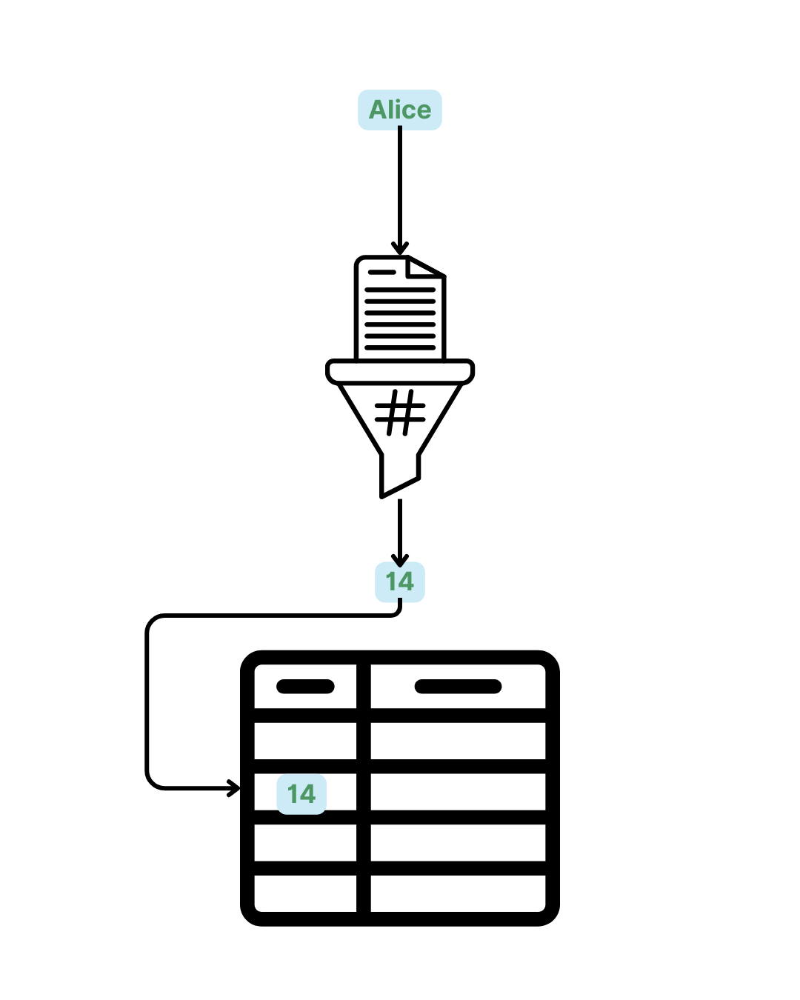

### The Basic Idea

- Hash table is basically an **array** of size n
- A search is performed on some part/data member of the stored items, called the **key**
- Each key is mapped to an index between 0 and n-1
  - The mapping is called a **hash function**

```
Key (e.g., "Alice") -> [ Hash Function ] -> Index (e.g., 42)
```

---

# Hash Table Concept


Arrays provide the fastest mechanism for accessing data

- given an index, you can access the data at that position in $O(1)$ time.
- given an index of unused position, you can insert an element in $O(1)$ time.
- given an index of used position, you can delete an element in $O(1)$ time.

### The Problem

We do NOT search by using an **index**; rather we use the **value** of the data element to search.

---

# Hash Table Concept

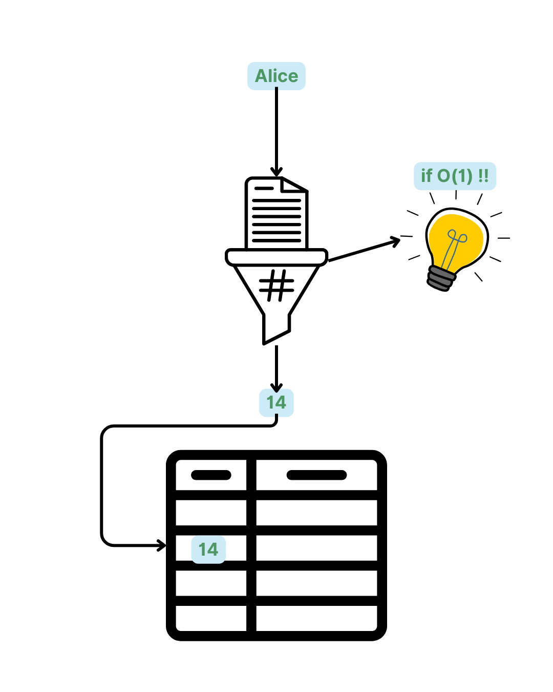

### If we can **calculate the index** in $O(1)$ and access the array in $O(1)$, we get **constant time** operations!

---

# Hash Table Idea Summarized

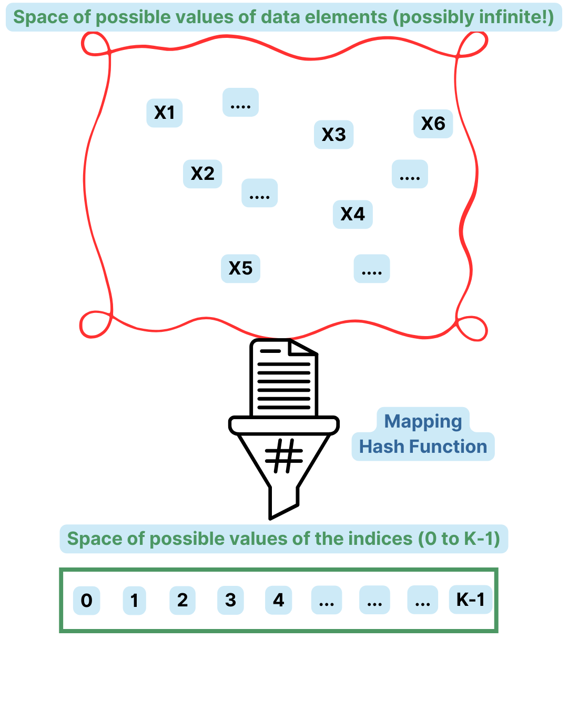

---

# Hash Functions

The fundamental problems in hash tables are:

- Finding that perfect hash function, so that there are no collisions.
  - This is not possible since for interesting cases the **domain of possible data values** is much larger than the number of slots in the array, so here will always be collisions.

* This having failed, developing mechanisms so that collisions are handled in a certain way.

### Key Challenges

1. **Hash Function Design:** How to map arbitrary keys to a fixed range of indices?
2. **Collision Resolution:** What if two different keys map to the same index?

---

# Hash Functions

A hash function $h(K)$ maps a key $K$ to an integer in the range $[0, \text{TableSize} - 1]$.

- Should be easy and fast to compute
- Should place items evenly throughout the hash table

### 1. Integer Keys

The most common method: $h(K) = K \pmod{\text{TableSize}}$

- Usually, **TableSize should be a prime number** and close to the **power of two** to ensure better distribution.
  - For _theorotical reasons_

---

# Hash Functions

### 2. String Keys

For most applications, the key (of the data element to be stored) is a character string of some sort

In that case, we treat the string as a number in some base $P$.

- Basically the ASCII values of the characters in the string

- We compute the polynomial with the characters as the coefficients and 37 as the variable value, using Horner’s method.

$$h(S) = \left( \sum_{i=0}^{n-1} S[i] \cdot P^i \right) \pmod{\text{TableSize}}$$

```cpp
int hashString(string s, int tableSize) {
    int hashVal = 0;
    for (char c : s)
        hashVal = (37 * hashVal + c) % tableSize;
    return hashVal;
}
```

---

# Properties of a Good Hash Function

To achieve $O(1)$ average performance, a hash function should:

1. **Be Deterministic:** The same key must always produce the same hash value.
2. **Be Fast to Compute:** Calculating $h(K)$ shouldn't become a bottleneck.
3. **Distribute Uniformly:** Keys should be spread across the table as evenly as possible (minimizing clusters).
4. **Be Sensitive to All Bits:** Small changes in the key should result in large, unpredictable changes in the hash value (the _Avalanche Effect_).

### Common Practical Hash Functions

- **MurmurHash:** Used in Java's `HashMap` and many databases.
- **CityHash / FarmHash:** Optimized for speed on modern CPUs (by Google).
- **SHA-256:** Cryptographic hash (secure but slower to compute).

---

# The Problem - Collisions

### What is a Collision?

A collision occurs when two distinct keys $K_1$ and $K_2$ produce the same hash value:
$h(K_1) = h(K_2)$

### Why are they inevitable?

- **Pigeonhole Principle:** If you have more keys than table slots, collisions MUST happen.
- **Birthday Paradox:** Even if you have many slots, collisions happen much sooner than you'd expect.
  - In a group of just **23 people**, there is a **50% chance** that two share the same birthday.
  - In a hash table with 365 slots, after inserting only 23 items, you already have a 50% chance of a collision!

---

<!-- _footer: "" -->
<!-- _header: "" -->
<!-- _paginate: false -->

<style scoped>
p { text-align: center}
h1 {text-align: center; font-size: 72px}
</style>

# Collision Resolution

---

# Collision Resolution Strategies

We need a way to handle cases where $h(K_1) = h(K_2)$.

<div class="columns">

<div>

### 1. Separate Chaining

Each array slot points to a **linked list** of all items that hash to that index.

</div>

<div>

### 2. Open Addressing

If a slot is full, look for **another empty slot** in the array.

- Linear Probing
- Quadratic Probing
- Double Hashing

</div>

</div>

---

# Separate Chaining


This is a very simple idea.

- Each array entry holds, not an element X, but **points to a list of such elements**
- Each entry on a list hashes to the same value and hence, collide.
- So, most lists have a single entry, some have more than one.

### Array serves as the **entry point**

Any ADT can be used instead of a linked list (e.g., binary search tree, another hash table, etc.)

### If the table is large and the hash function is good

- Lists should be short
- Efficient and good enough
- Not worthwile to employ other, more complicated ADTs

---

<!-- _footer: "" -->
<!-- _header: "" -->
<!-- _paginate: false -->
<style scoped>
p {text-align: center; font-size: 24px; font-style: italic}
</style>

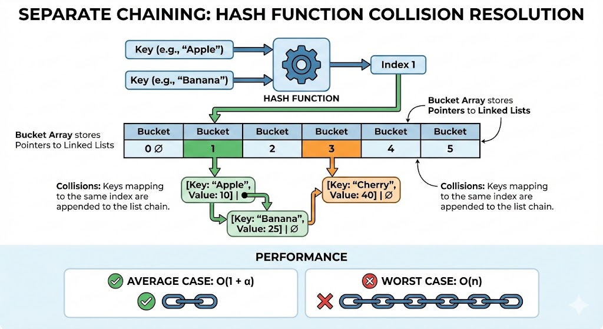

---

# Load Factor ($\lambda$)

$$\lambda = \frac{N}{\text{TableSize}}$$
where $N$ is the number of elements.

- Average number of elements per list is $\lambda$.
- The efficieny depends on the **load factor**, not the size of the hash table
- Make the table at least as large as the expected number of elements you want to store so that $\lambda \le 1$.
- If λ exceeds 1, restructure and extend the size of the hash table known as **rehashing**

---

# Seperate Chaining

Separate chaining is a conceptually simple data structure.

- But it has the disadvantage of implementing/using a second data structure (linked lists)
- This tends to slow down the operations a bit due to new allocations.
- One needs to use 3 classes: HashedObj, List, HashTable

### Complexity

- **Search Time:** $1 + \lambda$ (on average)
- **Insertion:** $O(1)$ (insert at head of list)
- **Removal:** $O(\text{list length})$

### Performance Note

- Separate chaining is robust. It still works if $\lambda > 1$.
- However, as $\lambda$ increases, performance degrades towards $O(N)$ if the lists become long.

---

# Practice

**Scenario:**
Insert these keys into a hash table of size 7 using Separate Chaining:
**10, 24, 4, 31, 18**

**Hash Function:** $h(K) = K \pmod{7}$

---

# Open Addressing

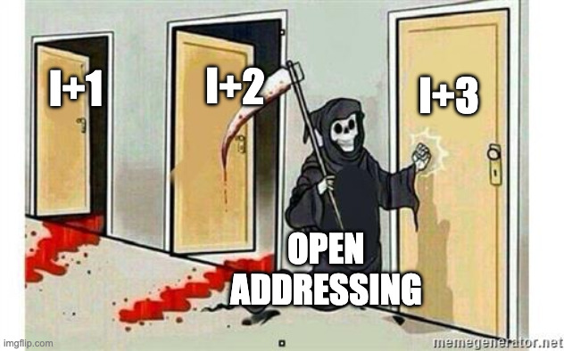

### The Idea

- No linked lists. All elements live in the array itself.
- If `table[h(K)]` is occupied, try alternative positions:
  - $h_0(K), h_1(K), h_2(K), \dots$ until an empty cell is found.

### Probing Function

The $i$-th probe is: $h_i(K) = (h(K) + f(i)) \pmod{\text{TableSize}}$
where $f(i)$ is the collision resolution strategy.

We get different strategies for different functions $f$

- Linear Probing: $f(i) = i$
- Quadratic probing: $f(i) = i^2$
- Double Hashing: $f(i) = i \times h_2(x)$

---

<!-- _footer: "" -->
<!-- _header: "" -->
<!-- _paginate: false -->
<style scoped>
p {text-align: center; font-size: 24px; font-style: italic}
</style>

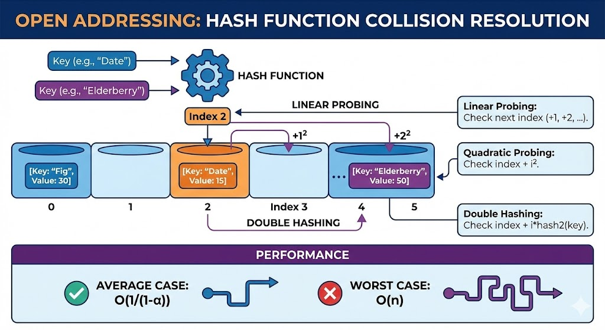

---

# Deletion in Open Addressing

### The Problem

If we remove an element by clearing its slot (setting it to NULL), we might break the _probe path_ for a later element.

**Example (Linear Probing):**

1. Insert 10 ($h=3$). `T[3]=10`.
2. Insert 24 ($h=3$). Collision, `T[4]=24`.
3. Remove 10. If we set `T[3]=NULL`...
4. Search for 24. $h(24)=3$. We see `T[3]` is NULL and stop. **24 is NOT FOUND**, even though it's in the table!

### The Solution - Lazy Deletion

Instead of NULL, mark the cell with a special flag: **DELETED**.

- **Search:** Continue probing if you see a DELETED flag.
- **Insert:** You can reuse a DELETED slot for a new element.

---

# 1. Linear Probing

### Strategy: $f(i) = i$

Check cells sequentially: $h(K), h(K)+1, h(K)+2, \dots$

### Problem - Primary Clustering

- Occupied cells tend to form long continuous blocks.
- Any key hashing into the cluster will further increase the cluster size.
- Performance degrades significantly as $\lambda$ approaches 1.

Keep the load factor, $\lambda$, low, preferably $0.5$ or less

### How do we search with linear probing?

Start probing at the hashed position until either

- the element is found, or
- an empty slot is found (thus element is not found!)

We make one complete trip around the table ending back at the initial hashed position (the table is full and the element is
not found!)

---

# Practice

**Scenario:**
Insert keys: **10, 24, 4, 31, 18** into a hash table of size 7.
$h(K) = K \pmod{7}$

---

# Answer

**Scenario:**
Insert keys: **10, 24, 4, 31, 18** into a hash table of size 7.
$h(K) = K \pmod{7}$

1. **10:** $10 \pmod{7} = 3$. Slot 3 is empty. -> `T[3] = 10`
2. **24:** $24 \pmod{7} = 3$. Slot 3 FULL. Try $(3+1) \pmod{7} = 4$. -> `T[4] = 24`
3. **4:** $4 \pmod{7} = 4$. Slot 4 FULL. Try $(4+1) \pmod{7} = 5$. -> `T[5] = 4`
4. **31:** $31 \pmod{7} = 3$. Slot 3 FULL. Try 4 (FULL), 5 (FULL), 6. -> `T[6] = 31`
5. **18:** $18 \pmod{7} = 4$. Slot 4 FULL. Try 5 (FULL), 6 (FULL), 0. -> `T[0] = 18`

**Final State:**

- 0: **18** | 1: - | 2: - | 3: **10** | 4: **24** | 5: **4** | 6: **31**

---

# 2. Quadratic Probing

### Strategy: $f(i) = i^2$

Check cells: $h(K), h(K)+1^2, h(K)+2^2, h(K)+3^2, \dots$


<!-- TODO: Diagram showing quadratic steps (1, 4, 9) from the collision point -->

### Why?

- Eliminates **Primary Clustering** (nearby keys don't follow the same probe sequence).
- However, keys that hash to the **exact same index** will still follow the same sequence (**Secondary Clustering**).

### Theorem

If the table size is **prime** and $\lambda < 0.5$, quadratic probing is **guaranteed** to find an empty slot if one exists.

---

# Practice

**Scenario:**
Insert keys: **10, 24, 4, 31, 18** into a hash table of size 7.
$h(K) = K \pmod{7}$, using $f(i) = i^2$.

---

# Answer

**Scenario:**
Insert keys: **10, 24, 4, 31, 18** into a hash table of size 7.
$h(K) = K \pmod{7}$, using $f(i) = i^2$.

1. **10:** $10 \pmod{7} = 3$. Slot 3 empty. -> `T[3] = 10`
2. **24:** $24 \pmod{7} = 3$. Slot 3 FULL. Try $(3 + 1^2) \pmod{7} = 4$. -> `T[4] = 24`
3. **4:** $4 \pmod{7} = 4$. Slot 4 FULL. Try $(4 + 1^2) \pmod{7} = 5$. -> `T[5] = 4`
4. **31:** $31 \pmod{7} = 3$. Slot 3 FULL.
   - $i=1: (3 + 1^2) \pmod{7} = 4$ (FULL)
   - $i=2: (3 + 2^2) \pmod{7} = 7 \pmod{7} = 0$. Slot 0 empty. -> `T[0] = 31`
5. **18:** $18 \pmod{7} = 4$. Slot 4 FULL.
   - $i=1: (4 + 1^2) \pmod{7} = 5$ (FULL)
   - $i=2: (4 + 2^2) \pmod{7} = 8 \pmod{7} = 1$. Slot 1 empty. -> `T[1] = 18`

**Final State:**

- 0: **31** | 1: **18** | 2: - | 3: **10** | 4: **24** | 5: **4** | 6: -

---

# 2. Quadratic Probing

Not so minor problem:

- There is no guarantee of finding an empty cell once the table gets more than half full
- Or, even before the table gets half full if the table size is not prime.

Since the quadratic functions only maps to offsets ending with 1, 4, 9, 6, 5 only **half of the table** is available for collision resolution

If quadractic probing is used, and the table size is prime,

- then a new element can always be inserted if the table is at least half empty.

---

# 3. Double Hashing

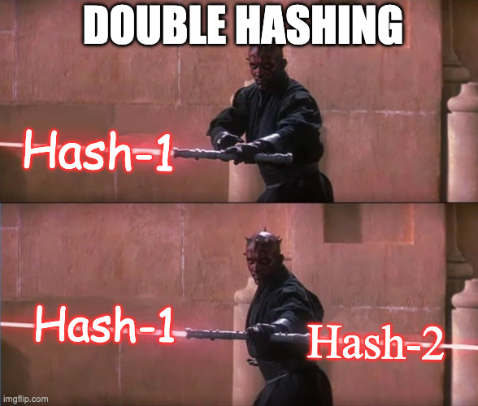

### Strategy: $f(i) = i \cdot h_2(K)$

Use a second hash function to determine the step size.
$h_i(K) = (h_1(K) + i \cdot h_2(K)) \pmod{\text{TableSize}}$

### Why?

- Eliminates both primary and secondary clustering.
- Even if $h_1(K_1) = h_1(K_2)$, their step sizes $h_2(K_1)$ and $h_2(K_2)$ will likely be different.

### Note on $h_2(K)$

- Must never return 0.
- Should be relatively prime to TableSize.
- Common choice: $h_2(K) = R - (K \pmod{R})$ where $R$ is a prime $< \text{TableSize}$.

---

# Practice

**Scenario:**
Insert keys: **10, 24, 31** into table size 7.
$h_1(K) = K \pmod{7}$
$h_2(K) = 5 - (K \pmod{5})$

---

# Answer

**Scenario:**
Insert keys: **10, 24, 31** into table size 7.
$h_1(K) = K \pmod{7}$
$h_2(K) = 5 - (K \pmod{5})$

1. **10:** $h_1(10) = 3$. Slot 3 empty. -> `T[3] = 10`
2. **24:** $h_1(24) = 3$. Slot 3 FULL.
   - Calculate step size: $h_2(24) = 5 - (24 \pmod{5}) = 5 - 4 = 1$.
   - Try $(3 + 1 \cdot 1) \pmod{7} = 4$. Slot 4 empty. -> `T[4] = 24`
3. **31:** $h_1(31) = 3$. Slot 3 FULL.
   - Calculate step size: $h_2(31) = 5 - (31 \pmod{5}) = 5 - 1 = 4$.
   - Try $(3 + 1 \cdot 4) \pmod{7} = 7 \pmod{7} = 0$. Slot 0 empty. -> `T[0] = 31`

**Final State:**

- 0: **31** | 1: - | 2: - | 3: **10** | 4: **24** | 5: - | 6: -

---

# Collision Resolution Comparison

| Strategy              | Pros                                              | Cons                                     |
| :-------------------- | :------------------------------------------------ | :--------------------------------------- |
| **Separate Chaining** | Simple, robust to high $\lambda$, no limit on $N$ | Needs extra memory for pointers          |
| **Linear Probing**    | Good cache locality, simple                       | Primary Clustering                       |
| **Quadratic Probing** | No Primary Clustering                             | Secondary Clustering, size must be prime |
| **Double Hashing**    | No clustering, best distribution                  | More expensive (two hash functions)      |

---

<!-- _footer: "" -->
<!-- _header: "" -->
<!-- _paginate: false -->

<style scoped>
p { text-align: center}
h1 {text-align: center; font-size: 72px}
</style>

# Rehashing & Applications

---

# Rehashing

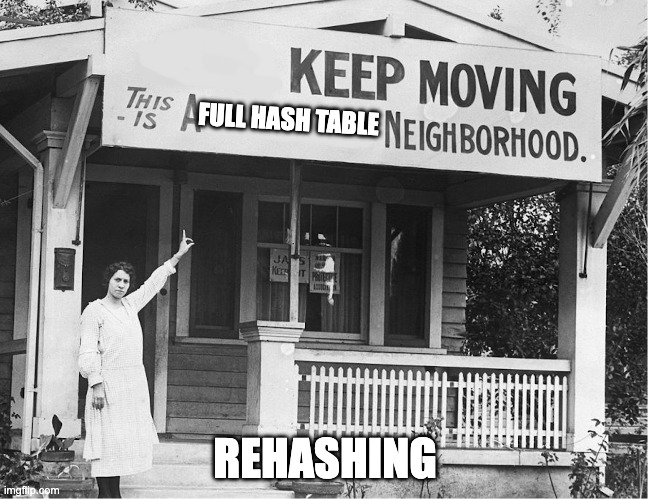

### The Problem

As the hash table fills up, collisions increase and performance drops.
For Open Addressing, insertion might even fail if the table is full.

### The Solution - Rehashing

1. Create a new table that is roughly **twice as large** (and usually prime).
2. For every element in the old table:
   - Calculate its **new hash** in the larger table.
   - Insert it into the new table.
3. Delete the old table.

### When to rehash?

- **Separate Chaining:** When $\lambda > 1$ (or even $\lambda > 0.75$).
- **Open Addressing:** When $\lambda > 0.5$ (especially for Quadratic Probing).

---

<!-- _footer: "" -->
<!-- _header: "" -->
<!-- _paginate: false -->
<style scoped>
p {text-align: center; font-size: 24px; font-style: italic}
</style>

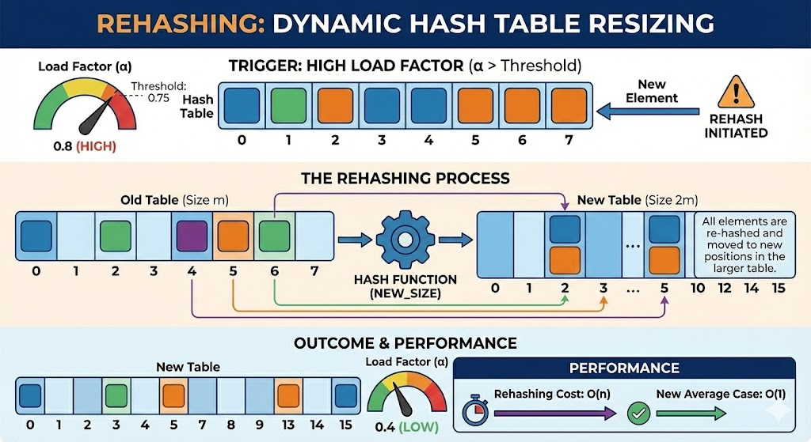

---

# Hash Table vs. Binary Search Tree (BST)

When should you use which?

| Feature               | Hash Table                     | Balanced BST (AVL/Red-Black)    |
| :-------------------- | :----------------------------- | :------------------------------ |
| **Average Search**    | $O(1)$                         | $O(\log N)$                     |
| **Worst-Case Search** | $O(N)$                         | $O(\log N)$                     |
| **Ordering**          | Unordered (Random)             | **Ordered** (Sorted)            |
| **Range Queries**     | Impossible (needs $O(N)$ scan) | **Efficient** ($O(\log N + K)$) |
| **Min/Max**           | $O(N)$                         | **$O(\log N)$**                 |
| **Memory**            | Sparse array (wasted space)    | Pointers (overhead per node)    |

### Recommendation

- Use **Hash Table** for fast point lookups (e.g., "Get user by ID").
- Use **BST** if you need sorted data or range queries (e.g., "Get all users aged 20-30").

---

<!-- _footer: "" -->
<!-- _header: "" -->
<!-- _paginate: false -->

<style scoped>
p { text-align: center}
h1 {text-align: center; font-size: 72px}
</style>

# Hashing in Real World

---

# Specialized Hashing - Consistent Hashing

### The Problem with Modular Hashing in Distributed Systems

If you have $N$ servers and use $h(K) \pmod{N}$, adding or removing a server (changing $N$) causes **almost all keys** to map to different servers! This triggers massive data migrations.

### The Solution: Consistent Hashing

1. Imagine hash values on a **ring** (0 to $2^{32}-1$).
2. Map both **Servers** and **Keys** onto this ring.
3. Each key is stored on the **first server found clockwise**.

### Benefit

When a server is added or removed, only **$1/N$** of the keys need to be moved on average.

**Used in:** Amazon DynamoDB, Apache Cassandra, Akamai CDN.

---

<!-- _footer: "" -->
<!-- _header: "" -->
<!-- _paginate: false -->
<style scoped>
p {text-align: center; font-size: 24px; font-style: italic}
</style>

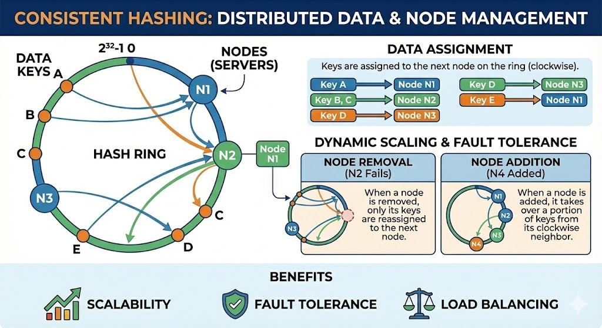

---

# Specialized Hashing - Bloom Filters

### Problem: Membership Testing in Large Datasets

You have 1 billion URLs (malicious). You want to check if a URL is in the set without storing all 1 billion strings.

### The Idea: Bloom Filter

- A **bit array** of size $M$, initially all 0s.
- $k$ different hash functions $h_1, h_2, \dots, h_k$.
- **To add an element:** Set bits at indices $h_1(X), h_2(X), \dots, h_k(X)$ to 1.
- **To check membership:** If **all** bits at those indices are 1, return "Possibly in set." Else, return "Definitely NOT in set."

### Key Properties

- **Zero False Negatives:** If it says "No," it is 100% correct.
- **Possible False Positives:** It might say "Yes" for an element not in the set.
- **Space Efficient:** Uses a tiny fraction of the memory needed to store the actual keys.

**Used in:** Google Chrome (malicious URL check), Medium (checking if you've read an article).

---

<!-- _footer: "" -->
<!-- _header: "" -->
<!-- _paginate: false -->
<style scoped>
p {text-align: center; font-size: 24px; font-style: italic}
</style>

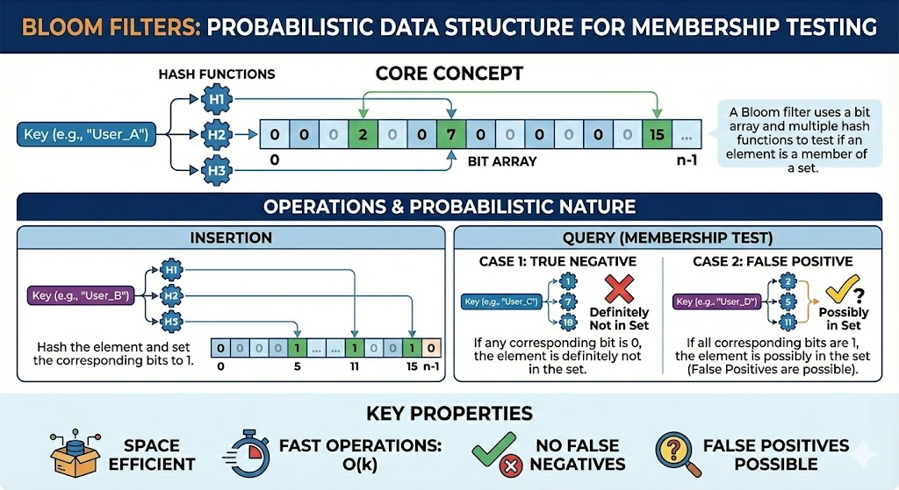

---

# Locality Sensitive Hashing - LSH

### Problem: Nearest Neighbor Search

In Recommendation Systems (e.g., Netflix), we want to find movies similar to one you just watched. In a vector space with 1000 dimensions and 1M movies, an exact search is too slow.

### The Idea of LSH

Standard hashing tries to **avoid** collisions. LSH tries to **cause** collisions for similar items!

- $h(x)$ is designed such that if $x$ and $y$ are close, $h(x) = h(y)$ with high probability.
- Instead of searching 1M movies, we only check movies that hashed into the same "bucket."

### Applications

- Approximate Nearest Neighbors (ANN)
- Duplicate document detection (Shingling + MinHashing)
- Audio Fingerprinting (Shazam)

---

<!-- _footer: "" -->
<!-- _header: "" -->
<!-- _paginate: false -->
<style scoped>
p {text-align: center; font-size: 24px; font-style: italic}
</style>

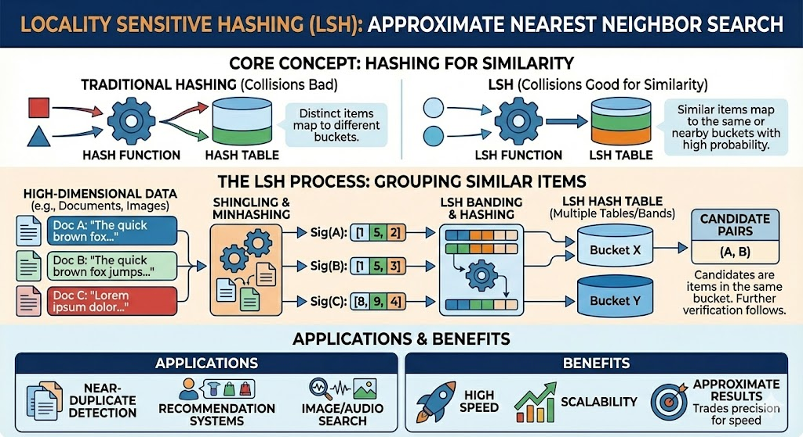

---

# Git Version Control

Git is essentially a **content-addressable filesystem**.

- Every file (blob), directory (tree), and commit is identified by the **SHA-1 hash** of its contents.
- If you change a single character in a file, its hash changes completely.
- Git uses these hashes to:
  - Detect changes instantly.
  - Avoid storing duplicate files (same content = same hash).
  - Ensure data integrity (no silent corruption).

---

# Blockchain and Cryptocurrencies

- **Block Hashing:** Each block in a blockchain contains the hash of the previous block (a **Hash Pointer**). This creates an immutable chain.
- **Merkle Trees:** A tree of hashes used to efficiently verify that a transaction exists in a block without downloading the entire block.
- **Proof of Work:** Bitcoin mining involves finding a number (nonce) such that the hash of the block starts with many zeros.

---

# Hashing Applications

| Area               | Example Use Case                                        |
| :----------------- | :------------------------------------------------------ |
| **Infrastructure** | Load Balancing, Consistent Hashing, CDNs                |
| **Security**       | Password Salting (bcrypt), Digital Signatures           |
| **AI / ML**        | Feature Hashing, LSH (Similarity Search), Deduplication |
| **Development**    | Git Content Addressing, Compilers, Symbol Tables        |
| **Storage**        | Caching (Redis), Database Indexing, Blockchain          |

### Key Takeaways

- Average performance is $O(1)$ if the load factor is controlled.
- Hash function quality and collision resolution are critical.
- **Always rehash** before the table gets too full!
- Hashing is the backbone of modern distributed systems and AI infrastructure.

---

# Thank You!

## Contact Information

- **Email:** ekrem.cetinkaya@yildiz.edu.tr
- **Office Hours:** Tuesday 14:00-16:00 - Room F-B21
- **Course Repo:** [GitHub Link](https://github.com/ekremcet/yzm2031-data-structures-and-algorithms)
