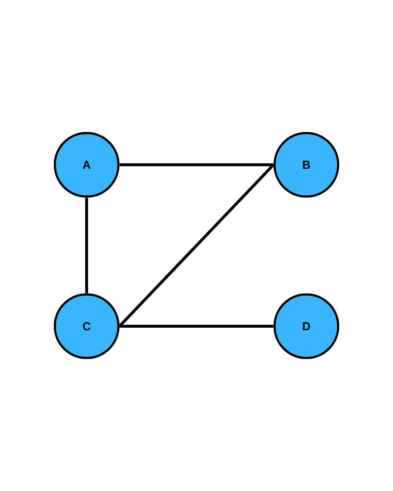
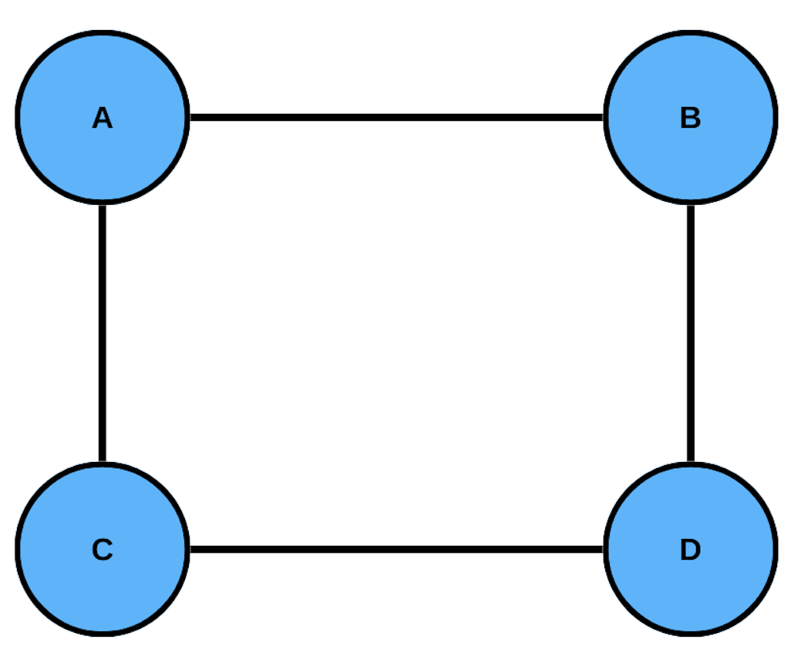
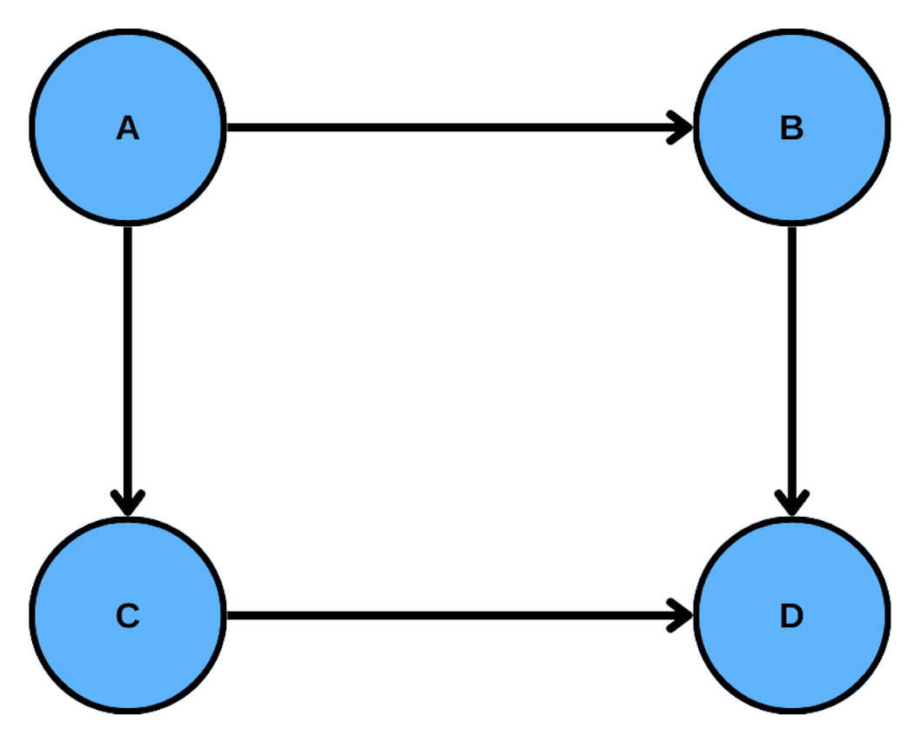
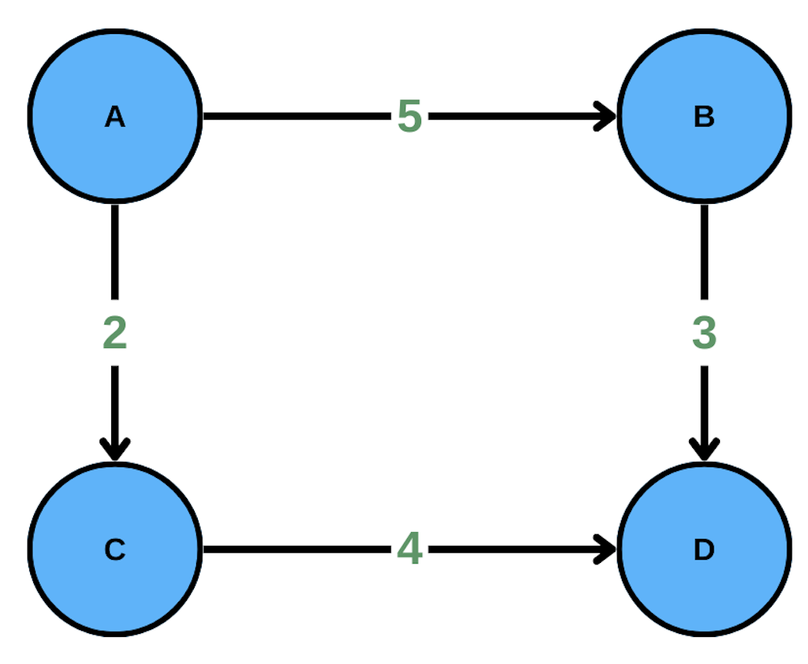
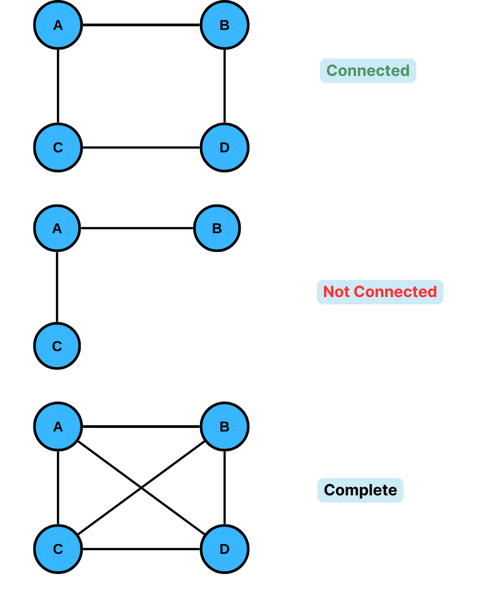
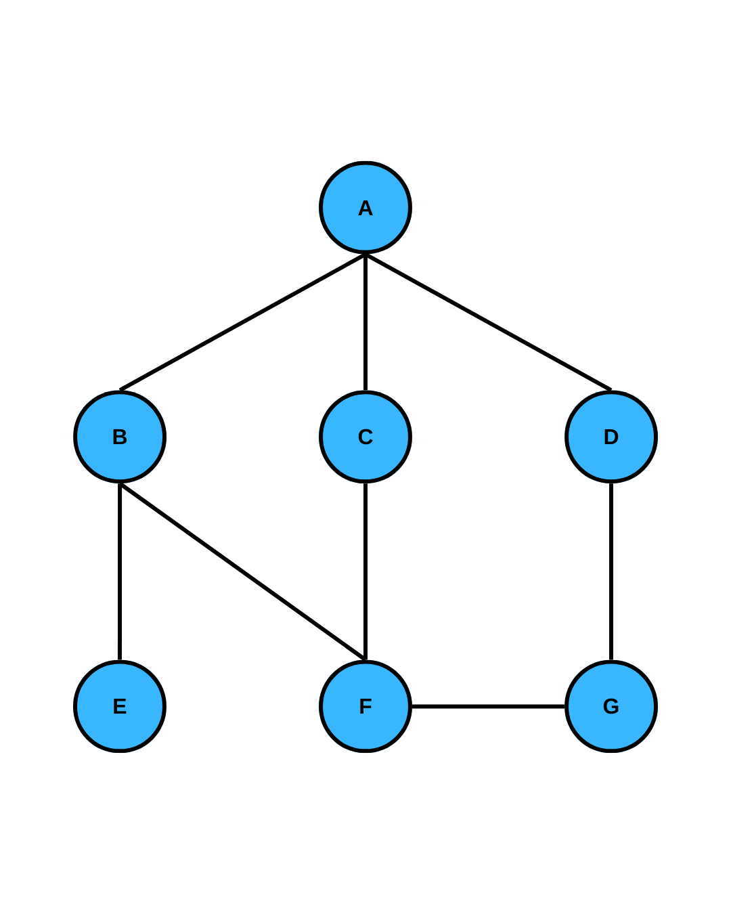
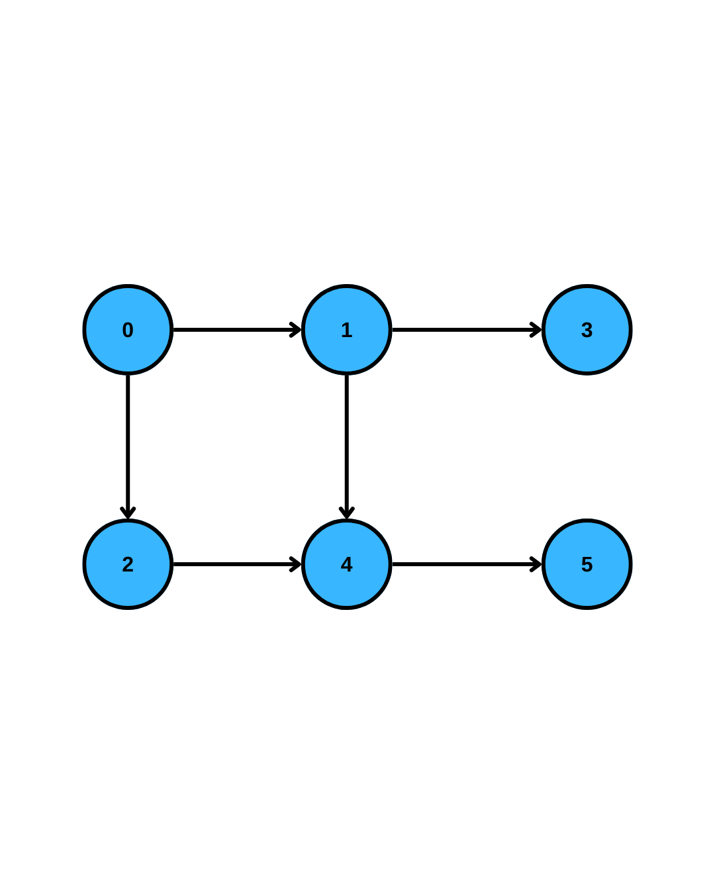
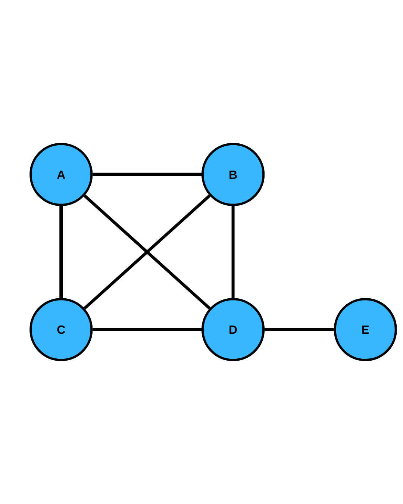
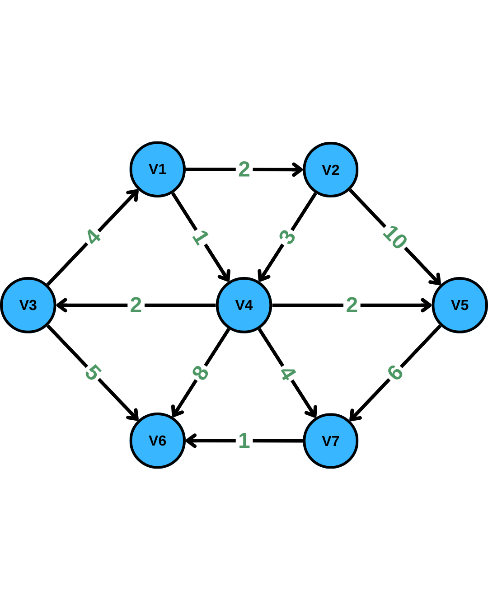

# YZM2031

## Data Structures and Algorithms

### Week 12: Graph Data Structures

**Instructor:** Ekrem Çetinkaya
**Date:** 31.12.2025

---

# Recap

## Hash Tables

<div class="columns">

<div>

**Core Concepts**

- Key-Value storage with $O(1)$ average operations
- Hash function maps keys to indices
- Load factor $\lambda = N / \text{TableSize}$

</div>

<div>

**Collision Resolution**

- Separate Chaining (linked lists)
- Open Addressing (Linear, Quadratic, Double Hashing)
- Rehashing when table fills up

</div>

</div>

### Key Insight

Hash tables excel at point lookups but don't support ordered operations like range queries or finding min/max efficiently.

---

# Today's Agenda

1. **Introduction:** What are graphs and why do we need them?
2. **Terminology:** Vertices, edges, paths, cycles
3. **Representations:** Adjacency Matrix vs Adjacency List
4. **Graph Traversals:** BFS and DFS
5. **Topological Sort:** Ordering vertices in a DAG
6. **Shortest Path:** Dijkstra's Algorithm
7. **Applications:** Real-world uses of graphs

---

<!-- _footer: "" -->
<!-- _header: "" -->
<!-- _paginate: false -->

<style scoped>
p { text-align: center}
h1 {text-align: center; font-size: 72px}
</style>

# What Are Graphs?

---

# Motivation

### Many problems are naturally modeled as graphs

Graphs are used to model arbitrary relationships among objects

<div class="columns">

<div>

**Social Networks**

- People are nodes
- Friendships are edges
- _Friend of friend_ = path of length 2

**Road Networks**

- Cities are nodes
- Roads are edges
- Distances are edge weights

</div>

<div>

**Web Pages**

- Pages are nodes
- Hyperlinks are edges
- Google's PageRank uses graph analysis

**Dependencies**

- Tasks/packages are nodes
- Dependencies are edges
- Build order = topological sort

</div>

</div>

---

# Graph Definition



### A graph $G = (V, E)$ consists of:

- **$V$:** A set of **vertices** (also called nodes)
- **$E$:** A set of **edges** connecting pairs of vertices

### Example

```
V = {A, B, C, D}
E = {(A,B), (A,C), (B,C), (C,D)}
```

Each edge connects exactly two vertices (_we won't cover hypergraphs_).

---

# Types of Graphs

<div class="columns">

<div>

### Undirected Graph

- Edges have **no direction**
- $(A, B)$ means $A$ and $B$ are connected
- Symmetric: if $A$ connects to $B$, then $B$ connects to $A$

**Examples:** Friendship networks, road networks (bidirectional)



</div>

<div>

### Directed Graph (Digraph)

- Edges have a **direction**
- $(A, B)$ means edge from $A$ **to** $B$
- Not symmetric: $A \to B$ doesn't imply $B \to A$

**Examples:** Web links, task dependencies, Twitter follows



</div>

</div>

---

# More Graph Types

<div class="columns">

<div>

### Weighted Graph

- Each edge has an associated **weight** (cost/distance)
- Used for optimization problems



</div>

<div>

### Special Types

- **DAG (Directed Acyclic Graph):** Directed graph with no cycles
- **Tree:** Connected acyclic undirected graph (a special graph!)
- **Complete Graph $K_n$:** Every vertex connected to every other vertex

</div>

</div>

---

# Graph Terminology


### Adjacency

- Two vertices are **adjacent** if connected by an edge
- In $A \text{---} B$, $A$ is adjacent to $B$ (and vice versa for undirected)

### Degree

- **Degree of vertex $v$:** Number of edges incident to $v$
- For directed graphs:
  - **In-degree:** Number of edges coming **in** to $v$
  - **Out-degree:** Number of edges going **out** from $v$

### Example

```
degree(A) = 2
degree(B) = 2
degree(C) = 3
degree(D) = 1
```

---

# Paths and Cycles


### Path

A sequence of vertices $v_1, v_2, \ldots, v_k$ where each consecutive pair is connected by an edge.

- **Length of path:** Number of edges ($k - 1$)
- **Simple path:** No vertex appears more than once

### Cycle

A path where the first and last vertices are the same.

- **Simple cycle:** No vertex (except start/end) appears more than once

```
Path A -> B -> C -> D (length 3)

Cycle: A -> B -> C -> A
```

---

# Connectivity



- **Complete graph**: Graph with edges between all pairs of vertices.

### Undirected Graphs

- **Connected graph:** There exists a path between every pair of vertices
- **Connected component:** Maximal set of connected vertices

### Directed Graphs

- **Strongly connected:** Path exists from $u$ to $v$ AND from $v$ to $u$ for all pairs
- **Weakly connected:** Connected if we ignore edge directions

---

# Practice



### Given the following graph:

**Questions:**

1. Is this graph directed or undirected?
2. What is the degree of vertex A?
3. What is the degree of vertex F?
4. List all vertices adjacent to C.
5. Is there a cycle? If so, name one.
6. Is the graph connected?

---

# Answer - Graph Terminology

1. **Undirected** (edges have no arrows)

2. **degree(A) = 3** (connected to B, C, D)

3. **degree(F) = 3** (connected to B, C, G)

4. **Vertices adjacent to C:** A, F

5. **Yes, there are cycles:**

   - A -> B -> F -> C -> A
   - A -> C -> F -> G -> D -> A

6. **Yes, connected** - can reach any vertex from any other

---

<!-- _footer: "" -->
<!-- _header: "" -->
<!-- _paginate: false -->

<style scoped>
p { text-align: center}
h1 {text-align: center; font-size: 72px}
</style>

# Graph Representations

---

# How to Store a Graph?

<div class="columns">

<div>

### Adjacency Matrix

- 2D array of size $V \times V$
- `matrix[i][j] = 1` if edge $(i, j)$ exists
- For **weighted graphs**, we store the weight

**Space:** $O(V^2)$

</div>

<div>

### Adjacency List

- Array of lists
- `adj[i]` contains all neighbors of vertex $i$
- For **weighted graphs**, we store (neighbor, weight) pairs

**Space:** $O(V + E)$

</div>

</div>

### Trade-offs depend on graph density

- **Dense graph:** $E \approx V^2$ -> Matrix might be better
- **Sparse graph:** $E \ll V^2$ -> List is much better

---

# Density of a Graph

### Maximum Number of Edges

- For **digraphs**, there can be at most $M = |V|(|V|-1)$ edges
- For **undirected graphs**, there can be at most $M = \frac{|V|(|V|-1)}{2}$ edges

### Graph Density

We define the **density** of a graph as:

$$D = \frac{|E|}{|V|^2}$$

- If $D$ is close to 1, that is $|E| = \Theta(|V|^2)$, then the graph is **dense**
- If $D$ is small, that is $|E| = O(|V|)$, then the graph is **sparse**

### Why Does This Matter?

The density determines which representation is more efficient!

---

# Adjacency Matrix


### Properties

- **Symmetric** for undirected graphs (only store upper/lower triangle)
- Main diagonal is 0 (no self-loops) or could store self-loops
- For weighted graphs, store weights instead of 1

```
    A  B  C  D
A [ 0  1  1  0 ]
B [ 1  0  0  1 ]
C [ 1  0  0  1 ]
D [ 0  1  1  0 ]
```

### Complexity

| Operation            | Time   |
| :------------------- | :----- |
| Check if edge exists | $O(1)$ |
| Find all neighbors   | $O(V)$ |
| Add/Remove edge      | $O(1)$ |

---

# Adjacency Matrix - Implementation

```cpp
class GraphMatrix {
private:
    int V;
    vector<vector<int>> matrix;

public:
    GraphMatrix(int vertices) : V(vertices), matrix(V, vector<int>(V, 0)) {}

    void addEdge(int u, int v, int weight = 1) {
        matrix[u][v] = weight;
        matrix[v][u] = weight;  // Remove for directed graph
    }

    bool hasEdge(int u, int v) {
        return matrix[u][v] != 0;
    }

    vector<int> getNeighbors(int u) {
        vector<int> neighbors;
        for (int v = 0; v < V; v++) {
            if (matrix[u][v] != 0)
                neighbors.push_back(v);
        }
        return neighbors;
    }
};
```

---

# Adjacency List


### Properties

- Each vertex stores only its neighbors
- Much more space-efficient for sparse graphs
- For **weighted graphs**, we store (neighbor, weight) pairs

```
A -> [B, C]
B -> [A, D]
C -> [A, D]
D -> [B, C]
```

### Complexity

| Operation            | Time                  |
| :------------------- | :-------------------- |
| Check if edge exists | $O(\text{degree}(u))$ |
| Find all neighbors   | $O(\text{degree}(u))$ |
| Add edge             | $O(1)$                |
| Remove edge          | $O(\text{degree}(u))$ |

---

# Adjacency List - Implementation

```cpp
class GraphList {
private:
    int V;
    vector<vector<pair<int, int>>> adj;  // (neighbor, weight)

public:
    GraphList(int vertices) : V(vertices), adj(V) {}

    void addEdge(int u, int v, int weight = 1) {
        adj[u].push_back({v, weight});
        adj[v].push_back({u, weight});  // Remove for directed graph
    }

    bool hasEdge(int u, int v) {
        for (auto& [neighbor, w] : adj[u]) {
            if (neighbor == v) return true;
        }
        return false;
    }

    vector<pair<int, int>>& getNeighbors(int u) {
        return adj[u];
    }
};
```

---

# Adjacency List - Additional Details

### Non-Integer Vertex Labels

Vertices may have labels which are not integers (e.g., city names, usernames)

- Use a **hash table** to map names to integers
- Use the integers to access the adjacency list vector

```cpp
unordered_map<string, int> nameToIndex;  // "Istanbul" -> 0
vector<string> indexToName;               // 0 -> "Istanbul"
vector<vector<pair<int, int>>> adj;       // adjacency list by index
```

### Edge Objects

The edge objects in the adjacency lists typically store:

- The **index** of the target vertex
- The **weight** of the edge (if weighted)
- Pointer to **next element** in the list
  - This is exactly the same data structure we used for **hash tables with seperate chaining**

---

# Comparison: Matrix vs List

| Aspect            | Adjacency Matrix | Adjacency List     |
| :---------------- | :--------------- | :----------------- |
| **Space**         | $O(V^2)$         | $O(V + E)$         |
| **Edge lookup**   | $O(1)$           | $O(\text{degree})$ |
| **Get neighbors** | $O(V)$           | $O(\text{degree})$ |
| **Add edge**      | $O(1)$           | $O(1)$             |
| **Remove edge**   | $O(1)$           | $O(\text{degree})$ |
| **Best for**      | Dense graphs     | Sparse graphs      |

### In Practice

- Most real-world graphs are **sparse** (social networks, road maps)
- **Adjacency list is usually preferred**
- Unless you need fast edge lookup and have dense graphs

---

# Practice


### Given this directed weighted graph:

**Build:**

1. The adjacency matrix
2. The adjacency list

---

# Answer - Build Representations

### Adjacency Matrix (weighted, directed)

```
      A    B    C    D
A [   0    5    2    0  ]
B [   0    0    0    3  ]
C [   0    0    0    4  ]
D [   0    0    0    0  ]
```

### Adjacency List

```
A -> [(B, 5), (C, 2)]
B -> [(D, 3)]
C -> [(D, 4)]
D -> []
```

Note: For directed graphs, the matrix is NOT symmetric

---

<!-- _footer: "" -->
<!-- _header: "" -->
<!-- _paginate: false -->

<style scoped>
p { text-align: center}
h1 {text-align: center; font-size: 72px}
</style>

# Topological Sort

---

# Topological Sort

### Topological Order

A linear ordering of vertices such that for every directed edge $(u, v)$, vertex $u$ comes **before** vertex $v$ in the ordering.

### Requirements

- Graph must be **directed**
- Graph must be **acyclic** (DAG - Directed Acyclic Graph)
- If there's a cycle, no valid topological order exists!

### Topological Order is NOT Unique!

At any point, we may have **multiple vertices with in-degree 0**, and we can choose any of them. This leads to multiple valid orderings.

### Applications

- Build systems (Makefiles, package managers)
- Course prerequisites
- Task scheduling
- Spreadsheet cell evaluation order

---

# Topological Sort - Definition

### Simple Algorithm

```
1. Find a vertex with in-degree 0
2. Print it and remove it from the graph
3. Repeat until all vertices are processed
4. If no vertex with in-degree 0 exists but graph is not empty -> cycle!
```

### Implementation Idea

```cpp
void topsort() {
    for (int counter = 0; counter < NUM_VERTICES; counter++) {
        Vertex v = findVertexOfIndegreeZero();  // O(V) scan
        if (v == NOT_A_VERTEX)
            throw CycleFound();
        v.topNum = counter;
        for each w adjacent to v:
            w.indegree--;
    }
}
```

### Problem: `findVertexOfIndegreeZero()` takes $O(V)$ time, called $V$ times -> **$O(V^2)$**

---

# Topological Sort

### Example

Universities have courses with prerequisites. Before taking a course, you must complete its prerequisites.

**Example: Computer Science Curriculum**

- CS101 has no prerequisites (can start here)
- CS102 requires CS101
- CS201 and CS202 require CS102
- CS333 requires CS201
- CS350 requires CS201 and CS202

**Question:** In what order should you take the courses?

Valid orderings:

- CS101, CS102, CS201, CS202, CS333, CS350
- CS101, CS102, CS202, CS201, CS333, CS350
- (Many more valid orderings!)

---

# Topological Sort - Kahn's Algorithm

### Idea: Avoid repeated scans by tracking zero-indegree vertices

Instead of scanning for zero-indegree vertices each time, **keep them in a queue**

```
1. Calculate in-degree of all vertices
2. Add all vertices with in-degree 0 to queue
3. While queue not empty:
   a. Remove vertex v from queue, add to result
   b. For each neighbor u of v:
      - Decrease in-degree of u by 1
      - If in-degree of u becomes 0, add u to queue
4. If result contains all vertices -> valid ordering
   Else -> cycle exists!
```

### Time Complexity: $O(V + E)$

---

# Practice



**Using Kahn's Algorithm:**

1. Calculate in-degrees
2. Trace the algorithm step by step
3. Give a valid topological ordering

---

# Answer - Topological Sort

```
In-degrees: [0:0, 1:1, 2:1, 3:1, 4:2, 5:1]

Initial queue: [0] (only vertex with in-degree 0)

Step 1: Remove 0, add to result
        Decrease in-degree of 1, 2
        In-degrees: [1:0, 2:0, 3:1, 4:2, 5:1]
        Queue: [1, 2], Result: [0]

Step 2: Remove 1, decrease in-degree of 3, 4
        In-degrees: [2:0, 3:0, 4:1, 5:1]
        Queue: [2, 3], Result: [0, 1]

Step 3: Remove 2, decrease in-degree of 4
        In-degrees: [3:0, 4:0, 5:1]
        Queue: [3, 4], Result: [0, 1, 2]

Step 4: Remove 3, no outgoing edges
        Queue: [4], Result: [0, 1, 2, 3]

Step 5: Remove 4, decrease in-degree of 5
        Queue: [5], Result: [0, 1, 2, 3, 4]

Step 6: Remove 5
        Result: [0, 1, 2, 3, 4, 5]
```

---

<!-- _footer: "" -->
<!-- _header: "" -->
<!-- _paginate: false -->

<style scoped>
p { text-align: center}
h1 {text-align: center; font-size: 72px}
</style>

# Graph Traversals

---

# Why Traverse Graphs?

Many graph problems require visiting all vertices:

- **Connectivity:** Can we reach $B$ from $A$?
- **Path finding:** What's the path from $A$ to $B$?
- **Cycle detection:** Does the graph contain a cycle?
- **Component counting:** How many connected components?

### Two Fundamental Strategies

1. **BFS (Breadth-First Search):** Explore level by level
2. **DFS (Depth-First Search):** Explore as deep as possible first

---

# Breadth-First Search (BFS)

### Strategy: Explore neighbors first, then neighbors' neighbors

- Start from a source vertex $s$
- Visit all vertices at distance 1
- Then all vertices at distance 2
- And so on...

### Key Property

BFS finds the **shortest path** (in terms of number of edges) from source to all other vertices.

---

# BFS - Algorithm

### Uses a **Queue** (FIFO)

```
BFS(Graph G, Vertex s):
    create queue Q
    mark s as visited
    enqueue s into Q

    while Q is not empty:
        v = dequeue from Q
        process v

        for each neighbor u of v:
            if u is not visited:
                mark u as visited
                enqueue u into Q
```

### Time Complexity: $O(V + E)$

- Each vertex is enqueued/dequeued at most once: $O(V)$
- Each edge is examined at most twice: $O(E)$

---

# BFS - Implementation

```cpp
void BFS(int start, vector<vector<int>>& adj) {
    int V = adj.size();
    vector<bool> visited(V, false);
    vector<int> distance(V, -1);
    vector<int> parent(V, -1);
    queue<int> q;

    visited[start] = true;
    distance[start] = 0;
    q.push(start);

    while (!q.empty()) {
        int v = q.front();
        q.pop();

        for (int u : adj[v]) {
            if (!visited[u]) {
                visited[u] = true;
                distance[u] = distance[v] + 1;
                parent[u] = v;
                q.push(u);
            }
        }
    }
}
```

---

# BFS Example



### Step-by-step from A

```
Queue: [A]        Visit A
Queue: [B,C,D]    Visit B,C,D (neighbors of A)
Queue: [C,D,E]    Visit E (neighbor of B, C,D seen)
Queue: [D,E]      D already visited
Queue: [E]        E already visited
Queue: []         Done!

Order: A -> B -> C -> D -> E
```

---

# Depth-First Search (DFS)

### Strategy: Go as deep as possible before backtracking

- Start from a source vertex
- Explore one path completely before trying alternatives
- Uses **backtracking** when stuck

### Key Property

DFS is useful for:

- Detecting cycles
- Topological sorting
- Finding connected components
- Solving maze problems

---

# DFS - Algorithm

### Uses a **Stack** (LIFO) or **Recursion**

```
DFS(Graph G, Vertex s):
    mark s as visited
    process s

    for each neighbor u of s:
        if u is not visited:
            DFS(G, u)
```

### Iterative Version (explicit stack)

```
DFS_Iterative(Graph G, Vertex s):
    create stack S
    push s onto S

    while S is not empty:
        v = pop from S
        if v is not visited:
            mark v as visited
            process v
            for each neighbor u of v:
                push u onto S
```

---

# DFS - Implementation

```cpp
// Recursive DFS
void DFS(int v, vector<vector<int>>& adj, vector<bool>& visited) {
    visited[v] = true;
    cout << v << " ";  // Process vertex

    for (int u : adj[v]) {
        if (!visited[u]) {
            DFS(u, adj, visited);
        }
    }
}

// Iterative DFS
void DFS_Iterative(int start, vector<vector<int>>& adj) {
    vector<bool> visited(adj.size(), false);
    stack<int> s;
    s.push(start);

    while (!s.empty()) {
        int v = s.top(); s.pop();
        if (!visited[v]) {
            visited[v] = true;
            cout << v << " ";
            for (int u : adj[v]) s.push(u);
        }
    }
}
```

---

# DFS Example


Step-by-step from A

```
Call DFS(A): Visit A
Call DFS(B): Visit B
Call DFS(D): Visit D
Call DFS(C): Visit C (backtrack)
Call DFS(E): Visit E (backtrack x4)

Order: A -> B -> D -> C -> E
```

---

# BFS vs DFS Comparison

| Aspect             | BFS                    | DFS                        |
| :----------------- | :--------------------- | :------------------------- |
| **Data Structure** | Queue                  | Stack / Recursion          |
| **Order**          | Level by level         | Deep then backtrack        |
| **Shortest Path**  | Yes (unweighted)       | No                         |
| **Memory**         | $O(V)$ in worst case   | $O(V)$ for recursion stack |
| **Use Case**       | Shortest path, closest | Topological sort, cycles   |

---

<!-- _footer: "" -->
<!-- _header: "" -->
<!-- _paginate: false -->

<style scoped>
p { text-align: center}
h1 {text-align: center; font-size: 72px}
</style>

# Shortest Path Algorithms

---

<!-- _footer: "" -->
<!-- _header: "" -->
<!-- _paginate: false -->

<style scoped>
p { text-align: center}
h3 {text-align: center; font-size: 48px}
</style>

### What is the shortest path from $V1$ to $V6$?



---

# Shortest Path Problem

### Problem Statement

Given a weighted graph $G = (V, E)$ and a source vertex $s$:
Find the shortest path from $s$ to all other vertices.

### Variants

- **Single-Source:** From one vertex to all others (Dijkstra, Bellman-Ford)
- **All-Pairs:** Between all pairs of vertices (Floyd-Warshall)
- **Unweighted:** BFS solves this!

### Key Insight

For **unweighted** graphs, BFS gives shortest paths.
For **weighted** graphs, we need more sophisticated algorithms.

---

# Dijkstra's Algorithm

### Idea: Greedy expansion from source

1. Maintain **distances** from source (initially $\infty$, source = 0)
2. Maintain a set of **finalized** vertices
3. Repeatedly:
   - Pick the unfinalized vertex $u$ with **smallest distance**
   - Mark $u$ as finalized
   - **Relax** all edges from $u$: if going through $u$ is shorter, update

### Relaxation

For edge $(u, v)$ with weight $w$:

```
if distance[u] + w < distance[v]:
    distance[v] = distance[u] + w
```

---

# Dijkstra's Algorithm - Pseudocode

```
Dijkstra(Graph G, Source s):
    for each vertex v:
        dist[v] = ∞
        parent[v] = null
    dist[s] = 0

    Q = priority queue of all vertices (by distance)

    while Q is not empty:
        u = extract vertex with minimum dist from Q

        for each neighbor v of u:
            if dist[u] + weight(u,v) < dist[v]:
                dist[v] = dist[u] + weight(u,v)
                parent[v] = u
                decrease priority of v in Q
```

---

# Dijkstra's Algorithm - Implementation

```cpp
vector<int> dijkstra(int V, vector<vector<pair<int,int>>>& adj, int src) {
    vector<int> dist(V, INT_MAX);
    priority_queue<pair<int,int>, vector<pair<int,int>>,
                   greater<pair<int,int>>> pq;

    dist[src] = 0;
    pq.push({0, src});  // (distance, vertex)

    while (!pq.empty()) {
        auto [d, u] = pq.top(); pq.pop();

        if (d > dist[u]) continue;  // Skip outdated entries

        for (auto [v, w] : adj[u]) {
            if (dist[u] + w < dist[v]) {
                dist[v] = dist[u] + w;
                pq.push({dist[v], v});
            }
        }
    }
    return dist;
}
```

---

# Dijkstra's Algorithm - Example


### Graph with 7 vertices

**Edges:**

- $v_1 \to v_2$: 2, $v_1 \to v_4$: 1
- $v_3 \to v_1$: 4, $v_3 \to v_6$: 5
- $v_4 \to v_2$: 3, $v_4 \to v_3$: 2
- $v_4 \to v_5$: 2, $v_4 \to v_6$: 8, $v_4 \to v_7$: 4
- $v_2 \to v_5$: 10, $v_5 \to v_7$: 6, $v_7 \to v_6$: 1

**Start from $v_1$**

---

# Dijkstra - Step by Step (from $v_1$)

| Step | u     | $d[v_1]$ | $d[v_2]$ | $d[v_3]$ | $d[v_4]$ | $d[v_5]$ | $d[v_6]$ | $d[v_7]$ | Known                                 |
| :--- | :---- | :------- | :------- | :------- | :------- | :------- | :------- | :------- | :------------------------------------ |
| Init | -     | 0        | ∞        | ∞        | ∞        | ∞        | ∞        | ∞        | {}                                    |
| 1    | $v_1$ | 0        | 2        | ∞        | 1        | ∞        | ∞        | ∞        | {$v_1$}                               |
| 2    | $v_4$ | 0        | 2        | 3        | 1        | 3        | 9        | 5        | {$v_1$,$v_4$}                         |
| 3    | $v_2$ | 0        | 2        | 3        | 1        | 3        | 9        | 5        | {$v_1$,$v_4$,$v_2$}                   |
| 4    | $v_3$ | 0        | 2        | 3        | 1        | 3        | 8        | 5        | {$v_1$,$v_4$,$v_2$,$v_3$}             |
| 5    | $v_5$ | 0        | 2        | 3        | 1        | 3        | 8        | 5        | {$v_1$,$v_4$,$v_2$,$v_3$,$v_5$}       |
| 6    | $v_7$ | 0        | 2        | 3        | 1        | 3        | 6        | 5        | {$v_1$,$v_4$,$v_2$,$v_3$,$v_5$,$v_7$} |
| 7    | $v_6$ | 0        | 2        | 3        | 1        | 3        | 6        | 5        | All                                   |

---

# Practice


**Apply Dijkstra's algorithm starting from $v_3$:**

1. Show the distance array after each step
2. What is the shortest path from $v_3$ to $v_7$?
3. What is the shortest distance from $v_3$ to $v_6$?

---

# Answer

| Step | u     | $d[v_1]$ | $d[v_2]$ | $d[v_3]$ | $d[v_4]$ | $d[v_5]$ | $d[v_6]$ | $d[v_7]$ |
| :--- | :---- | :------- | :------- | :------- | :------- | :------- | :------- | :------- |
| Init | -     | ∞        | ∞        | 0        | ∞        | ∞        | ∞        | ∞        |
| 1    | $v_3$ | 4        | ∞        | 0        | ∞        | ∞        | 5        | ∞        |
| 2    | $v_1$ | 4        | 6        | 0        | 5        | ∞        | 5        | ∞        |
| 3    | $v_4$ | 4        | 6        | 0        | 5        | 7        | 5        | 9        |
| 4    | $v_6$ | 4        | 6        | 0        | 5        | 7        | 5        | 9        |
| 5    | $v_2$ | 4        | 6        | 0        | 5        | 7        | 5        | 9        |
| 6    | $v_5$ | 4        | 6        | 0        | 5        | 7        | 5        | 9        |
| 7    | $v_7$ | 4        | 6        | 0        | 5        | 7        | 5        | 9        |

**Answers:**

- Shortest path $v_3 \to v_7$: $v_3 \to v_1 \to v_4 \to v_7$ (distance = 4+1+4 = **9**)
- Shortest distance $v_3 \to v_6$: **5** (direct edge)

---

# Dijkstra's Limitation

### Dijkstra does NOT work with negative edge weights!

### For negative weights, use Bellman-Ford algorithm

- Handles negative weights
- Detects negative cycles
- Time: $O(VE)$

---

<!-- _footer: "" -->
<!-- _header: "" -->
<!-- _paginate: false -->

<style scoped>
p { text-align: center}
h1 {text-align: center; font-size: 72px}
</style>

# Minimum Spanning Trees

---

# Minimum Spanning Tree (MST)

### Definition

A **spanning tree** of a connected graph $G$ is a tree that:

- Contains all vertices of $G$
- Contains a subset of edges of $G$
- Is connected and has no cycles

A **minimum spanning tree** is a spanning tree with the **minimum total edge weight**.

### Properties

- A graph with $V$ vertices has a spanning tree with exactly $V-1$ edges
- MST is not necessarily unique (may have multiple MSTs with same total weight)

### Applications

- Network design (minimize cable length)
- Clustering algorithms
- Approximation algorithms for NP-hard problems

---

# MST Algorithms

### Two Greedy Approaches

<div class="columns">

<div>

**Prim's Algorithm**

- Start from any vertex
- Grow the tree by adding the **cheapest edge** connecting tree to non-tree vertex
- Similar to Dijkstra's algorithm

**Time:** $O(E \log V)$ with binary heap

</div>

<div>

**Kruskal's Algorithm**

- Sort all edges by weight
- Add edges in order, **skip if creates cycle**
- Uses Union-Find data structure

**Time:** $O(E \log E)$

</div>

</div>

### Both produce optimal MST!

---

# Prim's Algorithm

### Idea: Grow tree from a starting vertex

```
1. Start with any vertex s, add to tree T
2. While T doesn't include all vertices:
   a. Find minimum weight edge (u, v) where u ∈ T and v ∉ T
   b. Add v to T and edge (u, v) to MST
3. Return MST edges
```

### Key Insight

At each step, we pick the **cheapest edge** that connects the tree to a new vertex.

This is similar to Dijkstra, but we compare **edge weights** directly, not **path distances**.

---

# Prim's Algorithm - Pseudocode

```cpp
void prim(Graph G, Vertex s) {
    for each vertex v:
        v.dist = ∞
        v.known = false
        v.parent = null
    s.dist = 0

    PriorityQueue pq;  // min-heap by dist
    pq.insert(s)

    while (!pq.empty()) {
        v = pq.extractMin()
        v.known = true

        for each edge (v, w) with weight c:
            if (!w.known && c < w.dist):
                w.dist = c        // NOT v.dist + c!
                w.parent = v
                pq.decreaseKey(w)
    }
}
```

---

# Kruskal's Algorithm

### Idea: Add edges in order of weight, avoid cycles

```
1. Sort all edges by weight (ascending)
2. For each edge (u, v) in sorted order:
   a. If u and v are in different components:
      - Add edge (u, v) to MST
      - Merge the components
3. Stop when MST has V-1 edges
```

### Cycle Detection with Union-Find

- Each vertex starts in its own set
- **Find(v):** Which set does v belong to?
- **Union(u, v):** Merge sets containing u and v
- Add edge only if Find(u) ≠ Find(v)

---

# Kruskal's Algorithm - Pseudocode

```cpp
vector<Edge> kruskal(Graph G) {
    vector<Edge> mst;
    DisjointSet ds(NUM_VERTICES);

    // Sort edges by weight
    sort(edges.begin(), edges.end(), byWeight);

    for (Edge e : edges) {
        int uSet = ds.find(e.u);
        int vSet = ds.find(e.v);

        if (uSet != vSet) {
            mst.push_back(e);
            ds.union(uSet, vSet);

            if (mst.size() == NUM_VERTICES - 1)
                break;
        }
    }
    return mst;
}
```

---

# Kruskal's Algorithm - Step by Step


### Sort edges and add if no cycle:

| Step | Edge        | Weight | Action               |
| :--- | :---------- | :----- | :------------------- |
| 1    | $v_1 - v_4$ | 1      | Add                  |
| 2    | $v_7 - v_6$ | 1      | Add                  |
| 3    | $v_1 - v_2$ | 2      | Add                  |
| 4    | $v_4 - v_3$ | 2      | Add                  |
| 5    | $v_4 - v_5$ | 2      | Add                  |
| 6    | $v_4 - v_2$ | 3      | Cycle!               |
| 7    | $v_3 - v_1$ | 4      | Cycle!               |
| 8    | $v_4 - v_7$ | 4      | Add (6 edges, done!) |

**MST Total Weight:** 1+1+2+2+2+4 = **12**

---

# Prim's Algorithm - Step by Step


### Start from $v_1$, grow tree:

| Step | Add Vertex | Via Edge  | Weight | Tree Vertices                         |
| :--- | :--------- | :-------- | :----- | :------------------------------------ |
| 0    | $v_1$      | -         | -      | {$v_1$}                               |
| 1    | $v_4$      | $v_1-v_4$ | 1      | {$v_1$,$v_4$}                         |
| 2    | $v_3$      | $v_4-v_3$ | 2      | {$v_1$,$v_4$,$v_3$}                   |
| 3    | $v_2$      | $v_1-v_2$ | 2      | {$v_1$,$v_4$,$v_3$,$v_2$}             |
| 4    | $v_5$      | $v_4-v_5$ | 2      | {$v_1$,$v_4$,$v_3$,$v_2$,$v_5$}       |
| 5    | $v_7$      | $v_4-v_7$ | 4      | {$v_1$,$v_4$,$v_3$,$v_2$,$v_5$,$v_7$} |
| 6    | $v_6$      | $v_7-v_6$ | 1      | All vertices                          |

**MST Total Weight:** 1+2+2+2+4+1 = **12**

---

# Prim vs Kruskal

| Aspect              | Prim's           | Kruskal's               |
| :------------------ | :--------------- | :---------------------- |
| **Approach**        | Grow single tree | Merge forest of trees   |
| **Data Structure**  | Priority Queue   | Union-Find              |
| **Edge Selection**  | Cheapest to tree | Cheapest overall        |
| **Time Complexity** | $O(E \log V)$    | $O(E \log E)$           |
| **Best for**        | Dense graphs     | Sparse graphs           |
| **Parallelizable**  | No               | Yes (edges independent) |

### Both guarantee optimal MST

---

<!-- _footer: "" -->
<!-- _header: "" -->
<!-- _paginate: false -->

<style scoped>
p { text-align: center}
h1 {text-align: center; font-size: 72px}
</style>

# Graph Applications

---

# Real-World Graph Applications

<div class="columns">

<div>

### Navigation Systems

- Vertices: Intersections
- Edges: Roads with distances
- Algorithm: Dijkstra/A\* for shortest path
- Example: Google Maps, Waze

### Social Networks

- Vertices: Users
- Edges: Friendships/Follows
- Analysis: Influence, communities
- Example: Facebook, LinkedIn

</div>

<div>

### Web Search

- Vertices: Web pages
- Edges: Hyperlinks
- Algorithm: PageRank (based on graph structure)
- Example: Google Search

### Package Management

- Vertices: Software packages
- Edges: Dependencies
- Algorithm: Topological sort
- Example: npm, pip, apt

</div>

</div>

---

# More Applications

### Network Routing

- Internet packet routing uses shortest path algorithms
- OSPF (Open Shortest Path First) uses Dijkstra

### Recommendation Systems

- Users and items as vertices
- Interactions as edges
- Find similar users/items via graph analysis

### Compiler Design

- Data flow analysis
- Dead code elimination
- Register allocation (graph coloring)

---

# Summary

## Graph Fundamentals

- Graphs model relationships between entities
- **Directed** vs **Undirected**, **Weighted** vs **Unweighted**
- Key concepts: adjacency, degree, path, cycle, connectivity

## Representations

| Representation   | Space    | Edge Lookup        | Best For      |
| :--------------- | :------- | :----------------- | :------------ |
| Adjacency Matrix | $O(V^2)$ | $O(1)$             | Dense graphs  |
| Adjacency List   | $O(V+E)$ | $O(\text{degree})$ | Sparse graphs |

---

# Summary

## Traversals

| Algorithm | Data Structure  | Use Case                                | Complexity |
| :-------- | :-------------- | :-------------------------------------- | :--------- |
| BFS       | Queue           | Shortest path (unweighted), level-order | $O(V+E)$   |
| DFS       | Stack/Recursion | Topological sort, cycle detection       | $O(V+E)$   |

## Key Algorithms

| Problem                    | Algorithm    | Complexity       |
| :------------------------- | :----------- | :--------------- |
| Topological Sort           | Kahn's / DFS | $O(V+E)$         |
| Shortest Path (unweighted) | BFS          | $O(V+E)$         |
| Shortest Path (weighted)   | Dijkstra     | $O((V+E)\log V)$ |
| Minimum Spanning Tree      | Prim's       | $O(E \log V)$    |
| Minimum Spanning Tree      | Kruskal's    | $O(E \log E)$    |

---

# Thank You!

## Contact Information

- **Email:** ekrem.cetinkaya@yildiz.edu.tr
- **Office Hours:** Tuesday 14:00-16:00 - Room F-B21
- **Course Repo:** [GitHub Link](https://github.com/ekremcet/yzm2031-data-structures-and-algorithms)
