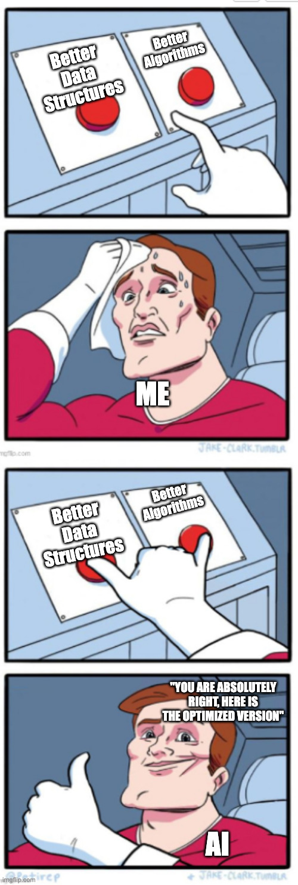
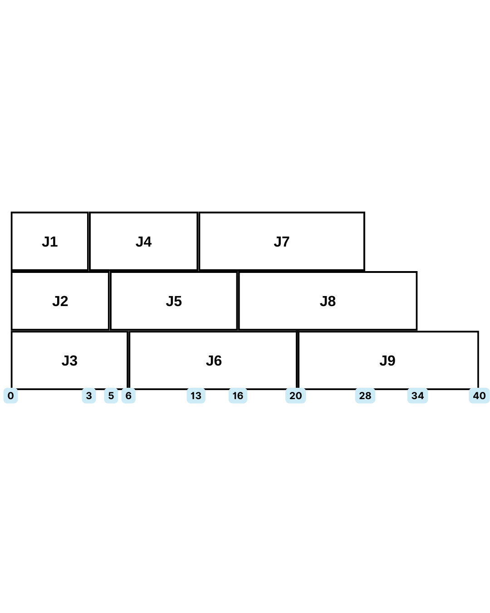
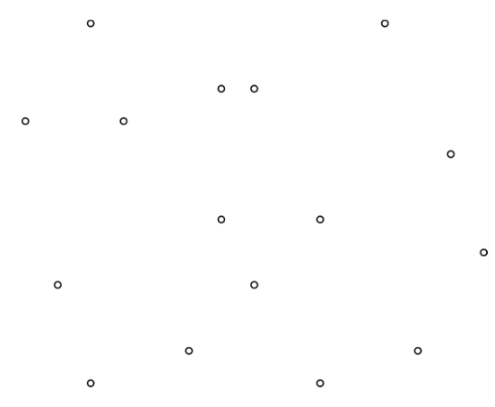
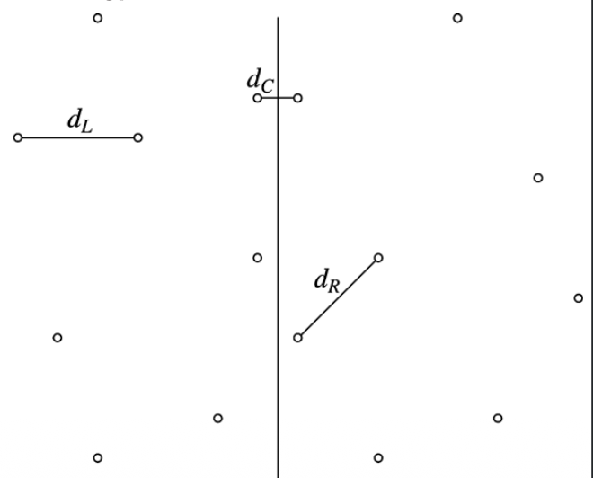
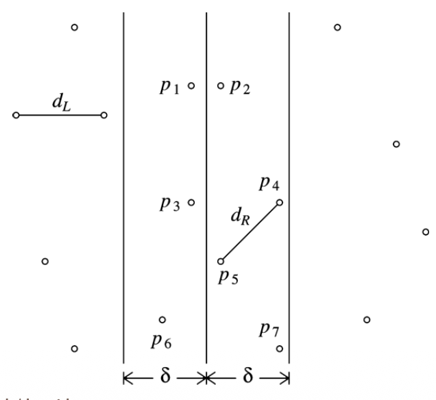

# YZM2031

## Data Structures and Algorithms

### Week 13: Algorithm Design Techniques

**Instructor:** Ekrem Çetinkaya
**Date:** 07.01.2026

---

# Recap

## Graph Data Structures

<div class="columns">

<div>

**Graph Representations**

- Adjacency Matrix: $O(V^2)$ space, $O(1)$ edge lookup
- Adjacency List: $O(V + E)$ space, efficient for sparse graphs

**Traversals**

- BFS: Level-by-level, shortest path (unweighted)
- DFS: Deep-first, topological sort, cycle detection

</div>

<div>

**Key Algorithms**

- Topological Sort: Kahn's algorithm for DAGs
- Dijkstra: Shortest path with non-negative weights
- Prim's & Kruskal's: Minimum Spanning Tree

</div>

</div>

### Key Insight

Many graph algorithms use **greedy** strategies. Today we'll explore algorithm design paradigms more broadly.

---

# Today's Agenda

1. **Algorithm Design Paradigms:** Overview of design approaches
2. **Greedy Algorithms:** Local optimum strategies
   - Scheduling Problem
   - Huffman Coding
   - Bin Packing Problem
3. **Divide and Conquer:** Breaking down problems
   - Closest Points Problem
4. **Dynamic Programming:** Overlapping subproblems
   - Fibonacci Numbers
   - Design Steps
5. **Summary:** Comparing paradigms

---

<!-- _footer: "" -->
<!-- _header: "" -->
<!-- _paginate: false -->

<style scoped>
p { text-align: center}
h1 {text-align: center; font-size: 72px}
</style>

# Algorithm Design Paradigms

---

# Improving Algorithm Efficiency



### Two Ways to Improve Efficiency

<div class="columns">

<div>

**Data Structures**

- Given an algorithm, choose the right data structure
- Makes running time as small as possible
- Necessary for efficient **implementation**

Example: Using a heap in Dijkstra's algorithm reduces complexity from $O(V^2)$ to $O(E \log V)$

</div>

<div>

**Algorithm Design**

- Design better algorithms from the start
- Different approaches to solving problems
- Focus on the **design** of the algorithm

Example: Using Merge Sort instead of Bubble Sort reduces complexity from $O(N^2)$ to $O(N \log N)$

</div>

</div>

---

# Common Algorithm Design Paradigms

### Three Major Paradigms

1. **Greedy**

   - Make the locally optimal choice at each step
   - Hope it leads to a globally optimal solution
   - Fast and simple, but doesn't always work

2. **Divide and Conquer**

   - Break problem into smaller independent subproblems
   - Solve recursively, then combine solutions
   - Often leads to $O(N \log N)$ algorithms

3. **Dynamic Programming**
   - Break problem into overlapping subproblems
   - Store solutions to avoid redundant computation
   - Trade space for time

---

<!-- _footer: "" -->
<!-- _header: "" -->
<!-- _paginate: false -->

<style scoped>
p { text-align: center}
h1 {text-align: center; font-size: 72px}
</style>

# Greedy Algorithms

---

# Greedy Algorithms


### Examples So Far

We've already seen greedy algorithms in action:

- **Dijkstra's Algorithm** - Always expand the vertex with smallest known distance
- **Prim's Algorithm** - Always add the cheapest edge connecting tree to non-tree vertex
- **Kruskal's Algorithm** - Sort edges by weight, add if no cycle forms

### Main Principles

1. **Work in phases** - Algorithm proceeds step by step
2. **In each phase, make a decision that appears to be the best**, without considering further consequences
3. **Focus on local optimum** at each phase, hopefully leading to a **global optimum**

---

# Scheduling Problem

### Problem Statement

Given $N$ jobs with processing times $t_1, t_2, \ldots, t_N$, schedule them on a **single processor** to minimize the **average completion time**.

### What is Completion Time?

- **Completion time** of a job = time when job finishes
- If jobs run in sequence: completion time includes waiting time

### Example

|  Job  | Processing Time |
| :---: | :-------------: |
| $j_1$ |       15        |
| $j_2$ |        8        |
| $j_3$ |        3        |
| $j_4$ |       10        |

**Question:** In what order should we process these jobs?

---

# Scheduling - Why Order Matters

<div class="columns">

<div>

**Order A:** $j_1 \to j_2 \to j_3 \to j_4$

|  Job  | Completion |
| :---: | :--------: |
| $j_1$ |     15     |
| $j_2$ |     23     |
| $j_3$ |     26     |
| $j_4$ |     36     |

**Total:** 100, **Avg:** 25

</div>

<div>

**Order B:** $j_3 \to j_2 \to j_4 \to j_1$

|  Job  | Completion |
| :---: | :--------: |
| $j_3$ |     3      |
| $j_2$ |     11     |
| $j_4$ |     21     |
| $j_1$ |     36     |

**Total:** 71, **Avg:** 17.75

</div>

</div>

---

# Scheduling - Why SPF Works

### Intuition

- Short jobs finish quickly = less waiting for later jobs
- Long jobs at the end only affect their own completion time
- Putting a long job first makes **all subsequent jobs wait**

### Theorem

**Shortest Process First** minimizes average completion time.

**Complexity:** $O(N \log N)$ for sorting jobs

---

# Multi-Processor Scheduling

### Problem: $N$ jobs, $P$ processors

|  Job  | Processing Time |
| :---: | :-------------: |
| $j_1$ |        3        |
| $j_2$ |        5        |
| $j_3$ |        6        |
| $j_4$ |       10        |
| $j_5$ |       11        |
| $j_6$ |       14        |
| $j_7$ |       15        |
| $j_8$ |       18        |
| $j_9$ |       20        |

Example: 3 processors, how do we schedule?

---

# Multi-Processor Scheduling

### Problem: $N$ jobs, $P$ processors



### Greedy Strategy

1. Sort jobs (shortest first)
2. Assign to processor that's free earliest

**Greedy still gives optimal**

---

# Huffman Coding - File Compression

### Standard Character Encoding

- ASCII uses **8 bits** per character (7 bits + parity)
- All characters encoded with same length
- For $C$ distinct characters: $\lceil \log_2 C \rceil$ bits needed
  - Normal ASCII set has around 100 printable characters so $\log_2 100$

### The Problem

Not all characters appear with equal frequency!

| Character | Typical Frequency in English |
| :-------: | :--------------------------: |
|     e     |            12.7%             |
|     t     |             9.1%             |
|     a     |             8.2%             |
|     z     |            0.07%             |

Why use same number of bits for 'e' and 'z'?

---

# Variable-Length Codes

### Idea

Use **shorter codes** for frequent characters and **longer codes** for rare characters.

### Example

|  Character   | Fixed (3 bits) | Variable |
| :----------: | :------------: | :------: |
| e (frequent) |      000       |    01    |
| a (frequent) |      001       |    10    |
|   z (rare)   |      010       |  00000   |

### Challenge

How do we decode variable-length codes unambiguously?

Example: If a=0, b=01, c=1, what does "01" mean?

- Could be "ab" (0, 1) or "b" (01)?

---

# Representation of Codes

<div class="columns">
<div>

### Tree Structure

- Data stored only at **leaves**
- Path from root to leaf = code
  - **Left branch = 0**
  - **Right branch = 1**

### Reading Codes

- **a** = left-left = **00**
- **e** = left-right = **01**
- **i** = right-left = **10**
- **sp** = right-right = **11**

</div>
<div>

```
         ○
        / \
       0   1
      /     \
     ○       ○
    / \     / \
   0   1   0   1
   a   e   i  sp
```

</div>
</div>

---

# Fixed-Length Codes - Tree

<div class="columns">
<div>

### 7 Characters, 3-Bit Codes

| Char | Code | Freq | Bits |
| :--: | :--: | :--: | :--: |
|  a   | 000  |  10  |  30  |
|  e   | 001  |  15  |  45  |
|  i   | 010  |  12  |  36  |
|  s   | 011  |  3   |  9   |
|  t   | 100  |  4   |  12  |
|  sp  | 101  |  13  |  39  |
|  nl  | 110  |  1   |  3   |

**Total: 174 bits**

</div>
<div>

```
        ○ (root)
       / \
      0   1
     ○     ○
    / \   / \
   0   1 0   1
   ○   ○ ○   ○
  /\  /\ /\  /\
 a e i s t sp nl -
```

</div>
</div>

---

# A Slightly Better Tree

<div class="columns">
<div>

### Variable-Length Codes

Idea: Put **frequent** characters **near root** (shorter codes).

Put **rare** characters **deeper** (longer codes).

- **e, i, sp** → 2 bits (frequent)
- **a** → 3 bits
- **t** → 4 bits
- **nl, s** → 5 bits (rare)

</div>
<div>

```
           ○ (58)
          / \
         0   1
        ○     ○
       / \   / \
      0   1 0   1
     ○   e  i  sp
    / \
   0   1
  ○    a
 / \
0   1
○   t
/\
nl s
```

</div>
</div>

---

# The Optimal Prefix Code

<div class="columns">
<div>

### Key Rule

No code is prefix of another

| Char | Code  | Freq | Bits |
| :--: | :---: | :--: | :--: |
|  a   |  001  |  10  |  30  |
|  e   |  01   |  15  |  30  |
|  i   |  10   |  12  |  24  |
|  s   | 00000 |  3   |  15  |
|  t   | 0001  |  4   |  16  |
|  sp  |  11   |  13  |  26  |
|  nl  | 00001 |  1   |  5   |

**Total: 146 bits** (was 174)

**Savings: 28 bits (16%!)**

</div>
<div>

### How Do We Find This?

**Huffman's Algorithm**

- A greedy algorithm to derive optimal character codes
- Maintain a forest of trees
- Each tree has a weight
  - The sum of the frequencies of its leaves
- At each step, merge two trees having smallest weights
- Initially start with single-node trees

</div>
</div>

---

# Huffman's Algorithm

### Greedy Strategy

Build tree **bottom-up** by repeatedly combining two **lowest frequency** nodes.

### Algorithm

1. Create leaf node for each character
2. Put all nodes in min-heap (by frequency)
3. While more than one node remains:
   - Remove two smallest: $n_1$, $n_2$
   - Create internal node with frequency = $n_1 + n_2$
   - Make $n_1$, $n_2$ children of new node
   - Insert new node back to heap
4. Last remaining node = root

### Time Complexity: $O(C \log C)$

---

# Huffman Example - Initial State

### Characters with Frequencies (sorted)

| nl  |  s  |  t  |  a  |  i  | sp  |  e  |
| :-: | :-: | :-: | :-: | :-: | :-: | :-: |
|  1  |  3  |  4  | 10  | 12  | 13  | 15  |

### Initial Forest (7 single-node trees)

```
[nl]  [s]  [t]  [a]   [i]   [sp]  [e]
  1    3    4   10    12     13   15
```

**Step 1:** Combine two smallest: nl(1) + s(3) = 4

---

# Huffman Example - After Step 1

<div class="columns">
<div>

### Combine nl(1) + s(3) = 4

Remaining nodes:

|  t  | [4]  |  a  |  i  | sp  |  e  |
| :-: | :--: | :-: | :-: | :-: | :-: |
|  4  | nl,s | 10  | 12  | 13  | 15  |

**Next:** t(4) + [4] = 8

</div>
<div>

```
      [4]
     /   \
  [nl]   [s]
    1     3
```

</div>
</div>

---

# Huffman Example - After Step 2

<div class="columns">
<div>

### Combine t(4) + [4] = 8

Remaining nodes:

| [8] |  a  |  i  | sp  |  e  |
| :-: | :-: | :-: | :-: | :-: |
|     | 10  | 12  | 13  | 15  |

**Next:** [8] + a(10) = 18

</div>
<div>

```
        [8]
       /   \
     [t]   [4]
      4   /   \
       [nl]  [s]
         1    3
```

</div>
</div>

---

# Huffman Example - After Step 3

<div class="columns">
<div>

### Combine [8] + a(10) = 18

Remaining nodes:

|  i  | sp  |  e  | [18] |
| :-: | :-: | :-: | :--: |
| 12  | 13  | 15  |      |

**Next:** i(12) + sp(13) = 25

</div>
<div>

```
       [18]
      /    \
    [8]    [a]
   /   \    10
 [t]   [4]
  4   /   \
   [nl]  [s]
    1     3
```

</div>
</div>

---

# Huffman Example - After Step 4

<div class="columns">
<div>

### Combine i(12) + sp(13) = 25

Remaining nodes:

|  e  | [18] | [25] |
| :-: | :--: | :--: |
| 15  |      |      |

**Next:** e(15) + [18] = 33

</div>
<div>

```
    [25]
   /    \
 [i]   [sp]
 12     13
```

</div>
</div>

---

# Huffman Example - After Step 5

<div class="columns">
<div>

### Combine e(15) + [18] = 33

Remaining nodes:

| [25] | [33] |
| :--: | :--: |
|      |      |

**Next:** [25] + [33] = 58

</div>
<div>

```
         [33]
        /    \
      [e]   [18]
      15   /    \
         [8]   [a]
        /  \    10
      [t]  [4]
       4  /   \
       [nl]  [s]
        1     3
```

</div>
</div>

---

# Huffman Example - Final Tree

<div class="columns">
<div>

### Final Codes (0=left, 1=right)

| Char | Code  | Freq | Bits |
| :--: | :---: | :--: | :--: |
|  i   |  10   |  12  |  24  |
|  sp  |  11   |  13  |  26  |
|  e   |  01   |  15  |  30  |
|  a   |  001  |  10  |  30  |
|  t   | 0001  |  4   |  16  |
|  nl  | 00001 |  1   |  5   |
|  s   | 00000 |  3   |  15  |

**Total: 146 bits**

</div>
<div>

```
           [58]
          /    \
       [33]    [25]
      /    \   /   \
    [e]  [18][i]  [sp]
    15  /   \ 12   13
      [8]  [a]
     /  \   10
   [t] [4]
    4  / \
    [nl][s]
     1   3
```

</div>
</div>

---

# Bin Packing Problem

### Problem Statement

- Given $N$ items with sizes $s_1, s_2, \ldots, s_N$ where $0 < s_i \leq 1$
- Pack them into bins of **unit capacity** (size 1)
- **Goal:** Minimize the number of bins used

### Real-World Applications

- Loading trucks with packages (weight capacity)
- Storing files on disks (storage capacity)
- Cutting stock problems (material waste)
- Memory allocation (block sizes)

---

# Bin Packing - Example

### Items: 0.2, 0.5, 0.4, 0.7, 0.1, 0.3, 0.8

### Optimal Packing: 3 bins

| Bin | Items           | Total |
| :-: | :-------------- | :---: |
|  1  | 0.2 + 0.8       |  1.0  |
|  2  | 0.7 + 0.3       |  1.0  |
|  3  | 0.5 + 0.4 + 0.1 |  1.0  |

Perfect packing - no wasted space!

But finding optimal is **NP-hard**...

---

# Online vs Offline Algorithms

### Online Algorithms

- Process items **one at a time** in the given order
- Must place each item before seeing the next
- Cannot rearrange previously placed items
- **Examples:** Next Fit, First Fit, Best Fit

### Offline Algorithms

- See **all items** before making any decisions
- Can sort and plan placements strategically
- Generally produce better results
- **Examples:** First Fit Decreasing, Best Fit Decreasing

### Trade-off

Online: Faster, works with streaming data
Offline: Better results, requires all data upfront

---

# Next Fit Algorithm

### Strategy

Check if the item fits in the **current (last) bin**:

- If yes = place it there
- If no = open a new bin and place it there

### Pseudocode

```
currentBin = new Bin()
for each item:
    if item fits in currentBin:
        place item in currentBin
    else:
        currentBin = new Bin()
        place item in currentBin
```

**Complexity:** $O(N)$ - very fast!

---

# Next Fit - Example

### Items: 0.2, 0.5, 0.4, 0.7, 0.1, 0.3, 0.8

| Step | Item |   Bin    | Remaining |
| :--: | :--: | :------: | :-------: |
|  1   | 0.2  |    B1    |    0.8    |
|  2   | 0.5  |    B1    |    0.3    |
|  3   | 0.4  | B2 (new) |    0.6    |
|  4   | 0.7  | B3 (new) |    0.3    |
|  5   | 0.1  |    B3    |    0.2    |
|  6   | 0.3  | B4 (new) |    0.7    |
|  7   | 0.8  | B5 (new) |    0.2    |

**Result:** 5 bins (optimal was 3!)

---

# First Fit Algorithm

### Strategy

Scan **all existing bins** and place item in the **first bin** that has room.

### Pseudocode

```
bins = []
for each item:
    placed = false
    for each bin in bins:
        if item fits in bin:
            place item in bin
            placed = true
            break
    if not placed:
        create new bin
        place item in new bin
```

**Complexity:** $O(N^2)$ naive, $O(N \log N)$ with balanced tree

---

# First Fit - Example

### Items: 0.2, 0.5, 0.4, 0.7, 0.1, 0.3, 0.8

| Step | Item | Check                 | Place in |
| :--: | :--: | :-------------------- | :------: |
|  1   | 0.2  | -                     | B1 (new) |
|  2   | 0.5  | B1(0.8) ✅            |    B1    |
|  3   | 0.4  | B1(0.3) ❌            | B2 (new) |
|  4   | 0.7  | B1✗, B2 ❌            | B3 (new) |
|  5   | 0.1  | B1(0.3) ✅            |    B1    |
|  6   | 0.3  | B1(0.2) ❌, B2(0.6)✅ |    B2    |
|  7   | 0.8  | B1 ❌, B2 ❌, B3 ❌   | B4 (new) |

**Result:** 4 bins (better than Next Fit!)

---

# Best Fit Algorithm

### Strategy

Place item in the bin where it fits **most tightly** (leaves least remaining space).

### Pseudocode

```
bins = []
for each item:
    bestBin = null
    minRemaining = infinity
    for each bin in bins:
        if item fits in bin:
            remaining = bin.remaining - item.size
            if remaining < minRemaining:
                minRemaining = remaining
                bestBin = bin
    if bestBin != null:
        place item in bestBin
    else:
        create new bin, place item
```

**Complexity:** $O(N^2)$ naive, $O(N \log N)$ with balanced tree

---

# Best Fit - Example

### Items: 0.2, 0.5, 0.4, 0.7, 0.1, 0.3, 0.8

| Step | Item | Best Fit              | Place in |
| :--: | :--: | :-------------------- | :------: |
|  1   | 0.2  | -                     | B1 (new) |
|  2   | 0.5  | B1(0.8)               |    B1    |
|  3   | 0.4  | B1(0.3) ❌            | B2 (new) |
|  4   | 0.7  | all ❌                | B3 (new) |
|  5   | 0.1  | B3(0.3) -> 0.2 best   |    B3    |
|  6   | 0.3  | B1(0.3) -> 0 perfect! |    B1    |
|  7   | 0.8  | all ❌                | B4 (new) |

**Result:** 4 bins (same as First Fit here)

---

# Offline: First Fit Decreasing (FFD)

### Strategy

1. **Sort** items by size in **decreasing** order
2. Apply **First Fit** to the sorted items

### Intuition

- Place large items first - they're harder to fit
- Small items can fill gaps later
- Avoids _painting yourself into a corner_

### Example: Items sorted: 0.8, 0.7, 0.5, 0.4, 0.3, 0.2, 0.1

---

# FFD - Example

### Sorted Items: 0.8, 0.7, 0.5, 0.4, 0.3, 0.2, 0.1

| Step | Item |   Place in    |
| :--: | :--: | :-----------: |
|  1   | 0.8  |   B1 (new)    |
|  2   | 0.7  |   B2 (new)    |
|  3   | 0.5  |   B3 (new)    |
|  4   | 0.4  | B3 (0.5 left) |
|  5   | 0.3  | B2 (0.3 left) |
|  6   | 0.2  | B1 (0.2 left) |
|  7   | 0.1  | B3 (0.1 left) |

**Result:** 3 bins (optimal for this example, but FFD doesn't always guarantee optimal)

---

# Bin Packing - Algorithm Comparison

### Results on Example: 0.2, 0.5, 0.4, 0.7, 0.1, 0.3, 0.8

| Algorithm                | Bins Used | Notes                    |
| :----------------------- | :-------: | :----------------------- |
| **Optimal**              |     3     | NP-hard to find          |
| **Next Fit**             |     5     | Fast but wasteful        |
| **First Fit**            |     4     | Better, scans all bins   |
| **Best Fit**             |     4     | Tightest fit strategy    |
| **First Fit Decreasing** |     3     | Optimal for this example |

---

# Greedy Algorithms - Summary

### Greedy algorithms do not always work!

**When Greedy Works:**

- Scheduling Problem -> Shortest Process First
- Huffman Coding -> Combine smallest frequencies
- MST (Prim's, Kruskal's) -> Add cheapest edges
- Dijkstra -> Expand closest vertex

**When Greedy Gives Approximation:**

- Bin Packing -> Near-optimal solutions possible
  - Online: Next Fit, First Fit, Best Fit
  - Offline: First Fit Decreasing, Best Fit Decreasing

---

<!-- _footer: "" -->
<!-- _header: "" -->
<!-- _paginate: false -->

<style scoped>
p { text-align: center}
h1 {text-align: center; font-size: 72px}
</style>

# Divide and Conquer

---

# Divide and Conquer


### The Three Steps

1. **Divide:** Break problem into smaller subproblems of the same type
2. **Conquer:** Solve subproblems recursively
3. **Combine:** Merge subproblem solutions into solution for original problem

### Key Characteristic

Subproblems are **independent** - they don't share sub-subproblems.

---

# Divide and Conquer - Examples

### Merge Sort: $T(N) = 2T(N/2) + O(N)$

- **Divide:** Split array into two halves
- **Conquer:** Recursively sort each half
- **Combine:** Merge two sorted halves

### Quick Sort: $T(N) = 2T(N/2) + O(N)$ average

- **Divide:** Partition around pivot
- **Conquer:** Recursively sort partitions
- **Combine:** Nothing (in-place)

### Binary Search: $T(N) = T(N/2) + O(1)$

- **Divide:** Compare with middle
- **Conquer:** Search one half
- **Combine:** Return result

---

# Closest Points Problem

### Problem Definition

Given $N$ points in a 2D plane, find the pair of points with the **smallest Euclidean distance**.



### Euclidean Distance

$$d(p_1, p_2) = \sqrt{(x_1 - x_2)^2 + (y_1 - y_2)^2}$$

### Brute Force

```cpp
for i = 0 to n-1:
    for j = i+1 to n-1:
        d = distance(points[i], points[j])
        if d < minDist: minDist = d
```

**Complexity:** $O(N^2)$

---

# Closest Points - D&C Idea

### Can We Do Better Than $O(N^2)$?

**Yes!** Using Divide and Conquer: $O(N \log N)$

### Algorithm Outline

1. **Preprocess:** Sort all points by x-coordinate
2. **Divide:** Split points into left half $P_L$ and right half $P_R$
3. **Conquer:** Recursively find closest pairs in each half
   - $d_L$ = closest distance in $P_L$
   - $d_R$ = closest distance in $P_R$
4. **Combine:** Find closest pair with one point in each half
5. **Return:** $\min(d_L, d_R, d_{cross})$

### Challenge

Step 4: How to efficiently check cross-boundary pairs?

---

# Closest Points - The Divide Step

### Splitting the Points



- Sort points by x-coordinate: $O(N \log N)$
- Find median x-coordinate
- Left half $P_L$: points with $x \leq$ median
- Right half $P_R$: points with $x >$ median

### After Recursive Calls

- $d_L$ = closest pair distance in left half
- $d_R$ = closest pair distance in right half
- $\delta = \min(d_L, d_R)$

**Question:** Can there be a closer pair spanning both halves?

---

# Closest Points - The Strip

### Key Observation

We need to compute the distance between points from different sides only if the distance is possibly smaller than distance among other points



If closest cross-boundary pair has distance $< \delta$:

- Both points must be within distance $\delta$ of the dividing line!

### The Strip

- Define strip as region within $\delta$ of the dividing line
- Only points in the strip can form a closer cross-boundary pair
- **Key insight:** We only need to check points in the strip!

---

# Closest Points - Complexity


### Complexity Analysis

- Preprocessing sort: $O(N \log N)$
- Recurrence: $T(N) = 2T(N/2) + O(N)$
- **Total:** $O(N \log N)$

Much better than brute force $O(N^2)$!

---

<!-- _footer: "" -->
<!-- _header: "" -->
<!-- _paginate: false -->

<style scoped>
p { text-align: center}
h1 {text-align: center; font-size: 72px}
</style>

# Dynamic Programming

---

# Dynamic Programming - Motivation


### The Problem with Plain Recursion

Some problems have **overlapping subproblems** - the same subproblem is solved multiple times

### Classic Example: Fibonacci Numbers

$$F(n) = F(n-1) + F(n-2), \quad F(0) = F(1) = 1$$

```cpp
int fib(int n) {
    if (n <= 1) return 1;
    return fib(n - 1) + fib(n - 2);
}
```

**Question:** How many times is F(2) computed when calculating F(6)?

---

# Fibonacci - The Redundancy Problem

### Call Tree for F(6)


### Counting Redundant Calls

| Subproblem | Times Computed |
| :--------: | :------------: |
|    F(4)    |       2        |
|    F(3)    |       3        |
|    F(2)    |       5        |
|    F(1)    |       8        |
|    F(0)    |       5        |

**Total calls:** 25 for just F(6)!

**Complexity:** $O(2^n)$ - exponential!

---

# Dynamic Programming - Core Idea

### Core idea: Using a table instead of recursion

- Systematically record answers to the subproblems
  - Usefull when subproblems are not independent
  - Overlapping
  - Share subproblems

**Two approaches:**

### 1. Memoization (Top-Down)

- Still use recursion
- Store results in a table
- Before computing, check if already done

### 2. Tabulation (Bottom-Up)

- Avoid recursion entirely
- Fill table in order of dependencies
- Start from base cases, build up

Both reduce complexity from exponential to polynomial!

---

# Fibonacci - Memoization (Top-Down)

```cpp
int memo[100];  // Initialize to -1

int fib(int n) {
    if (n <= 1) return 1;

    // Check if already computed
    if (memo[n] != -1)
        return memo[n];

    // Compute and store
    memo[n] = fib(n - 1) + fib(n - 2);
    return memo[n];
}
```

### Analysis

- Each F(i) computed **exactly once**
- Stored and reused
- **Complexity:** $O(n)$ time, $O(n)$ space

---

# Fibonacci - Tabulation (Bottom-Up)

```cpp
int fibonacci(int n) {
    if (n <= 1) return 1;

    int dp[n + 1];
    dp[0] = 1;
    dp[1] = 1;

    for (int i = 2; i <= n; i++) {
        dp[i] = dp[i-1] + dp[i-2];
    }

    return dp[n];
}
```

### Analysis

- No recursion overhead
- Fill table left to right
- **Complexity:** $O(n)$ time, $O(n)$ space

---

# Dynamic Programming - Core Idea

### Steps in designing for Dynamic Programming

1. Characterize structure of optimal solution
2. Recursively define value of optimal solution
3. Compute value of optimal solution in a bottom-up fashion
4. Construct optimal solution from computed information

---

<!-- _footer: "" -->
<!-- _header: "" -->
<!-- _paginate: false -->

<style scoped>
p { text-align: center}
h1 {text-align: center; font-size: 72px}
</style>

# Summary

---

# Paradigm Comparison

| Paradigm                | Approach                 | When to Use                                  | Examples                              |
| :---------------------- | :----------------------- | :------------------------------------------- | :------------------------------------ |
| **Greedy**              | Make best local choice   | Optimal substructure, greedy choice property | Dijkstra, Huffman, Scheduling         |
| **Divide & Conquer**    | Split, solve, combine    | Independent subproblems                      | Merge Sort, Quick Sort, Binary Search |
| **Dynamic Programming** | Store subproblem results | Overlapping subproblems                      | Fibonacci, Shortest Paths, Knapsack   |

### Key Question

How do we know which paradigm to apply?

- Understand the problem structure
- Identify whether subproblems overlap
- Check if greedy choice leads to optimal solution

---

# Course Summary - Data Structures

### Linear Structures

- **Arrays:** Random access, fixed size
- **Linked Lists:** Dynamic, sequential access
- **Stacks:** LIFO, function calls, expression evaluation
- **Queues:** FIFO, BFS, scheduling

### Tree Structures

- **Binary Trees:** Hierarchical data
- **BST:** Ordered operations $O(\log N)$ average
- **AVL Trees:** Balanced BST, guaranteed $O(\log N)$
- **Heaps:** Priority queues, $O(\log N)$ operations

### Other Structures

- **Hash Tables:** $O(1)$ average lookup
- **Graphs:** Relationships, networks
- **Disjoint Sets:** Union-Find for connectivity

---

# Course Summary - Algorithms

### Sorting

- Comparison: Merge Sort, Quick Sort, Heap Sort - $O(N \log N)$
- Non-comparison: Counting Sort, Radix Sort - $O(N)$

### Searching

- Binary Search - $O(\log N)$
- BST Operations - $O(\log N)$ balanced

### Graph Algorithms

- Traversals: BFS, DFS - $O(V + E)$
- Shortest Path: Dijkstra - $O((V+E) \log V)$
- MST: Prim's, Kruskal's - $O(E \log V)$

### Design Paradigms

- Greedy, Divide & Conquer, Dynamic Programming

---

# Thank You!

## Contact Information

- **Email:** ekrem.cetinkaya@yildiz.edu.tr
- **Office Hours:** Tuesday 14:00-16:00 - Room F-B21
- **Course Repo:** [GitHub Link](https://github.com/ekremcet/yzm2031-data-structures-and-algorithms)

### Good Luck on Your Finals
