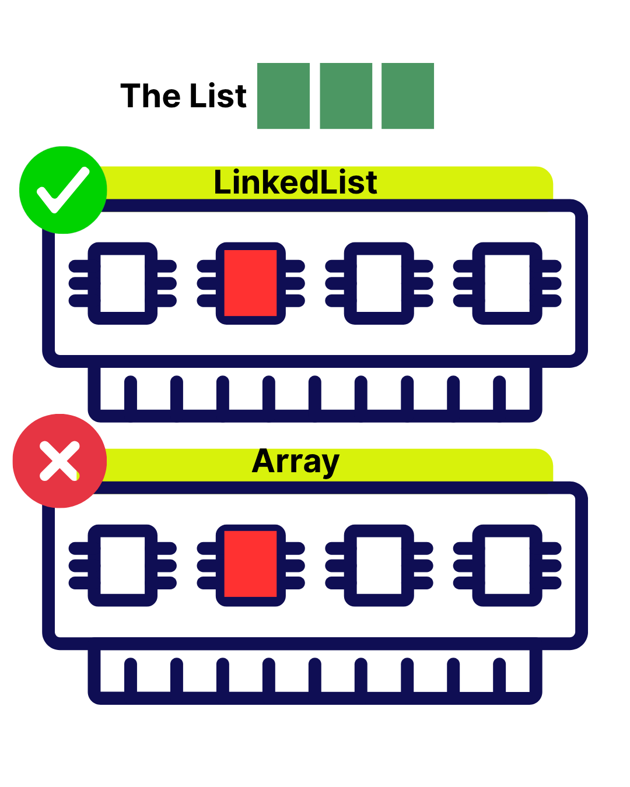
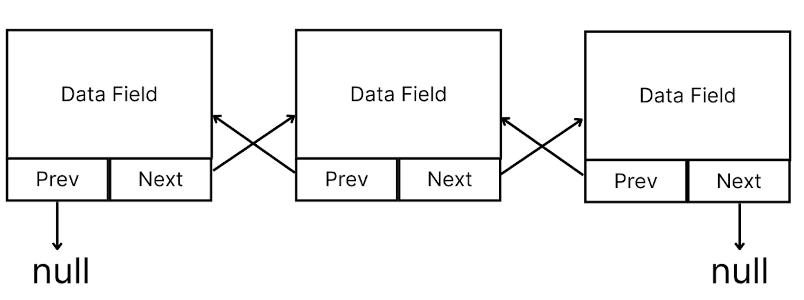

# YZM2031

## Data Structures and Algorithms

### Week 2: Lists and Linked Lists

**Instructor:** Ekrem Çetinkaya
**Date:** 08.10.2025

---

# Recap: Week 1

## What We Covered

- C++ fundamentals and syntax
- Memory management (stack vs heap)
- Pointers and reference
- Classes and objects
- Object-oriented programming basics
- Templates

## Today's Focus

Building on these concepts, we'll explore **Abstract Data Types** and our **first major data structure: Lists**

---

# What is an Abstract Data Type (ADT)?

An **Abstract Data Type (ADT)** is a model that defines:

- **What** data can be stored
- **What** operations can be performed on that data
- **Not how** it's implemented

> Think of it as a **contract** or **interface** - it specifies _what_ you can do, not _how_ it's done.

### Key Concept: Abstraction

**Abstraction** = Hiding implementation details, showing only functionality

- **What** you can do with a TV: change channels, adjust volume
- **How** it works internally: circuits, electronics (hidden)

---

# ADT: The Contract vs Implementation

<div class="two-columns">
<div class="column">

### The Abstract Part (Interface)

**What operations are available:**

```cpp
// List ADT Operations
- add(element)
- remove(element)
- get(index)
- size()
- isEmpty()
```

**This is the CONTRACT:**

- No mention of arrays
- No mention of pointers
- Just operations!

</div>
<div class="column">

### The Implementation Part

**How we actually do it:**

```cpp
// Implementation 1: Array
class ArrayList {
    int* data;
    int size;
};

// Implementation 2: Linked List
class LinkedList {
    Node* head;
};
```

**Same ADT, different implementations!**

</div>
</div>

---

# ADT in C++: Interface Example

```cpp
// ADT - defines WHAT, not HOW
class ListADT {
public:
    virtual void add(int value) = 0;
    virtual void remove(int value) = 0;
    virtual int get(int index) = 0;
    virtual int size() = 0;
    virtual bool isEmpty() = 0;
    virtual ~ListADT() {}
};

// Implementations
class ArrayList : public ListADT {
    // Implements using array
};

class LinkedList : public ListADT {
    // Implements using nodes and pointers
};
```

**Users only see the interface, not the implementation!**

---

# Example: SumArray


Let's say we want to define an array which always sums up the value of items in it whenever we modify it.

```cpp
class SumArray {
public:
    virtual int get(int) = 0;
    virtual void set(int, int) = 0;
    virtual int sum() = 0;
};
```

**This is the ADT contract:**

- Get value at index
- Set value at index
- Calculate sum of all elements

---

# Example: SumArray

### Implementation

```cpp
class SumArrayImpl : public SumArray {
public:
    SumArrayImpl(int);
    int get(int);
    void set(int, int);
    int sum();
    ~SumArrayImpl();

private:
    int *array;
    int numElements;
};
```

---

# Example: SumArray Implementation

<div class="two-columns">
<div class="column">

### Constructor

```cpp
SumArrayImpl::SumArrayImpl(int n) {
    numElements = n;
    array = new int[n];
    for(int i = 0; i < n; i++)
        array[i] = 0;
}
```

### Destructor

```cpp
SumArrayImpl::~SumArrayImpl() {
    delete [] array;
}
```

</div>
<div class="column">

### Get & Set Functions

```cpp
int SumArrayImpl::get(int index) {
    return array[index];
}

void SumArrayImpl::set(int index, int value) {
    array[index] = value;
}
```

**Direct array access:**

- Get: O(1) - constant time
- Set: O(1) - constant time

</div>

</div>

---

# Example: SumArray Implementation

### Sum Function

```cpp
int SumArrayImpl::sum() {
    int sum = 0;
    for(int i = 0; i < n; i++)
        sum += array[i];
    return sum;
}
```

### The Problem

**We are going to call this sum function very frequently.**
**How can we make it more efficient?**

_The for loop is a performance bottleneck when sum() is called repeatedly!_

---

# Performance Analysis

### Time Complexity

| Operation           | Complexity | Why?                      |
| ------------------- | ---------- | ------------------------- |
| `get(index)`        | **O(1)**   | Direct array access       |
| `set(index, value)` | **O(1)**   | Direct array access       |
| `sum()`             | **O(n)**   | Loop through all elements |

### The Problem

If we call `sum()` **frequently**:

- Each call requires **n** operations
- For 1000 elements: 1000 operations per sum!
- For 1,000,000 elements: 1,000,000 operations per sum!

---

<!-- _footer: "" -->
<!-- _header: "" -->
<!-- _paginate: false -->

<style scoped>
p { text-align: center}
h1 {text-align: center; font-size: 72px}
</style>

# Can we do better? 🙋


---

# Example: SumArray Implementation 2

**Instead of calculating sum every time, maintain it!**

```cpp
class SumArrayImpl2 : public SumArray {
public:
    SumArrayImpl2(int);
    int get(int);
    void set(int, int);
    int sum();
    ~SumArrayImpl2();

private:
    int *array;
    int numElements;
    int theSum;      // NEW: Store the running sum
};
```

**Trade-off:** Use extra memory to save computation time

---

# SumArray Implementation 2

<div class="two-columns">
<div class="column">

### Constructor

```cpp
SumArrayImpl2::SumArrayImpl2(int n) {
    numElements = n;
    array = new int[n];
    theSum = 0;  // Initialize sum to 0

    for(int i = 0; i < n; i++)
        array[i] = 0;
}
```

### Destructor

```cpp
SumArrayImpl2::~SumArrayImpl2() {
    delete [] array;
}
```

</div>

<div class="column">

###  Get Function

```cpp
int SumArrayImpl2::get(int index) {
    return array[index];
}
```

### Set Function

```cpp
void SumArrayImpl2::set(int index, int value) {
    theSum -= array[index];  // Subtract old value
    array[index] = value;    // Update array
    theSum += value;         // Add new value
}
```

**Change:**

1. Remove old value from sum
2. Update the array
3. Add new value to sum

</div>

</div>

---

# SumArray Implementation 2


```cpp
int SumArrayImpl2::sum() {
    return theSum;  // Just return the stored value!
}
```

**This is the payoff:**

- No loop needed
- No calculation needed
- Just return the pre-calculated sum
- **Time complexity: O(1)**

---

# Performance Comparison

<div class="two-columns">
<div class="column">

## Implementation 1

| Operation | Complexity |
| --------- | ---------- |
| `get()`   | O(1)       |
| `set()`   | O(1)       |
| `sum()`   | **O(n)**   |

**Memory:** O(n)

**Strategy:** Calculate when needed

**Best when:**

- Infrequent sum() calls
- Many set() operations

</div>
<div class="column">

## Implementation 2

| Operation | Complexity  |
| --------- | ----------- |
| `get()`   | O(1)        |
| `set()`   | O(1)        |
| `sum()`   | **O(1)**    |

**Memory:** O(n) + O(1)

**Strategy:** Maintain running total

**Best when:**

- Frequent sum() calls
- Trade memory for speed

</div>
</div>

---

# Space-Time Tradeoff


**You often trade one resource for another:**

- **Implementation 1**: Less memory, slower sum()
- **Implementation 2**: More memory, faster sum()


**Like caching in web development:**

- **No cache**: Compute every time (slow, less memory)
- **With cache**: Store results (fast, more memory)

**There's no free lunch!** Every optimization has a cost.

---

# Why ADTs Matter


### The ADT (What)

**Car Interface:**, Accelerate (press gas pedal), brake (press brake pedal), turn (rotate steering wheel), shift gears (use gear stick)

**You don't need to know HOW:** Combustion engine works, Brakes apply friction, Steering mechanism turns wheels

### The Implementation (How)

**Different implementations:**

- **Gas car**: Combustion engine
- **Electric car**: Electric motor
- **Hybrid car**: Both!

**Same interface, different internals!**

You can drive all three the same way, even though they work completely differently inside.

---

# The ADT Advantage

### Same Interface, Different Performance

```cpp
SumArray* arr1 = new SumArrayImpl(1000);  // Calculate on demand
SumArray* arr2 = new SumArrayImpl2(1000);  // Maintain running sum

// Both work the same way to the user:
arr1->set(0, 100);
arr1->set(1, 200);
int s1 = arr1->sum();  // O(n) - slower

arr2->set(0, 100);
arr2->set(1, 200);
int s2 = arr2->sum();  // O(1) - faster!
```

---

# Common Abstract Data Types

## ADTs You'll Meet This Semester

| ADT       | Key Operations           | Where are they?                |
| --------- | ------------------------ | ------------------------------ |
| **List**  | add, remove, get, insert | Shopping list, todo list       |
| **Stack** | push, pop, top           | Stack of plates, undo history  |
| **Queue** | enqueue, dequeue, front  | Line at store, printer queue   |
| **Set**   | add, remove, contains    | Mathematical set, unique items |
| **Map**   | put, get, remove         | Dictionary, phone book         |
| **Tree**  | insert, delete, search   | Family tree, file system       |
| **Graph** | addVertex, addEdge       | Social network, road map       |

**Each can be implemented in multiple ways!**

---

# ADT vs Data Structure

<div class="two-columns">
<div class="column">

### Abstract Data Type (ADT)

**Conceptual/Logical view**

- **What** operations exist
- **What** behavior to expect
- **Interface/Contract** Language-independent concept

**Examples:**

- List ADT
- Stack ADT
- Queue ADT

</div>
<div class="column">

### Data Structure

**Concrete/Physical view**

- **How** it's implemented
- **How** data is organized
- **Actual code** Language-specific implementation

**Examples:**

- ArrayList (implements List)
- LinkedList (implements List)
- Array-based Stack
- Linked Stack

</div>
</div>

**Think:** ADT = Blueprint, Data Structure = Actual Building

---

# Benefits of ADTs

## 1. Separation of Concerns

**User perspective:** "I just want to store and retrieve data"
**Implementation perspective:** "I need to optimize memory and speed"

## 2. Flexibility

Change implementation without breaking user code:

```cpp
ListADT* myList = new ArrayList();    // Using array
// ... later, switch to ...
ListADT* myList = new LinkedList();   // Using linked list
// Same interface, different performance!
```

## 3. Easier to Understand

Focus on **what** you're doing, not **how** it works internally.

---

# Now, Let's Apply This to Lists


## The List ADT

A **list** is a sequence of elements where:

- Elements are ordered (have positions: 0, 1, 2, ...)
- Duplicate elements are allowed
- Elements can be accessed by position

## Common List Operations

- **Access**: Get element at position i
- **Insert**: Add element at position i
- **Delete**: Remove element at position i
- **Search**: Find element with value x
- **Size**: Get number of elements

---

# Lists in Real Life

<div class="two-columns">
<div class="column">

### Digital World

- **Shopping cart** items
- **Todo list** tasks
- **Playlist** songs
- **Browser history**
- **Email inbox**
- **Social media feed**

</div>
<div class="column">

### Physical World

- **Queue** at a store
- **Deck of cards**
- **Books** on a shelf
- **Train cars** linked together
- **Chain links**

</div>
</div>

> The list is one of the most fundamental data structures in computer science.

---

# Two Main Implementations

<div class="two-columns">
<div class="column">

## 1. Array-Based List

```cpp
class ArrayList {
private:
    int* data;
    int size;
    int capacity;
};
```

**Characteristics:**

- Contiguous memory
- Fast random access
- Fixed initial capacity
- May need resizing

</div>
<div class="column">

## 2. Linked List

```cpp
struct Node {
    Object data;
    Node* next;
};

class LinkedList {
private:
    Node* head;
    int size;
};
```

**Characteristics:**

- Non-contiguous memory
- Dynamic size
- Sequential access
- No resizing needed

</div>
</div>

---


# Array-Based Lists

## Using Arrays to Store Lists

```cpp
class ArrayList {
private:
    int* data;        // Dynamic array
    int size;         // Current number of elements
    int capacity;     // Current array capacity - useful to prevent memory overflow

public:
    ArrayList(int cap = 10);
    ~ArrayList();
    void add(int value);
    void insert(int index, int value);
    void remove(int index);
    int get(int index);
    int length() { return size; }
};
```

---

# ArrayList Implementation: Constructor

```cpp
class ArrayList {
private:
    int* data;
    int size;
    int capacity;

public:
    ArrayList(int cap = 10) {
        capacity = cap;
        size = 0;
        data = new int[capacity];  // Allocate array on heap
    }

    ~ArrayList() {
        delete[] data;  // Free memory
    }
};
```

**Key Points:**

- Initial capacity prevents frequent resizing
- Size tracks actual number of elements
- Destructor prevents memory leaks

---

# ArrayList: Adding Elements

```cpp
void add(int value) {
    if (size >= capacity) {
        resize();  // Need more space
    }
    data[size] = value;
    size++;
}

void resize() {
    capacity *= 2;  // Double the capacity
    int* newData = new int[capacity];

    // Copy old elements
    for (int i = 0; i < size; i++) {
        newData[i] = data[i];
    }

    delete[] data;  // Free old array
    data = newData;  // Point to new array
}
```

**Time Complexity:** O(1) amortized (occasional O(n) for resize)

---

# ArrayList: Insertion at Position

```cpp
void insert(int index, int value) {
    if (index < 0 || index > size) {
        throw out_of_range("Invalid index");
    }

    if (size >= capacity) {
        resize();
    }

    // Shift elements to the right
    for (int i = size; i > index; i--) {
        data[i] = data[i - 1];
    }

    data[index] = value;
    size++;
}
```

**Time Complexity:** O(n) - Must shift elements

---

# ArrayList Example

### Inserting at Position 2

```
Initial array (size=5, capacity=8):
Index:  0   1   2   3   4   5   6   7
Data: [10][20][30][40][50][ ][ ][ ]

Insert 25 at index 2:

Step 1 - Shift elements right:
Index:  0   1   2   3   4   5   6   7
Data: [10][20][30][30][40][50][ ][ ]
                  ↑
Step 2 - Insert new value:
Index:  0   1   2   3   4   5   6   7
Data: [10][20][25][30][40][50][ ][ ]
              ↑ new
```

**Result:** size becomes 6

---

# ArrayList: Deletion

```cpp
void remove(int index) {
    if (index < 0 || index >= size) {
        throw out_of_range("Invalid index");
    }

    // Shift elements to the left
    for (int i = index; i < size - 1; i++) {
        data[i] = data[i + 1];
    }

    size--;
}

int get(int index) {
    if (index < 0 || index >= size) {
        throw out_of_range("Invalid index");
    }
    return data[index];
}
```

**Time Complexity:**

- Remove: O(n) - Must shift elements
- Get: O(1) - Direct access

---

# ArrayList: Performance Analysis

## Time Complexity

| Operation        | Average Case | Worst Case    |
| ---------------- | ------------ | ------------- |
| **Access (get)** | O(1)         | O(1)          |
| **Add (end)**    | O(1)         | O(n) (resize) |
| **Insert**       | O(n)         | O(n)          |
| **Remove**       | O(n)         | O(n)          |
| **Search**       | O(n)         | O(n)          |

## Space Complexity

- **Storage:** O(n)
- **Overhead:** Wasted space when size < capacity

---

# Linked Lists: Introduction

## What is a Linked List?

A **linked list** is a linear data structure where:

- Elements are stored in **nodes**
- Each node contains **data** and a **pointer** to the next node
- Nodes are not stored contiguously in memory
- First node is called the **head**

```cpp
struct Node {
    int data;       // The value
    Node* next;     // Pointer to next node

    Node(int val) : data(val), next(nullptr) {}
};
```

---

# Linked List

### Singly Linked List Structure

```
head
  ↓
┌───┬────┐    ┌───┬────┐    ┌───┬────┐    ┌───┬────┐
│ 10│ ●──┼───→│ 20│ ●──┼───→│ 30│ ●──┼───→│ 40│ ///│
└───┴────┘    └───┴────┘    └───┴────┘    └───┴────┘
  Node 1        Node 2        Node 3        Node 4
```

**Key Points:**

- Each node points to the next node
- Last node's `next` is `nullptr` (end of list)
- Head pointer gives access to the entire list

---

# Linked List vs Array

<div class="two-columns">
<div class="column">

### Array

- ✅ Fast random access: `O(1)`
- ✅ Cache-friendly (contiguous)
- ❌ Fixed size (or expensive resize)
- ❌ Expensive insertions/deletions: `O(n)`
- ❌ All elements must be in the same type

</div>
<div class="column">

### LinkedList 

- ❌ Slow random access: `O(n)`
- ❌ Not cache-friendly (scattered)
- ✅ Dynamic size
- ✅ Fast insertions/deletions: `O(1)`
- ✅ Elements can be in different types
</div>
</div>

---

<!-- _footer: "" -->
<!-- _header: "" -->
<!-- _paginate: false -->



---

# Singly Linked List: Class Structure

```cpp
class LinkedList {
private:
    struct Node {
        int data;
        Node* next;

        Node(int val) : data(val), next(nullptr) {}
    };

    Node* head;
    int size;

public:
    LinkedList() : head(nullptr), size(0) {}
    ~LinkedList();

    void insertFront(int value);
    void insertBack(int value);
    void insertAt(int index, int value);
    void remove(int value);
    void display();
    int length() { return size; }
};
```

---

# Linked List: Insert at Front

```cpp
void insertFront(int value) {
    Node* newNode = new Node(value);
    newNode->next = head;
    head = newNode;
    size++;
}
```

### Example

```
Before: head → [20] → [30] → nullptr
Insert 10 at front:
        head
         ↓
       [10] ──→ [20] → [30] → nullptr
        ↑
     newNode
```

**Time Complexity:** O(1) - Constant time!

---

# Linked List: Insert at Back

```cpp
void insertBack(int value) {
    Node* newNode = new Node(value);

    if (head == nullptr) {
        head = newNode;
    } else {
        Node* current = head;
        // Traverse to the last node
        while (current->next != nullptr) {
            current = current->next;
        }
        current->next = newNode;
    }
    size++;
}
```

**Time Complexity:** O(n) - Must traverse entire list

---

<!-- _footer: "" -->
<!-- _header: "" -->
<!-- _paginate: false -->

<style scoped>
p { text-align: center}
h1 {text-align: center; font-size: 72px}
</style>

# Can we do better? 🙋

---

# Linked List: Insert at Back - Optimized

**Solution:** Keep a `tail` pointer → O(1)

```cpp
class LinkedList {
private:
    Node* head;
    Node* tail;  // Add tail pointer!
    int size;
    
public:
    LinkedList() : head(nullptr), tail(nullptr), size(0) {}
};
```

**With tail pointer, insertion at back becomes O(1)!**

---

# Linked List: Insert at Back - Optimized

```cpp
void insertBack(int value) {
    Node* newNode = new Node(value);
    
    if (head == nullptr) {
        // Empty list: both head and tail point to new node
        head = tail = newNode;
    } else {
        // Add to end: update tail's next, then move tail
        tail->next = newNode;
        tail = newNode;
    }
    size++;
}
```

**Time Complexity:** O(1) - Direct access via tail pointer!

**Trade-off:** Extra memory for tail pointer

---

# Linked List: Insert at Position

```cpp
void insertAt(int index, int value) {
    if (index < 0 || index > size) {
        throw out_of_range("Invalid index");
    }

    if (index == 0) {
        insertFront(value);
        return;
    }

    Node* newNode = new Node(value);
    Node* current = head;

    // Traverse to node before insertion point
    for (int i = 0; i < index - 1; i++) {
        current = current->next;
    }

    newNode->next = current->next;
    current->next = newNode;
    size++;
}
```

**Time Complexity:** O(n) - Need to traverse to position

---

# Insert at Position : Example

## Insert 25 at index 2

```
Step 1: Traverse to index 1
head → [10] → [20] → [30] → nullptr
                ↑
             current

Step 2: Create new node
       [25]
     newNode

Step 3: Link new node
head → [10] → [20] → [30] → nullptr
                ↓     ↑
              [25] ───┘

Step 4: Relink previous node
head → [10] → [20] → [25] → [30] → nullptr
```


---

# Linked List: Deletion

```cpp
void remove(int value) {
    if (head == nullptr) return;

    // Special case: delete head
    if (head->data == value) {
        Node* temp = head;
        head = head->next;
        delete temp;
        size--;
        return;
    }

    // Find node before the one to delete
    Node* current = head;
    while (current->next != nullptr && current->next->data != value) {
        current = current->next;
    }

    if (current->next != nullptr) {
        Node* temp = current->next;
        current->next = current->next->next;
        delete temp;
        size--;
    }
}
```

---

# Linked List: Delete Tail

**The Problem:** Even with a tail pointer, we need the node BEFORE tail!

```cpp
void deleteTail() {
    if (head == nullptr) return;  // Empty list
    
    if (head == tail) {  // Only one node
        delete head;
        head = tail = nullptr;
        size--;
        return;
    }
    
    // Must traverse to find second-to-last node
    Node* current = head;
    while (current->next != tail) {
        current = current->next;
    }
    
    delete tail;
    tail = current;
    tail->next = nullptr;
    size--;
}
```

**Time Complexity:** Still O(n) - Need to find previous node!

---

# Why Delete Tail is O(n) in Singly Linked List

## The Fundamental Problem

```
Before deletion:
head → [10] → [20] → [30] → [40] ← tail
                       ↑
                  Need this node!
```

**We need to:**
1. Find the node BEFORE tail
2. Set its `next` to `nullptr`
3. Update `tail` pointer to this node

**Why we can't do better:**
- Singly linked list = **one-way street**
- Can't go backwards from tail
- Must start from head and traverse

**Solution for O(1) deletion:** Use **doubly linked list**

---

# Deletion: Visual Example

## Delete value 20

```
Initial:
head → [10] → [20] → [30] → nullptr

Step 1: Find node before target
head → [10] → [20] → [30] → nullptr
        ↑      ↑
     current  temp

Step 2: Relink and delete
head → [10] ─────→ [30] → nullptr

       [20]  ← delete this
       temp
```

**Time Complexity:** O(n) - Must search for value

---

# Linked List: Traversal and Display

```cpp
void display() {
    Node* current = head;

    while (current != nullptr) {
        cout << current->data;
        if (current->next != nullptr) {
            cout << " → ";
        }
        current = current->next;
    }
    cout << " → nullptr" << endl;
}

// Count nodes (alternative to size variable)
int count() {
    int cnt = 0;
    Node* current = head;

    while (current != nullptr) {
        cnt++;
        current = current->next;
    }
    return cnt;
}
```

---

# Linked List: Destructor

```cpp
~LinkedList() {
    Node* current = head;

    while (current != nullptr) {
        Node* next = current->next;  // Save next pointer
        delete current;              // Delete current node
        current = next;              // Move to next
    }

    head = nullptr;
    size = 0;
}
```

**Critical:** Must delete all nodes to prevent memory leaks!

**Pattern:** Save `next` before deleting, or you lose access to rest of list

---

# Singly Linked List: Performance

### Time Complexity

| Operation              | Complexity | Notes                                  |
| ---------------------- | ---------- | -------------------------------------- |
| **Insert at head**     | O(1)       | Direct pointer manipulation            |
| **Insert at tail**     | O(n)       | Must traverse (O(1) with tail pointer) |
| **Insert at position** | O(n)       | Must traverse to position              |
| **Delete**             | O(n)       | Must search for value                  |
| **Access by index**    | O(n)       | Must traverse                          |
| **Search**             | O(n)       | Must traverse                          |

### Space Complexity

- **Per node:** 8 bytes (data) + 8 bytes (pointer) = 16 bytes
- **Overhead:** Higher than arrays due to pointers

---

# Doubly Linked List

## What's Different?

Each node has **two pointers:**

- `next`: Points to next node
- `prev`: Points to previous node

```cpp
struct Node {
    int data;
    Node* next;
    Node* prev;  // New: pointer to previous node

    Node(int val) : data(val), next(nullptr), prev(nullptr) {}
};
```

**Advantages:**

- Can traverse in **both directions**
- Easier deletion (don't need previous node)
- More flexible operations

---

# Doubly Linked List: Structure



**Key Points:**

- First node's `prev` is `nullptr`
- Last node's `next` is `nullptr`

---

# Doubly Linked List: Class Structure

```cpp
class DoublyLinkedList {
private:
    struct Node {
        int data;
        Node* next;
        Node* prev;

        Node(int val) : data(val), next(nullptr), prev(nullptr) {}
    };

    Node* head;
    Node* tail;  // Optional but useful
    int size;

public:
    DoublyLinkedList() : head(nullptr), tail(nullptr), size(0) {}
    ~DoublyLinkedList();

    void insertFront(int value);
    void insertBack(int value);
    void remove(Node* node);  // Can remove by node reference
    void displayForward();
    void displayBackward();
};
```

---

# Doubly Linked List: Insert at Front

```cpp
void insertFront(int value) {
    Node* newNode = new Node(value);

    if (head == nullptr) {
        // Empty list
        head = tail = newNode;
    } else {
        newNode->next = head;
        head->prev = newNode;
        head = newNode;
    }
    size++;
}
```

```
Before: head → [20] ⇄ [30] ← tail

After:  head → [10] ⇄ [20] ⇄ [30] ← tail
```

---

# Doubly Linked List: Insert at Back

```cpp
void insertBack(int value) {
    Node* newNode = new Node(value);

    if (tail == nullptr) {
        // Empty list
        head = tail = newNode;
    } else {
        tail->next = newNode;
        newNode->prev = tail;
        tail = newNode;
    }
    size++;
}
```

**Time Complexity:** O(1) - Because we have a tail pointer

**Advantage over Singly Linked List:** No need to traverse to find the end

---

# What if No Tail Pointer?

### Insert at Back Without Tail

<div class="two-columns">
<div class="column">

### Singly Linked List

```cpp
// Must traverse
Node* current = head;
while (current->next != nullptr) {
    current = current->next;
}
current->next = newNode;
```

**Time:** O(n)

</div>
<div class="column">

### Doubly Linked List

```cpp
// Still must traverse
Node* current = head;
while (current->next != nullptr) {
    current = current->next;
}
current->next = newNode;
newNode->prev = current;
```

**Time:** O(n)

</div>
</div>

**Without tail pointer:** No advantage for insertion at back! Both are O(n).

---

# Doubly Linked List: Deletion

```cpp
void remove(Node* node) {
    if (node == nullptr) return;

    // Update previous node's next pointer
    if (node->prev != nullptr) {
        node->prev->next = node->next;
    } else {
        head = node->next;  // Deleting head
    }

    // Update next node's prev pointer
    if (node->next != nullptr) {
        node->next->prev = node->prev;
    } else {
        tail = node->prev;  // Deleting tail
    }

    delete node;
    size--;
}
```

**Time Complexity:** O(1) - If we have the node reference!

---

# Doubly Linked List: Bidirectional Traversal

```cpp
void displayForward() {
    Node* current = head;
    cout << "Forward: ";
    while (current != nullptr) {
        cout << current->data;
        if (current->next != nullptr) {
            cout << " ⇄ ";
        }
        current = current->next;
    }
    cout << endl;
}

void displayBackward() {
    Node* current = tail;
    cout << "Backward: ";
    while (current != nullptr) {
        cout << current->data;
        if (current->prev != nullptr) {
            cout << " ⇄ ";
        }
        current = current->prev;
    }
    cout << endl;
}
```

---

# Comparison: Singly vs Doubly Linked List

<div class="two-columns">
<div class="column">

## Singly Linked List

**Advantages:**

- ✅ Less memory (one pointer per node)
- ✅ Simpler implementation
- ✅ Sufficient for many use cases

**Disadvantages:**

- ❌ One-way traversal only
- ❌ Need previous node for deletion
- ❌ Cannot traverse backward

**Use when:** Forward-only traversal is sufficient

</div>
<div class="column">

## Doubly Linked List

**Advantages:**

- ✅ Bidirectional traversal
- ✅ Easier deletion (O(1) with node ref)
- ✅ More flexible operations

**Disadvantages:**

- ❌ More memory (two pointers per node)
- ❌ More complex implementation
- ❌ More pointer updates

**Use when:** Need backward traversal or frequent deletions

</div>
</div>

---

# Circular Linked Lists

## Singly Circular

```
       ┌──────────────────────────────┐
       ↓                              │
head → [10] → [20] → [30] → [40] ─────┘
```

Last node points back to first node (no `nullptr`)

## Doubly Circular

- **Last node's `next`** points to **first node**
- **First node's `prev`** points to **last node**

---

# Doubly Circular Lists

### Real-World Applications

**1. Music Player (with shuffle history)**
- Navigate forward/backward through songs
- Loop back to start when reaching end
- Example: Spotify playlist on repeat

**2. Browser Tab Management**
- Cycle through tabs: Ctrl+Tab (forward), Ctrl+Shift+Tab (backward)
- Last tab wraps to first tab

**3. Image Carousel**
- Slideshow that loops infinitely
- Can navigate both directions

---

# Array-Based List vs Linked List

| Feature               | Array-Based   | Linked List        |
| --------------------- | ------------- | ------------------ |
| **Memory**            | Contiguous    | Scattered          |
| **Access by index**   | O(1)          | O(n)               |
| **Insert at front**   | O(n)          | O(1)               |
| **Insert at end**     | O(1)\*        | O(n) or O(1)\*\*   |
| **Insert middle**     | O(n)          | O(n)               |
| **Delete**            | O(n)          | O(n) or O(1)\*\*\* |
| **Space overhead**    | Low           | High (pointers)    |
| **Cache performance** | Good          | Poor               |
| **Dynamic size**      | Resize needed | Natural            |

<small>\*Amortized, **With tail pointer, \***With node reference</small>

---

# When to Use Array-Based Lists

## Choose Arrays When:

1. **Random access is common**

   - Need to access elements by index frequently
   - Example: Video frames, game board

2. **Size is predictable**

   - Know approximate size in advance
   - Example: Days of the week, fixed configuration

3. **Memory is limited**

   - Less overhead per element
   - Cache-friendly for iteration

4. **Mostly append operations**
   - Adding to end is fast (amortized O(1))
   - Example: Log files, append-only data

---

# When to Use Linked Lists

## Choose Linked Lists When:

1. **Frequent insertions/deletions at front**

   - O(1) operation
   - Example: Undo/redo stack, queue implementation

2. **Size is unknown or highly variable**

   - No need to preallocate or resize
   - Example: Dynamic user input, real-time data

3. **Don't need random access**

   - Sequential access is fine
   - Example: Processing pipeline, iterators

4. **Memory fragmentation is acceptable**
   - Can use scattered memory
   - Large contiguous blocks not available

---

# Common Linked List Problems

## 1. Finding the Middle

```cpp
Node* findMiddle(Node* head) {
    Node* slow = head;
    Node* fast = head;

    // Fast moves 2x speed of slow
    while (fast != nullptr && fast->next != nullptr) {
        slow = slow->next;
        fast = fast->next->next;
    }

    return slow;  // When fast reaches end, slow is at middle
}
```

**Technique:** Two pointers (slow and fast)
**Time Complexity:** O(n)

---

# Common Linked List Problems

## 2. Detecting a Cycle

```cpp
bool hasCycle(Node* head) {
    Node* slow = head;
    Node* fast = head;

    while (fast != nullptr && fast->next != nullptr) {
        slow = slow->next;
        fast = fast->next->next;

        if (slow == fast) {
            return true;  // Cycle detected!
        }
    }

    return false;  // No cycle
}
```

**Technique:** Floyd's Cycle Detection (Tortoise and Hare)
**Time Complexity:** O(n)

---

# Common Linked List Problems

## 3. Reversing a Linked List

```cpp
Node* reverse(Node* head) {
    Node* prev = nullptr;
    Node* current = head;

    while (current != nullptr) {
        Node* next = current->next;  // Save next
        current->next = prev;        // Reverse link
        prev = current;              // Move prev forward
        current = next;              // Move current forward
    }

    return prev;  // New head
}
```

**Visual:** [1]→[2]→[3]→nullptr becomes nullptr←[1]←[2]←[3]
**Time Complexity:** O(n)

---

# Common Linked List Problems

## 4. Merging Two Sorted Lists

```cpp
Node* mergeSorted(Node* l1, Node* l2) {
    if (l1 == nullptr) return l2;
    if (l2 == nullptr) return l1;

    Node* result = nullptr;

    if (l1->data <= l2->data) {
        result = l1;
        result->next = mergeSorted(l1->next, l2);
    } else {
        result = l2;
        result->next = mergeSorted(l1, l2->next);
    }

    return result;
}
```

**Technique:** Recursion
**Time Complexity:** O(m + n)

---

# Common Linked List Problems

## 5. Removing Duplicates (Sorted List)

```cpp
void removeDuplicates(Node* head) {
    Node* current = head;

    while (current != nullptr && current->next != nullptr) {
        if (current->data == current->next->data) {
            Node* temp = current->next;
            current->next = current->next->next;
            delete temp;
        } else {
            current = current->next;
        }
    }
}
```

**Example:** [1]→[1]→[2]→[3]→[3] becomes [1]→[2]→[3]
**Time Complexity:** O(n)

---

# Memory Considerations

## Array-Based List Memory

```cpp
// ArrayList with capacity 100, size 10
int* data = new int[100];  // Allocated: 400 bytes
// Used: 40 bytes (10 elements)
// Wasted: 360 bytes (90 unused slots)
```

**Memory usage:** `capacity × sizeof(element)`
**Waste:** Can be significant if capacity >> size

## Linked List Memory

```cpp
// 10 nodes in singly linked list
// Per node: 4 bytes (int) + 8 bytes (pointer) = 12 bytes
// Total: 10 × 12 = 120 bytes
```

**Memory usage:** `size × (sizeof(data) + sizeof(pointer))`
**Overhead:** Fixed per node (pointer space)

---

# Cache Performance

## Why Arrays are Faster

```
Array in memory (contiguous):
┌────┬────┬────┬────┬────┬────┐
│ 10 │ 20 │ 30 │ 40 │ 50 │ 60 │  ← CPU loads entire block to cache
└────┴────┴────┴────┴────┴────┘
  ↑
 Fast sequential access (cache hits)
```

## Why Linked Lists are Slower

```
Linked List in memory (scattered):
0x1000: [10]→0x5000       ← Cache miss
0x5000: [20]→0x2000       ← Cache miss
0x2000: [30]→0x8000       ← Cache miss
  ↑
Slow sequential access (cache misses)
```

**Modern CPU cache lines:** 64 bytes
**Impact:** Arrays can be 10-100x faster for sequential access

---

# STL List Containers

## C++ Standard Template Library

<div class="two-columns">
<div class="column">

### std::vector (Array-based)

```cpp
#include <vector>

vector<int> vec;
vec.push_back(10);
vec.push_back(20);
vec[0];  // Random access
vec.size();
vec.clear();
```

**Use case:** Default choice for lists

</div>
<div class="column">

### std::list (Doubly Linked)

```cpp
#include <list>

list<int> lst;
lst.push_front(10);
lst.push_back(20);
lst.front();  // No random access
lst.size();
lst.clear();
```

**Use case:** Frequent front insertions

</div>
</div>

### std::forward_list (Singly Linked)

```cpp
#include <forward_list>
forward_list<int> fwd;
fwd.push_front(10);  // Only front operations
```

---

# Iterator Pattern

## Traversing with Iterators

```cpp
#include <vector>
#include <list>

vector<int> vec = {1, 2, 3, 4, 5};
list<int> lst = {1, 2, 3, 4, 5};

// Same iteration syntax for both!
for (auto it = vec.begin(); it != vec.end(); ++it) {
    cout << *it << " ";
}

for (auto it = lst.begin(); it != lst.end(); ++it) {
    cout << *it << " ";
}

// Or use range-based for loop
for (int val : vec) {
    cout << val << " ";
}
```

**Benefit:** Uniform interface across data structures

---

<!-- _footer: "" -->
<!-- _header: "" -->
<!-- _paginate: false -->

<style scoped>
p { text-align: center}
h1 {text-align: center; font-size: 72px}
h2 {text-align: center; font-size: 48px}
</style>


# A Common Interview Question 📝

## Remove nth Node from End

---

# Interview Question: nth from End

```cpp
Node* nthFromEnd(Node* head, int n) {
    Node* fast = head;
    Node* slow = head;

    // Move fast n steps ahead
    for (int i = 0; i < n; i++) {
        if (fast == nullptr) return nullptr;  // n > list length
        fast = fast->next;
    }

    // Move both until fast reaches end
    while (fast != nullptr) {
        slow = slow->next;
        fast = fast->next;
    }

    return slow;  // nth from end
}
```

**Technique:** Two pointers with gap of n
**Time Complexity:** O(n)

---

# Summary: Key Takeaways

### Lists are Fundamental

1. **Two main implementations**: Array-based and Linked
2. **Trade-offs**: Access speed vs insertion/deletion speed
3. **Array-based**: Fast access, slow modifications
4. **Linked lists**: Slow access, fast modifications
5. **Choose based on use case**: Access pattern matters!

### Linked List Varieties

- **Singly linked**: Simple, one-way traversal
- **Doubly linked**: Bidirectional, more flexible
- **Circular**: No end, useful for round-robin

### Online Visualizations

- **VisuAlgo**: https://visualgo.net/en/list
  - Interactive linked list animations

---

# Next Week Preview

## Week 3: Stack and Queue

Building on lists, we'll explore:

- **Stack**: LIFO (Last In, First Out)
  - Applications: Function calls, undo/redo, expression evaluation
- **Queue**: FIFO (First In, First Out)
  - Applications: Task scheduling, breadth-first search
- **Implementations**: Using arrays and linked lists
- **Variations**: Circular queue, deque, priority queue

## Reading Assignment

- **Weiss Chapter 3.6-3.7**: Stack and Queue
- **Review**: Linked list implementations

---

# Thank You!

## Contact Information

- **Email:** ekrem.cetinkaya@yildiz.edu.tr
- **Office Hours:** Tuesday 14:00-16:00 - Room F-B21
- **Book a slot before coming to the office hours:** [Booking Link](https://calendar.app.google/aBKvBqNAqG12oD2B9)
- **Course Repository:** [GitHub Link](https://github.com/ekremcet/yzm2031-data-structures-and-algorithms)

## Next Class

- **Date:** 15.10.2025
- **Topic:** Stack and Queue
- **Reading:** Weiss Chapter 3.6-3.7