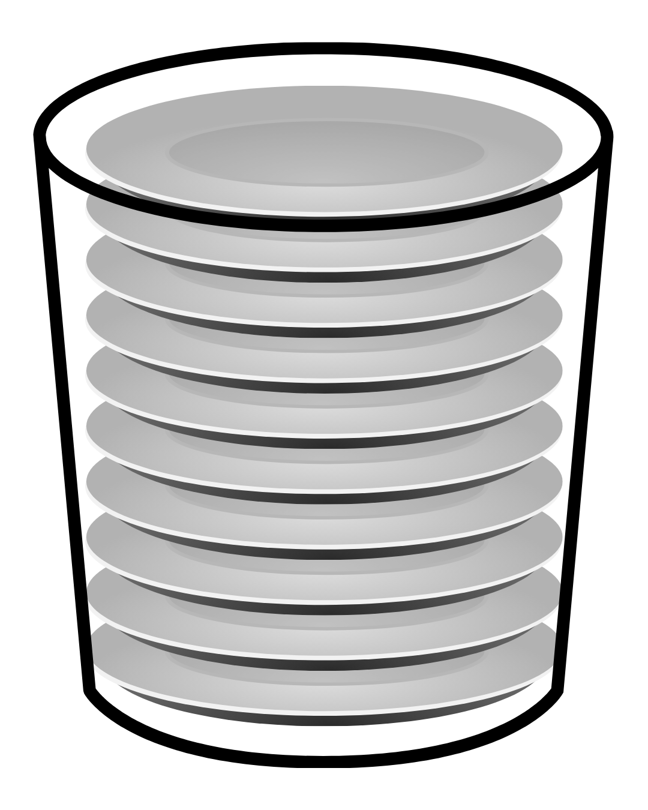

# YZM2031

## Data Structures and Algorithms

### Week 3: Stack and Queue

**Instructor:** Ekrem Çetinkaya
**Date:** 15.10.2025

---

# Recap: Week 2

## What We Covered

- Abstract Data Types (ADTs)
- List ADT and its implementations
- Array-based lists
- Linked lists (singly, doubly, circular)
- Performance analysis and trade-offs

## Today's Focus

Two more fundamental ADTs that restrict how we access data: **Stack** and **Queue**

---

# The Power of Restrictions

### Why Limit Functionality?

With lists, we could:
- Access any element at any position
- Insert/delete anywhere
- Complete freedom

**But sometimes, restrictions make things:**
- **Simpler** to use
- **Faster** to implement
- **Safer** from errors
- **More intuitive** for specific problems

> Constraints can be liberating

---

# Stack ADT



## What is a Stack?

A **Stack** is a linear data structure that follows **LIFO** (Last In, First Out) principle:
- The last element added is the first one to be removed
- Access is restricted to one end only (the "top")

Think of it like:
- Stack of plates
- Stack of books
- Browser back button
- Undo/redo functionality

---

# Stack


**Operations:**
- **Add a plate?** Put it on top (push)
- **Remove a plate?** Take from top (pop)
- **Check top plate?** Look at top (peek/top)

**You cannot:**
- Take a plate from the middle
- Access the bottom plate directly
- Rearrange plates

---

# Stack ADT: Interface

## Essential Operations

```cpp
class Stack {
public:
    virtual void push(int value) = 0;      // Add to top
    virtual int pop() = 0;                 // Remove from top
    virtual int top() = 0;                 // View top element
    virtual bool isEmpty() = 0;            // Check if empty
    virtual int size() = 0;                // Number of elements
    virtual ~Stack() {}
};
```

**Key Principle:** All operations happen at the **top** only

---

# Stack Operations

<div class="two-columns">
<div class="column">

## Push Operation

```
Initial:            After push(40):
┌────┐              ┌────┐
│ 30 │ ← top        │ 40 │ ← top (new)
├────┤              ├────┤
│ 20 │              │ 30 │
├────┤              ├────┤
│ 10 │              │ 20 │
└────┘              ├────┤
                    │ 10 │
                    └────┘
```

</div>
<div class="column">

## Pop Operation

```
Initial:            After pop():
┌────┐              
│ 40 │ ← top        
├────┤              ┌────┐
│ 30 │              │ 30 │ ← top
├────┤              ├────┤
│ 20 │              │ 20 │
├────┤              ├────┤
│ 10 │              │ 10 │
└────┘              └────┘
```

</div>
</div>

---

# Array-Based Stack Implementation

```cpp
class ArrayStack : public Stack {
private:
    int* data;
    int capacity;
    int topIndex;  // Index of top element

public:
    ArrayStack(int cap = 100) {
        capacity = cap;
        data = new int[capacity];
        topIndex = -1;  // Empty stack
    }

    ~ArrayStack() {
        delete[] data;
    }

    bool isEmpty() override {
        return topIndex == -1;
    }

    int size() override {
        return topIndex + 1;
    }
};
```

---

# Array-Based Stack: Push and Pop

```cpp
void push(int value) override {
    if (topIndex >= capacity - 1) {
        throw overflow_error("Stack overflow!");
    }
    data[++topIndex] = value;
}

int pop() override {
    if (isEmpty()) {
        throw underflow_error("Stack underflow!");
    }
    return data[topIndex--];
}

int top() override {
    if (isEmpty()) {
        throw underflow_error("Stack is empty!");
    }
    return data[topIndex];
}
```

**Time Complexity:** All operations are **O(1)**

---

# Array-Based Stack: Example

```cpp
int main() {
    ArrayStack stack(10);

    // Push elements
    stack.push(10);
    stack.push(20);
    stack.push(30);

    cout << "Top: " << stack.top() << endl;     // Output: 30
    cout << "Size: " << stack.size() << endl;   // Output: 3

    // Pop elements
    cout << "Pop: " << stack.pop() << endl;     // Output: 30
    cout << "Pop: " << stack.pop() << endl;     // Output: 20

    cout << "Top: " << stack.top() << endl;     // Output: 10
    cout << "Size: " << stack.size() << endl;   // Output: 1

    return 0;
}
```

---

# Linked List-Based Stack

```cpp
class LinkedStack : public Stack {
private:
    struct Node {
        int data;
        Node* next;
        Node(int val) : data(val), next(nullptr) {}
    };
    Node* topNode;
    int stackSize;

public:
    LinkedStack() : topNode(nullptr), stackSize(0) {}
    
    ~LinkedStack() {
        while (!isEmpty()) {
            pop();
        }
    }
    bool isEmpty() override {
        return topNode == nullptr;
    }
    int size() override {
        return stackSize;
    }
};
```

---

# Linked Stack: Push and Pop

```cpp
void push(int value) override {
    Node* newNode = new Node(value);
    newNode->next = topNode;
    topNode = newNode;
    stackSize++;
}

int pop() override {
    if (isEmpty()) {
        throw underflow_error("Stack underflow!");
    }
    Node* temp = topNode;
    int value = topNode->data;
    topNode = topNode->next;
    delete temp;
    stackSize--;
    return value;
}

int top() override {
    if (isEmpty()) {
        throw underflow_error("Stack is empty!");
    }
    return topNode->data;
}
```

**Time Complexity:** All operations are **O(1)**

---

# Array vs Linked Stack

<div class="two-columns">
<div class="column">

## Array-Based Stack

**Advantages:**
- ✅ Simple implementation
- ✅ Cache-friendly (contiguous memory)
- ✅ No pointer overhead
- ✅ Better memory locality

**Disadvantages:**
- ❌ Fixed capacity (or resize overhead)
- ❌ Potential waste of space
- ❌ Stack overflow possible

**Use when:** Maximum size is known

</div>
<div class="column">

## Linked List-Based Stack

**Advantages:**
- ✅ Dynamic size (no overflow)
- ✅ No wasted space
- ✅ Grows/shrinks as needed

**Disadvantages:**
- ❌ Extra memory for pointers
- ❌ Slower (pointer dereferencing)
- ❌ Not cache-friendly

**Use when:** Size is unpredictable

</div>
</div>

---

# Stack Applications: Function Call Stack

### How Function Calls Work

```cpp
void functionC() {
    cout << "In C" << endl;
}

void functionB() {
    cout << "B before C" << endl;
    functionC();
    cout << "B after C" << endl;
}

void functionA() {
    cout << "A before B" << endl;
    functionB();
    cout << "A after B" << endl;
}

int main() {
    functionA();
    return 0;
}
```

---

# Function Call Stack Visualization

```
Step 1: main() calls functionA()
┌─────────┐
│  main   │
└─────────┘

Step 2: functionA() calls functionB()
┌─────────┐
│functionA│ ← return address
├─────────┤
│  main   │
└─────────┘

Step 3: functionB() calls functionC()
┌─────────┐
│functionC│ ← currently executing
├─────────┤
│functionB│ ← return address
├─────────┤
│functionA│ ← return address
├─────────┤
│  main   │
└─────────┘

Step 4: functionC() returns
┌─────────┐
│functionB│ ← resume here
├─────────┤
│functionA│
├─────────┤
│  main   │
└─────────┘
```

---

# Stack Application: Undo/Redo

```cpp
class TextEditor {
private:
    stack<string> undoStack;
    stack<string> redoStack;
    string currentText;

public:
    void type(string text) {
        undoStack.push(currentText);  // Save current state
        currentText += text;
        
        // Clear redo stack (new action invalidates redo)
        while (!redoStack.empty()) {
            redoStack.pop();
        }
    }

    void undo() {
        if (!undoStack.empty()) {
            redoStack.push(currentText);
            currentText = undoStack.top();
            undoStack.pop();
        }
    }

    void redo() {
        if (!redoStack.empty()) {
            undoStack.push(currentText);
            currentText = redoStack.top();
            redoStack.pop();
        }
    }
};
```

---

# Stack Application: Browser History

```cpp
class BrowserHistory {
private:
    stack<string> backStack;
    stack<string> forwardStack;
    string currentPage;

public:
    void visit(string url) {
        backStack.push(currentPage);
        currentPage = url;
        // Clear forward stack when visiting new page
        while (!forwardStack.empty()) {
            forwardStack.pop();
        }
    }

    void back() {
        if (!backStack.empty()) {
            forwardStack.push(currentPage);
            currentPage = backStack.top();
            backStack.pop();
        }
    }

    void forward() {
        if (!forwardStack.empty()) {
            backStack.push(currentPage);
            currentPage = forwardStack.top();
            forwardStack.pop();
        }
    }
};
```

---

# Queue ADT


## What is a Queue?

A **Queue** is a linear data structure that follows **FIFO** (First In, First Out) principle:
- The first element added is the first one to be removed
- Elements added at the rear (back)
- Elements removed from the front

Think of it like:
- Queue at a store
- Printer queue
- Task scheduling

---

# Queue: Real-World Analogy

```
Front                                          Rear
  ↓                                             ↓
┌────┐  ┌────┐  ┌────┐  ┌────┐  ┌────┐
│ P1 │←─│ P2 │←─│ P3 │←─│ P4 │←─│ P5 │  ← People in line
└────┘  └────┘  └────┘  └────┘  └────┘
  ↑                                      ↑
  Dequeue (exit)                         Enqueue (enter)
```

**Operations:**
- **New person arrives?** Join at rear (enqueue)
- **Person gets served?** Leave from front (dequeue)
- **Who's next?** Check front (peek/front)

**Fair principle:** First come, first served

---

# Queue ADT: Interface

## Essential Operations

```cpp
class Queue {
public:
    virtual void enqueue(int value) = 0;  // Add to rear
    virtual int dequeue() = 0;            // Remove from front
    virtual int front() = 0;              // View front element
    virtual bool isEmpty() = 0;           // Check if empty
    virtual int size() = 0;               // Number of elements
    virtual ~Queue() {}
};
```

**Key Principle:** 
- Elements enter at the **rear**
- Elements exit from the **front**

---

# Queue Operations: Visual

## Enqueue Operation

```
Initial:                After enqueue(40):
Front   Rear             Front       Rear
  ↓      ↓                ↓            ↓
[10][20][30]             [10][20][30][40]
```

## Dequeue Operation

```
Initial:                After dequeue():
Front       Rear         Front    Rear
  ↓          ↓            ↓        ↓
[10][20][30][40]         [20][30][40]
 ↑
returned value = 10
```

---

# Array-Based Queue

```cpp
class ArrayQueue {
private:
    int* data;
    int capacity;
    int frontIndex;
    int rearIndex;
    int count;

public:
    ArrayQueue(int cap = 100) {
        capacity = cap;
        data = new int[capacity];
        frontIndex = 0;
        rearIndex = -1;
        count = 0;
    }
    void enqueue(int value) {
        if (count >= capacity) {
            throw overflow_error("Queue overflow!");
        }
        data[++rearIndex] = value;
        count++;
    }
    int dequeue() {
        if (isEmpty()) {
            throw underflow_error("Queue underflow!");
        }
        int value = data[frontIndex++];
        count--;
        return value;
    }
};
```

---

# Array Queue - The Problem

<div class="two-columns">
<div class="column">

### What happens when we dequeue?
```cpp
int dequeue() {
    if (isEmpty()) {
        throw underflow_error("Queue underflow!");
    }
    int value = data[frontIndex++];
    count--;
    return value;
}
```
</div>

<div class="column">

### The Issue

```
Initial:  [10][20][30][40][ ][ ][ ]
           ↑           ↑
         front       rear

After 2 dequeues:
          [  ][  ][30][40][ ][ ][ ]
                   ↑   ↑
                 front rear
                 
After 2 enqueues:
          [  ][  ][30][40][50][60][ ]
                   ↑           ↑
                 front       rear
                 
```
Problem: Space at beginning is wasted
Eventually runs out of space even though array has room

</div>
</div>

---

# Solution - Circular Queue

Treat the array as **circular** - wrap around to the beginning

```
Logical view:
        [0]
    [7]     [1]
  [6]         [2]
    [5]     [3]
        [4]

Physical array: [0][1][2][3][4][5][6][7]
```

**Key:** Use modulo operator `%` to wrap indices during enqueue and dequeue

```cpp
rear = (rear + 1) % capacity;
front = (front + 1) % capacity;
```

---

# Circular Queue Implementation

```cpp
class CircularQueue : public Queue {
private:
    int* data;
    int capacity;
    int frontIndex;
    int rearIndex;
    int count;

public:
    CircularQueue(int cap = 100) {
        capacity = cap;
        data = new int[capacity];
        frontIndex = 0;
        rearIndex = -1;
        count = 0;
    }
    ~CircularQueue() {
        delete[] data;
    }
    bool isEmpty() override {
        return count == 0;
    }
    int size() override {
        return count;
    }
};
```

---

# Circular Queue: Enqueue and Dequeue

```cpp
void enqueue(int value) override {
    if (count >= capacity) {
        throw overflow_error("Queue overflow!");
    }
    rearIndex = (rearIndex + 1) % capacity;  // Wrap around
    data[rearIndex] = value;
    count++;
}
int dequeue() override {
    if (isEmpty()) {
        throw underflow_error("Queue underflow!");
    }
    int value = data[frontIndex];
    frontIndex = (frontIndex + 1) % capacity;  // Wrap around
    count--;
    return value;
}
int front() override {
    if (isEmpty()) {
        throw underflow_error("Queue is empty!");
    }
    return data[frontIndex];
}
```

**Time Complexity:** All operations are **O(1)**

---

# Circular Queue: Example

```
Capacity = 5
Initial state: empty
front = 0, rear = -1, count = 0

[  ][  ][  ][  ][  ]

After enqueue(10), enqueue(20), enqueue(30):
[10][20][30][  ][  ]
 ↑       ↑
front  rear
count = 3

After dequeue() twice:
[  ][  ][30][  ][  ]
         ↑
      front
      rear
count = 1

After enqueue(40), enqueue(50), enqueue(60):
[60][  ][30][40][50]
     ↑   ↑       
    rear front  
count = 4
```

---

# Linked List-Based Queue

```cpp
class LinkedQueue : public Queue {
private:
    struct Node {
        int data;
        Node* next;
        Node(int val) : data(val), next(nullptr) {}
    };

    Node* frontNode;
    Node* rearNode;
    int queueSize;

public:
    LinkedQueue() : frontNode(nullptr), rearNode(nullptr), queueSize(0) {}
    ~LinkedQueue() {
        while (!isEmpty()) {
            dequeue();
        }
    }
    bool isEmpty() override {
        return frontNode == nullptr;
    }
    int size() override {
        return queueSize;
    }
};
```

---

# Linked List Queue: Enqueue and Dequeue

```cpp
void enqueue(int value) override {
    Node* newNode = new Node(value);
    if (isEmpty()) {
        frontNode = rearNode = newNode;
    } else {
        rearNode->next = newNode;
        rearNode = newNode;
    }
    queueSize++;
}

int dequeue() override {
    if (isEmpty()) {
        throw underflow_error("Queue underflow!");
    }
    Node* temp = frontNode;
    int value = frontNode->data;
    frontNode = frontNode->next;
    
    if (frontNode == nullptr) {
        rearNode = nullptr;  // Queue is now empty
    }
    delete temp;
    queueSize--;
    return value;
}
```

---

# Linked List Queue Example

```
Initial: empty
frontNode → nullptr
rearNode → nullptr

After enqueue(10):
frontNode → [10] → nullptr
rearNode  →  ↑

After enqueue(20), enqueue(30):
frontNode → [10] → [20] → [30] → nullptr
                           ↑
                       rearNode

After dequeue():
            [20] → [30] → nullptr
             ↑             ↑
         frontNode     rearNode

After dequeue() twice:
frontNode → nullptr
rearNode → nullptr
```

---

# Array vs Linked List Queue

<div class="two-columns">
<div class="column">

## Circular Array Queue

**Advantages:**
- ✅ Simple implementation
- ✅ Cache-friendly
- ✅ No pointer overhead

**Disadvantages:**
- ❌ Fixed capacity
- ❌ Wasted space possible
- ❌ Wrap-around logic

**Use when:** Maximum size is **known**

</div>
<div class="column">

## Linked Queue

**Advantages:**
- ✅ Dynamic size
- ✅ No overflow possible
- ✅ Simpler logic (no need for circular)

**Disadvantages:**
- ❌ Extra memory for pointers
- ❌ Extra pointer operations
- ❌ Not cache-friendly

**Use when:** Maximum size is **unknown**

</div>
</div>

---

# Queue Applications: Task Scheduling

```cpp
class TaskScheduler {
private:
    struct Task {
        int id;
        string description;
        int priority;
    };
    queue<Task> taskQueue;

public:
    void addTask(int id, string desc) {
        Task task = {id, desc, 0};
        taskQueue.push(task);
        cout << "Task added: " << desc << endl;
    }
    void processNext() {
        if (taskQueue.empty()) {
            cout << "No tasks to process!" << endl;
            return;
        }
        Task task = taskQueue.front();
        taskQueue.pop();
        
        cout << "Processing: " << task.description << endl;
        // Process the task...
    }
};
```

---

# Deque (Double-Ended Queue)

## What is a Deque?

A **deque** allows insertion and deletion at **both ends**

```cpp
class Deque {
public:
    virtual void pushFront(int value) = 0;   // Add to front
    virtual void pushBack(int value) = 0;    // Add to rear
    virtual int popFront() = 0;              // Remove from front
    virtual int popBack() = 0;               // Remove from rear
    virtual int front() = 0;                 // View front
    virtual int back() = 0;                  // View rear
    virtual bool isEmpty() = 0;
    virtual int size() = 0;
};
```

**Combines:** Stack and Queue functionality!

---

# Deque Operations

```
Initial deque:
Front    Rear
  ↓       ↓
[20][30][40]

After pushFront(10):
Front        Rear
  ↓           ↓
[10][20][30][40]

After pushBack(50):
Front            Rear
  ↓               ↓
[10][20][30][40][50]

After popFront():
Front       Rear
  ↓           ↓
[20][30][40][50]

After popBack():
Front    Rear
  ↓       ↓
[20][30][40]
```

---

# Deque Implementation (Circular Array)

```cpp
class CircularDeque {
private:
    int* data;
    int capacity;
    int frontIndex;
    int rearIndex;
    int count;

public:
    void pushFront(int value) {
        if (count >= capacity) throw overflow_error("Deque full!");
        frontIndex = (frontIndex - 1 + capacity) % capacity;
        data[frontIndex] = value;
        count++;
    }
    void pushBack(int value) {
        if (count >= capacity) throw overflow_error("Deque full!");
        rearIndex = (rearIndex + 1) % capacity;
        data[rearIndex] = value;
        count++;
    }
    int popFront() {
        if (isEmpty()) throw underflow_error("Deque empty!");
        int value = data[frontIndex];
        frontIndex = (frontIndex + 1) % capacity;
        count--;
        return value;
    }
    int popBack() {
        if (isEmpty()) throw underflow_error("Deque empty!");
        int value = data[rearIndex];
        rearIndex = (rearIndex - 1 + capacity) % capacity;
        count--;
        return value;
    }
};
```

---

# Priority Queue

## What is a Priority Queue?

A **priority queue** is a queue where elements have **priorities**:
- Element with highest priority is dequeued first
- Not strictly FIFO anymore

```cpp
class PriorityQueue {
public:
    virtual void enqueue(int value, int priority) = 0;
    virtual int dequeue() = 0;  // Returns highest priority element
    virtual bool isEmpty() = 0;
};
```

**Examples:**
- Hospital emergency room (critical patients first)
- CPU task scheduling (high-priority tasks first)
- Dijkstra's shortest path algorithm

**Note:** We'll cover efficient priority queue implementation (heap) in Week 10

---

# STL Stack and Queue

## C++ Standard Library

```cpp
#include <stack>
#include <queue>
#include <deque>

// Stack
stack<int> s;
s.push(10);
s.push(20);
cout << s.top() << endl;  // 20
s.pop();

// Queue
queue<int> q;
q.push(10);
q.push(20);
cout << q.front() << endl;  // 10
q.pop();

// Deque
deque<int> dq;
dq.push_front(10);
dq.push_back(20);
dq.pop_front();
```

---

# Stack vs Queue vs Deque

| Feature           | Stack           | Queue           | Deque            |
| ----------------- | --------------- | --------------- | ---------------- |
| **Principle**     | LIFO            | FIFO            | Both ends        |
| **Add**           | Push (top)      | Enqueue (rear)  | Both ends        |
| **Remove**        | Pop (top)       | Dequeue (front) | Both ends        |
| **Access**        | Top only        | Front only      | Both ends        |
| **Complexity**    | O(1) all ops    | O(1) all ops    | O(1) all ops     |

---

# Performance Summary

## Time Complexity

| Data Structure      | Push/Enqueue | Pop/Dequeue | Top/Front | Size     |
| ------------------- | ------------ | ----------- | --------- | -------- |
| **Array Stack**     | O(1)         | O(1)        | O(1)      | O(1)     |
| **Linked Stack**    | O(1)         | O(1)        | O(1)      | O(1)     |
| **Circular Queue**  | O(1)         | O(1)        | O(1)      | O(1)     |
| **Linked Queue**    | O(1)         | O(1)        | O(1)      | O(1)     |
| **Deque**           | O(1)         | O(1)        | O(1)      | O(1)     |

### All basic operations are constant time

---

<!-- _footer: "" -->
<!-- _header: "" -->
<!-- _paginate: false -->

<style scoped>
p { text-align: center}
h1 {text-align: center; font-size: 72px}
</style>

# Let's Practice

---

# LeetCode Problem 1: Valid Parentheses

## Problem Statement

**LeetCode #20 - Easy**

Given a string `s` containing just the characters `'('`, `')'`, `'{'`, `'}'`, `'['` and `']'`, determine if the input string is valid.

An input string is valid if:
1. Open brackets must be closed by the same type of brackets.
2. Open brackets must be closed in the correct order.
3. Every close bracket has a corresponding open bracket of the same type.

**Examples:**

```
Input: s = "()"
Output: true

Input: s = "()[]{}"
Output: true

Input: s = "(]"
Output: false
```

---

# Solution 1: Valid Parentheses

```cpp
bool isValid(string s) {
    stack<char> st;
    
    for (char c : s) {
        // If opening bracket, push to stack
        if (c == '(' || c == '{' || c == '[') {
            st.push(c);
        }
        // If closing bracket, check match
        else {
            if (st.empty()) return false;
            
            char top = st.top();
            st.pop();
            
            if ((c == ')' && top != '(') ||
                (c == '}' && top != '{') ||
                (c == ']' && top != '[')) {
                return false;
            }
        }
    }
    
    return st.empty();
}
```

**Time Complexity:** O(n) and **Space Complexity:** O(n)

---

# LeetCode Problem 2: Number of Recent Calls

## Problem Statement

**LeetCode #933 - Easy**

You have a `RecentCounter` class which counts the number of recent requests within a certain time frame.

Implement the `RecentCounter` class:
- `RecentCounter()` Initializes the counter with zero recent requests.
- `int ping(int t)` Adds a new request at time `t`, where `t` represents some time in milliseconds, and returns the number of requests that has happened in the past 3000 milliseconds (including the new request).

Specifically, return the number of requests that have happened in the inclusive range `[t - 3000, t]`.

It is **guaranteed** that every call to `ping` uses a strictly larger value of `t` than the previous call.

---

# Solution 2: Recent Calls

```cpp
class RecentCounter {
private:
    queue<int> requests;

public:
    RecentCounter() {}
    
    int ping(int t) {
        // Add the new request
        requests.push(t);
        
        // Remove requests older than t - 3000
        while (!requests.empty() && requests.front() < t - 3000) {
            requests.pop();
        }
        
        // Return the count of recent requests
        return requests.size();
    }
};
```

**Time Complexity:** O(1) amortized  
**Space Complexity:** O(n) where n is the number of recent requests within 3000ms

---

# Problem 2: Step-by-Step Example

```
RecentCounter counter;

ping(1):
Queue: [1]
Range: [1-3000, 1] = [-2999, 1]
All requests in range: 1
Return: 1

ping(100):
Queue: [1, 100]
Range: [100-3000, 100] = [-2900, 100]
All requests in range: 1, 100
Return: 2

ping(3001):
Queue: [1, 100, 3001]
Range: [3001-3000, 3001] = [1, 3001]
All requests in range: 1, 100, 3001
Return: 3

ping(3002):
Queue: [1, 100, 3001, 3002]
Range: [3002-3000, 3002] = [2, 3002]
Remove 1 (too old): Queue becomes [100, 3001, 3002]
Requests in range: 100, 3001, 3002
Return: 3
```

---

# Problem Solving Strategy

## When to Use Stack?

- ✅ Need to reverse order (LIFO)
- ✅ Matching/pairing problems (parentheses)
- ✅ Backtracking (undo operations)
- ✅ Expression evaluation
- ✅ Depth-first traversal

## When to Use Queue?

- ✅ Need to preserve order (FIFO)
- ✅ Processing in order received
- ✅ Level-by-level operations
- ✅ Breadth-first traversal
- ✅ Time window problems

**Think about:** What order do I need to process elements?

---

# Next Week Preview

## Week 4: Queue Variations and Strings

We'll explore:
- **Priority queues** in detail
- **Circular buffers** and applications
- **Character arrays** and C-strings
- **String** operations and algorithms
- **Pattern matching** basics
- Practical string manipulation problems

## Reading Assignment

- **Weiss Chapter 3.7**: Queue variations
- **String operations**: C++ string class

---

# Thank You!

## Contact Information

- **Email:** ekrem.cetinkaya@yildiz.edu.tr
- **Office Hours:** Tuesday 14:00-16:00 - Room F-B21
- **Book a slot before coming to the office hours:** [Booking Link](https://calendar.app.google/aBKvBqNAqG12oD2B9)
- **Course Repository:** [GitHub Link](https://github.com/ekremcet/yzm2031-data-structures-and-algorithms)

## Next Class

- **Date:** 22.10.2025
- **Topic:** Queue Variations and Strings
- **Reading:** Weiss Chapter 3.7

