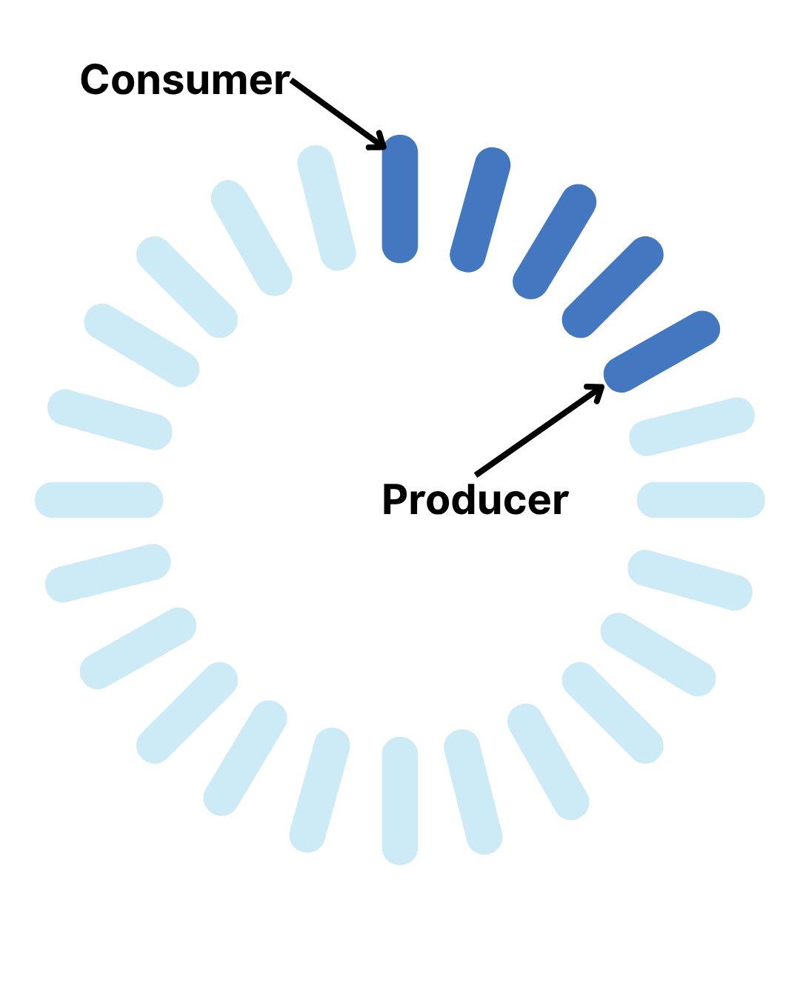

# YZM2031

## Data Structures and Algorithms

### Week 4: Queue Variations and Strings

**Instructor:** Ekrem Çetinkaya
**Date:** 22.10.2025

---

# Recap: Week 3

## What We Covered

- Stack ADT (LIFO) and implementations
- Queue ADT (FIFO) and implementations
- Circular queue for efficient space usage
- Deque (double-ended queue)
- Applications: undo/redo, task scheduling

## Today's Focus

- Ring buffers and bounded queues
- Character arrays and C-strings
- C++ string class and operations
- String algorithms and pattern matching
- Practical string problem solving

---

# Review: Queue Basics

## What We Know

**Regular Queue (FIFO):**
- First In, First Out
- Enqueue at rear, dequeue at front
- Linear or circular implementation

**Deque:**
- Double-ended queue
- Insert/remove from both ends

**Today:** We'll explore ring buffers and then dive deep into string manipulation!

---

# Bounded Queue (Ring Buffer)



### Fixed-Size Circular Buffer

A **bounded queue** (ring buffer) is commonly used in:
- Audio/video streaming
- Producer-consumer problems
- Network packet buffering
- Embedded systems (limited memory)

**Characteristics:**
- Fixed maximum capacity
- Overwrites oldest data when full (optional behavior)
- Very fast operations (no allocation)
- Contiguous memory (cache-friendly)

---

# Ring Buffer Implementation

```cpp
class RingBuffer {
private:
    int buffer[100];   // Fixed size array
    int capacity;
    int head;          // Write position
    int tail;          // Read position
    int count;         // Number of elements

public:
    RingBuffer(int size) {
        capacity = size;
        head = 0;
        tail = 0;
        count = 0;
    }

    bool push(int item) {
        if (count >= capacity) {
            return false;  // Buffer full
        }
        
        buffer[head] = item;
        head = (head + 1) % capacity;  // Wrap around
        count++;
        
        return true;
    }
};
```

---

# Ring Buffer: Pop and Access

```cpp
bool pop(int& item) {
    if (count == 0) {
        return false;  // Buffer empty
    }
    
    item = buffer[tail];
    tail = (tail + 1) % capacity;  // Wrap around
    count--;
    return true;
}

int get(int index) {
    if (index >= count) {
        return -1;  // Invalid index
    }
    int position = (tail + index) % capacity;
    return buffer[position];
}

int size() { return count; }
bool isEmpty() { return count == 0; }
bool isFull() { return count == capacity; }
void clear() { 
    head = 0;
    tail = 0;
    count = 0;
}
```

---

# Practice - Trace Ring Buffer Operations

Given a ring buffer with **capacity = 4**, trace the following operations:

```cpp
RingBuffer rb(4);

rb.push(10);
rb.push(20);
rb.push(30);
int x;
rb.pop(x);      // What is x?
rb.push(40);
rb.push(50);
rb.push(60);    // What happens here?
```

---

# Practice Answer - Ring Buffer Trace

```
Initial: [_][_][_][_]  head=0, tail=0, count=0

push(10): [10][_][_][_]  head=1, tail=0, count=1

push(20): [10][20][_][_]  head=2, tail=0, count=2

push(30): [10][20][30][_]  head=3, tail=0, count=3

pop(x): [10][20][30][_]  head=3, tail=1, count=2, x=10

push(40): [10][20][30][40]  head=0 (wrapped!), tail=1, count=3

push(50): [50][20][30][40]  head=1, tail=1, count=4 (full!)

push(60): Returns false (buffer full, no overwrite allowed)
```
---

# Ring Buffer Application - Audio Streaming

```cpp
RingBuffer audioBuffer(4096);  // Buffer for audio samples
// Producer: Capture audio
void captureAudio() {
    while (recording) {
        int sample = getAudioSample();
        audioBuffer.push(sample);
    }
}
// Consumer: Process audio
void processAudio() {
    int sample;
    while (processing) {
        if (audioBuffer.pop(sample)) {
            // Process the sample
            applyEffect(sample);
            playSample(sample);
        }
    }
}
```

**Benefits:**
- No memory allocation during streaming
- Handles speed differences between capture and playback

---

# Multi-Level Queue

## Different Queues for Different Priorities

A **multi-level queue** uses separate queues for different priority levels.

**Real-World Example:** Operating system task scheduling

```
High Priority Queue:    [System Task] → [Urgent Task]
                               ↓
Medium Priority Queue:  [User Task] → [Background Task]
                               ↓
Low Priority Queue:     [Cleanup] → [Logging]
```

**Rule:** Always serve from highest priority queue that has tasks.

---

# Multi-Level Queue Implementation

```cpp
class MultiLevelQueue {
private:
    queue<string> highPriority;
    queue<string> mediumPriority;
    queue<string> lowPriority;

public:
    void enqueue(string task, int priority) {
        if (priority >= 7) {
            highPriority.push(task);
        } else if (priority >= 4) {
            mediumPriority.push(task);
        } else {
            lowPriority.push(task);
        }
    }

    string dequeue() {
        // Check high priority first
        if (!highPriority.empty()) {
            string task = highPriority.front();
            highPriority.pop();
            return task;
        }
        // Then medium priority
        if (!mediumPriority.empty()) {
            string task = mediumPriority.front();
            mediumPriority.pop();
            return task;
        }
        // Finally low priority
        if (!lowPriority.empty()) {
            string task = lowPriority.front();
            lowPriority.pop();
            return task;
        }
        return "";  // No tasks
    }
    
    bool isEmpty() {
        return highPriority.empty() && 
               mediumPriority.empty() && 
               lowPriority.empty();
    }
};
```

---

# Multi-Level Queue Example

```cpp
MultiLevelQueue scheduler;

// Add tasks with priorities (1-10)
scheduler.enqueue("Critical Update", 9);
scheduler.enqueue("User Email", 5);
scheduler.enqueue("Background Sync", 2);
scheduler.enqueue("Emergency Alert", 10);

// Process tasks
cout << scheduler.dequeue() << endl;  // "Critical Update"
cout << scheduler.dequeue() << endl;  // "Emergency Alert"
cout << scheduler.dequeue() << endl;  // "User Email"
cout << scheduler.dequeue() << endl;  // "Background Sync"
```

**Key Point:** High priority tasks always run first!

---

# When to Use Multi-Level Queue

**Use when:**
- Tasks have distinct priority levels
- High-priority tasks must run first
- Priority levels don't change frequently

**Examples:**
- Operating system process scheduling
- Print job management
- Customer service ticket systems
- Network packet routing

**Advantage over single queue:** Important tasks never wait behind unimportant ones!

---

# When to Use Ring Buffers

## Comparison with Regular Queues

<div class="two-columns">
<div class="column">

### Ring Buffer

**Use when:**
- Fixed maximum size is acceptable
- Real-time processing (audio/video)
- Memory-constrained environments
- Predictable performance needed

**Advantages:**
- ✅ O(1) all operations
- ✅ No dynamic allocation
- ✅ Cache-friendly
- ✅ Lock-free possible

</div>
<div class="column">

### Dynamic Queue

**Use when:**
- Size varies significantly
- Unknown maximum size
- Memory is plentiful
- Occasional overflow acceptable

**Advantages:**
- ✅ Unlimited growth
- ✅ No data loss
- ✅ Simpler logic
- ✅ STL available

</div>
</div>

---

<!-- _footer: "" -->
<!-- _header: "" -->
<!-- _paginate: false -->

<style scoped>
p { text-align: center}
h1 {text-align: center; font-size: 64px}
h2 {text-align: center; font-size: 32px}
</style>

# Characters in C++

---

# Characters in C++

```cpp
// Single character
char c1 = 'A';
char c2 = 65;  // ASCII value of 'A'

// Wide characters (for Unicode)
wchar_t wc = L'∆';

// C++11: Unicode characters
char16_t c16 = u'A';  // UTF-16
char32_t c32 = U'A';  // UTF-32

// Character operations
char letter = 'a';
bool isUpper = isupper(letter);       // false
bool isLower = islower(letter);       // true
bool isDigit = isdigit('5');          // true
bool isAlpha = isalpha('A');          // true
char upper = toupper('a');            // 'A'
char lower = tolower('A');            // 'a'
```

**Note:** `char` is essentially a small integer (1 byte)

---

# ASCII Table

| Dec | Char | Description | Dec | Char | Description |
|-----|------|-------------|-----|------|-------------|
| 32  | (space) | Space | 65  | A | Uppercase A |
| 48  | 0 | Digit zero | 97  | a | Lowercase a |
| 49  | 1 | Digit one | 98  | b | Lowercase b |
| 50  | 2 | Digit two | ... | ... | ... |
| 57  | 9 | Digit nine | 122 | z | Lowercase z |

**Important patterns:**
- Digits: '0' (48) to '9' (57)
- Uppercase: 'A' (65) to 'Z' (90)
- Lowercase: 'a' (97) to 'z' (122)
- Difference: `'a' - 'A' = 32`

**Convert digit char to int:** `int value = ch - '0';`  
**Convert lowercase to uppercase:** `char upper = ch - 32;`

---

# Quiz - Character Arithmetic

### Question 1
What is the value of `'5' - '0'`?

a) 5  
b) '5'  
c) 53  
d) Compile error

### Question 2
What is the value of `'z' - 'a'`?

a) 0  
b) 25  
c) 26  
d) -25

---

# Quiz Answers

### Answer 1: a) 5
```cpp
'5' - '0' = 53 - 48 = 5
```
This is how we convert digit characters to integers!

### Answer 2: b) 25
```cpp
'z' - 'a' = 122 - 97 = 25
```
There are 26 letters, but 'z' is at index 25 (0-based).

**Practice:**
```cpp
// Convert lowercase to uppercase
char lower = 'h';
char upper = lower - 32;  // 'H'
// OR
char upper = lower - ('a' - 'A');
```

---

# C-Strings (Character Arrays)

## Null-Terminated Strings

```cpp
// C-style string declaration
char str1[6] = {'H', 'e', 'l', 'l', 'o', '\0'};  // Explicit null
char str2[] = "Hello";  // Automatic null terminator
char str3[100] = "Hello";  // Remaining filled with '\0'

// Memory layout of "Hello":
// ['H']['e']['l']['l']['o']['\0']
//   0    1    2    3    4    5

// Access individual characters
cout << str2[0] << endl;  // 'H'
str2[0] = 'h';  // Now "hello"

// Get length
int length = strlen(str2);  // 5 (doesn't count '\0')

// Size vs Length
sizeof(str2);  // 6 bytes (includes '\0')
strlen(str2);  // 5 characters
```

**Critical:** strings MUST end with `'\0'` (null terminator)

---

# String Functions

```cpp
#include <cstring>

// Length
char str[] = "Hello";
int len = strlen(str);  // 5

// Copy
char dest[50];
strcpy(dest, str);  // dest = "Hello"

// Concatenate
char str1[50] = "Hello";
char str2[] = " World";
strcat(str1, str2);  // str1 = "Hello World"

// Compare
int result = strcmp("abc", "abd");  // < 0 (abc comes before abd)
result = strcmp("abc", "abc");      // 0 (equal)
result = strcmp("abd", "abc");      // > 0 (abd comes after abc)

// Find character
char* ptr = strchr("Hello", 'l');  // Points to first 'l'

// Find substring
ptr = strstr("Hello World", "World");  // Points to "World"
```

---

# String Safety Issues

## Buffer Overflow

```cpp
// Buffer overflow
char buffer[5];
strcpy(buffer, "Hello World"); 

// ✅ SAFER: Use bounded versions
strncpy(buffer, "Hello World", 4);
buffer[4] = '\0';  // Ensure null termination

// No space for null terminator
char name[5];
strncpy(name, "Alice", 5); 

// ✅ CORRECT: Leave room for '\0'
char name[6];
strncpy(name, "Alice", 5);
name[5] = '\0';
```

**Best Practice:** Use C++ `std::string` instead of C-strings when possible

---

# Debugging - Find the Errors

```cpp
// This code has MULTIPLE bugs 🐛
void processName(char name[]) {
    char firstName[20];
    char lastName[20];
    
    // Split "John Doe" into first and last name
    int i = 0;
    while (name[i] != ' ') {
        firstName[i] = name[i];
        i++;
    }
    
    int j = 0;
    i++;  // Skip space
    while (name[i] != '\0') {
        lastName[j] = name[i];
        i++;
        j++;
    }
    
    cout << "First: " << firstName << endl;
    cout << "Last: " << lastName << endl;
}
```

---

# Debugging: The Bugs

```cpp
void processName(char name[]) {
    char firstName[20];
    char lastName[20];
    
    int i = 0;
    while (name[i] != ' ') {
        firstName[i] = name[i];
        i++;
    }
    firstName[i] = '\0';  // ❌ BUG 1: Missing null terminator!
    
    int j = 0;
    i++;  // Skip space
    while (name[i] != '\0') {
        lastName[j] = name[i];
        i++;
        j++;
    }
    lastName[j] = '\0';  // ❌ BUG 2: Missing null terminator!
    
    // ❌ BUG 3: No bounds checking! What if name has no space?
    // ❌ BUG 4: What if name is longer than 20 chars?
    
    cout << "First: " << firstName << endl;
    cout << "Last: " << lastName << endl;
}
```

---

<!-- _footer: "" -->
<!-- _header: "" -->
<!-- _paginate: false -->

<style scoped>
p { text-align: center}
h1 {text-align: center; font-size: 64px}
h2 {text-align: center; font-size: 32px}
</style>

# C++ String

---

# C++ String Class

## std::string - Standard library

```cpp
#include <string>
using namespace std;

// Declaration and initialization
string s1;                  // Empty string
string s2 = "Hello";        // From C-string
string s3("World");         // Constructor
string s4(5, 'x');          // "xxxxx"
string s5 = s2;             // Copy

// No need to worry about:
// - Null terminators
// - Buffer sizes
// - Memory management

// Access
cout << s2[0] << endl;      // 'H'
cout << s2.at(0) << endl;   // 'H' with bounds checking
s2[0] = 'h';                // Now "hello"

// Length
cout << s2.length() << endl;  // 5
cout << s2.size() << endl;    // 5 (same as length())
```

---


<!-- _footer: "" -->
<!-- _header: "" -->
<!-- _paginate: false -->

<style scoped>
h2 {text-align: center; font-size: 48px}
</style>

## Why we have both `size()`and `length()` ?

---

# String Operations

```cpp
string s1 = "Hello";
string s2 = "World";

// Concatenation
string s3 = s1 + " " + s2;  // "Hello World"
s1 += " there";             // "Hello there"

// Comparison
if (s1 == s2) { /* ... */ }
if (s1 < s2) { /* ... */ }  // Lexicographic comparison

// Substring
string sub = s3.substr(0, 5);  // "Hello" (from index 0, length 5)
sub = s3.substr(6);            // "World" (from index 6 to end)

// Find
size_t pos = s3.find("World");  // 6
if (pos != string::npos) {
    cout << "Found at position " << pos << endl;
}

// Replace
s3.replace(0, 5, "Hi");  // "Hi World"
```

---

# String Modification

```cpp
string str = "Hello";

// Append
str.append(" World");         // "Hello World"
str += "!";                   // "Hello World!"

// Insert
str.insert(5, ",");           // "Hello, World!"

// Erase
str.erase(5, 1);              // "Hello World!" (removed comma)

// Clear
str.clear();                  // Empty string

// Check empty
if (str.empty()) { /* ... */ }

// Get C-string
const char* cstr = str.c_str();
```

---

# String Input/Output

```cpp
string name, sentence;

// Input (stops at whitespace)
cout << "Enter your name: ";
cin >> name;  // "John" if input is "John Doe"

// Input entire line
cout << "Enter a sentence: ";
getline(cin, sentence);  // Gets "Hello World"

// Output
cout << "Name: " << name << endl;

// Character-by-character
for (char ch : sentence) {
    cout << ch << " ";
}
cout << endl;

```

---

# String Conversion

```cpp
#include <string>

// String to number
string numStr = "12345";
int num = stoi(numStr);           // String to integer: 12345
float fnum = stof("3.14");        // String to float: 3.14
double dnum = stod("3.14159");    // String to double: 3.14159

// Number to string
int value = 42;
string str = to_string(value);    // "42"

double pi = 3.14159;
str = to_string(pi);              // "3.141590"

// Check if string contains a digit
string s = "Hello123";
bool hasDigit = false;
for (int i = 0; i < s.length(); i++) {
    if (isdigit(s[i])) {
        hasDigit = true;
        break;
    }
}
```

---

# String Algorithms

```cpp
// Reverse a string (two pointers)
void reverseString(string& s) {
    int left = 0;
    int right = s.length() - 1;
    
    while (left < right) {
        // Swap characters
        char temp = s[left];
        s[left] = s[right];
        s[right] = temp;
        
        left++;
        right--;
    }
}

// Check if string is palindrome
bool isPalindrome(string s) {
    int left = 0;
    int right = s.length() - 1;
    
    while (left < right) {
        if (s[left] != s[right]) {
            return false;
        }
        left++;
        right--;
    }
    return true;
}
```

---

# String Tokenization (Splitting)

```cpp
#include <sstream>
#include <vector>

// Split by custom delimiter
vector<string> split(const string& str, char delimiter) {
    vector<string> tokens;
    stringstream ss(str);
    string token;
    
    while (getline(ss, token, delimiter)) {
        tokens.push_back(token);
    }
    
    return tokens;
}

// Usage
string sentence = "Hello World from C++";
vector<string> words = split(sentence);  // {"Hello", "World", "from", "C++"}

string csv = "apple,banana,orange";
vector<string> fruits = split(csv, ',');  // {"apple", "banana", "orange"}
```

---

# Practice - String Manipulation

**Task:** Write a function that takes a sentence and returns the longest word.

```cpp
string findLongestWord(string sentence) {
    
}

// Test cases:
findLongestWord("The quick brown fox");        // Should return "quick" or "brown"
findLongestWord("I love programming");         // Should return "programming"
findLongestWord("a bb ccc");                   // Should return "ccc"
```

**Hints:**
- Split the sentence into words
- Compare lengths
- Keep track of the longest

Try it yourself!

---

# Practice Solution - Longest Word

```cpp
string findLongestWord(string sentence) {
    string longest = "";
    string current = "";
    
    for (int i = 0; i < sentence.length(); i++) {
        if (sentence[i] == ' ') {
            if (current.length() > longest.length()) {
                longest = current;
            }
            current = "";
        } else {
            current += sentence[i];
        }
    }
    
    // Check last word
    if (current.length() > longest.length()) {
        longest = current;
    }
    
    return longest;
}
```

---

# STL String Search

```cpp
#include <string>

string text = "Hello World, Hello C++";
string pattern = "Hello";

// Find first occurrence
size_t pos = text.find(pattern);
if (pos != string::npos) {
    cout << "Found at position: " << pos << endl;  // 0
}

// Find from specific position
pos = text.find(pattern, pos + 1);
if (pos != string::npos) {
    cout << "Next occurrence at: " << pos << endl;  // 13
}

// Find all occurrences
pos = 0;
while ((pos = text.find(pattern, pos)) != string::npos) {
    cout << "Found at: " << pos << endl;
    pos++;
}

// Find last occurrence
pos = text.rfind(pattern);

// Find first of any character
pos = text.find_first_of("aeiou");  // Find first vowel
```

---

# Practice - Predict the Output

### Question 1
```cpp
string s1 = "abc";
string s2 = "def";
string s3 = s1 + s2;
reverse(s3.begin(), s3.end());
cout << s3;
```
**Output:** _________

### Question 2
```cpp
string s = "banana";
cout << s.find("ana");
```
**Output:** _________

---

# Answers

### Answer 1: `fedcba`
- `s1 + s2 = "abcdef"`
- After reverse: `"fedcba"`

### Answer 2: `1`
- First occurrence of "ana" is at index 1
- "b**ana**na"

---

# Practice - Reverse Words in a String

**Task:** Write a function that reverses the order of words in a string.

```cpp
string reverseWords(string s) {
    // Your code here
    
}

// Test cases:
reverseWords("Hello World");           // "World Hello"
reverseWords("C++ is awesome");        // "awesome is C++"
reverseWords("one");                   // "one"
reverseWords("  multiple   spaces  "); // "spaces multiple"
```

**Requirements:**
- Reverse the order of words
- Handle extra spaces (output should have single spaces)
- No leading/trailing spaces in output

---

# Practice Solution: Reverse Words

```cpp
string reverseWords(string s) {
    // Split into words (handles extra spaces automatically)
    vector<string> words;
    stringstream ss(s);
    string word;
    
    while (ss >> word) {
        words.push_back(word);
    }
    
    // Reverse the words vector
    reverse(words.begin(), words.end());
    
    // Join words back with spaces
    string result = "";
    for (int i = 0; i < words.size(); i++) {
        result += words[i];
        if (i < words.size() - 1) {
            result += " ";
        }
    }
    
    return result;
}
```

---
# Practice - Number of Words

**Task:** Write a function that counts the number of words in a string.

```cpp
int countWords(const string& str) {
    // Your code here
}

// Test cases:
countWords("Hello World");           // Should return 2
countWords("  Multiple   spaces  "); // Should return 2
countWords("");                      // Should return 0
countWords("   ");                   // Should return 0
countWords("One");                   // Should return 1
```

**Hints:**
- A word is separated by spaces
- Ignore leading/trailing spaces
- Handle multiple spaces between words

---

# Practice Solution: Count Words

```cpp
int countWords(const string& str) {
    int count = 0;
    bool inWord = false;
    
    for (char ch : str) {
        if (ch == ' ') {
            inWord = false;
        } else {
            if (!inWord) {
                count++;
                inWord = true;
            }
        }
    }
    
    return count;
}
```

---

<!-- _footer: "" -->
<!-- _header: "" -->
<!-- _paginate: false -->

<style scoped>
p { text-align: center}
h1 {text-align: center; font-size: 72px}
</style>

# Let's Practice

### LeetCode Problems

---

# LeetCode Problem 1: Valid Palindrome

## Problem Statement

**LeetCode #125 - Easy**

A phrase is a **palindrome** if, after converting all uppercase letters into lowercase letters and removing all non-alphanumeric characters, it reads the same forward and backward.

Given a string `s`, return `true` if it is a palindrome, or `false` otherwise.

**Examples:**

```
Input: s = "A man, a plan, a canal: Panama"
Output: true
Explanation: "amanaplanacanalpanama" is a palindrome.

Input: s = "race a car"
Output: false
Explanation: "raceacar" is not a palindrome.

Input: s = " "
Output: true
Explanation: Empty string is a palindrome.
```

---

# Solution 1: Valid Palindrome

```cpp
bool isPalindrome(string s) {
    int left = 0;
    int right = s.length() - 1;
    
    while (left < right) {
        // Skip non-alphanumeric characters from left
        while (!isalnum(s[left])) {
            left++;
        }
        
        // Skip non-alphanumeric characters from right
        while (!isalnum(s[right])) {
            right--;
        }
        
        // Compare characters (case-insensitive)
        if (tolower(s[left]) != tolower(s[right])) {
            return false;
        }
        
        left++;
        right--;
    }
    
    return true;
}
```

**Time Complexity:** O(n), **Space Complexity:** O(1)

---

# LeetCode Problem 2: Valid Anagram

## Problem Statement

**LeetCode #242 - Easy**

Given two strings `s` and `t`, return `true` if `t` is an anagram of `s`, and `false` otherwise.

An **anagram** is a word or phrase formed by rearranging the letters of a different word or phrase, typically using all the original letters exactly once.

**Examples:**

```
Input: s = "anagram", t = "nagaram"
Output: true

Input: s = "rat", t = "car"
Output: false
```

---

# Solution 2: Valid Anagram

```cpp
bool isAnagram(string s, string t) {
    // Different lengths can't be anagrams
    if (s.length() != t.length()) {
        return false;
    }
    
    // Count character frequencies
    int freq[26] = {0};
    
    for (int i = 0; i < s.length(); i++) {
        // Get 0-based index for a lowercase letter
        freq[s[i] - 'a']++;
        freq[t[i] - 'a']--;
    }
    
    // Check if all frequencies are zero
    for (int i = 0; i < 26; i++) {
        if (freq[i] != 0) {
            return false;
        }
    }
    
    return true;
}
```

**Time Complexity:** O(n), **Space Complexity:** O(1) - fixed size array

---

# Summary: Key Takeaways

## Queue Variations
- **Ring Buffer**: Fixed-size circular buffer for streaming data
- **Multi-Level Queue**: Separate queues for different priority levels
- **Use cases**: Streaming, OS scheduling, task management
- **Benefits**: O(1) operations, priority handling, predictable performance

## Strings
- **C-strings**: Null-terminated character arrays (need null terminator!)
- **std::string**: Safe, convenient, automatic memory management
- **Common operations**: Concatenation, substring, find, comparison
- **Algorithms**: Reverse, palindrome, tokenization, word manipulation

---

# Next Week Preview

## Week 5: Algorithm Analysis

We'll explore:
- **Time complexity** analysis
- **Big-O notation** and asymptotic analysis
- **Space complexity** considerations
- **Best, average, and worst-case** analysis
- **Amortized analysis** for data structures
- **Recursive algorithm** analysis
- **Practical examples** from data structures we've learned

## Reading Assignment

- **Weiss Chapter 2**: Algorithm Analysis
- **Review**: All data structures covered so far

---

# Thank You!

## Contact Information

- **Email:** ekrem.cetinkaya@yildiz.edu.tr
- **Office Hours:** Tuesday 14:00-16:00 - Room F-B21
- **Book a slot before coming to the office hours:** [Booking Link](https://calendar.app.google/aBKvBqNAqG12oD2B9)
- **Course Repository:** [GitHub Link](https://github.com/ekremcet/yzm2031-data-structures-and-algorithms)

## Next Class

- **Date:** 05.11.2025
- **Topic:** Algorithm Analysis
- **Reading:** Weiss Chapter 2

