# YZM2031

## Data Structures and Algorithms

### Week 5: Algorithm Analysis and Trees

**Instructor:** Ekrem Çetinkaya
**Date:** 05.11.2025

---

# Recap - Week 4

## What We Covered

- Queue variations (Ring Buffer, Multi-Level Queue)
- Characters and C-strings
- C++ string class and operations
- String algorithms (reverse, palindrome, tokenization)
- Pattern matching and word manipulation

---

# Today's Focus

**Part 1: Algorithm Analysis**

- Why algorithm analysis matters
- Time and space complexity
- Big-Oh notation and asymptotic analysis
- How to analyze code
- Comparing algorithms

**Part 2: Trees Introduction**

- Introduction to hierarchical data structures
- Tree terminology (root, leaf, height, depth)
- Tree properties and characteristics

---

# Why Do We Need Algorithm Analysis?

You have two programs that solve the same problem. Which one is better?

```cpp
// Program A
int sumArray1(int arr[], int n) {
    int sum = 0;
    for (int i = 0; i < n; i++) {
        sum += arr[i];
    }
    return sum;
}

// Program B
int sumArray2(int arr[], int n) {
    if (n == 0) return 0;
    return arr[n-1] + sumArray2(arr, n-1);
}
```

---

<!-- _footer: "" -->
<!-- _header: "" -->
<!-- _paginate: false -->

<style scoped>
p { text-align: center}
h1 {text-align: center; font-size: 64px}
</style>


# How do we compare?

---

# Intuitive Approaches


### Approach 1 - Run time on local computer

**Problems:**

- Different computers have different speeds
- Same computer may perform differently at different times
- Results not reproducible or comparable

### Approach 2 - Count instructions

**Problems:**

- Different programming languages
- Different compiler optimizations
- Too implementation-specific

---

# What We Need - Mathematical Analysis


Analyze algorithm **independent** of:

- Specific implementations
- Computers
- Data
- Programming language

---

# The RAM Model

## Random Access Machine

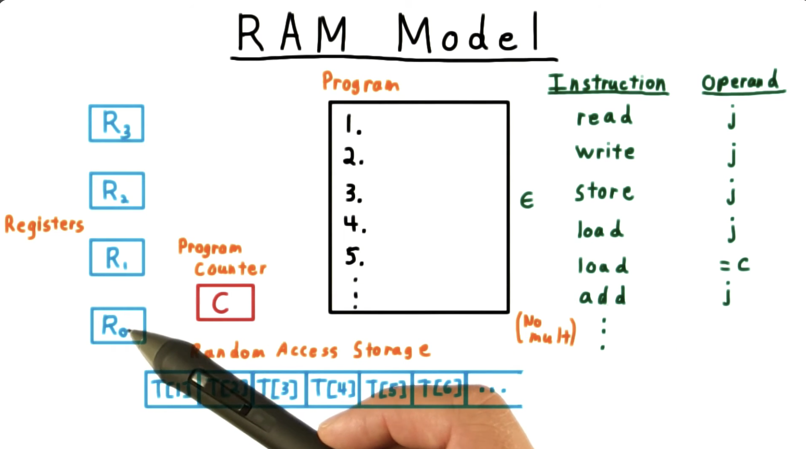

**How do we analyze algorithms mathematically?**

We use a theoretical model called **RAM (Random Access Machine)**

**Key Assumptions:**

- Each basic operation takes **unit time** (constant time)
- Memory access is **direct** - accessing any memory cell takes the same time
- Instructions execute **one after another** (no parallel execution)
- Infinite memory available

**This is a simplification, but it works well in practice**

<small> [RAM Model Tutoraial - Georgia Tech](https://www.youtube.com/watch?v=wkBjD0Fvl6U) </small>

---

# What Are Basic Operations?

## Operations That Take Constant Time

In the RAM model, these are considered **basic operations** (O(1)):

- **Evaluating an expression** (`x + y`, `a * b`)
- **Assigning a value to a variable** (`x = 5`)
- **Indexing into an array** (`arr[i]`)
- **Calling a method** (the call itself, not what it does inside)
- **Returning from a method**
- **Comparing two values** (`x < y`, `a == b`)

**Key Point:** We count these as 1 operation regardless of the actual CPU cycles

---

# Question - RAM Model Complexity

### How many operations in the function below?

```c++
int sum(int n) {
    int partialSum = 0;
    for (int i = 1; i <= n; i++) {
        partialSum += i * i * i;
    }

    return partialSum;
}
```

---

# Answer - RAM Model Complexity

### How many operations in the function below?

```c++
int sum(int n) {
    int partialSum = 0; ---------------> 1
    for (int i = 1; i <= n; i++) { ----> 2n + 2
        partialSum += i * i * i; ------> 4n
    }

    return partialSum; ----------------> 1
}
```

Total = `6n+4`

n = 1 -> 10
n = 100 -> 604
n = 10000 -> 60004

---

# Algorithm Complexity

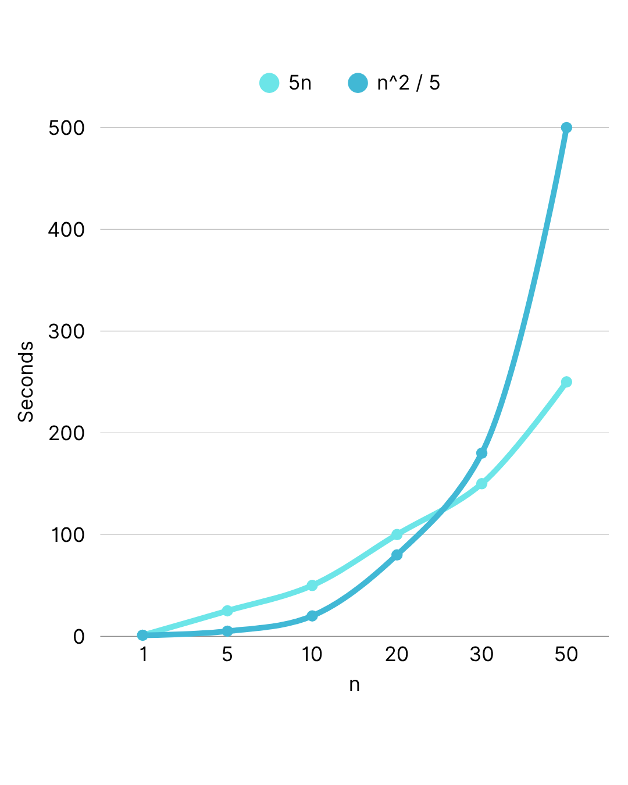

### What Do We Measure?

**Time Complexity:** How execution time grows with input size
**Space Complexity:** How memory usage grows with input size

### Important!

We don't care about **exact** time or memory
We care about **growth rate** as input size increases

**Example:**

- Algorithm A: `5n` operations
- Algorithm B: n<sup>2</sup> / 5 operations

For small `n`, B might be faster.
For large `n`, A is **much** faster

---

# Typical Growth Rates

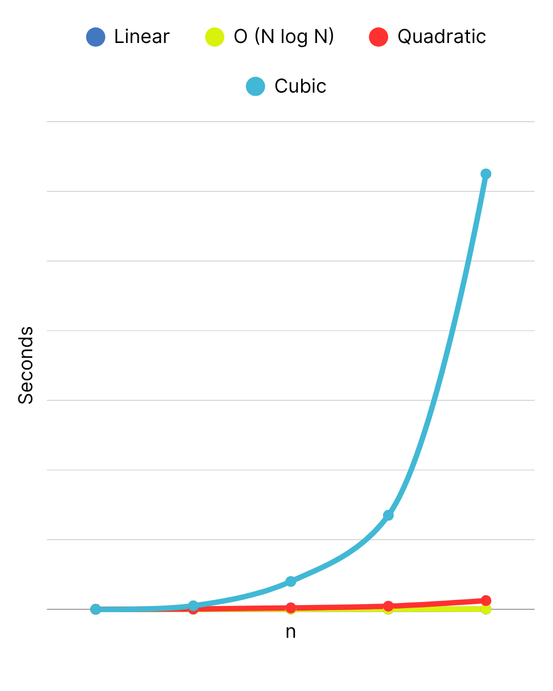

| Function          | Name        | Category   |
| ----------------- | ----------- | ---------- |
| c                 | Constant    | Sublinear  |
| log N             | Logarithmic | Sublinear  |
| log<sup>2</sup> N | Log-squared | Sublinear  |
| N                 | Linear      | Polynomial |
| N Log N           |             | Polynomial |
| N<sup>2</sup>     | Quadratic   | Polynomial |
| N<sup>3</sup>     | Cubic       | Polynomial |
| c<sup>N</sup>     | Exponential |

---

# Asymptotic Growth

### What is Asymptotic Behavior?

Use functions to model the **"approximate"** and **"asymptotic"** (running time) behavior of algorithms.

**Asymptotic growth:** The rate of growth of a function

- T(n): Time of running input size of n

**Goal:** Establish a relative order among the growth rate of functions

Given a particular function f(n), all other functions fall into three classes:

- T(n) growing with the **same rate** as f(n)
- T(n) growing **faster** than f(n)
- T(n) growing **slower** than f(n)

---

# Big-Oh Notation

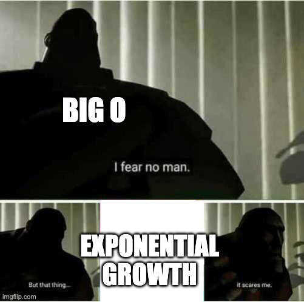

Big-Oh describes the **upper bound** of growth rate.

**Notation:** `T(n) = O(f(n))`

**Informal Meaning:**

- Function `T(n)` grows **no faster** than `f(n)` (ignoring constants)
- Big-Oh tells us the **worst-case** behavior as input size approaches infinity

---

# Big-Oh Notation - Mathematical Definition


**If there are positive constants c and n<sub>0</sub> such that:**

T(N) ≤ c \* f(N) for all N ≥ n<sub>0</sub>

**then T(N) = O(f(N))**

(read as "order of f(N)" or "big-oh of f(N)")

**What does this mean?**

- We can find some constant `c` that, when multiplied by `f(N)`, will always be ≥ `T(N)`
- This must be true for all inputs beyond some threshold n<sub>0</sub>
- T(N) is **bounded above** by c•f(N) for large N

---

# Big-Oh Visual Representation

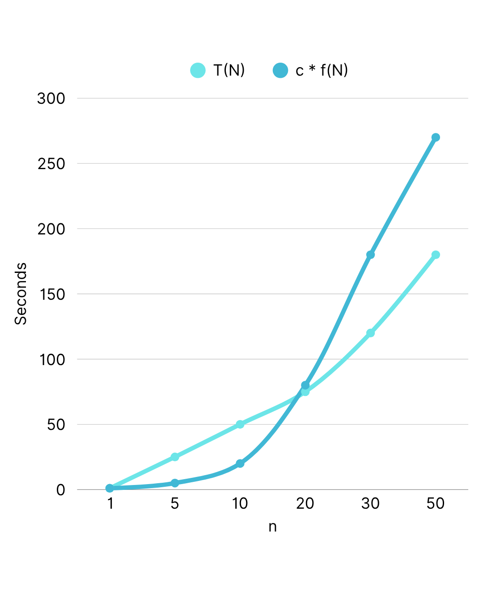

### T(N) is bounded by c \* f(N)

**After n<sub>0</sub>, T(N) is always below c \* f(N)**

---

# Example

### Prove: 2n + 10 is O(n)

We need to find positive constants c and n<sub>0</sub> such that:

2n + 10 ≤ c \* n for all n ≥ n<sub>0</sub>

**Let's find them:**

```
2n + 10 ≤ c * n
(c - 2)n ≥ 10         (rearrange)
n ≥ 10/(c - 2)        (solve for n)
```

**Choose c = 3:**

- n ≥ 10/(3 - 2) = 10/1 = 10
- So **n<sub>0</sub> = 10** and **c = 3**

**Verification:** For n = 10: 2(10) + 10 = 30, and 3(10) = 30

---

# Counterexample - What is not Big-Oh

### Question: Is n² = O(n)?

Let's try to satisfy the definition: n<sup>2</sup> ≤ c \* n for all n ≥ n<sub>0</sub>

**Attempt to find constants:**

```
n² ≤ c * n
n² / n ≤ c
n ≤ c
```

**Problem:**

- For the inequality to hold for **all** n ≥ n<sub>0</sub>, we need n ≤ c
- But c must be a **constant**
- n can grow arbitrarily large
- No constant c can be ≥ all values of n

**Conclusion: n² is NOT O(n)**

---

# Practice - Find Constants

### Prove: 3n<sup>2</sup> + 2n + 5 is O(n<sup>2</sup>)

**Task:** Find positive constants c and n<sub>0</sub> such that:

3n<sup>2</sup> + 2n + 5 ≤ c \* n<sup>2</sup> for all n ≥ n<sub>0</sub>

---

# Practice - Answer

### Prove: 3n<sup>2</sup> + 2n + 5 is O(n<sup>2</sup>)

**Solution with c = 5:**

```
3n² + 2n + 5 ≤ 5n²
2n + 5 ≤ 2n²         (subtract 3n² from both sides)
```

**For n ≥ 1:**

- 2n ≤ 2n² (since n ≥ 1 means n<sup>2</sup> ≥ n)
- 5 ≤ 2n² (since n ≥ 2 means n<sup>2</sup> ≥ 2.5)

**Therefore: c = 5, n<sub>0</sub> = 2**

**Verification for n = 2:**

- 3(4) + 2(2) + 5 = 12 + 4 + 5 = 21
- 5(4) = 20 --- doesn't work Need n<sub>0</sub> = 3

---

# Big-Omega - Ω(f(N))


### Lower Bound

**If there are positive constants c and n<sub>0</sub> such that:**

T(N) ≥ c \* f(N) for all N ≥ n<sub>0</sub>

**then T(N) = Ω(f(N))** (read as "omega of f(N)")

**What does this mean?**

- T(N) is **bounded below** by c \* f(N) for large N
- T(N) grows **at least as fast** as f(N)
- Opposite of Big-O (which is upper bound)

**Visual:** T(N) stays above cf(N) after n<sub>0</sub>

**Example:** If an algorithm takes at least n<sup>2</sup> operations, then T(N) = Ω(n²)

---

# Theta - Θ(f(N))

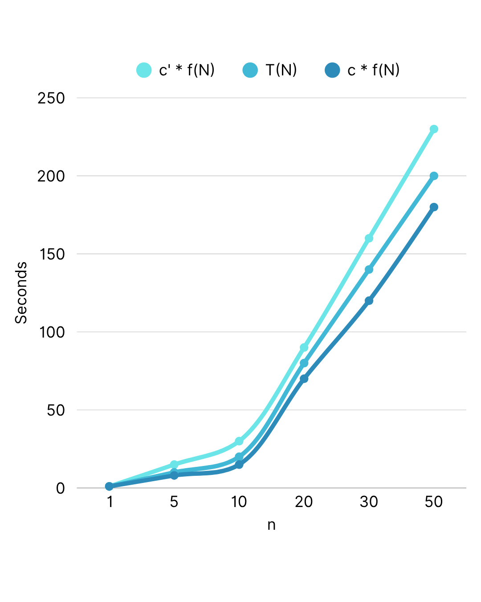

### Tight Bound (Exact Growth Rate)

**If T(N) = O(f(N)) AND T(N) = Ω(f(N))**

**then T(N) = Θ(f(N))** (read as "theta of f(N)")

**What does this mean?**

- T(N) grows at the **same rate** as f(N)
- T(N) is sandwiched between c _ f(N) and c'_ f(N)
- Most precise notation

**Mathematical definition:**

- There exist constants c, c', n<sub>0</sub>, n<sub>0</sub>' such that:
- c _ f(N) ≤ T(N) ≤ c' _ f(N) for all N ≥ max(n<sub>0</sub>, n<sub>0</sub>')

**Example:** 3n² + 2n + 5 = Θ(n²)

---

# Theta - Formal Definition

### Same Rate of Growth

T(N) and f(N) have same rate of growth if:

**lim(T(N) / f(N)) = c**, where **0 < c < ∞**, as N → ∞

**What this means:**

- The ratio T(N)/f(N) approaches a positive constant
- Neither function dominates the other
- They grow proportionally

**Example: Compare 3n² + 2n and n²**

```
lim(n→∞) (3n² + 2n) / n²
= lim(n→∞) (3 + 2/n)
= 3 (constant!)
```

Therefore: 3n² + 2n = Θ(n²)

---

# Little-oh - o(f(N))

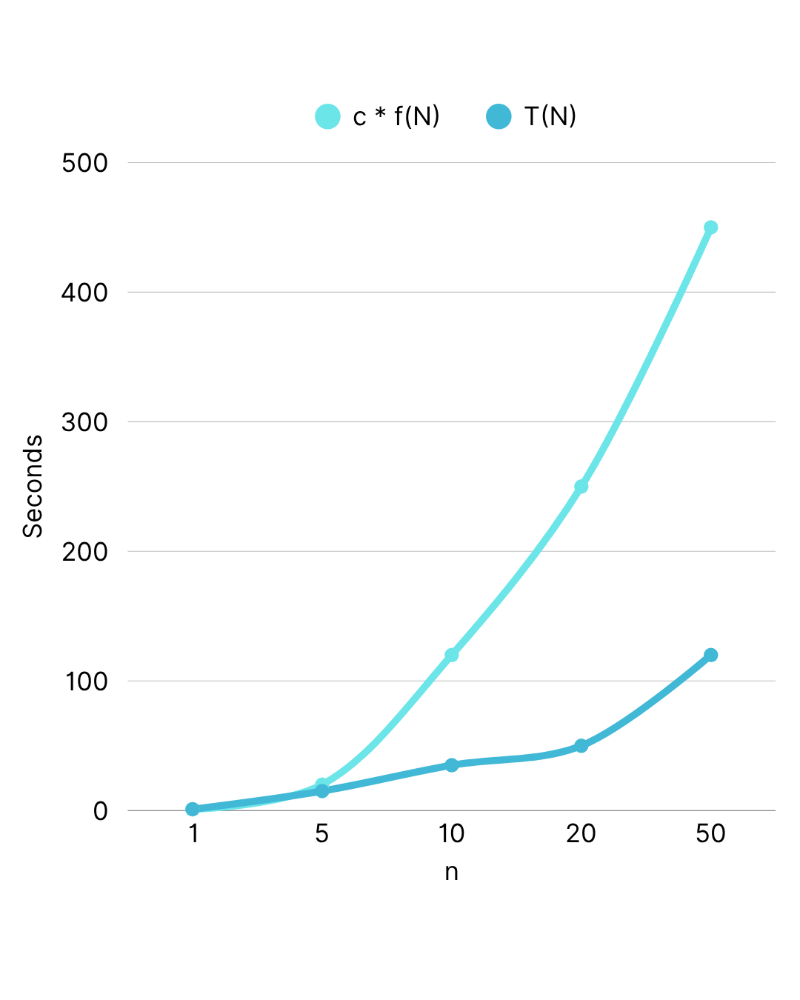

### Strictly Less Than (Not Equal)

**If T(N) = O(f(N)) and T(N) ≠ Θ(f(N))**

**then T(N) = o(f(N))** (read as "little-o of f(N)")

**Mathematical definition:**

**lim(T(N) / f(N)) = 0** as N → ∞

**What does this mean?**

- T(N) grows **strictly slower** than f(N)
- f(N) grows **strictly faster** than T(N)
- T(N) becomes negligible compared to f(N)

**Examples:**

- n = o(n<sup>2</sup>) (linear is strictly less than quadratic)
- n<sup>2</sup> is NOT o(n<sup>2</sup>) (same growth rate, use Θ instead)

---

# Little-oh Example

### Comparing n and n<sup>2</sup>

**Question:** Is n = o(n<sup>2</sup>)?

**Check the limit:**

```
lim(n→∞) n / n²
= lim(n→∞) 1/n
= 0
```

**Yes!** n = o(n<sup>2</sup>)

**Intuition:**

- As n grows, n<sup>2</sup> grows much faster
- The ratio n/n<sup>2</sup> = 1/n approaches 0
- n becomes insignificant compared to n<sup>2</sup>

**Practical meaning:** An O(n) algorithm is **significantly better** than O(n<sup>2</sup>)

---

# Little-Omega - ω(f(N))

### Strictly Greater Than (Not Equal)

**If T(N) = Ω(f(N)) and T(N) ≠ Θ(f(N))**

**then T(N) = ω(f(N))** (read as "little-omega of f(N)")

**Mathematical definition:**

**lim(T(N) / f(N)) = ∞** as N → ∞

**What does this mean?**

- T(N) grows **strictly faster** than f(N)
- f(N) grows **strictly slower** than T(N)
- Opposite of little-oh

**Examples:**

- n<sup>2</sup> = ω(n) (quadratic is strictly greater than linear)
- n² is NOT ω(n²) (same growth rate, use Θ instead)

---

# Comparing Little-oh and Little-omega

**Little-oh (T grows slower):**

```
lim(n→∞) n/n² = 0
→ n = o(n²)
```

**Little-omega (T grows faster):**

```
lim(n→∞) n²/n = ∞
→ n² = ω(n)
```

**Key Insight:**

- If T(N) = o(f(N)), then f(N) = ω(T(N))
- These are inverse relationships

---

# Summary - All Asymptotic Notations

### Complete Picture

| Notation | Meaning          | Condition      | Limit Test       |
| -------- | ---------------- | -------------- | ---------------- |
| O(f(N))  | Upper bound      | T(N) ≤ c•f(N)  | T / f ≤ constant |
| Ω(f(N))  | Lower bound      | T(N) ≥ c•f(N)  | T / f ≥ constant |
| Θ(f(N))  | Tight bound      | Both O and Ω   | T / f = constant |
| o(f(N))  | Strictly less    | T grows slower | T / f → 0        |
| ω(f(N))  | Strictly greater | T grows faster | T / f → ∞        |

**Most commonly used:** Big-Oh (worst case) and Theta (exact)

---

# Notation Relationships


**Same rate of growth:** T(N) = Θ(f(N))

**Different rate of growth:**

- **Either:** T(N) = o(f(N))

  - T(N) grows slower than f(N)
  - Example: n = o(n<sup>2</sup>)

- **Or:** T(N) = ω(f(N))
  - T(N) grows faster than f(N)
  - Example: n<sup>2</sup> = ω(n)

**In Practice:**

- Use **Big-Oh** for worst-case analysis (most common)
- Use **Theta** when you know exact growth rate
- Use **Omega** for best-case or lower bounds
- Little-oh and Little-omega are less common

---

# Big-Oh Classes

### Similar to the growth rates

| Function                             | Name         | Example                   |
| ------------------------------------ | ------------ | ------------------------- |
| O(1) or O(c)                         | Constant     | Array access, arithmetic  |
| O(log n)                             | Logarithmic  | Binary search             |
| O(log<sup>2</sup> n)                 | Log-squared  | Some divide & conquer     |
| O(n)                                 | Linear       | Linear search, array sum  |
| O(n log n)                           | Linearithmic | Merge sort, quick sort    |
| O(n<sup>2</sup>)                     | Quadratic    | Nested loops, bubble sort |
| O(n<sup>3</sup>)                     | Cubic        | Triple nested loops       |
| O(c<sup>n</sup>) or O(2<sup>n</sup>) | Exponential  | Recursive Fibonacci       |
| O(n!)                                | Factorial    | Generating permutations   |

**Rule of Thumb:** Anything worse than O(n<sup>2</sup>) is usually impractical for large inputs

---

# Question - Big-Oh Ordering

### Order these complexities from Fastest to Slowest

A. O(n<sup>2</sup>)
B. O(1)
C. O(n log n)
D. O(log n)
E. O(n)

---

# Answer

### Correct Order (Fastest to Slowest):

**B → D → E → C → A**

1. **O(1)** - Constant (B)
2. **O(log n)** - Logarithmic (D)
3. **O(n)** - Linear (E)
4. **O(n log n)** - Linearithmic (C)
5. **O(n²)** - Quadratic (A)

**Remember:** When comparing, the dominant term always wins

---

# Visualizing Growth Rates

## How fast do they grow?

For **n = 100**:

- O(1): 1 operation
- O(log n): ~7 operations
- O(n): 100 operations
- O(n log n): ~700 operations
- O(n<sup>2</sup>): 10,000 operations
- O(2<sup>n</sup>): 1,267,650,600,228,229,401,496,703,205,376 operations 💀

**Key Takeaway:** Growth rate matters more than anything else for large inputs

---

# O(1) - Constant Time

### Operations that Don't Depend on Input Size

```cpp
// Array access - O(1)
int getFirst(int arr[]) {
    return arr[0];  // Direct memory access
}

// Arithmetic operations - O(1)
int add(int a, int b) {
    return a + b;  // Single operation
}

// Linked list operations (if we have pointer) - O(1)
void insertAtFront(Node*& head, int value) {
    Node* newNode = new Node(value);
    newNode->next = head;
    head = newNode;
}
```

**Key:** Number of operations stays the same regardless of `n`

---

# O(log n) - Logarithmic Time

### Dividing the Problem in Half Each Time

```cpp
// Binary search - O(log n)
int binarySearch(int arr[], int n, int target) {
    int left = 0;
    int right = n - 1;

    while (left <= right) {
        int mid = left + (right - left) / 2;

        if (arr[mid] == target) {
            return mid;
        }

        if (arr[mid] < target) {
            left = mid + 1;   // Search right half
        } else {
            right = mid - 1;  // Search left half
        }
    }

    return -1;
}
```

**Why log n?** Each iteration cuts problem size in half

---

# Practice - Identify Complexity

### What is the time complexity of these functions?

```cpp
// Function 1
void printFirst(int arr[], int n) {
    cout << arr[0] << endl;
}

// Function 2
void printAll(int arr[], int n) {
    for (int i = 0; i < n; i++) {
        cout << arr[i] << endl;
    }
}

// Function 3
void printPairs(int arr[], int n) {
    for (int i = 0; i < n; i++) {
        for (int j = 0; j < n; j++) {
            cout << arr[i] << "," << arr[j] << endl;
        }
    }
}
```

---

# Practice - Answer

```cpp
// Function 1: O(1) - Constant
void printFirst(int arr[], int n) {
    cout << arr[0] << endl;  // Always 1 operation
}

// Function 2: O(n) - Linear
void printAll(int arr[], int n) {
    for (int i = 0; i < n; i++) {  // n operations
        cout << arr[i] << endl;
    }
}

// Function 3: O(n²) - Quadratic
void printPairs(int arr[], int n) {
    for (int i = 0; i < n; i++) {      // n times
        for (int j = 0; j < n; j++) {   // n times each
            cout << arr[i] << "," << arr[j] << endl;
        }
    }  // Total: n x n = n²
}
```

---

# Understanding Logarithms

**Question:** How many times can we divide `n` by 2 until we reach 1?

**Answer:** log<sub>2</sub>(n) times

**Example with n = 16:**

```
16 -> 8 -> 4 -> 2 -> 1
```

That's 4 steps, and log₂(16) = 4

**Another Example:**

- In a phone book with 1 million names
- Binary search needs only ~20 comparisons
- Linear search needs up to 1 million comparisons

**Bottom Line:** O(log n) scales **extremely** well

---

# O(n) - Linear Time

## Processing Each Element Once

```cpp
// Sum array - O(n)
int sum(int arr[], int n) {
    int total = 0;
    for (int i = 0; i < n; i++) {
        total += arr[i];  // Visit each element once
    }
    return total;
}

// Find maximum - O(n)
int findMax(int arr[], int n) {
    int maxVal = arr[0];
    for (int i = 1; i < n; i++) {
        if (arr[i] > maxVal) {
            maxVal = arr[i];
        }
    }
    return maxVal;
}
```

**Key:** One pass through the data = O(n)

---

# O(n log n) - Linearithmic Time

## Efficient Sorting Algorithms

```cpp
// Merge sort pseudocode - O(n log n)
void mergeSort(int arr[], int left, int right) {
    if (left >= right) return;

    int mid = (left + right) / 2;

    // Divide: O(log n) levels
    mergeSort(arr, left, mid);
    mergeSort(arr, mid + 1, right);

    // Conquer: O(n) work per level
    merge(arr, left, mid, right);
}
```

**Why n log n?**

- O(log n) levels of recursion (dividing in half)
- O(n) work at each level (merging)
- Total: O(n) x O(log n) = O(n log n)

---

# O(n<sup>2</sup>) - Quadratic Time

### Nested Loops Over the Same Data

```cpp
// Bubble sort - O(n²)
void bubbleSort(int arr[], int n) {
    for (int i = 0; i < n; i++) {        // n times
        for (int j = 0; j < n - i - 1; j++) {  // n times
            if (arr[j] > arr[j + 1]) {
                // Swap
                int temp = arr[j];
                arr[j] = arr[j + 1];
                arr[j + 1] = temp;
            }
        }
    }
}

// Check for duplicates - O(n²)
bool hasDuplicates(int arr[], int n) {
    for (int i = 0; i < n; i++) {
        for (int j = i + 1; j < n; j++) {
            if (arr[i] == arr[j]) return true;
        }
    }
    return false;
}
```

---

# Activity - Count Operations

### How many comparisons for hasDuplicates with n = 5?

```cpp
bool hasDuplicates(int arr[], int n) {
    for (int i = 0; i < n; i++) {
        for (int j = i + 1; j < n; j++) {
            if (arr[i] == arr[j]) return true;
        }
    }
    return false;
}
```

**Task:** Manually count how many times `arr[i] == arr[j]` is executed and find Big-Oh notation

---

# Activity - Answer

### Counting comparisons for n = 5:

```
i=0: j=1,2,3,4  → 4 comparisons
i=1: j=2,3,4    → 3 comparisons
i=2: j=3,4      → 2 comparisons
i=3: j=4        → 1 comparison
i=4: (none)     → 0 comparisons
```

**Total: 4 + 3 + 2 + 1 = 10 comparisons**

**Formula:** For n elements: n(n - 1) / 2 comparisons

- For n=5: 5 x 4 / 2 = 10
- For n=10: 10 x 9 / 2 = 45
- For n=100: 100 x 99 / 2 = 4,950

**Big-Oh:** Drop constants and lower terms → **O(n<sup>2</sup>)**

---

# O(2<sup>n</sup>) - Exponential Time

## Trying All Possible Combinations

```cpp
// Naive recursive Fibonacci - O(2ⁿ)
int fibonacci(int n) {
    if (n <= 1) return n;

    return fibonacci(n - 1) + fibonacci(n - 2);
}
```

**Why 2<sup>n</sup>?**

```
                    fib(5)
                /            \
           fib(4)            fib(3)
          /      \          /      \
      fib(3)   fib(2)   fib(2)   fib(1)
     /    \    /    \   /    \
  fib(2) fib(1) ...
```

Each call spawns 2 more calls, tree grows exponentially

**Warning:** Even fib(50) takes forever

---

# Practice - Calculate Complexity

```cpp
void mysteryFunction(int arr[], int n) {
    for (int i = 0; i < n; i++) {
        for (int j = i; j < n; j++) {
            cout << arr[i] + arr[j] << endl;
        }
    }
}
```

**Questions:**

1. How many times does the inner loop run for each `i`?
2. What is the total number of operations?
3. What is the Big-Oh complexity?

---

# Answer

```cpp
void mysteryFunction(int arr[], int n) {
    for (int i = 0; i < n; i++) {
        for (int j = i; j < n; j++) {
            cout << arr[i] + arr[j] << endl;
        }
    }
}
```

**Analysis:**

- When `i = 0`: inner loop runs `n` times
- When `i = 1`: inner loop runs `n - 1` times
- When `i = 2`: inner loop runs `n - 2` times
- ...
- When `i = n-1`: inner loop runs `1` time

**Total:** `n + (n-1) + (n-2) + ... + 1 = n(n+1)/2 = (n² + n)/2`

**Big-Oh:** Drop constants and lower terms → **O(n<sup>2</sup>)**

---

# Best, Average, and Worst Case

## Same Algorithm, Different Scenarios

```cpp
// Linear search
int search(int arr[], int n, int target) {
    for (int i = 0; i < n; i++) {
        if (arr[i] == target) {
            return i;
        }
    }
    return -1;
}
```

**Best Case:** O(1) - Target is first element
**Average Case:** O(n/2) = O(n) - Target is in middle
**Worst Case:** O(n) - Target is last or not found

---

# Why Focus on Worst Case?

## Three Reasons

1. **Easier to analyze**

   - No need to guess about "typical" inputs
   - Clear, unambiguous definition

2. **Safety Critical**

   - Medical devices, aviation systems
   - Need guaranteed response time
   - Can't afford "usually fast"

3. **Conservative estimate**
   - If worst case is acceptable, we're safe
   - Average case is bonus

---

# Rules for Calculating Big-Oh


1. **Drop constants:** O(2n) = O(n), O(n/2) = O(n)

2. **Drop lower-order terms:** O(n² + n) = O(n²), O(n² + log n) = O(n²)

3. **Different variables for different inputs:**

   ```cpp
   void process(int arr1[], int n, int arr2[], int m) {
       for (int i = 0; i < n; i++) { /* ... */ }  // O(n)
       for (int i = 0; i < m; i++) { /* ... */ }  // O(m)
   }
   // Total: O(n + m), NOT O(n)!
   ```

4. **Sequential = Add, Nested = Multiply:**
   - Sequential loops: O(n) + O(n) = O(n)
   - Nested loops: O(n) × O(n) = O(n²)

---

# Practice - Apply the Rules

### Simplify these to Big-Oh notation:

1. `3n + 5`
2. `2n² + 100n + 50`
3. `n log n + n`
4. `5n² + 3n³ + 2`
5. `log n + n + n²`

---

# Practice - Answers

### Simplified Big-Oh:

1. `3n + 5` → **O(n)** (drop constants)

2. `2n² + 100n + 50` → **O(n²)** (drop lower terms n and constants)

3. `n log n + n` → **O(n log n)** (n log n dominates n)

4. `5n² + 3n³ + 2` → **O(n³)** (n³ dominates)

5. `log n + n + n²` → **O(n²)** (n² dominates everything)

**Key Rule:** Always keep only the fastest-growing term

---

# Question - Complex Analysis

## What is the complexity?

```cpp
void process(int arr[], int n) {
    // Part 1
    int max = arr[0];
    for (int i = 1; i < n; i++) {
        if (arr[i] > max) max = arr[i];
    }

    // Part 2
    for (int i = 0; i < max; i++) {
        cout << i << endl;
    }

    // Part 3
    for (int i = 0; i < n; i++) {
        for (int j = 0; j < n; j++) {
            cout << arr[i] * arr[j] << endl;
        }
    }
}
```

---

# Answer

```cpp
void process(int arr[], int n) {
    // Part 1: O(n) - one loop through array
    int max = arr[0];
    for (int i = 1; i < n; i++) {
        if (arr[i] > max) max = arr[i];
    }

    // Part 2: O(max) - depends on max value, not n!
    // Could be O(1) if max is small, or O(n) if max ≈ n
    // Worst case: max could be very large!
    for (int i = 0; i < max; i++) {
        cout << i << endl;
    }

    // Part 3: O(n²) - nested loops
    for (int i = 0; i < n; i++) {
        for (int j = 0; j < n; j++) {
            cout << arr[i] * arr[j] << endl;
        }
    }
}
```

**Total:** O(n) + O(max) + O(n²) = **O(n² + max)**

---

# Question - Complexity

### What's the time complexity?

```cpp
void mystery(int n) {
    int sum = 0;
    for (int i = 0; i < n; i++) {
        sum += i;
    }

    for (int i = 0; i < n; i++) {
        for (int j = 0; j < 100; j++) {
            sum += j;
        }
    }
}
```

**A)** O(n)  
**B)** O(n²)  
**C)** O(n + 100)  
**D)** O(100n)

---

# Answer

```cpp
void mystery(int n) {
    int sum = 0;
    for (int i = 0; i < n; i++) {        // O(n)
        sum += i;
    }

    for (int i = 0; i < n; i++) {        // O(n)
        for (int j = 0; j < 100; j++) {  // O(100) = O(1) constant!
            sum += j;
        }
    }
}
```

**Analysis:**

- First loop: O(n)
- Second loop: O(n) x O(100) = O(100n) = O(n)
- Total: O(n) + O(n) = O(n)

**Answer: A) O(n)**

**Key Point:** Inner loop with constant bound (100) is just a constant

---

<!-- _footer: "" -->
<!-- _header: "" -->
<!-- _paginate: false -->

<style scoped>
p { text-align: center}
h1 {text-align: center; font-size: 72px; color: #2c3e50}
</style>

# Trees

---

# From Linear to Hierarchical


## So Far We've Seen Linear Structures

- Arrays - sequential access
- Linked Lists - sequential traversal
- Stacks - LIFO access
- Queues - FIFO access

**Problem:** These are all linear structures!

## What About Hierarchical Relationships?

- File systems (folders contain folders)
- Organization charts (managers and employees)
- Family trees (parents and children)
- Decision processes (choices leading to more choices)

---

# Where Trees?


**File Systems:**

- Directories contain subdirectories
- Hierarchical organization

**Compilers:**

- Abstract Syntax Trees (AST)
- Expression evaluation

**AI/Games:**

- Decision trees
- Game state exploration

**Networks:**

- Routing protocols
- DNS hierarchy

---

# What is a Tree?

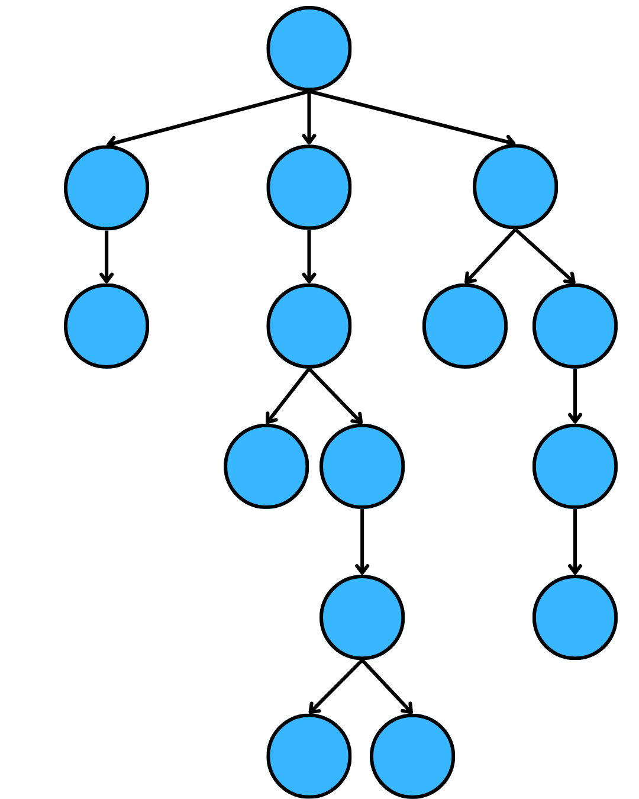

A **tree** is a hierarchical data structure consisting of nodes connected by edges.

## Key Characteristics

- **One root node** - the topmost node
- **Parent-child relationships** - each node (except root) has exactly one parent
- **No cycles** - there's exactly one path between any two nodes
- **Connected** - all nodes are reachable from the root

## Tree vs Graph

- Trees are special cases of graphs
- Trees have no cycles
- Trees have n-1 edges for n nodes

---

# Tree Terminology

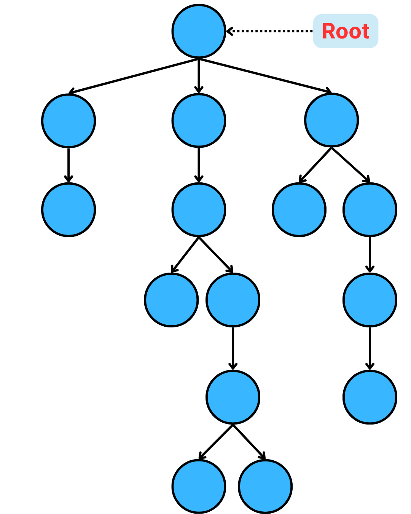

## Basic Terms

**Node:** A single element in the tree containing data

<div class="highlight">
Root: The topmost node
</div>

**Edge:** Connection between two nodes

**Parent:** Node with children below it

**Child:** Node connected below another node

**Siblings:** Nodes with the same parent

**Leaf:** Node with no children

**Subtrees:** Individiual trees within tree

---

# Tree Terminology

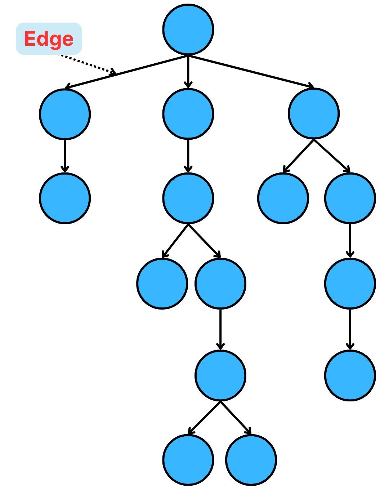

## Basic Terms

**Node:** A single element in the tree containing data

**Root**: The topmost node

<div class="highlight">
Edge: Connection between two nodes
</div>

**Parent:** Node with children below it

**Child:** Node connected below another node

**Siblings:** Nodes with the same parent

**Leaf:** Node with no children

**Subtrees:** Individiual trees within tree

---

# Tree Terminology

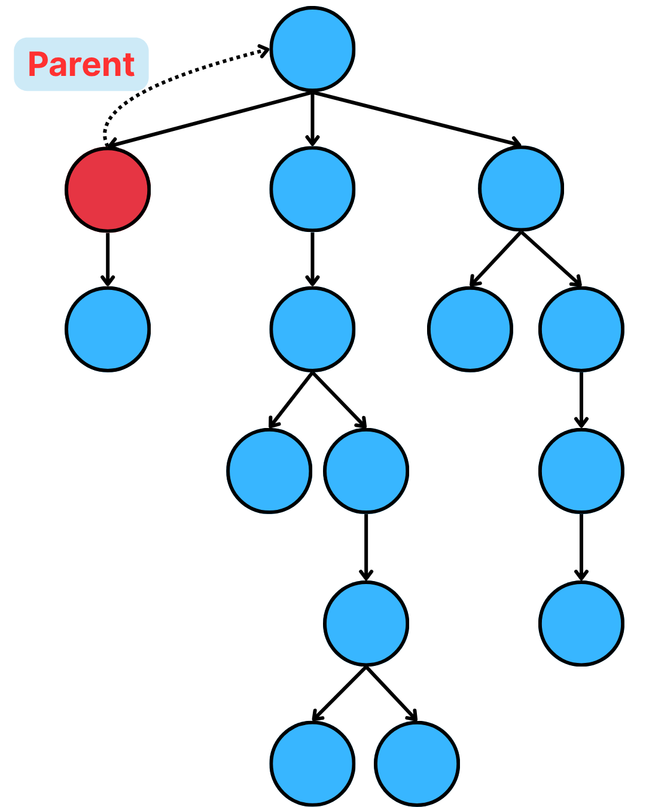

## Basic Terms

**Node:** A single element in the tree containing data

**Root**: The topmost node

**Edge**: Connection between two nodes

<div class="highlight">
Parent: Node with children below it
</div>

**Child:** Node connected below another node

**Siblings:** Nodes with the same parent

**Leaf:** Node with no children

**Subtrees:** Individiual trees within tree

---

# Tree Terminology

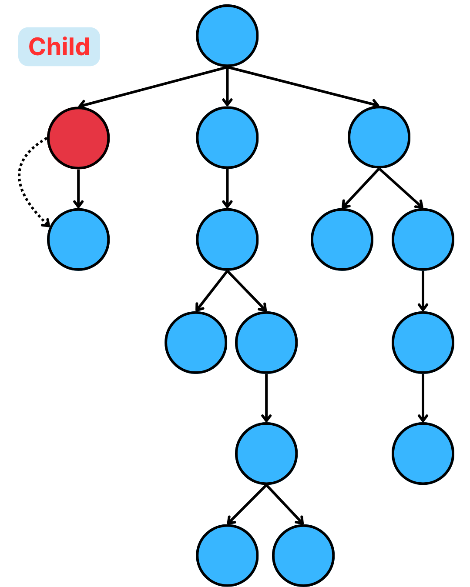

## Basic Terms

**Node:** A single element in the tree containing data

**Root**: The topmost node

**Edge**: Connection between two nodes

**Parent**: Node with children below it

<div class="highlight">
Child: Node connected below another node
</div>

**Siblings:** Nodes with the same parent

**Leaf:** Node with no children

**Subtrees:** Individiual trees within tree

---

# Tree Terminology

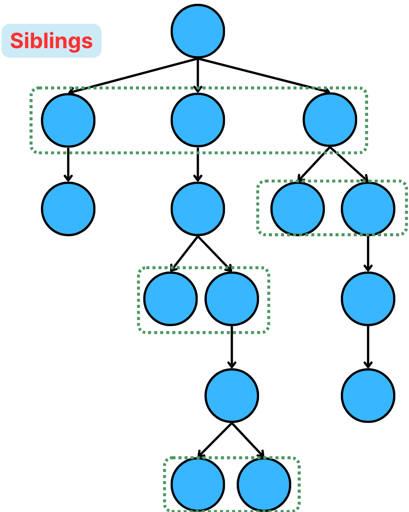

## Basic Terms

**Node:** A single element in the tree containing data

**Root**: The topmost node

**Edge**: Connection between two nodes

**Parent**: Node with children below it

**Child**: Node connected below another node

<div class="highlight">
Siblings: Nodes with the same parent
</div>

**Leaf:** Node with no children

**Subtrees:** Individiual trees within tree

---

# Tree Terminology

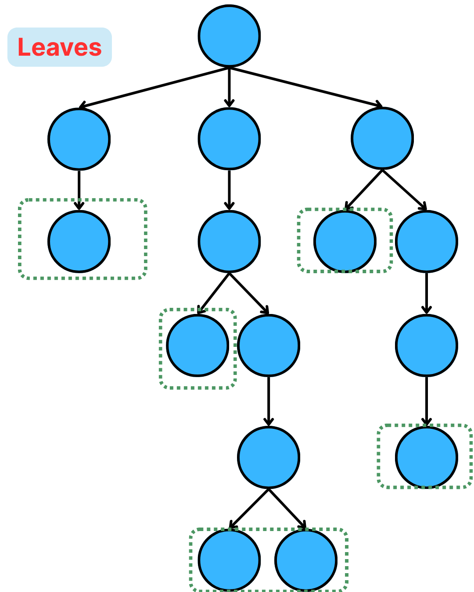

## Basic Terms

**Node:** A single element in the tree containing data

**Root**: The topmost node

**Edge**: Connection between two nodes

**Parent**: Node with children below it

**Child**: Node connected below another node

**Siblings**: Nodes with the same parent

<div class="highlight">
Leaf: Node with no children
</div>

**Subtrees:** Individiual trees within tree

---

# Tree Terminology

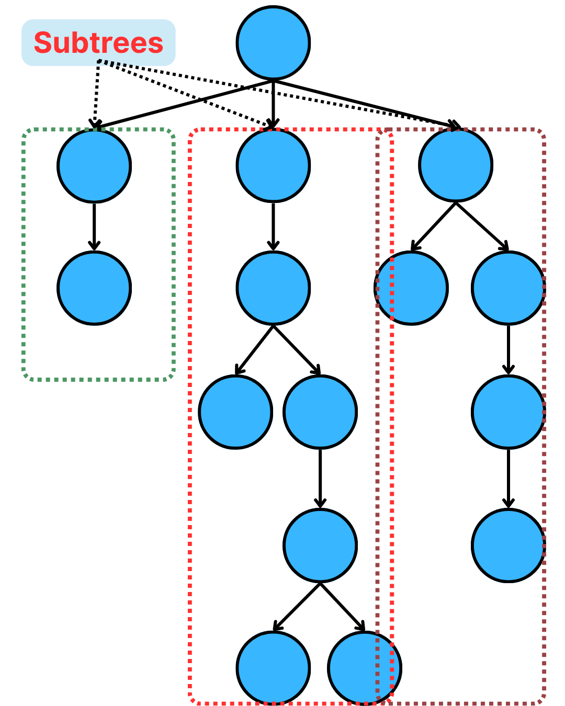

## Basic Terms

**Node:** A single element in the tree containing data

**Root**: The topmost node

**Edge**: Connection between two nodes

**Parent**: Node with children below it

**Child**: Node connected below another node

**Siblings**: Nodes with the same parent

**Leaf**: Node with no children

<div class="highlight">
Subtrees: Individiual trees within tree
</div>

---

# More Tree Terminology


<div class="highlight">
Path: Sequence of nodes connected by edges

- There is exactly one path from root to each node

</div>

**Depth/Level of a node:** Number of edges from root to that node

- Root has depth 0
- Root's children have depth 1

**Height of a node:** Number of edges on the longest path from that node to a leaf

- Leaf has height 0

**Height of a tree:** Height of the root node

**Degree of a node:** Number of children it has

---

# More Tree Terminology

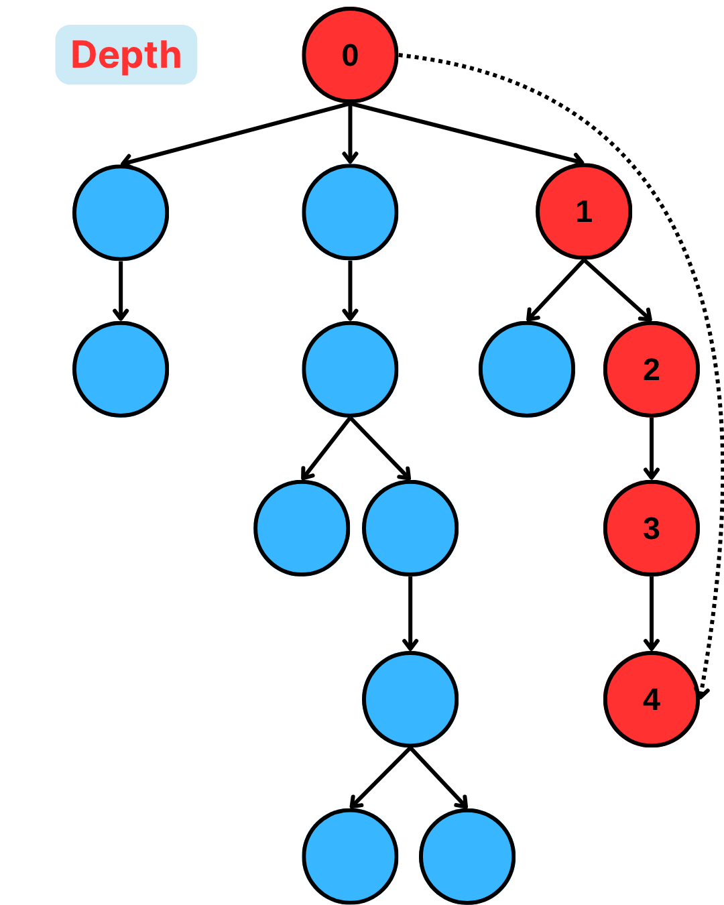

**Path**: Sequence of nodes connected by edges

- There is **exactly one path** from root to each node

<div class="highlight">
Depth/Level of a node: Number of edges from root to that node

- Root has depth 0
- Root's children have depth 1
</div>

**Height of a node:** Number of edges on the longest path from that node to a leaf

- Leaf has height 0

**Height of a tree:** Height of the root node

**Degree of a node:** Number of children it has

---

# More Tree Terminology


**Path**: Sequence of nodes connected by edges

- There is **exactly one path** from root to each node

**Depth/Level of a node:** Number of edges from root to that node

- Root has depth 0
- Root's children have depth 1

<div class="highlight">
Height of a node: Number of edges on the longest path from that node to a leaf

- Leaf has height 0

Height of a tree: Height of the root node
</div>

**Degree of a node:** Number of children it has

---


# More Tree Terminology

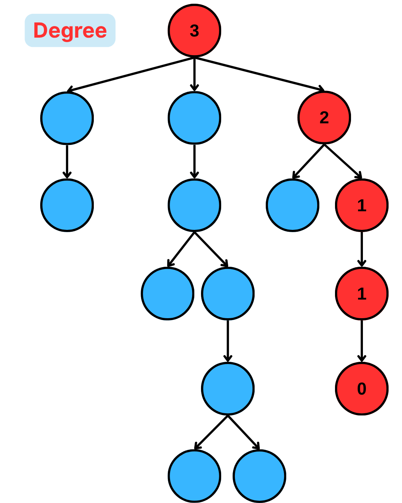

**Path**: Sequence of nodes connected by edges

- There is **exactly one path** from root to each node

**Depth/Level of a node:** Number of edges from root to that node

- Root has depth 0
- Root's children have depth 1

**Height of a node:** Number of edges on the longest path from that node to a leaf

- Leaf has height 0

**Height of a tree:** Height of the root node

<div class="highlight">
Degree of a node: Number of children it has
</div>

---

# Tree Terminology - Practice

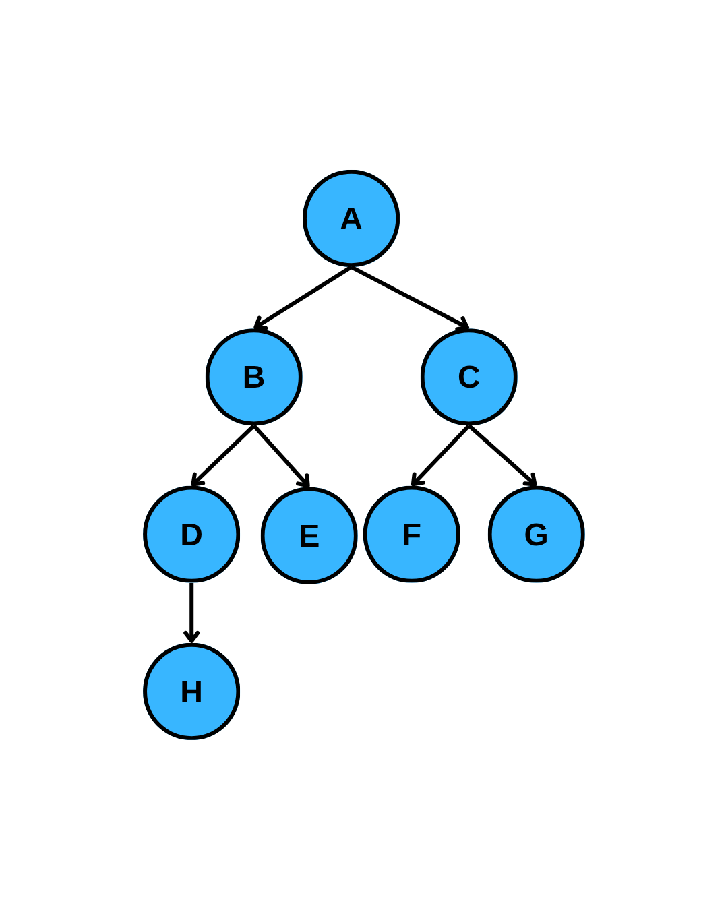

**Identify:**

- Root: 
- Leaves: 
- Internal nodes: 
- Parent of D: 
- Children of C:
- Siblings of B: 
- Degree of B: 
- Depth of D: 
- Height of B: 
- Height of tree: 

---

# Tree Terminology - Answer


**Identify:**

- Root: A
- Leaves: E, F, G, H
- Internal nodes: A, B, C, D
- Parent of D: B
- Children of C: F, G
- Siblings of B: C
- Degree of B: 2
- Depth of D: 2
- Height of B: 2
- Height of tree: 3

---

# Tree Properties


## Important Properties

**1. Number of Edges**

- A tree with n nodes has exactly **n-1 edges**
- Example: 10 nodes → 9 edges

**2. Maximum Nodes at Level**

- Maximum nodes at level i = **2^i**
- Level 0: 1 node (root)
- Level 1: 2 nodes
- Level 2: 4 nodes
- Level 3: 8 nodes

**3. Path Uniqueness**

- Between any two nodes, there is exactly **one path**

---

# Summary - Key Takeaways

## Part 1: Algorithm Analysis

**Big-Oh Notation:**
- Describes growth rate of algorithms
- Focus on worst case, ignore constants
- Essential for comparing algorithms

**Common Complexities:**
- O(1) < O(log n) < O(n) < O(n log n) < O(n²) < O(2ⁿ) < O(n!)

**Analysis Skills:**
- Count loops and operations
- Add for sequential, multiply for nested
- Consider both time and space

---

# Summary - Key Takeaways

## Part 2: Trees Introduction

**Tree Fundamentals:**
- Hierarchical data structure with nodes and edges
- One root, parent-child relationships, no cycles
- n nodes → n-1 edges

**Tree Terminology:**
- Node, root, parent, child, siblings, leaf
- Path, depth/level, height
- Degree and subtrees

**Tree Properties:**
- Maximum nodes at level i = 2^i
- Exactly one path between any two nodes
- Foundation for advanced structures

---

# Thank You!

## Contact Information

- **Email:** ekrem.cetinkaya@yildiz.edu.tr
- **Office Hours:** Tuesday 14:00-16:00 - Room F-B21
- **Book a slot before coming to the office hours:** [Booking Link](https://calendar.app.google/aBKvBqNAqG12oD2B9)
- **Course Repository:** [GitHub Link](https://github.com/ekremcet/yzm2031-data-structures-and-algorithms)

## Next Class

- **Date:** 12.11.2025
- **Topic:** Trees (cont.) and Binary Search Tree
- **Reading:** Weiss Ch.4.1-4.2-4.3

**Practice Resources:**
- Visualize algorithms: https://visualgo.net
- Big-Oh cheat sheet: https://www.bigocheatsheet.com
