# YZM2031

## Data Structures and Algorithms

### Week 6: Binary Trees & Binary Search Trees

**Instructor:** Ekrem Çetinkaya
**Date:** 12.11.2025

---

<!-- _footer: "" -->
<!-- _header: "" -->
<!-- _paginate: false -->

<style scoped>
p { text-align: center}
h1 {text-align: center; font-size: 72px;}
</style>

# Binary Trees

---

# Binary Trees

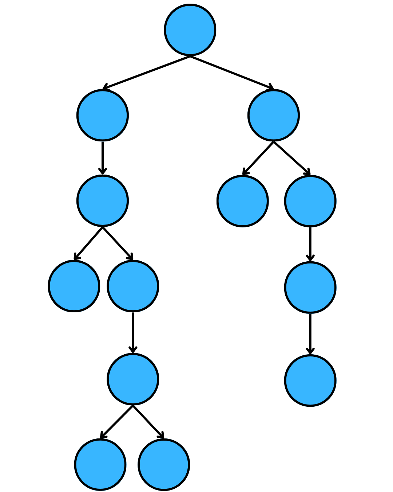

A tree where each node has **at most 2 children**

### Why Binary Trees?

- The general representation of trees are OK but not
necessarity required in many applications
- Accessing some components may not be very
efficient
- For many applications, trees with restricted
structures are sufficient

---

# Binary Trees


### Why Binary Trees?

- Simple structure
- Efficient operations
- Foundation for many advanced structures:
  - Binary Search Trees (BST)
  - Heaps
  - AVL Trees
  - Red-Black Trees

**Maximum nodes in binary tree of height h:**
- 2^(h+1) - 1 nodes

---

# Types of Binary Trees

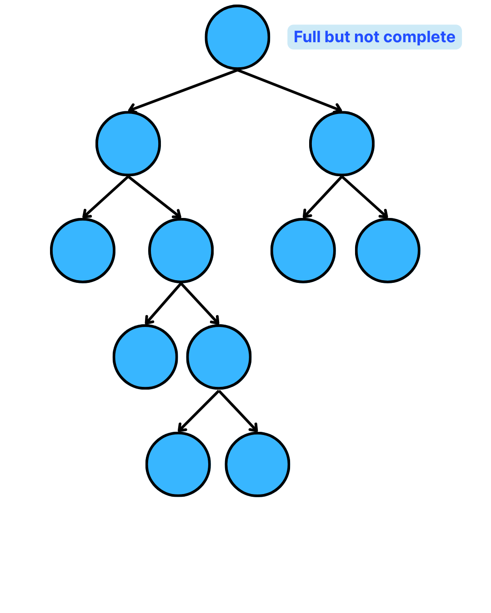

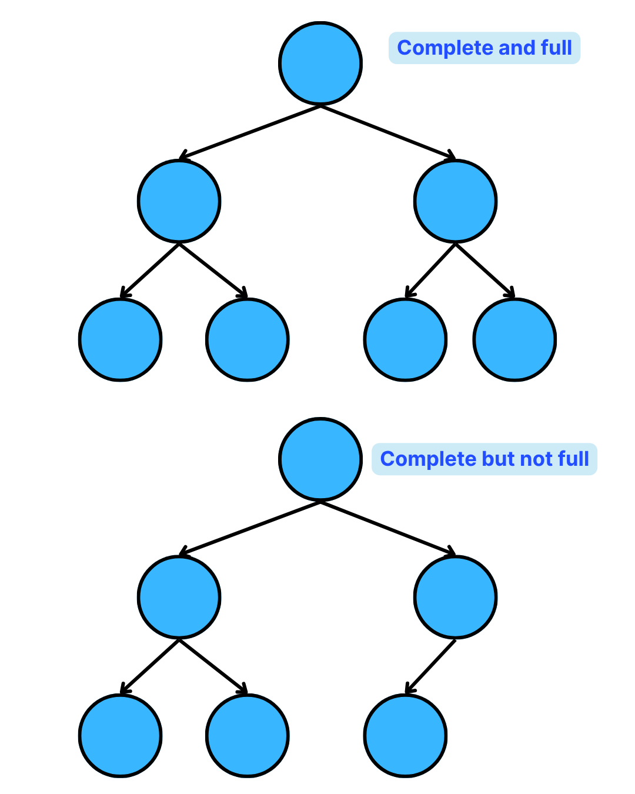

### Full Binary Tree

Every node has either **0 or 2 children**
- No node has only 1 child

### Complete Binary Tree

All levels are completely filled **except possibly the last**
- Last level fills from _left to right_

### Balanced Binary Tree
- If the height of any node’s right subtree differs from the height of the node’s left subtree by no more than 1
- Complete binary trees are balanced

---

# Types of Binary Trees

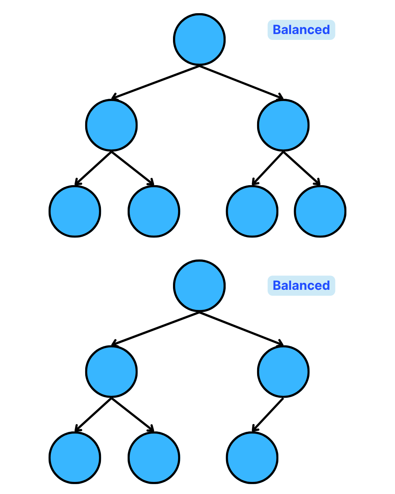

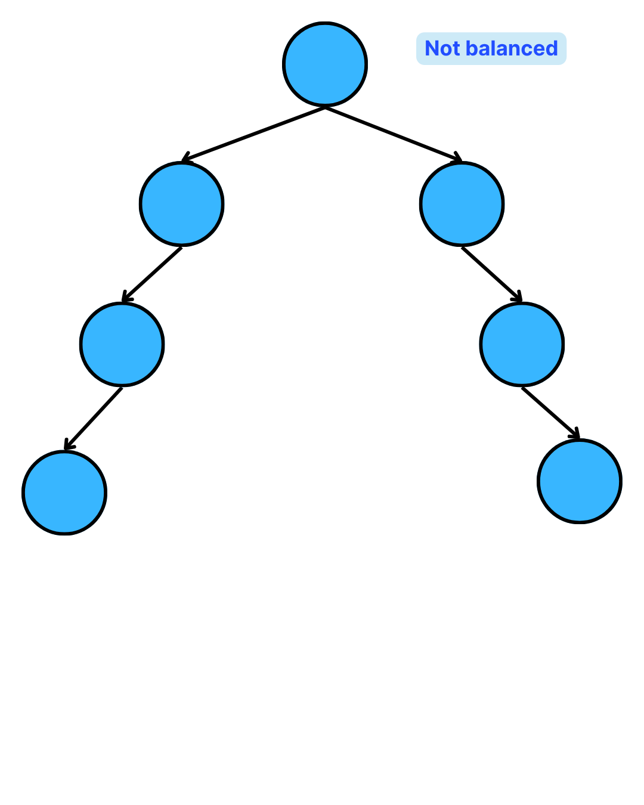

### Full Binary Tree

Every node has either **0 or 2 children**
- No node has only 1 child

### Complete Binary Tree

All levels are completely filled **except possibly the last**
- Last level fills from _left to right_

### Balanced Binary Tree
- If the height of any node's right subtree differs from the height of the node's left subtree by no more than 1
- Complete binary trees are balanced

---

# Binary Tree Implementation

## Two Main Approaches

**1. Linked List (Pointer-Based)**
- Each node contains data and pointers to children
- Dynamic memory allocation
- Flexible size

**2. Array-Based**
- Store nodes in a contiguous array
- Fixed size
- Efficient for complete binary trees

---

# Linked List Implementation

## Node Structure

```cpp
struct TreeNode {
    int data;
    TreeNode* left;
    TreeNode* right;
    
    // Constructor
    TreeNode(int val) 
        : data(val), left(nullptr), right(nullptr) {}
};
```

**Structure:**
- Data field (can be any type)
- Pointer to left child
- Pointer to right child
- Initially, children are `nullptr`

---

# Linked List Implementation

## Binary Tree Class

```cpp
class BinaryTree {
private:
    TreeNode* root;
    
public:
    BinaryTree() : root(nullptr) {}
    
    // Basic operations
    void insert(int val);
    void deleteNode(int val);
    bool search(int val);
    
    // Traversals
    void inorder();
    void preorder();
    void postorder();
    void levelOrder();
    
    // Utility functions
    int height();
    int countNodes();
    bool isEmpty() { return root == nullptr; }
};
```

---

# Linked List Implementation - Creating Nodes

```cpp
// Creating a binary tree manually
TreeNode* root = new TreeNode(1);
root->left = new TreeNode(2);
root->right = new TreeNode(3);
root->left->left = new TreeNode(4);
root->left->right = new TreeNode(5);
```


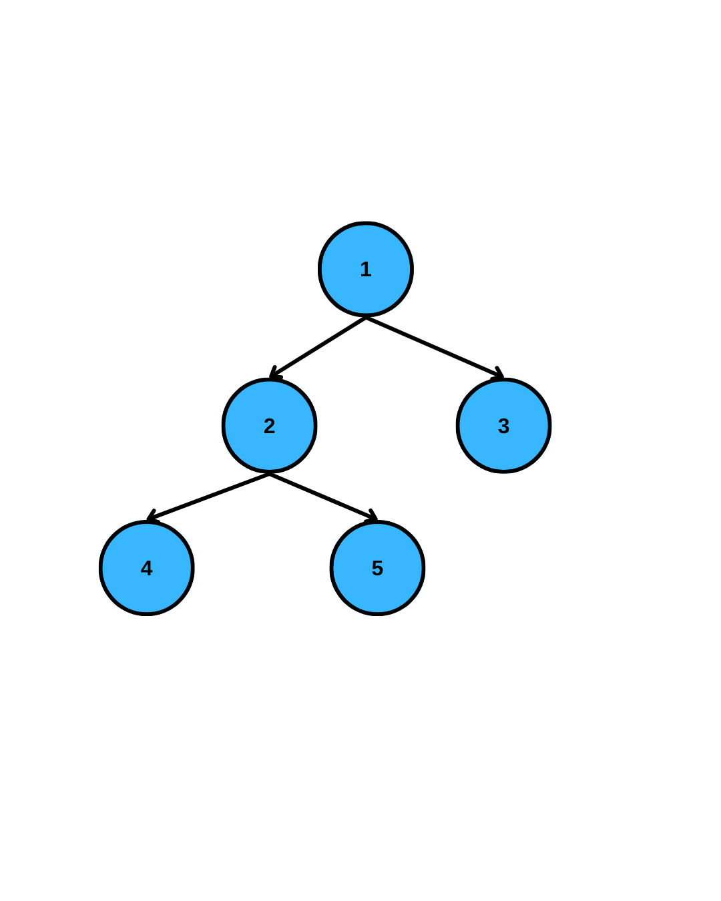

**Memory:** Each node allocated dynamically on the heap

---

# Array-Based Implementation

Store the tree in a **contiguous array** using **level-order** numbering

**Indexing Rule:**
- Root at index 0
- For node at index `i`:
  - Left child: `2*i + 1`
  - Right child: `2*i + 2`
  - Parent: `(i-1) / 2`

---

# Array-Based Implementation - Example

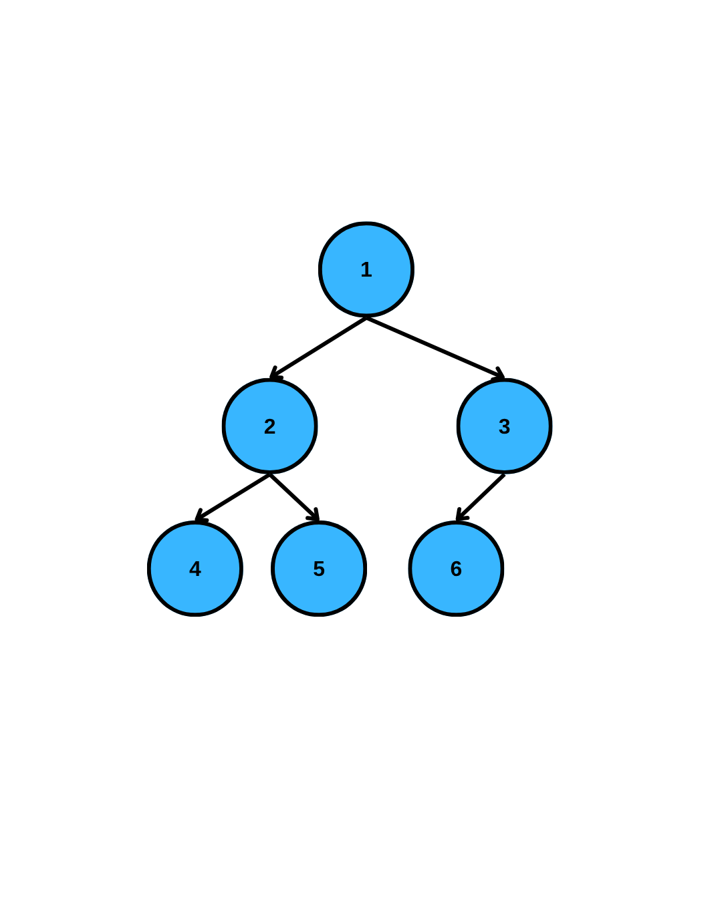

**Array representation:**
```
Index:  0   1   2   3   4   5   6
Value: [1] [2] [3] [4] [5] [6] [-]
```

**Access formulas:**
- Node at index `i`
- Left child at `2*i + 1`
- Right child at `2*i + 2`
- Parent at `(i-1) / 2`

---

# Array-Based Implementation - Code

```cpp
class ArrayBinaryTree {
private:
    int* tree;
    int capacity;
    int size;
    
public:
    ArrayBinaryTree(int maxSize) {
        capacity = maxSize;
        tree = new int[capacity];
        size = 0;
        // Initialize with sentinel value
        for (int i = 0; i < capacity; i++) {
            tree[i] = -1;  // -1 means empty
        }
    }
    
    int getLeftChild(int index) {
        int leftIndex = 2 * index + 1;
        if (leftIndex < capacity && tree[leftIndex] != -1)
            return tree[leftIndex];
        return -1;  // No left child
    }
    
    int getRightChild(int index) {
        int rightIndex = 2 * index + 2;
        if (rightIndex < capacity && tree[rightIndex] != -1)
            return tree[rightIndex];
        return -1;  // No right child
    }
    
    int getParent(int index) {
        if (index == 0) return -1;  // Root has no parent
        int parentIndex = (index - 1) / 2;
        return tree[parentIndex];
    }
};
```

---

# Array-Based Implementation - Inserting

```cpp
void insert(int value, int index) {
    if (index >= capacity) {
        cout << "Tree is full!" << endl;
        return;
    }
    tree[index] = value;
    size++;
}

// Example: Build the tree
ArrayBinaryTree bt(100);
bt.insert(1, 0);     // Root
bt.insert(2, 1);     // Left child of root
bt.insert(3, 2);     // Right child of root
bt.insert(4, 3);     // Left child of node 2
bt.insert(5, 4);     // Right child of node 2
bt.insert(6, 5);     // Left child of node 3
```

---


<!-- _footer: "" -->
<!-- _header: "" -->
<!-- _paginate: false -->

<style scoped>
p { text-align: center}
h1 {text-align: center; font-size: 72px; color: #2c3e50}
</style>

# Tree Traversal

---

# Tree Traversal

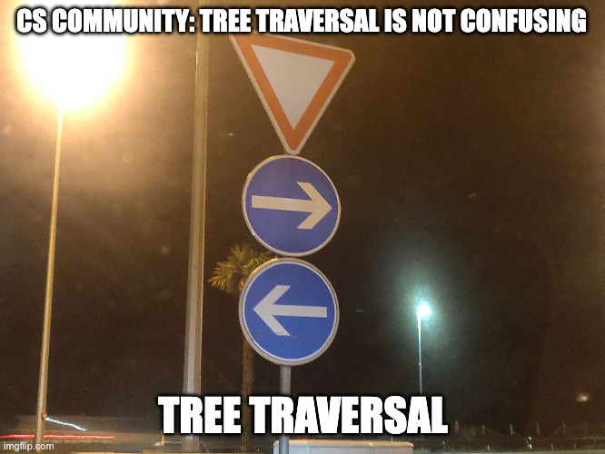


**Problem:** How do we visit every node in a tree?

Unlike arrays (simple loop), trees are hierarchical

### Why?
- Print all values
- Search for a value
- Calculate tree properties
- Copy/clone a tree
- Serialize/deserialize

---

# Tree Traversal


To put the nodes of a binary tree into a linear order
we use the notion of a traversal.
- Pre-order traversal
- In-order traversal
- Post-order traversal


---

# Tree Traversal

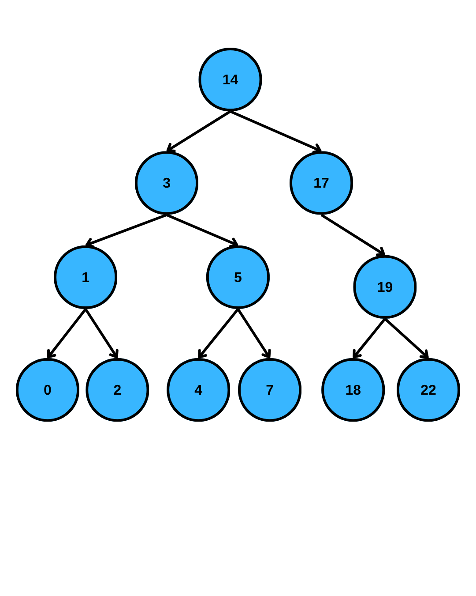

**1. Pre-order (Root - Left - Right)**
- Visit root first
- Then left subtree
- Then right subtree


**2. In-order (Left - Root - Right)**
- Visit left subtree first
- Then root
- Then right subtree


**3. Post-order (Left - Right - Root)**
- Visit left subtree first
- Then right subtree
- Then root last


---


# Tree Traversal


**1. Pre-order (Root - Left - Right)**

>14, 3, 1, 0, 2, 5, 4, 7, 17, 19, 18, 22

**2. In-order (Left - Root - Right)**

>0, 1, 2, 3, 4, 5, 7, 14, 17, 18, 19, 22

**3. Post-order (Left - Right - Root)**

>0, 2, 1, 4, 7, 5, 3, 18, 22, 19, 17, 14

---

# Pre-order Traversal


## Root - Left - Right

>14, 3, 1, 0, 2, 5, 4, 7, 17, 19, 18, 22

```cpp
void preorder(TreeNode* root) {
    if (root == nullptr) {
        return;  // Base case
    }
    
    // 1. Visit root first
    cout << root->data << " ";
    
    // 2. Traverse left subtree
    preorder(root->left);
    
    // 3. Traverse right subtree
    preorder(root->right);
}
```

---

# In-order Traversal


## Left - Root - Right
>0, 1, 2, 3, 4, 5, 7, 14, 17, 18, 19, 22

```cpp
void inorder(TreeNode* root) {
    if (root == nullptr) {
        return;  // Base case
    }
    
    // 1. Traverse left subtree first
    inorder(root->left);
    
    // 2. Visit root
    cout << root->data << " ";
    
    // 3. Traverse right subtree
    inorder(root->right);
}
```

---

# Post-order Traversal


## Left - Right - Root

>0, 2, 1, 4, 7, 5, 3, 18, 22, 19, 17, 14

```cpp
void postorder(TreeNode* root) {
    if (root == nullptr) {
        return;  // Base case
    }
    
    // 1. Traverse left subtree first
    postorder(root->left);
    
    // 2. Traverse right subtree
    postorder(root->right);
    
    // 3. Visit root last
    cout << root->data << " ";
}
```

---

# Practice

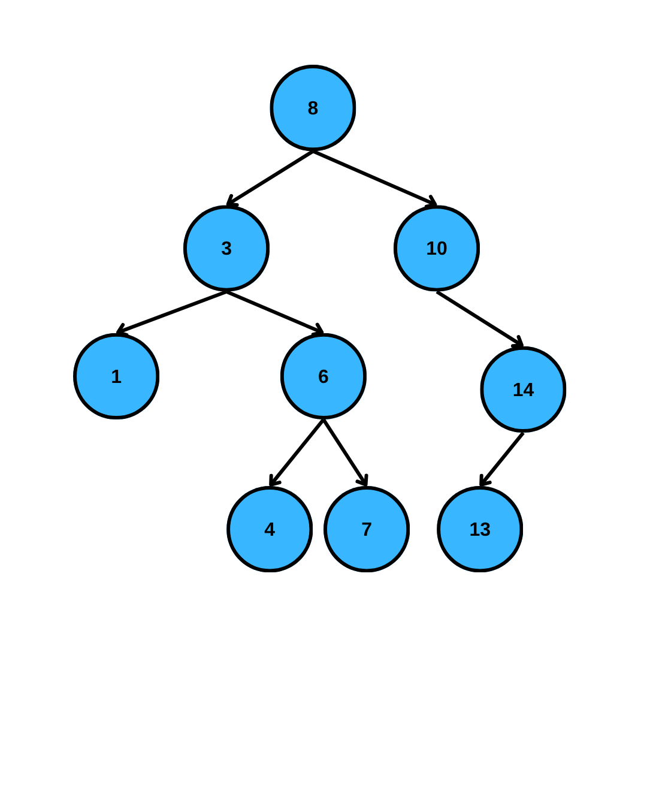

**Questions:**
1. What is the pre-order traversal?
2. What is the in-order traversal?
3. What is the post-order traversal?

---

# Answers


1. **Pre-order:** 8 3 1 6 4 7 10 14 13
2. **In-order:** 1 3 4 6 7 8 10 13 14
3. **Post-order:** 1 4 7 6 3 13 14 10 8

---

<!-- _footer: "" -->
<!-- _header: "" -->
<!-- _paginate: false -->

<style scoped>
p { text-align: center}
h1 {text-align: center; font-size: 72px}
</style>

# Binary Search Trees

---

# The Problem - Finding an Element


**Arrays:**
- Unsorted: Linear search O(n)

**Linked Lists:**
- Search: O(n) - must traverse

**Question:** How about sorted array?

---

# The Problem - Guess the Number


One player (A) chooses a random number between two numbers
* 0 - 100

The other player (B) tries to find that number by guessing

Player A helps player B by giving hints to pick a higher or a lower number

**What should be the strategy?**

---

# The Problem - Guess the Number


### Example: Find(4)

Player A can choose the number in the middle (7)
- When player B says lower/higher, half of the list is eliminated

---

# The Problem - Guess the Number

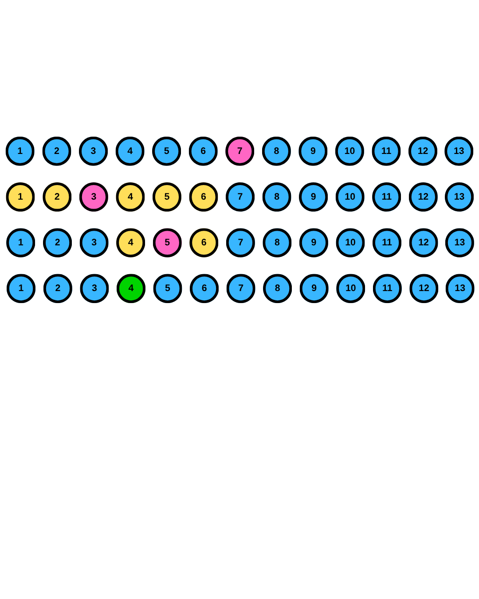

### Example: Find(4)

Player A can choose the number in the middle (7)
- When player B says lower/higher, half of the list is eliminated
- At each step, the number of candidate items is **halved**

### In sorted array search is O (logN)
* Keeping the array sorted is costly after each insertion and deletion: O(N)

**Can we have a more efficient data structure?**

---

# Binary Search Tree

A **Binary Search Tree (BST)** is a binary tree with a special property:

**BST Property:**
> For every node:
> - All values in **left subtree** are **less than** node's value
> - All values in **right subtree** are **greater than** node's value

This property holds for **every node** in the tree. 

Recursive definition

**Result:** Data is naturally sorted

---

# BST Example

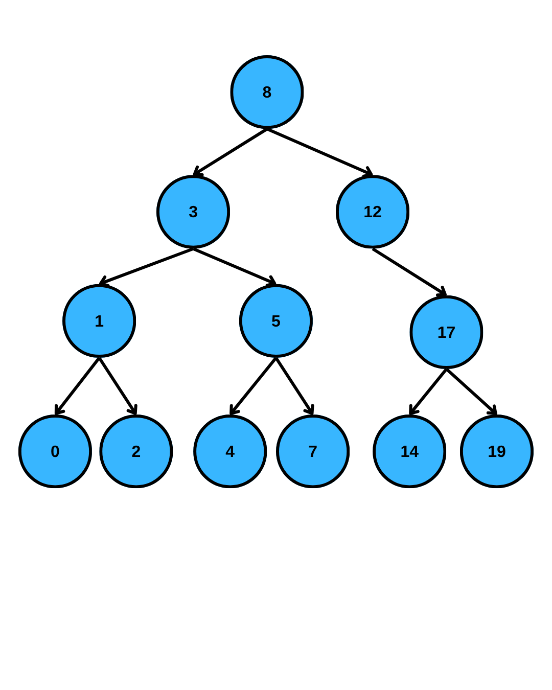

**Check the BST property:**
- 8: left (3,1,0,2,5,4,7) < 8 < right (12,17,14,19) 
- 3: left (1,0,2) < 3 < right (5,4,7)
- 12: left (3,1,0,2,5,4,7) < 12 < right (17,14,19)

**In-order traversal:** 0, 1, 2, 3, 4, 5, 7, 8, 12, 14, 17, 19 (sorted)

**Key:** In-order traversal of BST always gives sorted order!

---

# Not a BST!


**Why not?**
- Node 5's right child is 9, but 9 > 8


A tree is only a BST if **every node** follows the rule.

---

# BST Node Structure

```cpp
struct BSTNode {
    int data;
    BSTNode* left;
    BSTNode* right;
    
    // Constructor
    BSTNode(int val) : data(val), left(nullptr), right(nullptr) {}
};

class BST {
private:
    BSTNode* root;
    
public:
    BST() : root(nullptr) {}
    
    // Operations
    bool search(int val);
    void insert(int val);
    void remove(int val);
    void inorder();
};
```

---

# BST Search Operation

## How to Search?

Start at root, compare:
1. If value == current node: **Found!**
2. If value < current node: **Go left**
3. If value > current node: **Go right**
4. If nullptr: **Not found**

**Like binary search on array, but on a tree**

---

# BST Search - Example

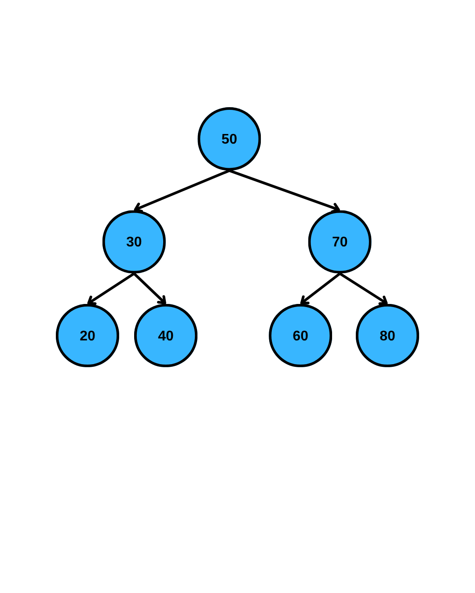

**Search for 60:**
1. Start at 50...

**Search for 35:**
1. Start at 50...

---

# BST Search - Example


**Search for 60:**
1. Start at 50: 60 > 50, go right
2. At 70: 60 < 70, go left
3. At 60: Found ✅

**Search for 35:**
1. Start at 50: 35 < 50, go left
2. At 30: 35 > 30, go right 
3. At 40: 35 < 40, go left
4. nullptr: Not found ❌

---

# BST Search - Implementation

```cpp
bool search(BSTNode* node, int val) {
    // Base case: reached nullptr
    if (node == nullptr) {
        return false;
    }
    
    // Found the value
    if (val == node->data) {
        return true;
    }
    
    // Recursively search left or right
    if (val < node->data) {
        return search(node->left, val);   // Go left
    } else {
        return search(node->right, val);  // Go right
    }
}

```

---


# BST Search - Iterative Version

```cpp
bool BST::search(int val) {
    BSTNode* current = root;
    
    while (current != nullptr) {
        if (val == current->data) {
            return true;  // Found!
        }
        else if (val < current->data) {
            current = current->left;   // Go left
        }
        else {
            current = current->right;  // Go right
        }
    }
    
    return false;  // Not found
}
```

**Both versions work!**
- Recursive: cleaner, uses call stack
- Iterative: no stack overhead

---

# BST Find Minimum

## Finding the Smallest Value

**Key:** The minimum value is the **leftmost node**

**Algorithm:**
1. Start at root
2. Keep going left until no left child exists
3. That node contains the minimum value

**Time Complexity:** O(h) where h is height
- Best case (balanced): O(log n)
- Worst case (skewed): O(n)

---

# BST Find Minimum - Code

```cpp
BSTNode* findMin(BSTNode* node) {
    if (node == nullptr) {
        return nullptr;  // Empty tree
    }
    
    // Keep going left until we can't go anymore
    while (node->left != nullptr) {
        node = node->left;
    }
    
    return node;  // This is the minimum
}

// Alternative: Recursive version
BSTNode* findMinRecursive(BSTNode* node) {
    if (node == nullptr) {
        return nullptr;
    }
    if (node->left == nullptr) {
        return node;  // Found the minimum
    }
    return findMinRecursive(node->left);
}
```

---

# BST Find Maximum

**Key:** The maximum value is the **rightmost node**

**Algorithm:**
1. Start at root
2. Keep going right until no right child exists
3. That node contains the maximum value

**Time Complexity:** O(h) where h is height
- Best case (balanced): O(log n)
- Worst case (skewed): O(n)

---

# BST Find Maximum - Code

```cpp
BSTNode* findMax(BSTNode* node) {
    if (node == nullptr) {
        return nullptr;  // Empty tree
    }
    
    // Keep going right until we can't go anymore
    while (node->right != nullptr) {
        node = node->right;
    }
    
    return node;  // This is the maximum
}

// Alternative: Recursive version
BSTNode* findMaxRecursive(BSTNode* node) {
    if (node == nullptr) {
        return nullptr;
    }
    if (node->right == nullptr) {
        return node;  // Found the maximum
    }
    return findMaxRecursive(node->right);
}
```

---

# BST Insert Operation

Essentially similar to search, but:
1. Search for the value
2. When we reach nullptr, insert there
3. New nodes are always inserted as **leaves**

**Key:** Must maintain BST property

---

# BST Insert - Example

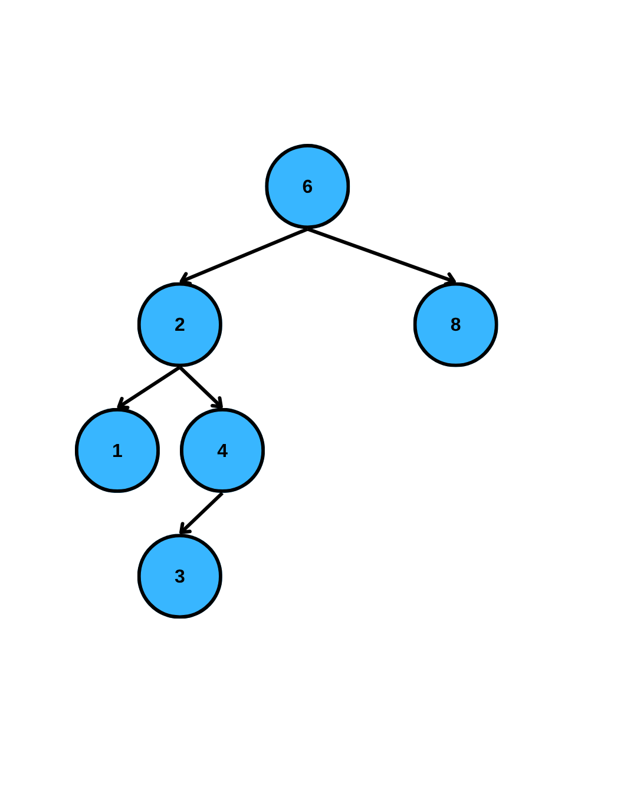

**To insert 5:**
* Where do we go?

---

# BST Insert - Example

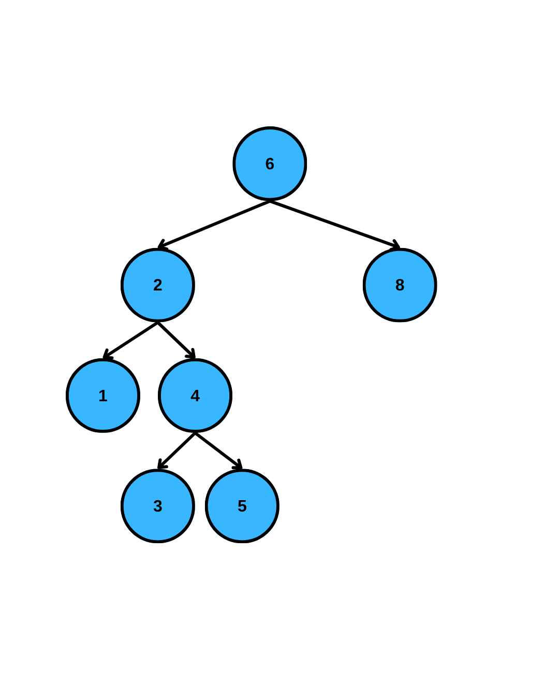

**To insert 5:**
* Where do we go?

Should be the right child of 4

**To insert: 7**
* Where do we go?

---

# BST Insert - Example

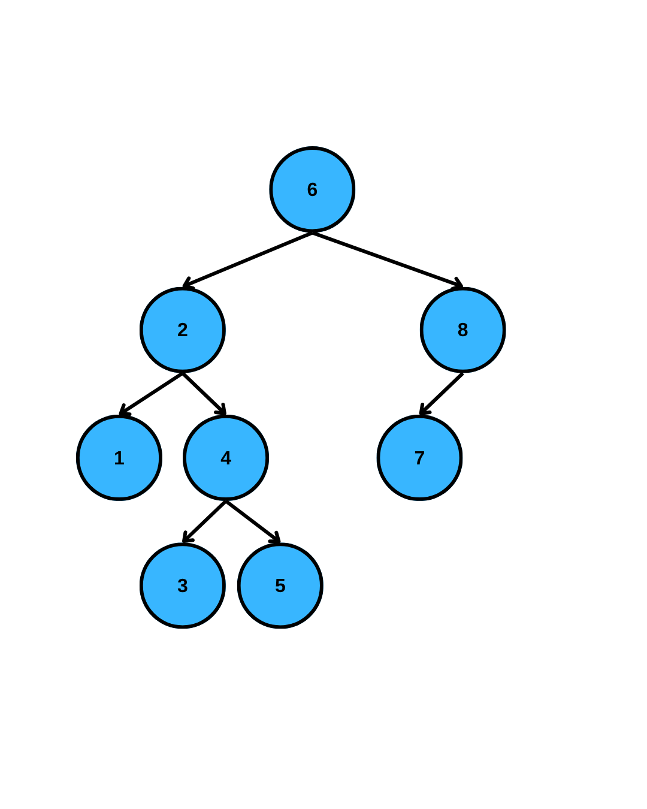

**To insert 5:**
* Where do we go?

Should be the right child of 4

**To insert: 7**
* Where do we go?

Should be the left child of 8

**To insert: 17**
* Where do we go?

---

# BST Insert - Example

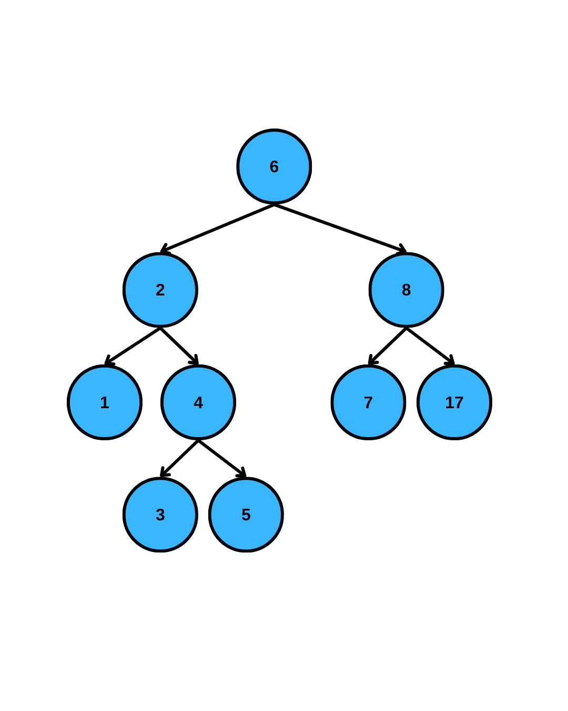

**To insert 5:**
* Where do we go?

Should be the right child of 4

**To insert: 7**
* Where do we go?

Should be the left child of 8

**To insert: 17**
* Where do we go?

Should be the right child of 8

---

# BST Insert - Implementation

```cpp
BSTNode* insert(BSTNode* node, int val) {
    // Base case: found the insertion point
    if (node == nullptr) {
        return new BSTNode(val);
    }
    
    // Recursively insert in left or right subtree
    if (val < node->data) {
        node->left = insert(node->left, val);
    }
    else if (val > node->data) {
        node->right = insert(node->right, val);
    }
    // If val == node->data, do nothing (no duplicates)
    
    return node;
}

```

---

# BST Delete Operation

### Most Complex Operation in the BST

**Three Cases:**

**Case 1:** Node is a leaf (no children)
- Just remove it

**Case 2:** Node has one child
- Replace node with its child

**Case 3:** Node has two children
- Find successor (or predecessor)
- Replace with successor
- Delete successor

---

# BST Delete - Case 1 - Leaf Node

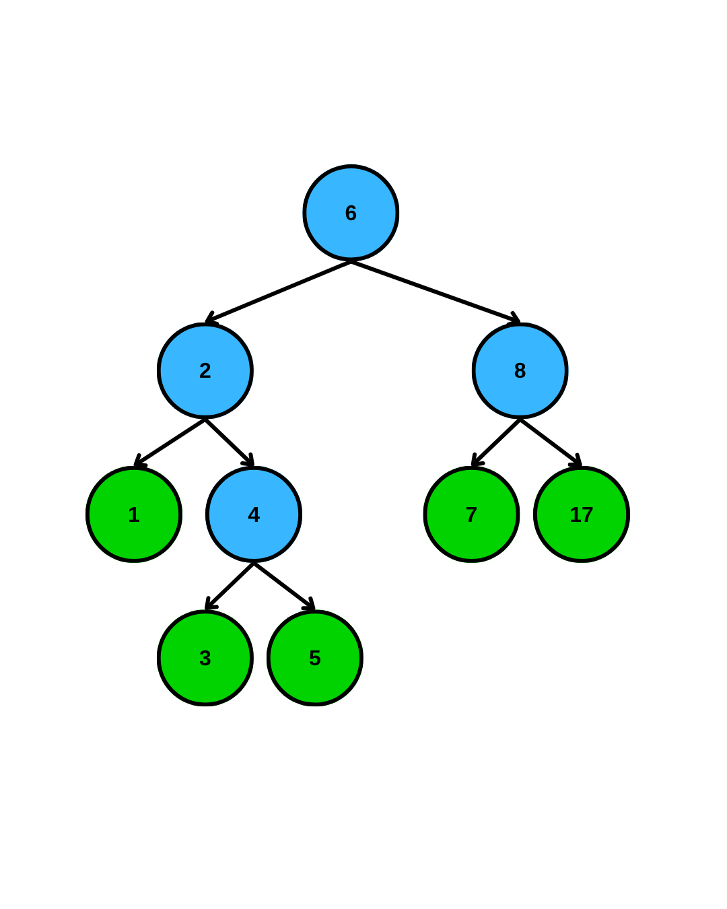

**Delete 7 (leaf node):**
- Just remove it
- No children to worry about
- Simple
> Same goes to 1, 3, 5, 17

---

# BST Delete - Case 2 - One Child

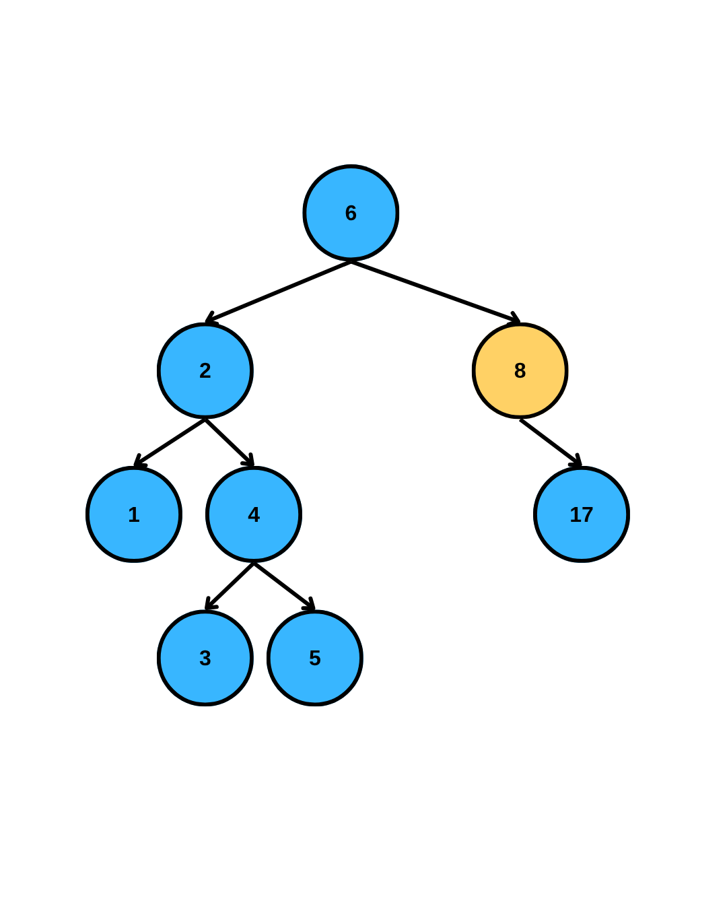

**Delete 8 (one child):**

---

# BST Delete - Case 2 - One Child

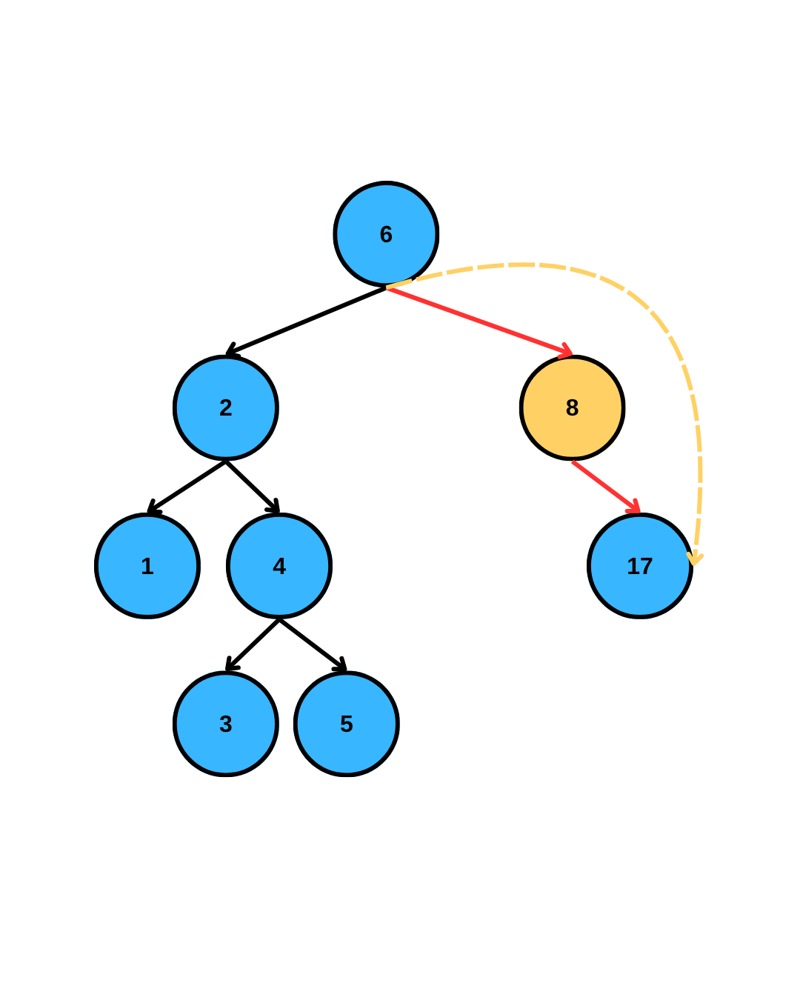

**Delete 8 (one child):**
- Make that single child the child of the grandparent

---


# BST Delete - Case 2 - One Child

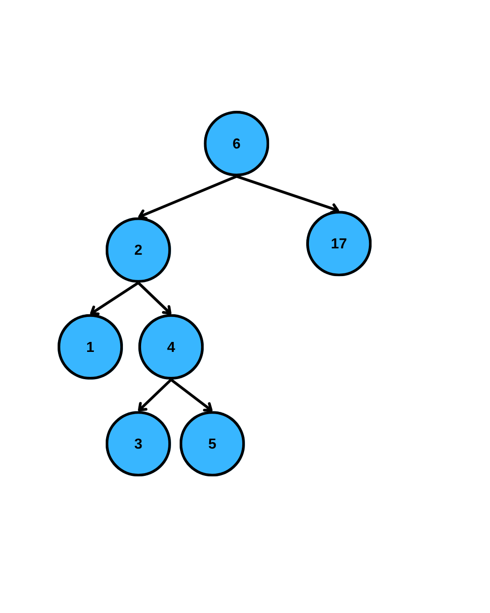

**Delete 8 (one child):**
- Make that single child the child of the grandparent
- 17 becomes the child of 6

---

# BST Delete - Case 3 - Two Children

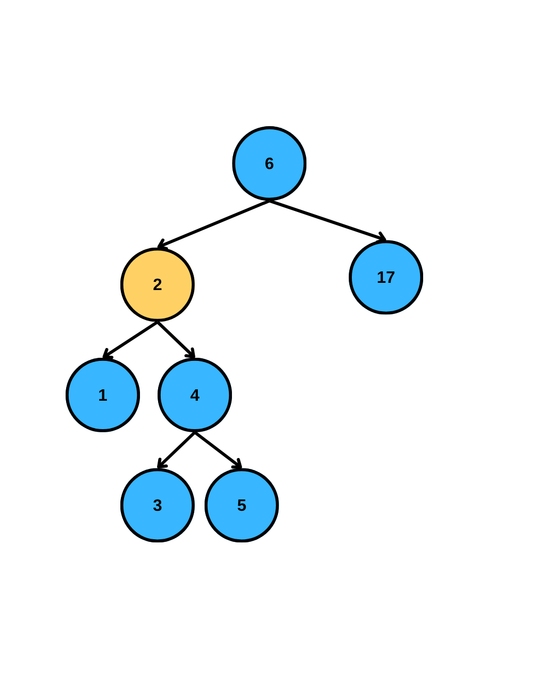

**Delete 2 (two children):**

---

# BST Delete - Case 3 - Two Children

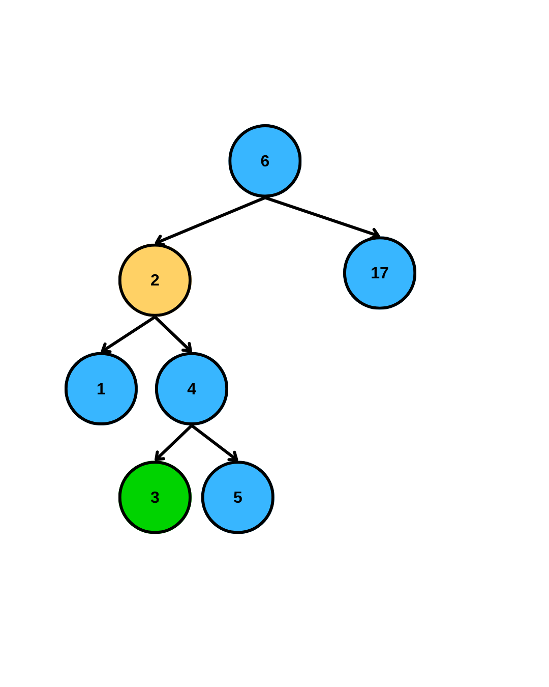

**Delete 2 (two children):**
- Find the minimum node on the right subtree (or the maximum node on the left subtree)

---

# BST Delete - Case 3 - Two Children

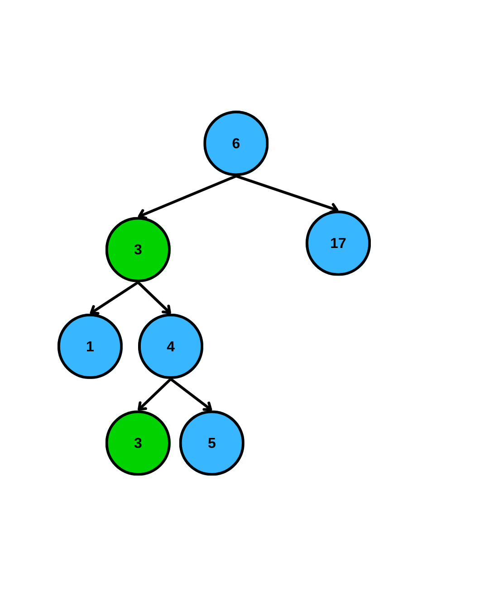

**Delete 2 (two children):**
- Find the minimum node on the right subtree (or the maximum node on the left subtree)
- Copy the newly found node to the original node to be deleted

---

# BST Delete - Case 3 - Two Children

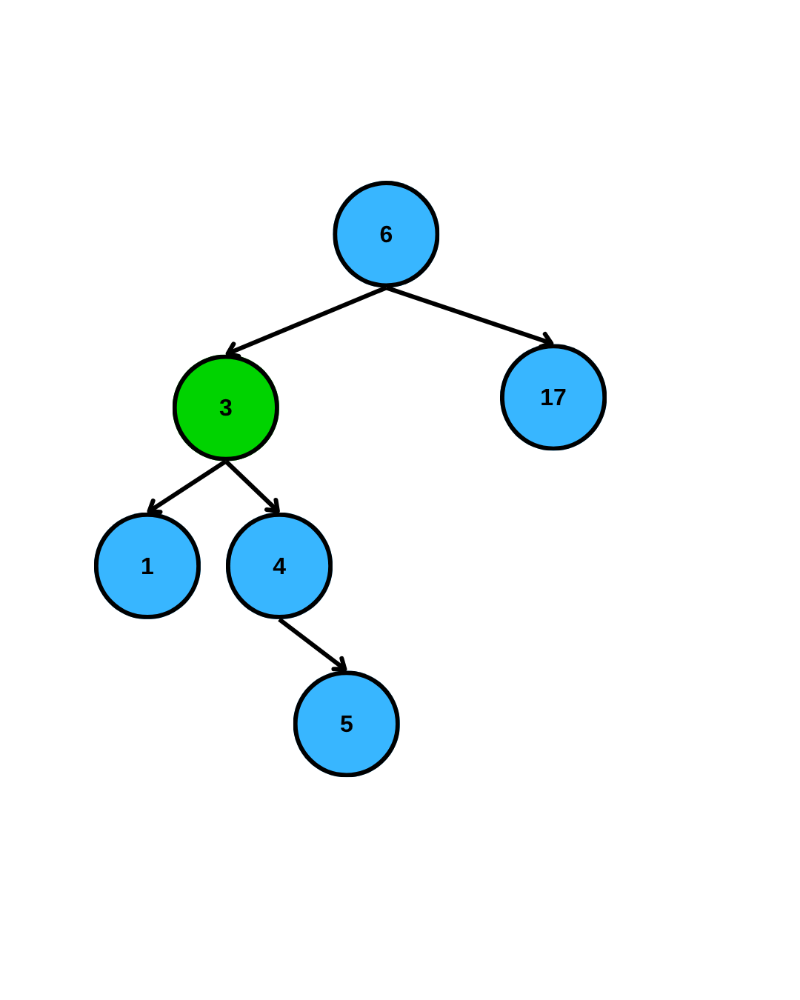

**Delete 2 (two children):**
- Find the minimum node on the right subtree (or the maximum node on the left subtree)
- Copy the newly found node to the original node to be deleted
- Delete the found node recursively

---

# BST Delete - Practice

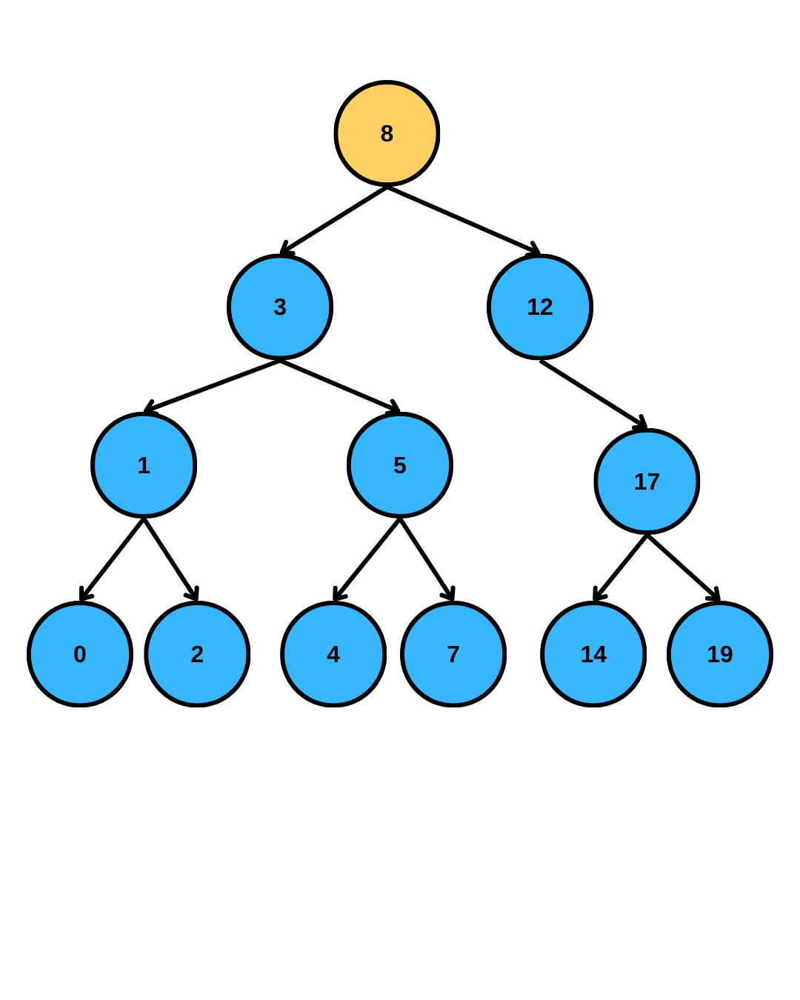

**Delete 8**

**How to do it?**

---

# Finding In-order Successor

```cpp
BSTNode* findMin(BSTNode* node) {
    // Minimum is leftmost node
    while (node->left != nullptr) {
        node = node->left;
    }
    return node;
}

BSTNode* findMax(BSTNode* node) {
    // Maximum is rightmost node
    while (node->right != nullptr) {
        node = node->right;
    }
    return node;
}
```

**In-order Successor:** Smallest value in right subtree (findMin(node->right))
**In-order Predecessor:** Largest value in left subtree (findMax(node->left))

---

# BST Delete - Implementation

```cpp
BSTNode* deleteNode(BSTNode* node, int val) {
    if (node == nullptr) return nullptr;
    
    // Find the node to delete
    if (val < node->data) {
        node->left = deleteNode(node->left, val);
    }
    else if (val > node->data) {
        node->right = deleteNode(node->right, val);
    }
    else {  // Found the node
        // Case 1: Leaf node or Case 2: One child
        if (node->left == nullptr) {
            BSTNode* temp = node->right;
            delete node;
            return temp;
        }
        else if (node->right == nullptr) {
            BSTNode* temp = node->left;
            delete node;
            return temp;
        }
        
        // Case 3: Two children
        BSTNode* successor = findMin(node->right);
        node->data = successor->data;  // Copy successor's value
        node->right = deleteNode(node->right, successor->data);  // Delete successor
    }
    return node;
}
```

---

# BST Traversals

```cpp
void inorder(BSTNode* node) {
    if (node == nullptr) return;
    inorder(node->left);
    cout << node->data << " ";  // Prints in sorted order!
    inorder(node->right);
}

void preorder(BSTNode* node) {
    if (node == nullptr) return;
    cout << node->data << " ";
    preorder(node->left);
    preorder(node->right);
}

void postorder(BSTNode* node) {
    if (node == nullptr) return;
    postorder(node->left);
    postorder(node->right);
    cout << node->data << " ";
}
```

**Remember:** Inorder traversal of BST gives **sorted output**!

---

# BST Operations - Time Complexity

| Operation | Best/Average | Worst |
|-----------|-------------|-------|
| **Search** | O(log n) | O(n) |
| **Insert** | O(log n) | O(n) |
| **Delete** | O(log n) | O(n) |
| **Traversal** | O(n) | O(n) |

**Key Question:** Why the difference between average and worst?

---

# The Worst Case - Skewed Tree

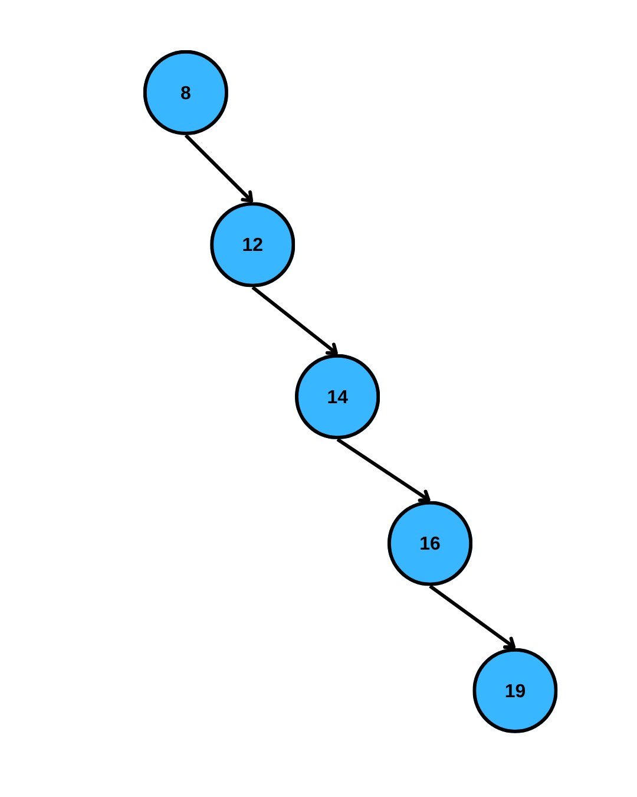

### When BST Becomes a Linked List

```
Insert: 8, 12, 14, 16, 19 (sorted order)
```

**Height = n-1 (worst case!)**
- Search: O(n) - must traverse all nodes
- Essentially a linked list

---

# The Best Case - Balanced Tree

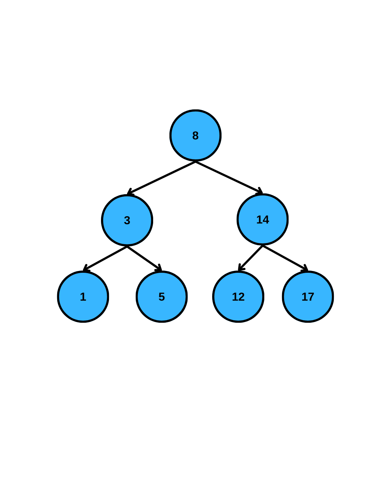

### Ideal Structure is the balanced tree

```
Insert: 8, 3, 1, 5, 14, 12, 17
```

**Height = log n (best case!)**
- Search: O(log n) - halve problem each step
- Like binary search

**Key:** Insert order matters

🤔 How do we come up with data structures such that they keep themselves balanced for efficiency?

---

# Preview - Self-Balancing Trees

### The Solution to Skewed Trees

**AVL Trees:**
- Guarantee O(log n) operations
- Maintain balance through rotations
- Height difference ≤ 1

**Red-Black Trees:**
- Guarantee O(log n) operations
- Less strict balancing
- Used in C++ STL (map, set)

**Coming in future weeks**

---

# Practice

```
        50
       /  \
      30   70
     / \   / \
    20 40 60 80
```

**Questions:**
1. What is the in-order traversal?
2. Search for 60 - how many comparisons?
3. Insert 55 - where does it go?
4. Delete 30 - what's the result?
5. What is the height of this tree?

---

# Answer

```
        50
       /  \
      30   70
     / \   / \
    20 40 60 80
```

1. **In-order:** 20, 30, 40, 50, 60, 70, 80
2. **Search 60:** 3 comparisons (50 → 70 → 60)
3. **Insert 55:** Goes as left child of 60
4. **Delete 30:** Replace with 40 (inorder successor)
5. **Height:** 2 (root at level 0)

---

# Practice

### Build a BST

Insert in order: 15, 10, 20, 8, 12, 17, 25

**Question:** Draw the resulting BST

---

# Answer

Insert order: 15, 10, 20, 8, 12, 17, 25

```
        15
       /  \
      10   20
     / \   / \
    8  12 17 25
```

**Observations:**
- First inserted becomes root
- Perfectly balanced
- Height = 2
- All operations: O(log n)

---

# Summary - Key Takeaways

<div class="two-columns">

<div class="column">

## Binary Trees

**Binary Tree Types:**
- Full, Complete, Perfect, Degenerate trees
- Tree shape affects performance
- Balanced vs skewed structures

**Tree Traversals:**
- Pre-order, In-order, Post-order
- All O(n) time, varying space complexity

</div>

<div class="column">

## Binary Search Trees

**BST Definition:**
- Binary tree with ordering property
- Left < Root < Right for every node
- Inorder traversal gives sorted output

**BST Operations:**
- Search, Insert: Follow the ordering property
- Delete: Three cases (leaf, one child, two children)
- All operations: O(h) where h is height

**Performance:**
- Best/Average: O(log n) - balanced tree
- Worst: O(n) - skewed tree
- Shape matters

</div>

</div>

---

# Thank You!

## Contact Information

- **Email:** ekrem.cetinkaya@yildiz.edu.tr
- **Office Hours:** Tuesday 14:00-16:00 - Room F-B21
- **Book a slot before coming to the office hours:** [Booking Link](https://calendar.app.google/aBKvBqNAqG12oD2B9)
- **Course Repository:** [GitHub Link](https://github.com/ekremcet/yzm2031-data-structures-and-algorithms)

## Next Class

- **Date:** 19.11.2025
- **Topic:** Midterm 1


