# YZM2031

## Data Structures and Algorithms

### Week 7: Balanced Trees (AVL Trees)

**Instructor:** Ekrem Çetinkaya
**Date:** 26.11.2025

---

# Midterm 1 Grades Are Out

### Average: 63,1

### Maximum: 87

### Average Points per Question

- Q1: 4,3 / 10
- Q2: 3,8 / 5
- Q3: 7,4 / 10
- Q4: 3.6 / 10
- Q5: 8,5 / 15
- Q6: 13,5 / 15
- Q7: 8,7 / 15
- Q8: 13,3 / 20

---

<!-- _footer: "" -->
<!-- _header: "" -->
<!-- _paginate: false -->
<style scoped>
p {text-align: center; font-size: 24px; font-style: italic}
</style>

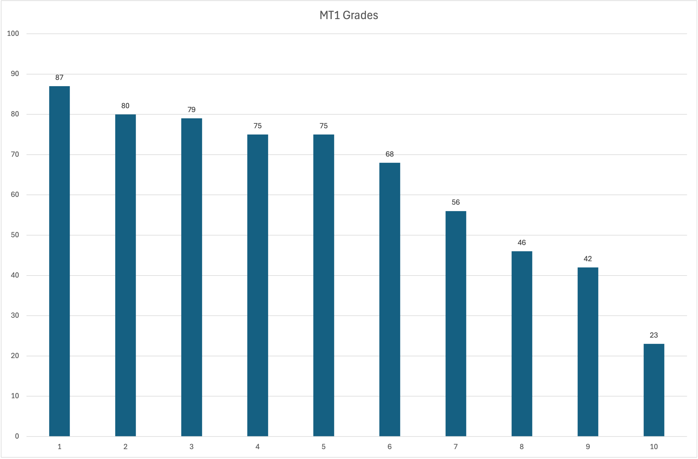

---

<!-- _footer: "" -->
<!-- _header: "" -->
<!-- _paginate: false -->

<style scoped>
p {text-align: center; font-size: 24px; font-style: italic}
</style>

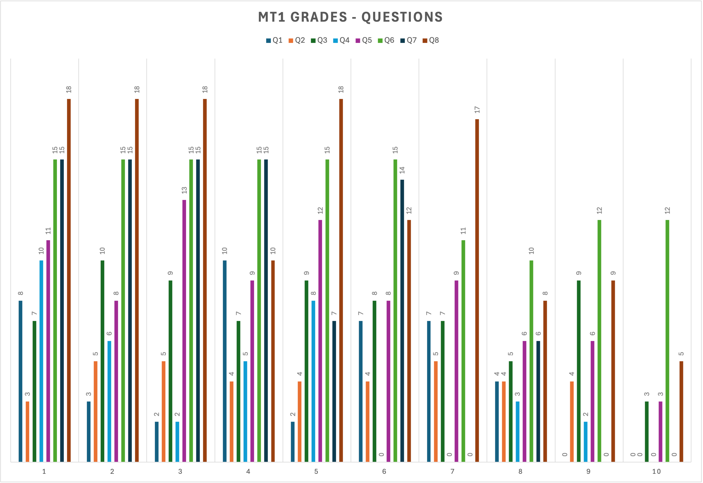

---

# Recap - Week 6

## Binary Search Trees

- **Property:** Left Subtree < Root < Right Subtree
- **Operations:** Search, Insert, Delete
- **Traversal:** In-order traversal yields sorted data

## The Problem

- **Best Case (Balanced):** Height ≈ log n → O(log n)
- **Worst Case (Skewed):** Height ≈ n → O(n)

**Challenge:** As we insert/delete, how do we prevent the tree from becoming a line?

---

# The Problem: Skewed BST


## When BST Becomes Inefficient

```
Insert Sequence: 8, 12, 14, 16, 19
```

**Result:**

- **Structure:** Looks like a linked list
- **Height:** n-1 (Max possible)
- **Performance:** O(n) for all operations

**We lose the primary benefit of binary search**

---

# The Solution - Self-Balancing Trees

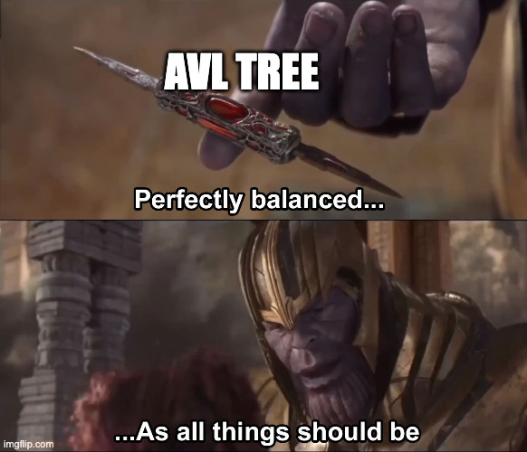

## Automated Balancing

**Key Idea:**

- Detect when the tree becomes too onesided
- Perform local adjustments (_rotations_) to fix it
- Ensure height stays close to **log n**

**Result:** Guaranteed **O(log n)** for Search, Insert, and Delete

---

# Introduction to AVL Trees

## Adelson-Velsky and Landis (1962)

- The **first** self-balancing binary search tree invented.
- Strictly height-balanced.

**Definition:**

> An AVL tree is a BST where for **every node**, the height difference between its left and right subtrees is **at most 1**.

**Balance Property:**
`| Height(Left) - Height(Right) | ≤ 1`

---

# AVL Tree Example

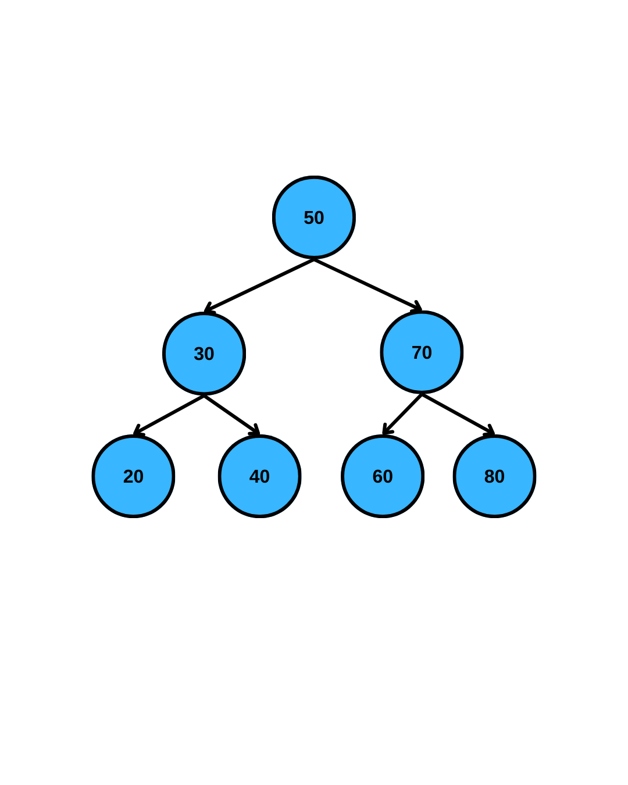

**Checking the Property:**

- **Leaves:** Height difference is 0.
- **Internal Nodes:**
  - 30: |1 - 1| = 0
  - 50: |2 - 2| = 0

**Verdict:** Valid AVL Tree.

---

# Not an AVL Tree

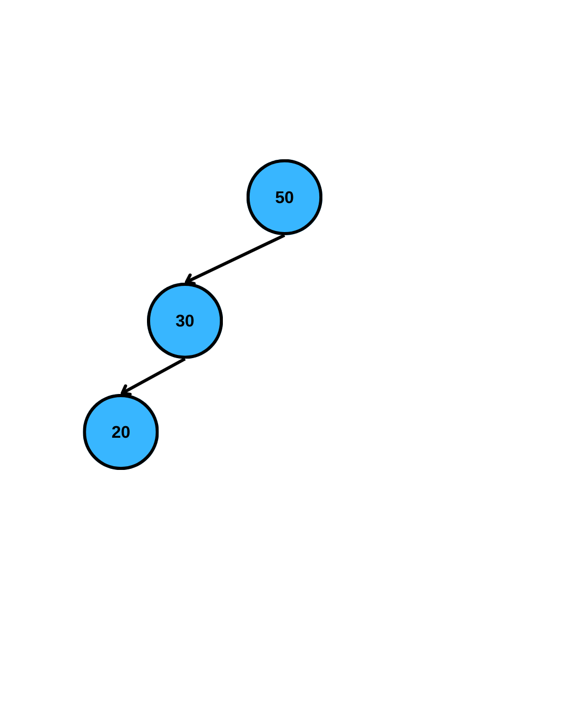

**Checking the Property:**

- **Node 20:** Balanced (0)
- **Node 30:** Balanced (1)
- **Node 50:** Left height = 2, Right height = 0.
  - Difference = 2 > 1

**Verdict:** Not an AVL Tree. Needs rebalancing

---

# Balance Factor (BF)

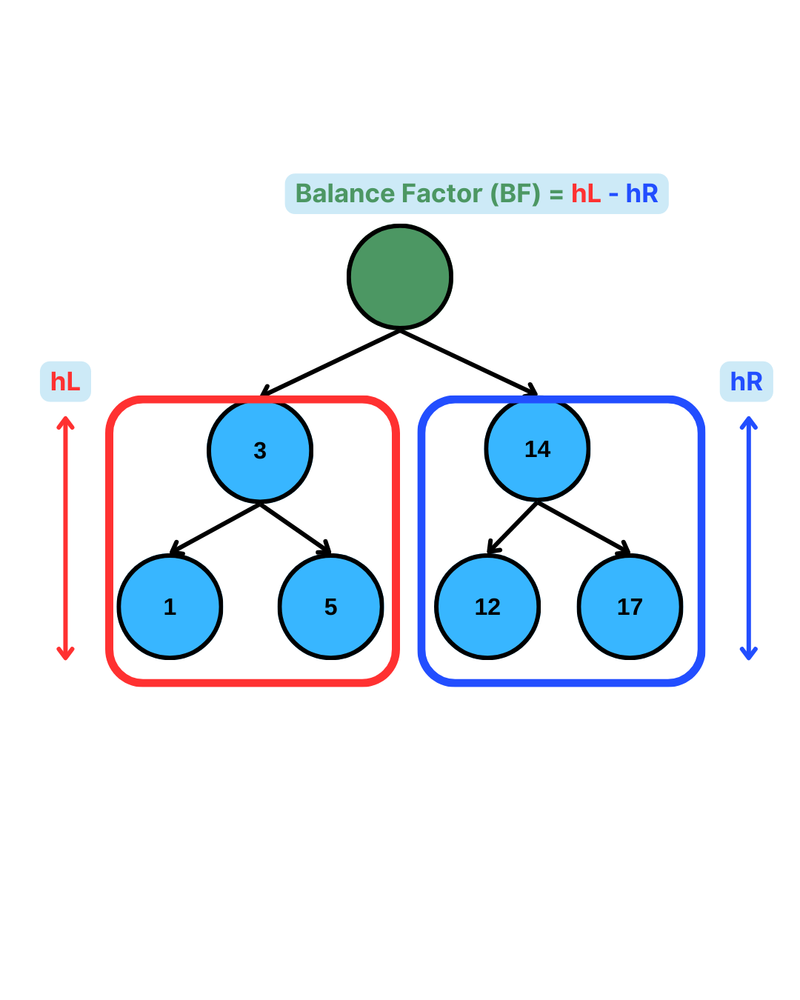

## The Metric for Balance

**Balance Factor (BF) = Height(Left Subtree) - Height(Right Subtree)**

## Interpretation

- **BF = 0:** Perfectly balanced.
- **BF = +1:** Left-heavy (but allowed)
- **BF = -1:** Right-heavy (but allowed)

## Violation

- **|BF| > 1:** The node is unbalanced

---

# Calculating Height and Balance Factor

```cpp
struct AVLNode {
    int data;
    AVLNode* left;
    AVLNode* right;
    int height;  // Cache height to avoid O(n) calculation

    AVLNode(int val) : data(val), left(nullptr),
                       right(nullptr), height(1) {}
};

// Utility to get height safely (handles nullptr)
int getHeight(AVLNode* node) {
    return (node == nullptr) ? 0 : node->height;
}

// Calculate Balance Factor
int getBalance(AVLNode* node) {
    if (node == nullptr) return 0;
    return getHeight(node->left) - getHeight(node->right);
}
```

---

# Balance Factor Examples

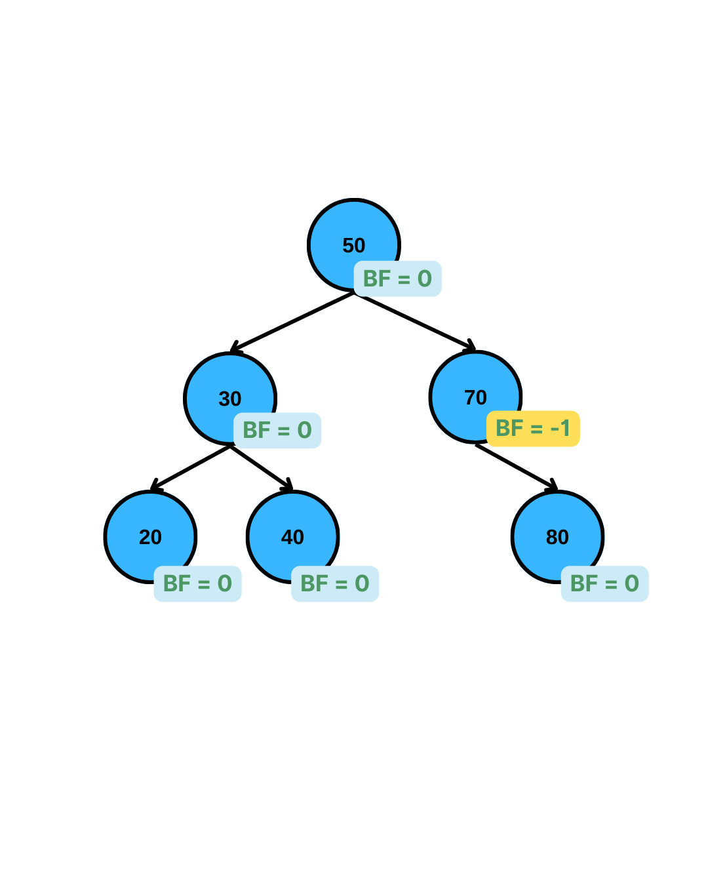

- **50:** Left H=2, Right H=2 → 0
- **70:** Left H=0, Right H=1 → -1
- **20:** Left H=0, Right H=0 → 0

**Note:** Heights are 1-based (leaf height = 1) or 0-based (leaf height = 0). Just be consistent. We usually assume height(null) = 0.

---

# Question - Balance Factors

### Calculate the Balance Factor for each node

### Is this an AVL tree?

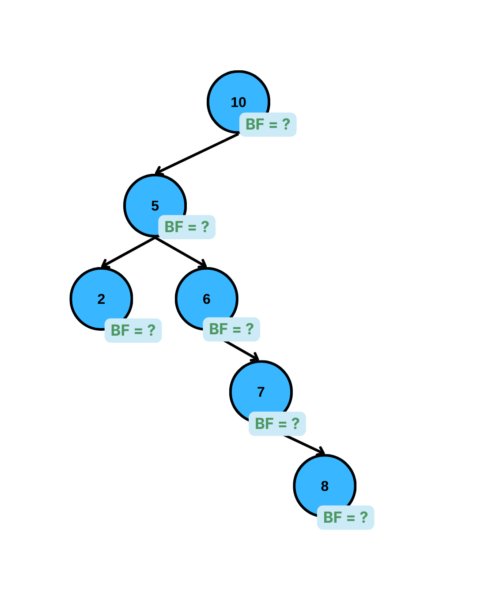

---

# Answer - Balance Factors

### Calculate the Balance Factor for each node

### Is this an AVL tree? No

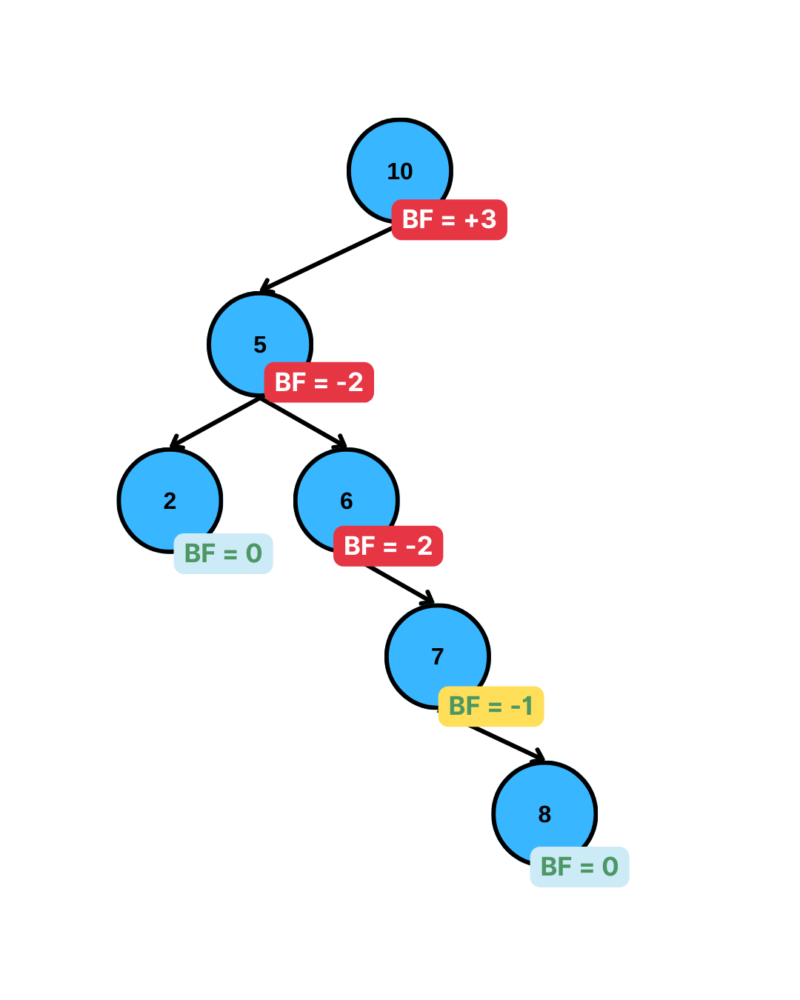

---

# Practice 

## Which of these insertion sequences result in a valid AVL tree (without rotations)?

<div class="columns">

<div>

### Sequence A: 50, 25, 75, 10, 30, 60, 80

### Sequence B: 50, 40, 30, 20, 10

### Sequence C: 100, 50, 150, 25, 75, 125, 175, 12

</div>

<div>

**Think about:**
- What does the tree look like after each insert?
- What is the BF at the root after all inserts?
- Does any node violate |BF| ≤ 1?

</div>

</div>

---

# Practice - Answers 

<div class="columns">

<div>

### ✅ Sequence A: 50, 25, 75, 10, 30, 60, 80
```
        50 (BF = 0)
       /  \
      25   75
     / \   / \
    10 30 60 80
```
Perfect binary tree! All BFs = 0

### ❌ Sequence B: 50, 40, 30, 20, 10
```
      50
     /
    40
   /
  30  ← BF(50) = +2 after this!
```
Left-skewed: Violates AVL after 3rd insert

</div>

<div>

### ✅ Sequence C: 100, 50, 150, 25, 75, 125, 175, 12
```
          100 (BF = +1)
         /    \
       50      150
      /  \     /  \
     25  75  125  175
    /
   12
```
- BF(25) = +1, BF(50) = +1, BF(100) = +1
- All valid! ✅

</div>


</div>

---

# Automated Fixes

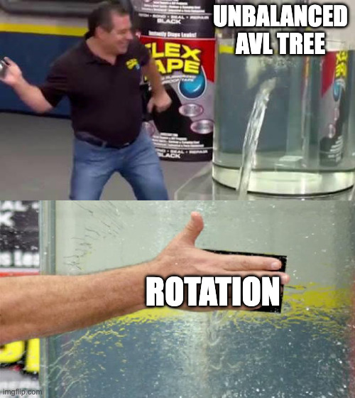

When an insertion or deletion creates a violation (|BF| > 1):

1.  **Identify** the deepest node that is unbalanced.
2.  **Determine** the type of imbalance (which subtrees are heavy?).
3.  **Perform Rotation(s)** to fix it locally.

## Goals

- Restore |BF| ≤ 1.
- **Crucial:** Preserve the BST ordering property (Left < Root < Right).
- Operations are O(1) pointer changes.

---

# Rotation

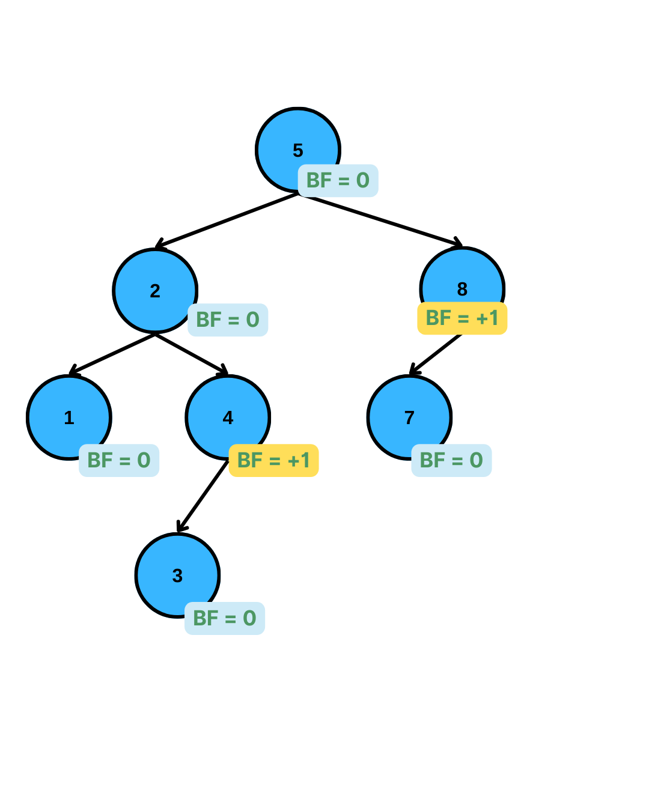

Suppose we have an AVL tree

---

# Rotation


We insert 6 to the AVL tree

- Like a normal BST insert
- AVL tree no more

---

# Rotation


Only nodes on the path from the inserted node to the root may have their subtrees altered

---

# Rotation


To fix it, we need to follow from the inserted node up towards the root

---

# Rotation

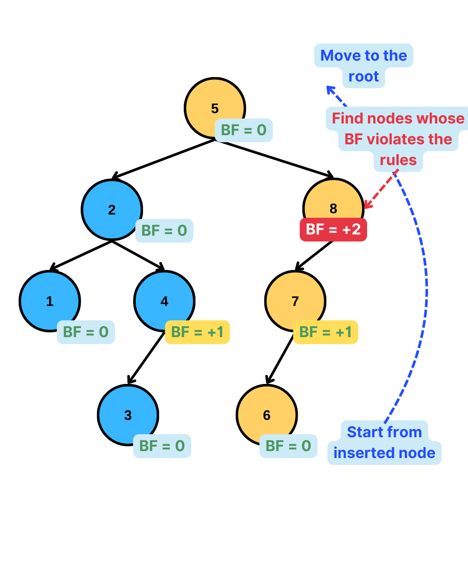

Find nodes whose new balance violates the AVL condition.
The tree must be re-organized to restore the balance.

---

# Rotation

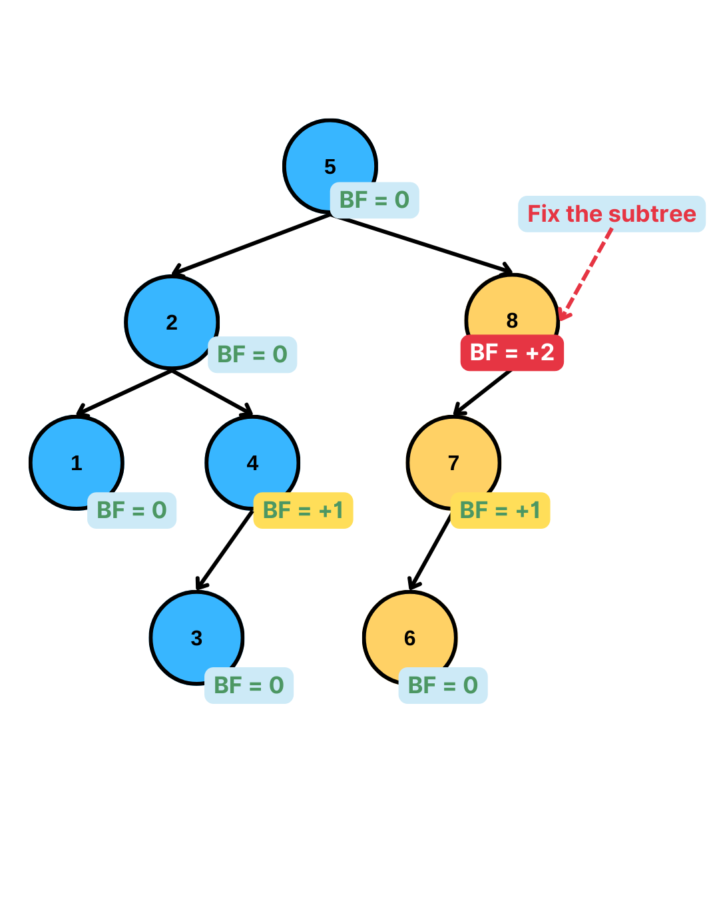

Fixing the subtree rooted at the deepest such node guarantees that the whole tree has the AVL property.

8 is the node whose balance is disrupted.

We should reorganize the tree rooted at 8.

---

# Rotation

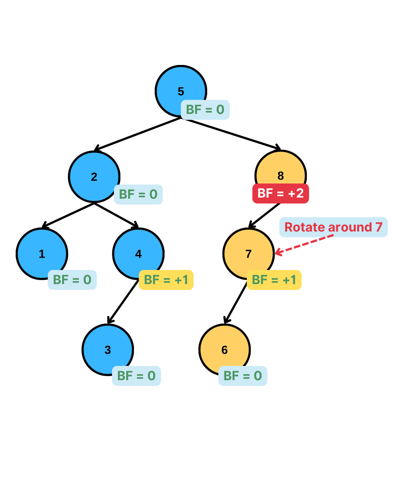

Rotate around 7

---

# Rotation

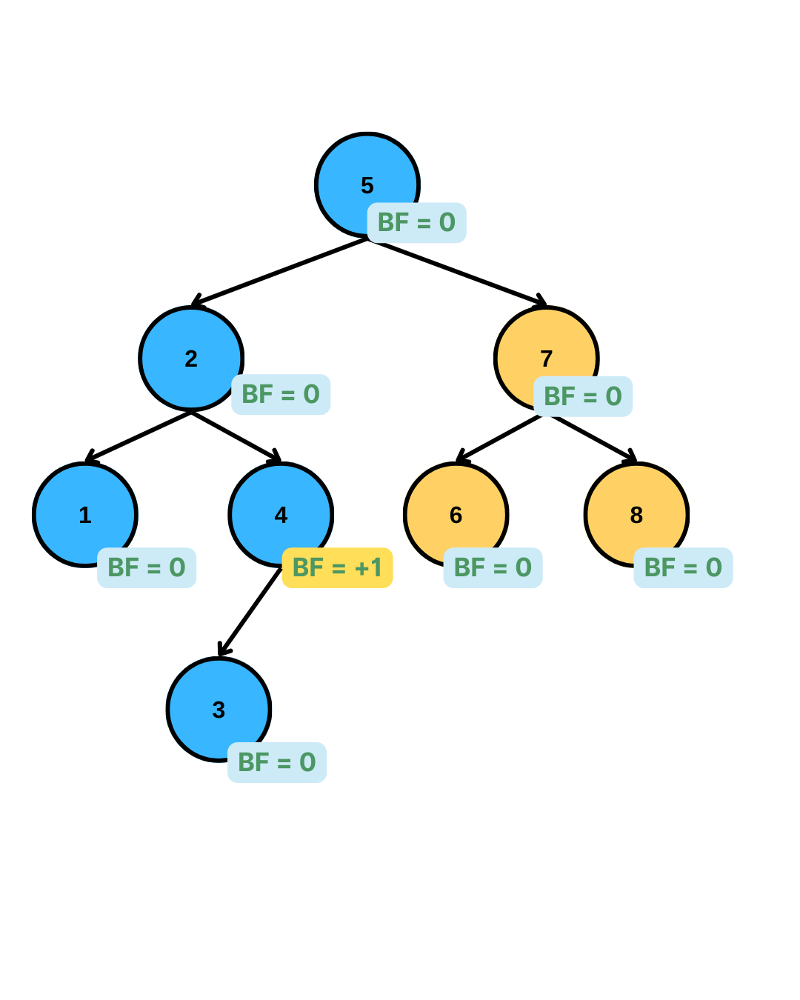

Now the tree is balanced 🫡

---

# Insertion

Since any node A has at most two children and a height imbalance requires that A’s two subtrees’ heights differ by two, there are four cases to consider:

1. **LL Case:** Left child, Left subtree.
2. **RR Case:** Right child, Right subtree.
3. **LR Case:** Left child, Right subtree.
4. **RL Case:** Right child, Left subtree.

---

# Four Types of Rotations

## 1. Single Rotations (Outer Cases)

- **LL Case:** Left child, Left subtree.
- **RR Case:** Right child, Right subtree.

## 2. Double Rotations (Inner Cases)

- **LR Case:** Left child, Right subtree.
- **RL Case:** Right child, Left subtree.

_The name tells you the path from the unbalanced node to the inserted node_

---

# 1. Left-Left (LL) Case → Right Rotation


## When to Use?

- Imbalance is at **X** (BF = +2).
- Left child **Y** is left-heavy (BF = +1 or 0).

## Right Rotation

- Visualize grabbing **Y** and pulling it up.
- **X** falls down to the right.

---

<!-- _footer: "" -->
<!-- _header: "" -->
<!-- _paginate: false -->
<style scoped>
p {text-align: center; font-size: 24px; font-style: italic}
h1 {text-align:center}
</style>

# Right Rotation - Example

<div class="columns">

<div>

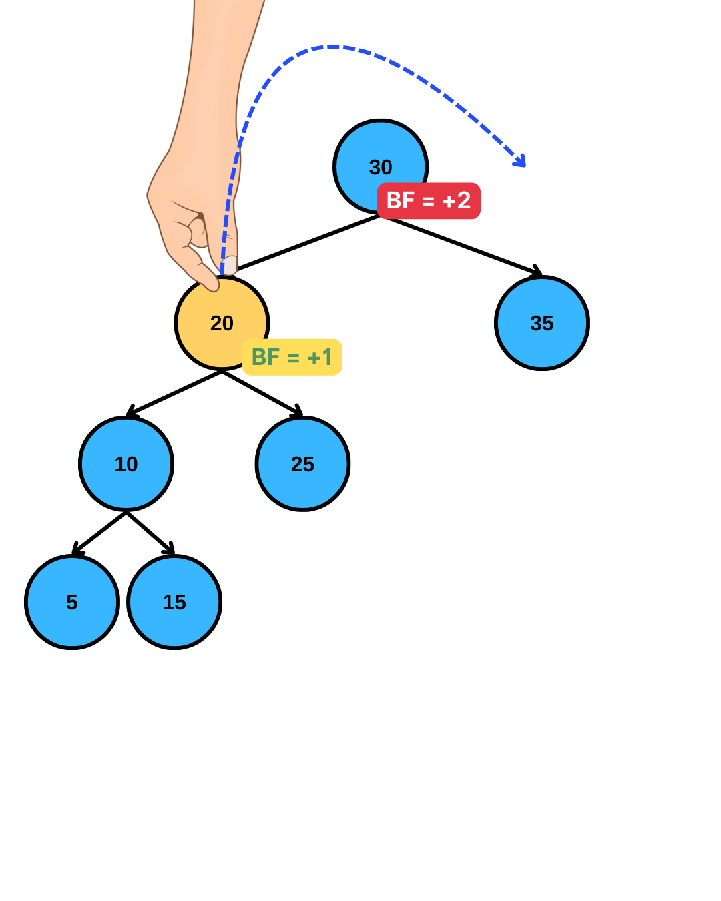

</div>

<div>

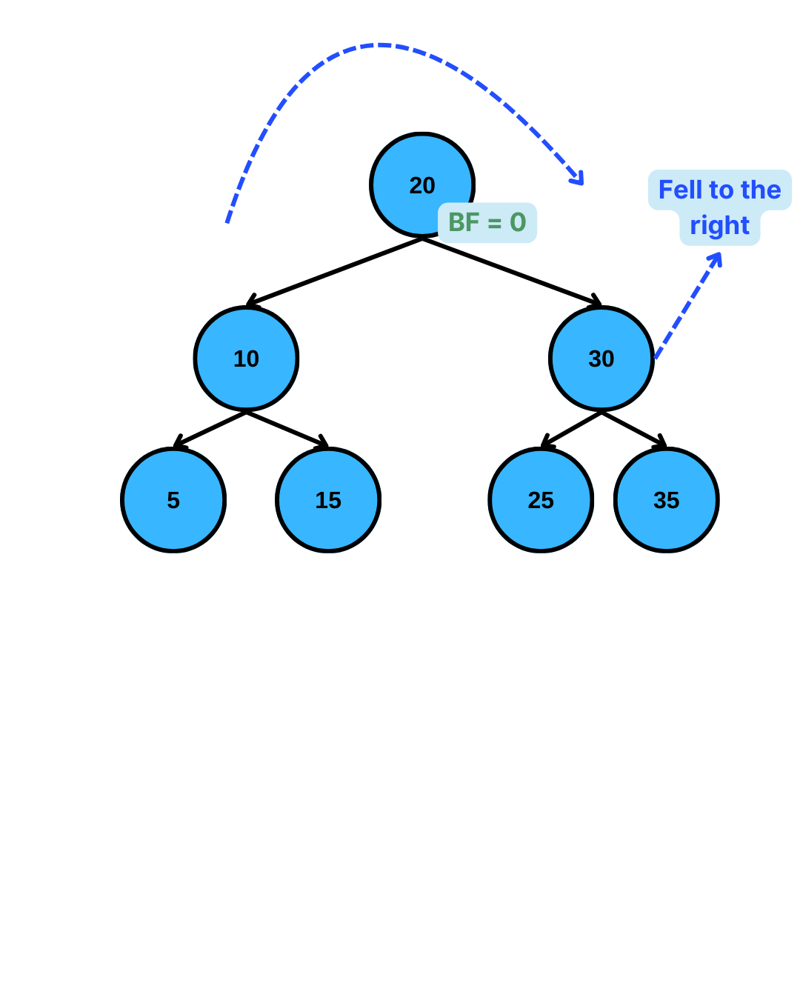

</div>

</div>

---

# Right Rotation - Code

```cpp
AVLNode* rightRotate(AVLNode* x) {
    AVLNode* y = x->left;      // y is the new root
    AVLNode* T2 = y->right;    // T2 is the subtree moving across

    // Perform rotation
    y->right = x;
    x->left = T2;

    // Update heights (x first, then y)
    x->height = 1 + max(getHeight(x->left), getHeight(x->right));
    y->height = 1 + max(getHeight(y->left), getHeight(y->right));

    return y;  // Return new root
}
```

**Time Complexity:** O(1)

---

# 2. Right-Right (RR) Case → Left Rotation

## When to Use?

- Imbalance is at **X** (BF = -2).
- Right child **Y** is right-heavy (BF = -1 or 0).

## The Fix: Left Rotation

- Visualize grabbing **Y** and pulling it up.
- **X** falls down to the left.

---

<!-- _footer: "" -->
<!-- _header: "" -->
<!-- _paginate: false -->
<style scoped>
p {text-align: center; font-size: 24px; font-style: italic}
h1 {text-align:center}
</style>

# Left Rotation - Example

<div class="columns">

<div>

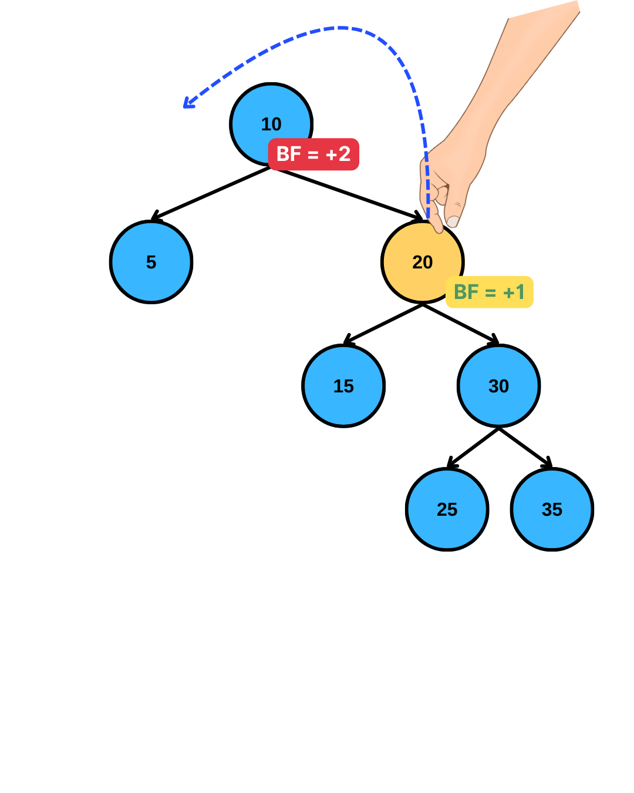

</div>

<div>

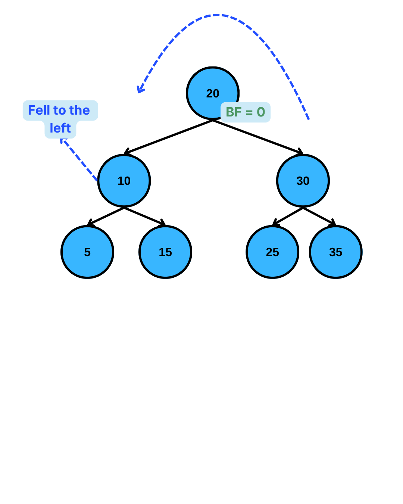

</div>

</div>

---

# Left Rotation - Code

```cpp
AVLNode* leftRotate(AVLNode* x) {
    AVLNode* y = x->right;     // y is the new root
    AVLNode* T2 = y->left;     // T2 is the subtree moving across

    // Perform rotation
    y->left = x;
    x->right = T2;

    // Update heights
    x->height = 1 + max(getHeight(x->left), getHeight(x->right));
    y->height = 1 + max(getHeight(y->left), getHeight(y->right));

    return y;  // Return new root
}
```

**Time Complexity:** O(1)

---

# 3. Left-Right (LR) Case - Double Rotation

## When to Use?

- Imbalance at **X** (BF = +2).
- Left child **Y** is **right-heavy** (BF = -1).
- "Zig-Zag" shape.

**Single rotation does not solve the problem**

## The Fix - Left-Right Rotation

1. **Left Rotate Y** to convert it into LL case.
2. **Right Rotate X** to balance the tree.

---

<!-- _footer: "" -->
<!-- _header: "" -->
<!-- _paginate: false -->
<style scoped>
p {text-align: center; font-size: 24px; font-style: italic}
h1 {text-align:center}
</style>

# Left-Right Rotation - Example

<div class="columns-3">

<div>

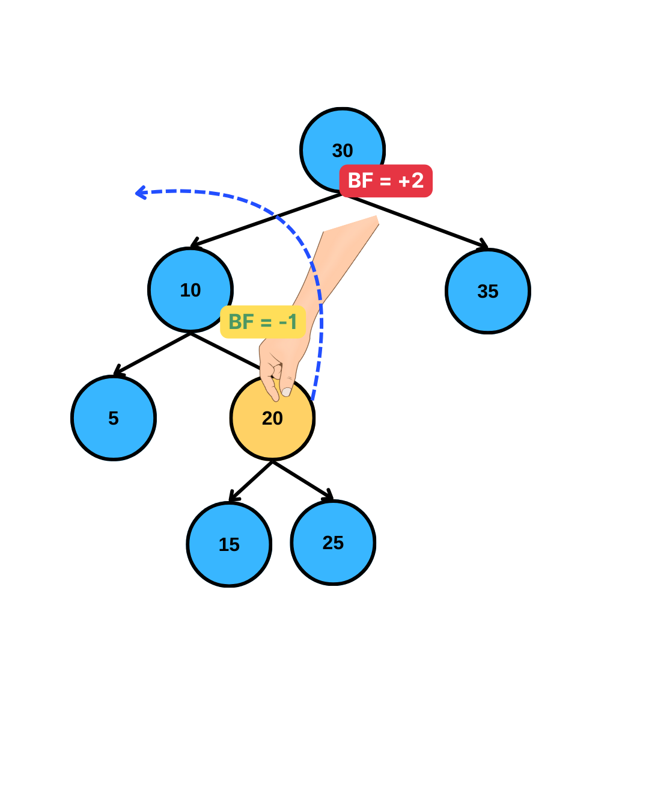

</div>

<div>

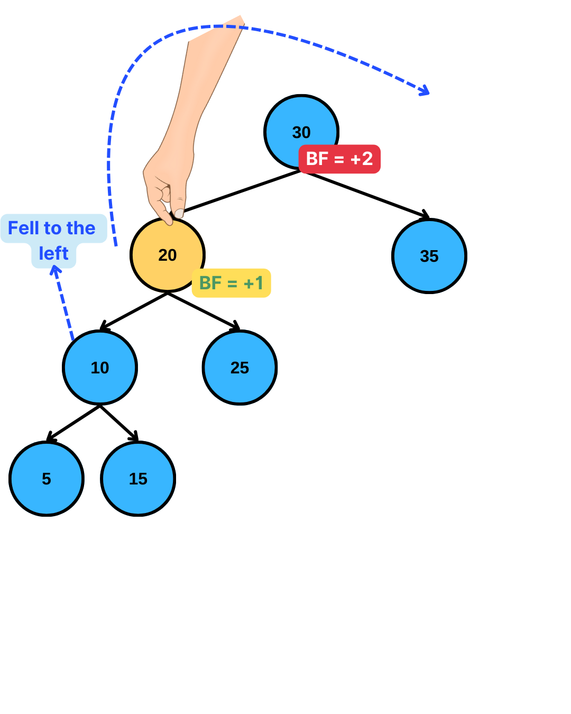

</div>

<div>


</div>

</div>

**Logic:** We simply lift the "grandchild" **20** all the way up to become the new root

---

# Left-Right Rotation - Code

```cpp
AVLNode* leftRightRotate(AVLNode* node) {
    // 1. Transform LR into LL
    node->left = leftRotate(node->left);

    // 2. Fix LL
    return rightRotate(node);
}
```

---

# 4. Right-Left (RL) Case - Double Rotation

## When to Use?

- Imbalance at **X** (BF = -2).
- Right child **Y** is **left-heavy** (BF = +1).
- "Zag-Zig" shape.

## The Fix: Right-Left Rotation

1. **Right Rotate Y** to convert it into RR case.
2. **Left Rotate X** to balance the tree.

---

# Right-Left Rotation - Practice

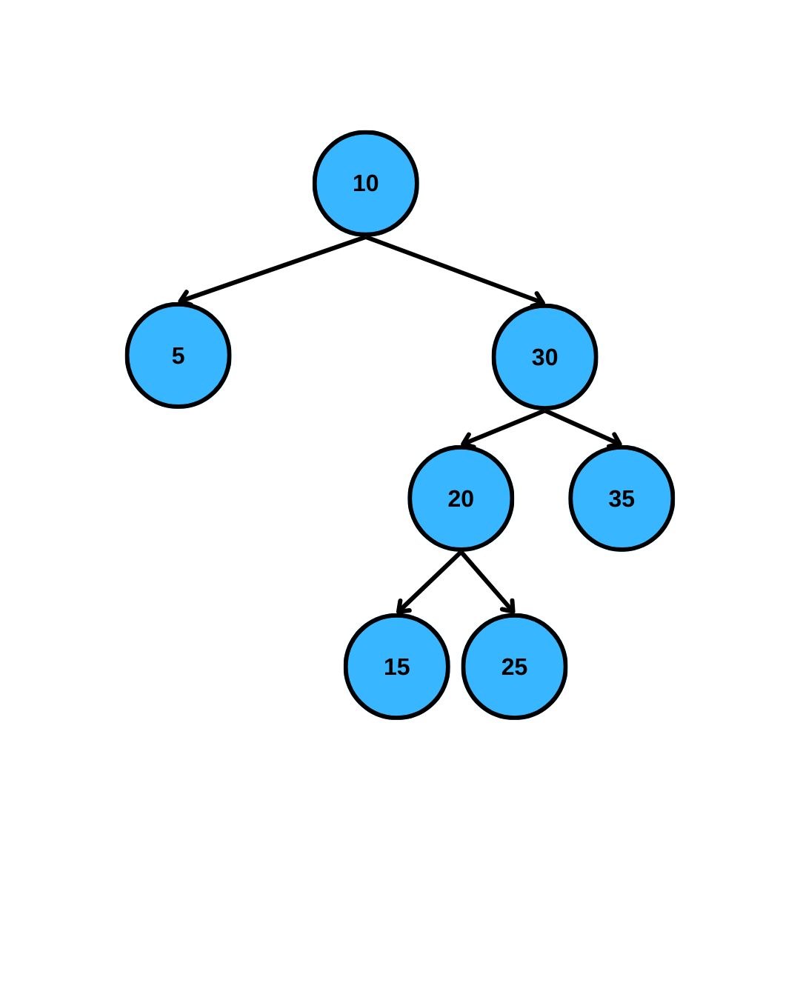

Let's do it together

---

# Right-Left Rotation - Code

```cpp
AVLNode* rightLeftRotate(AVLNode* node) {
    // 1. Transform RL into RR
    node->right = rightRotate(node->right);

    // 2. Fix RR
    return leftRotate(node);
}
```

**Summary:**

- Outer cases (LL, RR) → 1 Rotation.
- Inner cases (LR, RL) → 2 Rotations.

---

# Rotation Decision Table

| Balance Factor (Root) | Child's Balance Factor | Case   | Rotation(s)               |
| --------------------- | ---------------------- | ------ | ------------------------- |
| **+2** (Left Heavy)   | **≥ 0** (Left Heavy)   | **LL** | Right(Root)               |
| **+2** (Left Heavy)   | **< 0** (Right Heavy)  | **LR** | Left(Child) → Right(Root) |
| **-2** (Right Heavy)  | **≤ 0** (Right Heavy)  | **RR** | Left(Root)                |
| **-2** (Right Heavy)  | **> 0** (Left Heavy)   | **RL** | Right(Child) → Left(Root) |

**Key:** Always check the node where violation happens + its heavy child.

---

# Practice - Identify the Case

### For each scenario, identify: LL, RR, LR, or RL?

<div class="columns">

<div>

### Scenario 1:
- Root BF = +2
- Left Child BF = +1

### Scenario 2:
- Root BF = -2
- Right Child BF = +1

### Scenario 3:
- Root BF = +2
- Left Child BF = -1

</div>

<div>

### Scenario 4:
- Root BF = -2
- Right Child BF = -1

### Scenario 5:
- Root BF = -2
- Right Child BF = 0

### Scenario 6:
- Root BF = +2
- Left Child BF = 0

</div>

</div>

---

# Practice - Identify the Case - Answers

| Scenario | Root BF | Child BF | Case   | Rotation(s)       |
| -------- | ------- | -------- | ------ | ----------------- |
| 1        | +2      | +1       | **LL** | Right(Root)       |
| 2        | -2      | +1       | **RL** | Right → Left      |
| 3        | +2      | -1       | **LR** | Left → Right      |
| 4        | -2      | -1       | **RR** | Left(Root)        |
| 5        | -2      | 0        | **RR** | Left(Root)        |
| 6        | +2      | 0        | **LL** | Right(Root)       |

**Tip:** The case name tells you the path from unbalanced node to the heavy subtree!

---

# AVL Insertion Logic

### A Recursive Process

1. **Standard BST Insert:** Go down, insert leaf.
2. **Unwind Recursion:** Move back up to root.
3. **Update Height:** For current node.
4. **Check Balance:** Calculate BF.
5. **Rebalance:** If |BF| > 1, perform rotation.
6. **Return:** The (potentially new) root of this subtree.

**Why is this efficient?**
Rotations are local. Height is O(log n), so we do at most O(log n) checks.

---

# AVL Insert - Implementation

```cpp
AVLNode* insert(AVLNode* node, int val) {
    // 1. Standard BST Insert
    if (node == nullptr) return new AVLNode(val);

    if (val < node->data)
        node->left = insert(node->left, val);
    else if (val > node->data)
        node->right = insert(node->right, val);
    else
        return node; // No duplicates

    // 2. Update Height
    node->height = 1 + max(getHeight(node->left), getHeight(node->right));

    // 3. Get Balance Factor
    int balance = getBalance(node);

    // 4. Check & Fix Imbalance (Next Slide) ->
    return rebalance(node, balance, val);
}
```

---

# Handling the 4 Cases

```cpp
AVLNode* rebalance(AVLNode* node, int balance, int val) {
    // LL Case
    if (balance > 1 && val < node->left->data)
        return rightRotate(node);

    // RR Case
    if (balance < -1 && val > node->right->data)
        return leftRotate(node);

    // LR Case
    if (balance > 1 && val > node->left->data) {
        node->left = leftRotate(node->left);
        return rightRotate(node);
    }

    // RL Case
    if (balance < -1 && val < node->right->data) {
        node->right = rightRotate(node->right);
        return leftRotate(node);
    }

    return node; // Balanced
}
```

---

# AVL Insertion Trace - Example 1

**Sequence: 10, 20, 30**

What happens?

---

# AVL Insertion Trace - Example 1

1. Insert 10.
2. Insert 20. Tree is skewing right.
3. Insert 30.
   - Node 10 has BF = -2.
   - Child 20 has BF = -1.
   - **Case:** RR.
   - **Action:** Left Rotate(10).

**Result:** 20 becomes root, 10 left, 30 right. Perfectly balanced.

---

# AVL Insertion Trace - Example 2

**Sequence: 30, 20, 25**

What happens?

---

# AVL Insertion Trace - Example 2

1. Insert 30.
2. Insert 20 (Left of 30).
3. Insert 25 (Right of 20).
   - Node 30 has BF = +2.
   - Child 20 has BF = -1.
   - **Case:** LR.
   - **Action:** Left Rotate(20), then Right Rotate(30).

**Result:** 25 becomes root, 20 left, 30 right.

---

# Practice - Complete AVL Build

## Build an AVL tree by inserting: 50, 30, 70, 20, 40, 60, 80, 10, 25, 35, 45, 5

### For each step:
1. Draw the tree after standard BST insert
2. Check if any node is unbalanced
3. If unbalanced, identify the case and perform rotation
4. Draw the final balanced tree

**Work through this (3 minutes)**

---

# Practice - Complete AVL Build - Solution (Part 1)

### Insert 50, 30, 70, 20, 40, 60, 80:

```
              50 (BF = 0)
            /    \
          30      70
         /  \    /  \
        20  40  60  80
```

All nodes balanced! ✅ This is a perfect binary tree.

---

# Practice - Complete AVL Build - Solution (Part 2)

<div class="columns">

<div>

### Insert 10:
```
              50 (BF = +1)
            /    \
          30      70
         /  \    /  \
        20  40  60  80
       /
      10
```
- BF(20) = +1 ✅
- BF(30) = +1 ✅
- BF(50) = +1 ✅

Still balanced!

</div>

<div>

### Insert 25:
```
              50 (BF = +1)
            /    \
          30      70
         /  \    /  \
        20  40  60  80
       /  \
      10  25
```
- BF(20) = 0 ✅
- All other BFs unchanged

Still balanced!

</div>

</div>

---

# Practice - Complete AVL Build - Solution (Part 3)

<div class="columns">

<div>

### Insert 35:
```
              50
            /    \
          30      70
         /  \    /  \
        20  40  60  80
       / \  /
      10 25 35
```
- BF(40) = +1 ✅
- BF(30) = 0 ✅

Still balanced!

</div>

<div>

### Insert 45:
```
              50
            /    \
          30      70
         /  \    /  \
        20  40  60  80
       / \  / \
      10 25 35 45
```
- BF(40) = 0 ✅
- All nodes balanced!

Still balanced!

</div>

</div>

---

# Practice - Complete AVL Build - Solution (Part 4)

### Insert 5:

<div class="columns">

<div>

### After BST Insert:
```
              50
            /    \
          30      70
         /  \    /  \
        20  40  60  80
       / \  / \
      10 25 35 45
     /
    5
```

</div>

<div>

### Check Balance:
- BF(10) = +1 ✅
- BF(20) = +2 ❌ **UNBALANCED!**

**Child BF(10) = +1** → LL Case!

**Action:** Right Rotate(20)

</div>

</div>

---

# Practice - Complete AVL Build - Final Result

### After Right Rotate(20):

```
              50
            /    \
          30      70
         /  \    /  \
        10  40  60  80
       / \  / \
      5  20 35 45
          \
          25
```

- BF(10) = 0 ✅
- BF(30) = +1 ✅
- BF(50) = +1 ✅

**Final tree is balanced!** 

---

# Practice

### Insert sequence: 3, 2, 1, 4, 5, 6, 7, 16, 15, 14, 13, 12, 11, 10, 8, 9


**Task:** Build the AVL tree step by step, noting each rotation

**Hint:** You'll need MANY rotations throughout the process

---

# Practice - Challenge Problem - Answer (Part 1)

| Step | Insert | Action                        | Tree State            |
| ---- | ------ | ----------------------------- | --------------------- |
| 1    | 3      | Insert                        | Root = 3              |
| 2    | 2      | Insert                        | 2 left of 3           |
| 3    | 1      | LL → Right Rotate(3)          | Root = 2              |
| 4    | 4      | Insert                        | 4 right of 3          |
| 5    | 5      | RR → Left Rotate(3)           | 4 becomes right child |
| 6    | 6      | RR → Left Rotate(4)           | 4 → 5 subtree         |
| 7    | 7      | RR → Left Rotate(2)           | Root = 4              |

### After inserting 1-7:
```
        4
       / \
      2   6
     / \ / \
    1  3 5  7
```

---

# Practice - Challenge Problem - Answer (Part 2)

| Step | Insert | Action                        | Rotation At           |
| ---- | ------ | ----------------------------- | --------------------- |
| 8    | 16     | Insert                        | No rotation           |
| 9    | 15     | RL → Right(16), Left(7)       | Node 7                |
| 10   | 14     | LL → Right Rotate(15)         | Node 15               |
| 11   | 13     | LL → Right Rotate(14)         | Node 14               |
| 12   | 12     | LL → Right Rotate(4)          | Root changes!         |
| 13   | 11     | LL → Right Rotate(13)         | Node 13               |
| 14   | 10     | LL → Right Rotate(12)         | Node 12               |
| 15   | 8      | Insert                        | No rotation           |
| 16   | 9      | LR → Left(8), Right(10)       | Node 10               |

**Total Rotations: 11** (vs 0 in regular BST which would have height 16)

---

# Practice - Challenge Problem - Final Tree

### Final AVL Tree (16 nodes, height = 4):

```
                8
            /       \
          4          12
        /   \       /   \
       2     6    10     14
      / \   / \   / \   /  \
     1   3 5   7 9  11 13   15
                             \
                              16
```

**Comparison:**
- Regular BST height: **15**
- AVL Tree height: **4**
- Worst-case search: **4 comparisons** instead of 15

**This is the power of self-balancing trees**

---

# AVL Deletion Algorithm

1. **Standard BST Delete:**
   - Leaf, One Child, or Two Children (successor).
2. **Unwind Recursion:** Move back up
3. **Update Height & Balance:** Same as insert
4. **Rebalance:**
   - **Critical Diff:** Deletion may require rotations at **multiple levels**
   - We must continue checking all the way to the root

---

# AVL Deletion - Code Snippet

```cpp
AVLNode* deleteNode(AVLNode* root, int val) {
    // 1. Standard BST Delete (Recursive)
    if (!root) return root;
    if (val < root->data) root->left = deleteNode(root->left, val);
    else if (val > root->data) root->right = deleteNode(root->right, val);
    else {
        // Node Found: Handle 3 cases
        if (!root->left || !root->right) {
            AVLNode* temp = root->left ? root->left : root->right;
            if (!temp) { temp = root; root = nullptr; }
            else *root = *temp; // Copy child
            delete temp;
        } else {
            // 2 Children: Get successor
            AVLNode* temp = findMin(root->right);
            root->data = temp->data;
            root->right = deleteNode(root->right, temp->data);
        }
    }
    if (!root) return root;

    // 2. Update Height
    root->height = 1 + max(getHeight(root->left), getHeight(root->right));
```

---

# AVL Deletion - Code Snippet

```cpp
    // 3. Rebalance (Check Child's BF for case)
    int balance = getBalance(root);

    // Left Heavy
    if (balance > 1) {
        if (getBalance(root->left) >= 0) return rightRotate(root); // LL
        else { root->left = leftRotate(root->left); return rightRotate(root); } // LR
    }
    // Right Heavy
    if (balance < -1) {
        if (getBalance(root->right) <= 0) return leftRotate(root); // RR
        else { root->right = rightRotate(root->right); return leftRotate(root); } // RL
    }
    return root;
}
```

---

# Practice - AVL Deletion

```
              50
            /    \
          30      70
         /  \    /  \
        20  40  60  80
       /        \     \
      10        65    90
```

### Delete nodes in this order: 10, 20, 30

### For each deletion, show the tree and any rotations needed.

---

# Practice - AVL Deletion - Step 1

### Delete 10 (leaf node):

<div class="columns">

<div>

### After deleting 10:
```
              50
            /    \
          30      70
         /  \    /  \
        20  40  60  80
                \     \
                65    90
```

</div>

<div>

### Check Balance:
- BF(20) = 0 
- BF(30) = 0   
- BF(50) = 0 

**No rotation needed!**

</div>

</div>

---

# Practice - AVL Deletion - Step 2

### Delete 20 (leaf node):

<div class="columns">

<div>

### After deleting 20:
```
              50
            /    \
          30      70
            \    /  \
            40  60  80
                \     \
                65    90
```

</div>

<div>

### Check Balance:
- BF(30) = -1 
- BF(50) = 0 

**Still balanced!**

</div>

</div>

---

# Practice - AVL Deletion - Step 3

### Delete 30 (node with one child):

<div class="columns">

<div>

### After BST delete (replace with 40):
```
              50
            /    \
          40      70
                 /  \
                60  80
                \     \
                65    90
```

</div>

<div>

### Check Balance:
- BF(40) = 0 
- BF(50) = -2 **UNBALANCED!**

**Right child BF(70) = 0** → RR Case!

**Action:** Left Rotate(50)

</div>

</div>

---

# Practice - AVL Deletion - Final Result

### After Left Rotate(50):

```
              70
            /    \
          50      80
         /  \       \
        40  60      90
              \
              65
```

### Verify Balance:
- BF(40) = 0, BF(60) = -1, BF(50) = 0, BF(80) = -1, BF(70) = +1

**All balanced**

---

# Comparison: AVL vs Regular BST

| Feature          | Regular BST   | AVL Tree            |
| ---------------- | ------------- | ------------------- |
| **Worst Search** | O(n)          | O(log n)            |
| **Worst Insert** | O(n)          | O(log n)            |
| **Worst Delete** | O(n)          | O(log n)            |
| **Structure**    | Can be skewed | Always balanced     |
| **Overhead**     | None          | Store height/BF     |
| **Complexity**   | Simple        | Complex (Rotations) |

**Verdict:** AVL gives strict guarantees at the cost of implementation complexity.

---

# Space Overhead

```cpp
struct BSTNode {
    int data;        // 4 bytes
    BSTNode* left;   // 8 bytes
    BSTNode* right;  // 8 bytes
}; // Total: 20 bytes
```

```cpp
struct AVLNode {
    int data;        // 4 bytes
    AVLNode* left;   // 8 bytes
    AVLNode* right;  // 8 bytes
    int height;      // 4 bytes <-- Overhead
}; // Total: 24 bytes
```

**Trade-off:** We pay ~20% more memory per node to gain exponential speedup in worst-case scenarios.

---

# Why is Height O(log n)?

The worst-case AVL tree (minimum nodes for height $h$) occurs when every node has subtrees differing by exactly 1 in height.

$$N_h = N_{h-1} + N_{h-2} + 1$$

This recurrence relation is very close to the **Fibonacci sequence**.

- **Growth:** The number of nodes grows exponentially with height.
- **Inverse:** Therefore, height grows logarithmically with the number of nodes.
- **Exact Bound:** $Height < 1.44 \log_2(n+2)$

**Example:**
For 1 million nodes, a regular BST could have height 1,000,000. An AVL tree has height at most ~28.

---

# Other Self-Balancing Trees

AVL is not the only self-balancing BST. Other popular ones include:

- **Red-Black Trees** (1972) - Used in `std::map`, `TreeMap`
- **B-Trees** (1970) - Used in databases and file systems
- **Splay Trees** (1985) - Self-adjusting, no extra storage
- **Treaps** (1989) - Randomized BST with heap property

We'll briefly look at **Red-Black Trees** since they're widely used in standard libraries.

---

<style scoped>
.red { color: #D22B2B }
</style>

# Red-Black Trees - Introduction

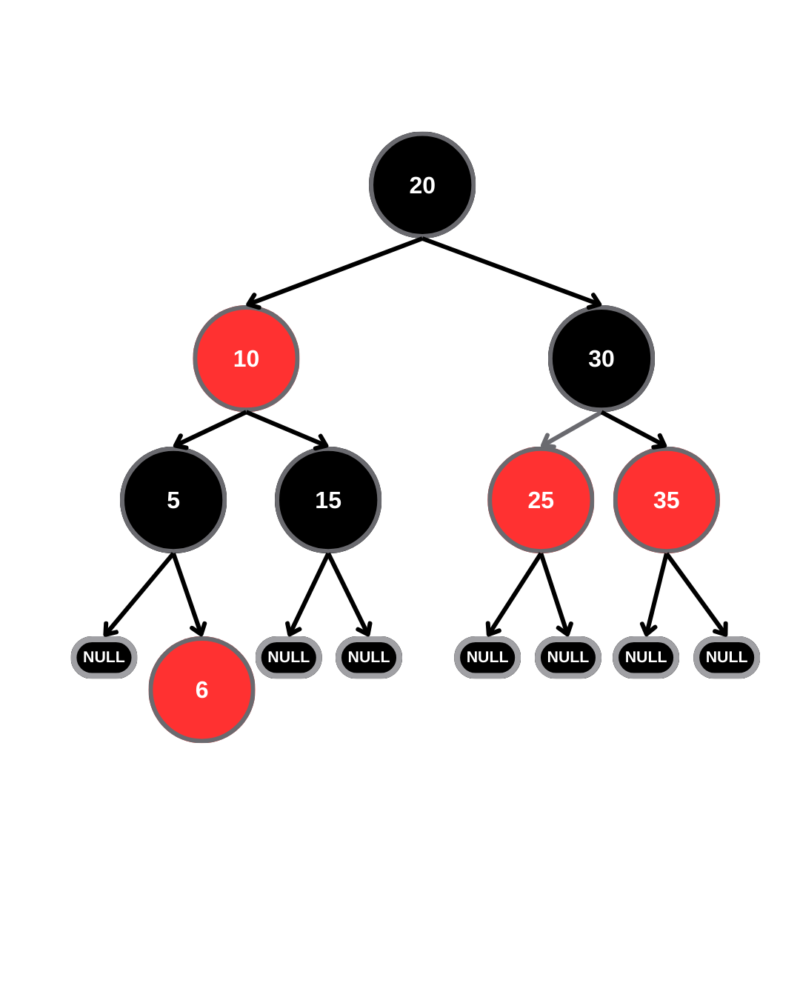

### What is it?

A BST where each node has a **color** (<span class="red">Red</span> or black) and must follow specific rules to stay balanced.

### Key Idea

Instead of tracking height like AVL, we use **color constraints** to ensure the tree remains approximately balanced.

- Maintain a slightly looser height invariant than AVL trees. \* Because the height of the <span class="red">red</span>-black tree is slightly larger, lookup will be slower in a <span class="red">red</span>-black tree.
- However, the looser height invariant makes insertion and deletion faster.

**Guarantee:** Longest path is at most **2x** the shortest path.

---

<style scoped>
.red { color: #D22B2B }
</style>

# Red-Black Tree Properties


Every Red-Black tree must satisfy these 5 rules:

1. Every node is either **<span class="red">Red</span>** or **Black**
2. The **root** is always **Black**
3. All **NULL leaves** are considered **Black**
4. **<span class="red">Red</span>** **nodes** cannot have **<span class="red">Red</span>** **children** (no two reds in a row)
5. Every path from a node to its NULL descendants has the **same number of Black nodes**
6. New nodes are inserted as **<span class="red">red</span>** node

These rules guarantee the tree height is at most **2 × log(n+1)**

---

# AVL vs Red-Black Trees

Both are self-balancing O(log n) trees, but they have different trade-offs:

1.  **Strictness:**

    - **AVL:** Very strict ($|BF| \le 1$). Tree is more compressed.
    - **Red-Black:** Looser balance. Tree can be slightly taller.

2.  **Performance:**

    - **AVL:** Faster **Lookups** (shorter height).
    - **Red-Black:** Faster **Insert/Delete** (fewer rotations needed).

3.  **Adoption:**
    - **AVL:** Read-heavy systems (Databases).
    - **Red-Black:** General purpose libraries (C++ `std::map`, Java `TreeMap`).

---

# When to Use AVL Trees?

### Ideal

- **Read-Heavy Workloads:**
  - You search much more often than you insert/delete.
  - AVL trees are more strictly balanced than Red-Black trees, making lookups slightly faster.
- **Databases:** Indexing records where fast retrieval is critical.
- **Dictionaries:** Spell checkers, symbol tables.

### Less Ideal

- **Write-Heavy Workloads:**
  - Frequent insertions/deletions trigger many rotations.
  - Red-Black trees might be preferred here (fewer rotations).

---

# Practice - Real World Scenario

### You're designing a phone contact list with these requirements:

- ~1000 contacts
- Search by name 
- Add new contacts 
- Delete contacts

### Questions:
1. Would you use a regular BST or AVL tree? Why?
2. What's the worst-case search time with each?
3. What's the trade-off you're making?

---

# Answer

<div class="columns">

<div>

### Recommendation: **AVL Tree**

**Why?**
- Read-heavy workload (searches >> writes)
- Need guaranteed fast lookups
- Small overhead for ~1000 nodes

</div>

<div>

### Comparison:

| Metric       | BST (Worst) | AVL       |
| ------------ | ----------- | --------- |
| Search       | O(1000)     | O(10)     |
| Insert       | O(1000)     | O(10)     |
| Memory/node  | 20 bytes    | 24 bytes  |
| Total memory | 20 KB       | 24 KB     |

**4 KB extra memory for 100x faster worst-case!**

</div>

</div>

---

# Summary - Key Takeaways

1.  **Self-Balancing:** AVL trees automatically keep height at O(log n).
2.  **Balance Factor:** `Height(L) - Height(R)` must be {-1, 0, 1}.
3.  **Rotations:** The mechanism to fix imbalance.
    - Single (LL, RR)
    - Double (LR, RL)
4.  **Performance:** Guaranteed O(log n) for all basic operations.

---

# Thank You!

## Contact Information

- **Email:** ekrem.cetinkaya@yildiz.edu.tr
- **Office Hours:** Tuesday 14:00-16:00 - Room F-B21
- **Course Repo:** [GitHub Link](https://github.com/ekremcet/yzm2031-data-structures-and-algorithms)

## Next Class

- **Topic:** Heap Data Structure (Priority Queues)
- **Reading:** Weiss Ch.6
