# YZM2031

## Data Structures and Algorithms

### Week 8: Priority Queues (Heaps)

**Instructor:** Ekrem Çetinkaya
**Date:** 03.12.2025

---

# Recap

## AVL Trees

- **Self-Balancing:** Guarantee O(log n) height
- **Balance Factor:** `Height(Left) - Height(Right)` must be {-1, 0, 1}
- **Rotations:** Mechanism to restore balance (LL, RR, LR, RL)

---

# Priority Queues (Heaps)


- **Some tasks can be more important than others.**

  - They need to be handled **more efficiently** (processed sooner).

- **To give priority among the stored objects (data, task, etc.):**
  - A standard Queue (FIFO) treats everyone equally.
  - **We need a special kind of queue.** -> **Priority Queue**.

---

# Example - Emergency Room (ER)

## The Triage Nurse

- Patients arrive at random times.
- **Patient A:** Broken finger (Arrived 09:00)
- **Patient B:** Cardiac arrest (Arrived 09:05)
- **Patient C:** Flu symptoms (Arrived 08:30)

## Who goes in first?

- If FIFO (Queue): Patient C (Flu) -> Patient A (Finger) -> Patient B (Cardiac)
- If Priority Queue: **Patient B (Critical)** -> Patient A (Major) -> Patient C (Minor)

**We need a data structure that allows us to skip the line based on urgency.**

---

# Priority Queue ADT


A collection of items where each item has a **priority**.
Elements are processed based on priority, not arrival time.

## Operations

1.  **Insert(x):** Add item x with a priority.
2.  **deleteMin() / deleteMax():** Remove and return the item with the highest priority (min or max value depending on definition).
3.  **findMin() / findMax():** Peek at the highest priority item.

## Applications

- Operating System process scheduling
- Dijkstra's Shortest Path Algorithm
- Huffman Coding (Compression)
- Event-driven simulations

---

# Priority Queues vs. Heaps

You will often hear **"Priority Queue"** and **"Heap"** used interchangeably, but there is a distinction:

- **Priority Queue (The ADT):** Defines **what** the data structure does.

  - _Interface:_ `insert(item)`, `deleteMin()`, `findMin()`.
  - _Behavior:_ Elements are popped based on priority.

- **Heap (The Data Structure):** Defines **how** it is implemented.

  - _Implementation:_ A complete binary tree stored in an array satisfying the heap property.

- **Priority Queue** is like the concept of a "Stack" (LIFO).
- **Heap** is like the "Array" or "Linked List" used to build that Stack.
- _Note: We almost always use Heaps to build Priority Queues because they are the most efficient implementation_

---

# Implementations of Priority Queue

| Structure                | Insert   | Delete Min | Find Min |
| :----------------------- | :------- | :--------- | :------- |
| **Unsorted Array**       | O(1)     | O(n)       | O(n)     |
| **Sorted Array**         | O(n)     | O(1)       | O(1)     |
| **Unsorted Linked List** | O(1)     | O(n)       | O(n)     |
| **Sorted Linked List**   | O(n)     | O(1)       | O(1)     |
| **Binary Search Tree**   | O(log n) | O(log n)   | O(log n) |

Binary search trees look OK but are actually an overkill

- We do not need find or findMax operations
- We do not need the pointers

A simplified binary tree called a **HEAP** is sufficient for implementing priority queues.

---

# Binary Heap


A **Binary Heap** is a specialized tree-based data structure that satisfies the **Heap Property**.

It is the standard implementation of a **Priority Queue**.

Even though it is a _Tree_, we usually store it in an **Array**, not with pointers.

To call a tree a **Heap**, it must strictly follow these two properties:

1.  **Structure Property:** The tree must be a **Complete Binary Tree**
2.  **Heap-Order Property:** Every parent must have a specific relationship with its children (Min or Max).

---

# Why do we use Heaps?

## Specialized vs. General

A **Binary Search Tree (BST)** is a general tool for searching $O(\log N)$.
A **Heap** is a specialized tool for accessing the **extremes** (Min/Max).

### Advantages

1.  **Speed:** Finding the minimum/maximum is **O(1)** (It's always the root).
2.  **Efficiency:** Insertions and Deletions are **O(log N)** and generally faster than BSTs in practice due to better locality.
3.  **No Rotations:** Unlike AVL/Red-Black trees, heaps maintain balance automatically via the Structure Property.

---

# Why store Heaps in an Array?

Since a Heap is a **Complete Binary Tree**, we don't need `Node` objects with `left` and `right` pointers. We can map the tree directly to an array.

## Benefits

1.  **Space Efficiency:** No memory wasted on pointers (saves ~16 bytes per node).
2.  **Cache Locality:** Arrays are contiguous in RAM. Accessing `i` then `2*i` hits the CPU cache much better than following random pointers.
3.  **Performance:** Simple index arithmetic is faster than pointer dereferencing.

---

# Why Better Locality?

### The Cost of Pointers (BST)

- In a standard BST, nodes are created via `new Node()`.
- These nodes are scattered randomly in memory (Heap memory).
- Traversing `current = current->left` jumps to a random memory address.
- **Result:** Frequent **Cache Misses**. The CPU has to wait for RAM to fetch data (slow).

### The Power of Arrays (Heap)

- A Binary Heap is just a `vector` or array.
- Memory is **contiguous** (all blocks side-by-side).
- When CPU fetches index `i`, it also fetches `i+1`, `i+2`, etc. into the Cache.
- **Result:** Much fewer cache misses. The data is already waiting in the CPU L1/L2 cache.

---

# Structure Property


To become a heap, a tree must

- be a complete binary tree
- possible exception of the bottom level, which is filled from left to right

### Array Representation

For a node at index `i` (0-based):

- **Left Child:** `2*i + 1`
- **Right Child:** `2*i + 2`
- **Parent:** `(i - 1) / 2`

**Array:** `[A, B, C, D, E, F]`

---

# Practice

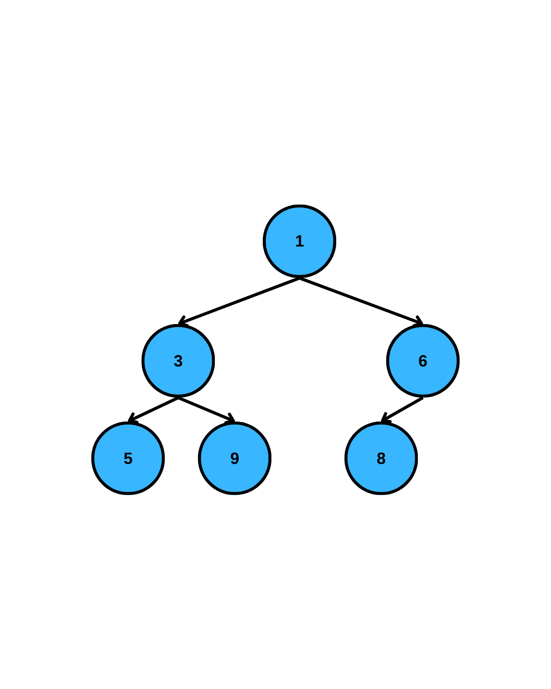

**Is this a complete binary tree?**

**What is the array representation?**

---

# Answer

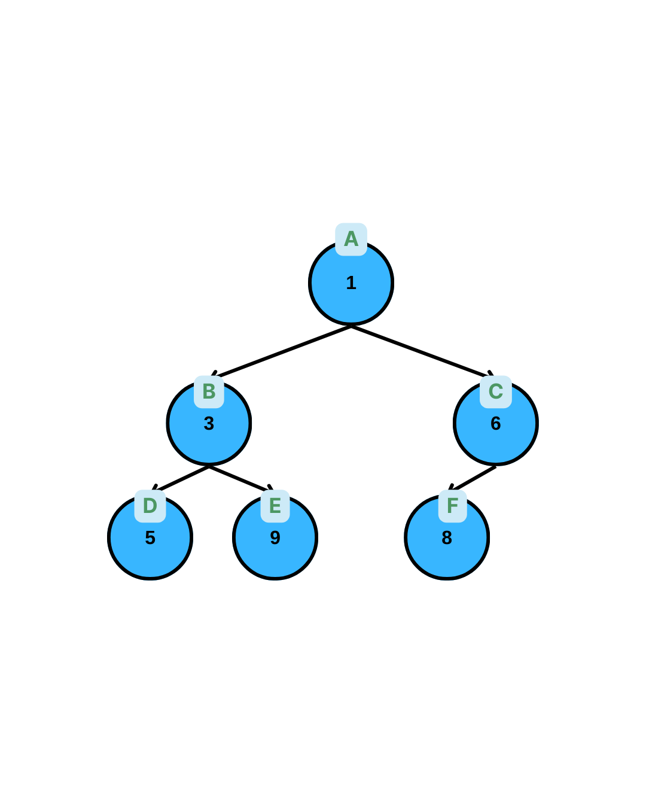

**Yes**, it is complete.

**Array:**
`[1, 3, 6, 5, 9, 8]`

**Indices:**

- Root (1) at 0
- Left(0) -> 1 -> Val: 3
- Right(0) -> 2 -> Val: 6
- Left(1) -> 3 -> Val: 5
- Right(1) -> 4 -> Val: 9
- Left(2) -> 5 -> Val: 8

---

<style scoped>
.maxheap { color: #D22B2B; font-style: "bold" }
</style>

# Heap Order Property

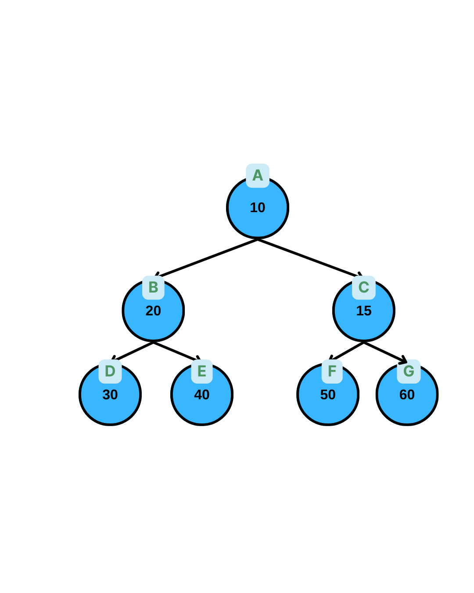

- For every node X, the key of the parent is smaller (<span class="maxheap">larger</span>) than the key of X.
- Any node must be smaller (<span class="maxheap">larger</span>) than **all** of its descendants.
- The **minimum** (<span class="maxheap">maximum</span>) element is at the root.

**Min-Heap:** `Parent <= Children`
**<span class="maxheap">Max-Heap:</span>** `Parent >= Children`

### Consequence

- The **Root** is always the smallest (<span class="maxheap">largest</span>) element.
- Finding minimum (<span class="maxheap">maximum</span>) is **O(1)**.
- **Note:** No specific ordering between siblings (Left could be > Right or vice versa).

---

# Practice

### Which of these are valid Min-Heaps?

<div class="columns">

<div>

**Tree A:**

```
       2
     /   \
    4     8
   / \
  9   7
```

**Tree B:**

```
       5
     /   \
    5     8
   /
  6
```

</div>

<div>

**Tree C:**

```
       10
     /    \
    8      12
```

**Tree D:**

```
       3
     /   \
    5     10
     \
      6
```

</div>

</div>

---

# Practice: Identify the Heap - Answers

**Tree A:** **Yes.** Complete tree. 2<4, 2<8, 4<9, 4<7.
**Tree B:** **Yes.** Complete tree. 5<=5 (ok), 5<8, 5<6.
**Tree C:** **No.** Not a heap. 10 > 8! (Parent must be smaller).
**Tree D:** **No.** Not a complete tree! Node 5 is missing left child but has right child? Or missing child at index 3?
(5 has right child 6 but no left child, it's not complete. Array is `[3, 5, 10, -, 6]`. Gap at index 3. Not complete.)

---

# Operations - Insert

We must maintain:

1.  **Structure Property** (Shape)
2.  **Heap Order Property** (Order)

### Algorithm: "Percolate Up" (Bubble Up)

1.  **Place X** in the next available spot in the array (to keep it complete).
2.  **Compare X** with its parent.
3.  **If X < Parent**: Swap them.
4.  **Repeat** step 2-3 until X >= Parent or X becomes the root.

**Time Complexity:** O(log n) - Height of tree.

---

# Insert Example

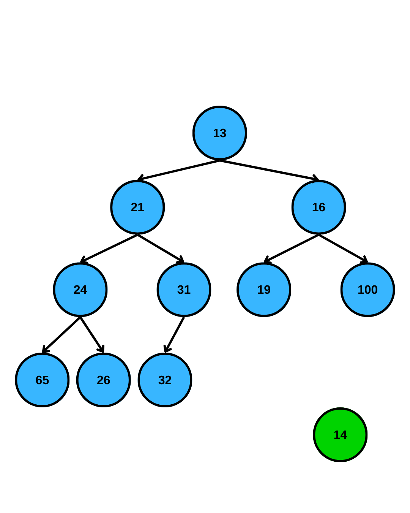

### Let's insert 14 into this heap

---

# Insert Example


### Let's insert 14 into this heap

- Create a hole and put 14 there

---

# Insert Example

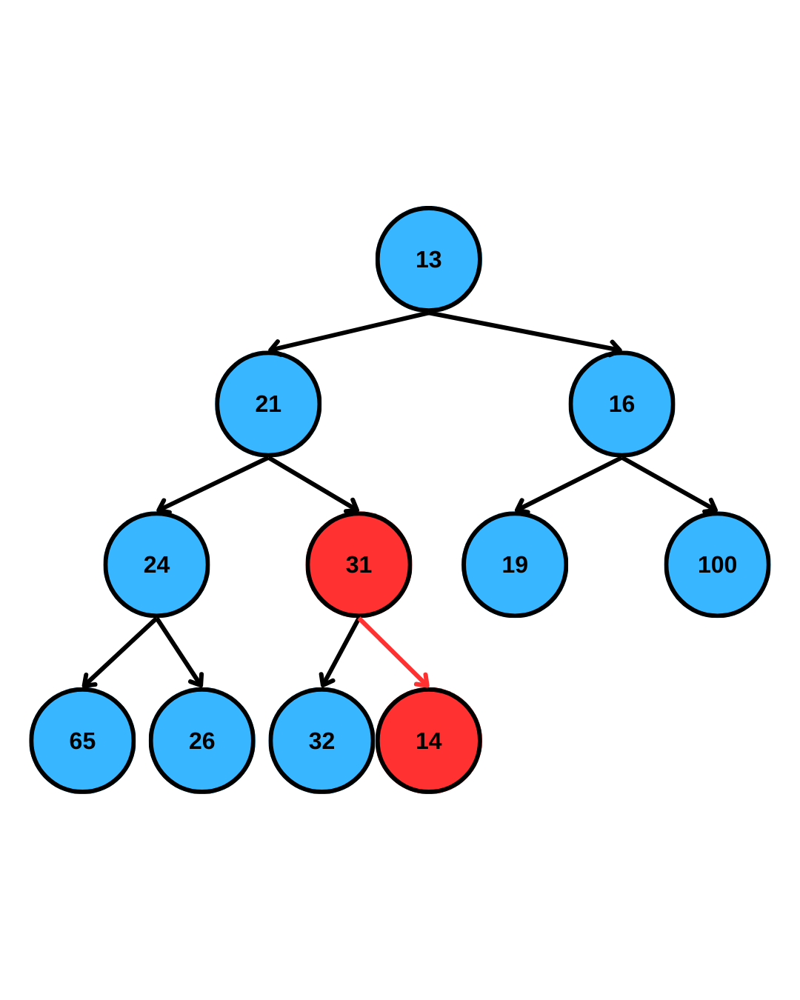

### Let's insert 14 into this heap

- Create a hole and put 14 there
- Heap property violated

---

# Insert Example

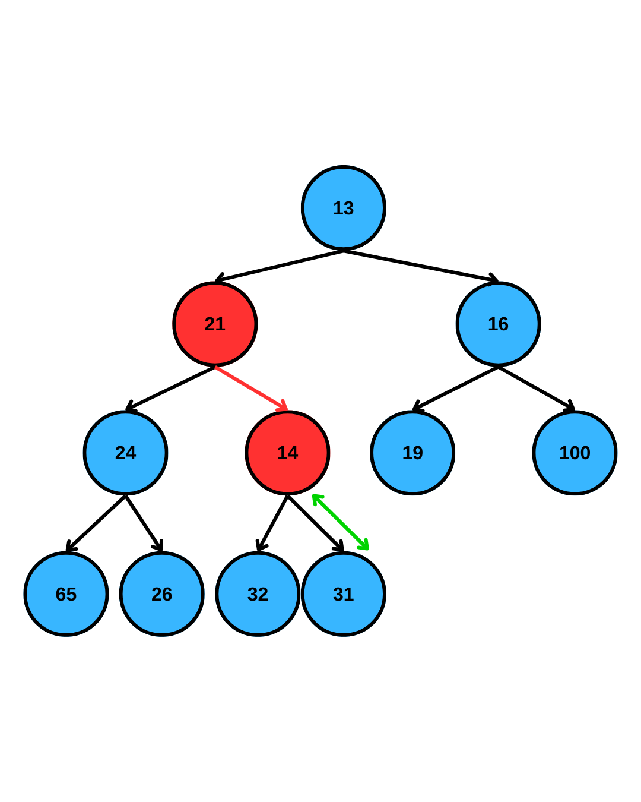

### Let's insert 14 into this heap

- Create a hole and put 14 there
- Heap property violated
- Exchange with parent

---

# Insert Example

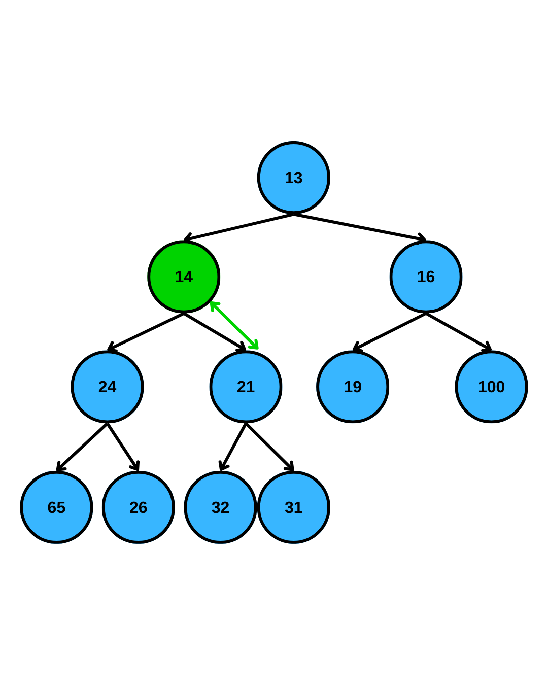

### Let's insert 14 into this heap

- Create a hole and put 14 there
- Heap property violated
- Exchange with parent
- Heap property violated

---

# Insert Example

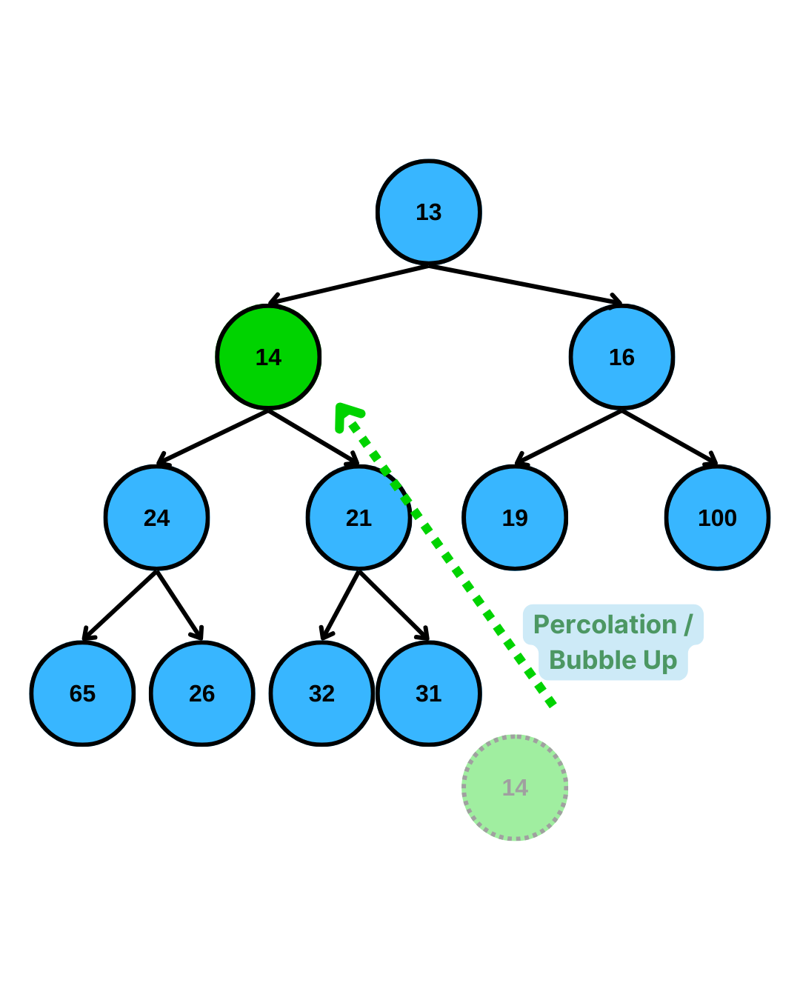

### Let's insert 14 into this heap

- Create a hole and put 14 there
- Heap property violated
- Exchange with parent
- Heap property violated
- Exchange with parent
- Heap property now established

---

# Practice

### Insert the following sequence into an empty Min-Heap:

**15, 10, 20, 8, 12, 5**

---

# Implementation Details

```cpp
class BinaryHeap {
private:
    vector<int> array;

public:
    // Check if heap is empty
    bool isEmpty() { return array.empty(); }

    // Return minimum element (Root)
    int findMin() { return array[0]; }

    void insert(int x);
    void deleteMin();
    void percolateDown(int hole);
};
```

---

# Code - Insert (Percolate Up)

```cpp
void insert(int x) {
    // 1. Create a hole at the end
    int hole = array.size();
    array.push_back(x);

    // 2. Percolate Up
    // While hole is not root AND x < parent
    while (hole > 0 && x < array[(hole - 1) / 2]) {
        array[hole] = array[(hole - 1) / 2]; // Move parent down
        hole = (hole - 1) / 2;               // Move hole up
    }

    // 3. Place x in the correct spot
    array[hole] = x;
}
```

---

# Alternate Implementation (1-Based Indexing)

If we do, 1-based indexing, there is an alternate implementation.

- **Parent:** `i / 2`
- **Left Child:** `2 * i`
- **Code becomes more compact:**

```cpp
// If we used 1-based indexing:
void insert(int x) {
    int hole = ++currentSize; // Increment first

    // x < array[hole / 2] compares with parent
    // hole /= 2 moves up
    for( ; hole > 1 && x < array[hole / 2]; hole /= 2) {
        array[hole] = array[hole / 2];
    }
    array[hole] = x;
}
```

**Note:** We use `(hole - 1) / 2` for 0-based indexing parent.

---

# Insertion

If an element needs to be percolated up d levels, the insert operation uses **d+1** assignment operations
A swap would have required 3 assignments per swap, for a total **3d** swaps for percolating d levels.

- Thus insert takes $O(log N)$ time at the maximum.
- When the new element is also the new minimum.

---

# Operations - DeleteMin

### Goal: Remove Root (Minimum)

We must maintain:

1.  **Structure Property**
2.  **Heap Order Property**

### Algorithm: "Percolate Down"

1.  **Remove Root** (it leaves a "hole").
2.  **Move Last Element** (from end of array) to the Root.
3.  **Compare** new root with **smaller** of its two children.
4.  **If Root > Smaller Child**: Swap them.
5.  **Repeat** until Root <= Children or it becomes a leaf.

**Time Complexity:** O(log n).

---

# Deleting Minimum

- Step 1: Get the minimum value from the root
  - Results in disjoint heaps
- Step 2: Since the new heap has one less element copy the last element to the empty root.
  - Results in a semiheap (violates the heap property)
- Step 3: Transform the semiheap back into a heap
  - Percolate down until the heap property is established

### Perculate Down

A recursive algorithm that trickles the root down the tree until it is not out of place

1.  Compare the node with its children; if they are in the correct order, stop.
2.  Otherwise, swap the element with the smallest child.
3.  Repeat the operation for the swapped child node

---

# Delete Minimum - Example

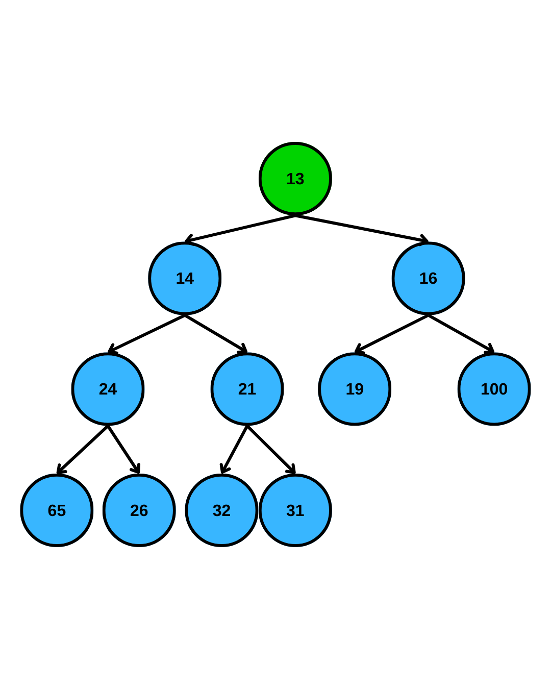

### Let's delete 13 (minimum)

---

# Delete Minimum - Example

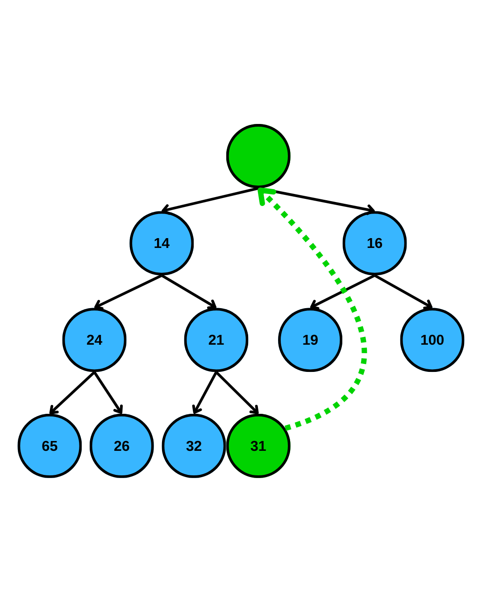

### Let's delete 13 (minimum)

1. Remove 13 which is the minimum

---

# Delete Minimum - Example

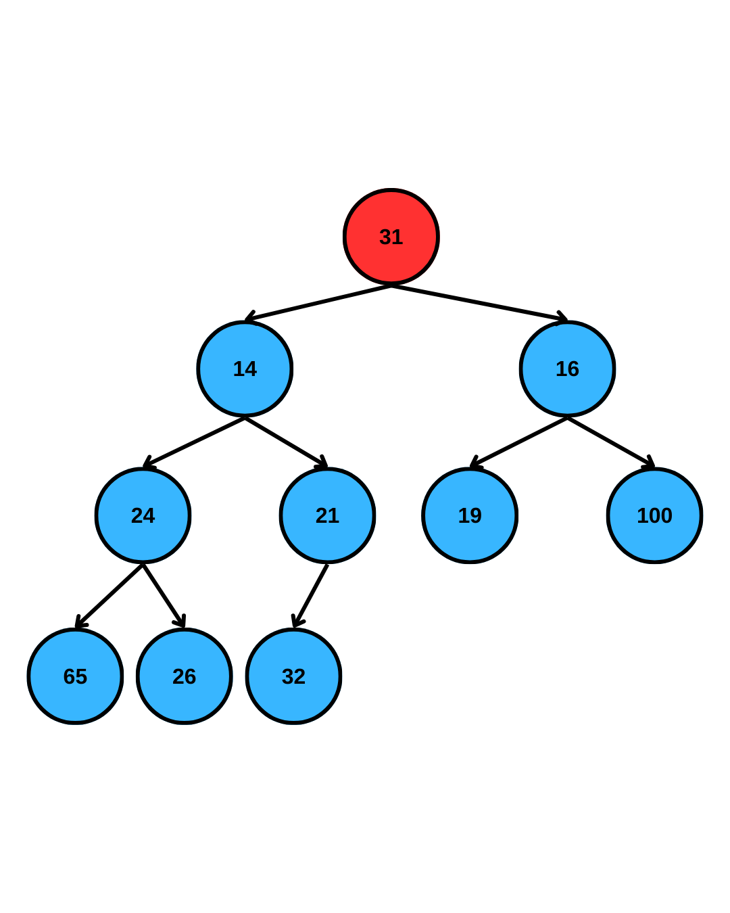

### Let's delete 13 (minimum)

1. Remove 13 which is the minimum
2. Put the last element to the root and remove the last ndoe

---

# Delete Minimum - Example


### Let's delete 13 (minimum)

1. Remove 13 which is the minimum
2. Put the last element to the root and remove the last ndoe
3. Heap-order property violated

- We need to perculate **31** down

---

# Delete Minimum - Example

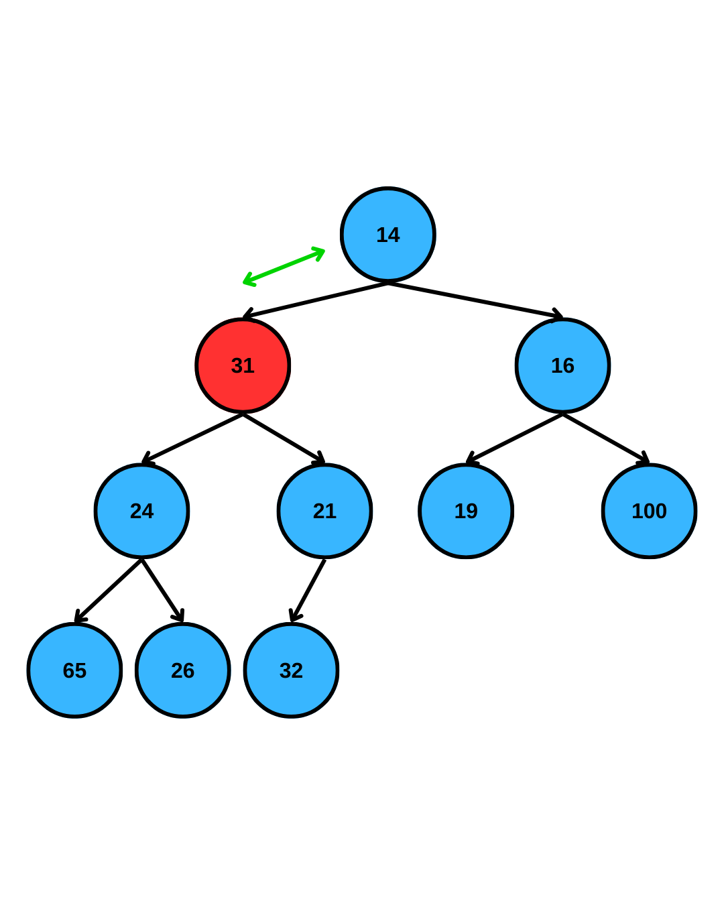

### Let's delete 13 (minimum)

1. Remove 13 which is the minimum
2. Put the last element to the root and remove the last ndoe
3. Heap-order property violated
4. Perculate 31 one level down

---

# Delete Minimum - Example

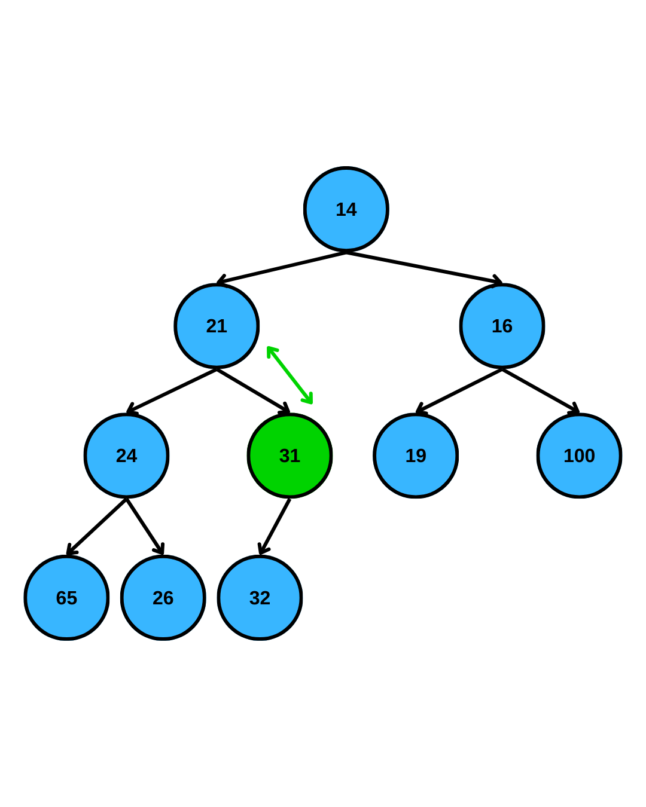

### Let's delete 13 (minimum)

1. Remove 13 which is the minimum
2. Put the last element to the root and remove the last ndoe
3. Heap-order property violated
4. Perculate 31 one level down
5. Perculate 31 one level down
6. Now heap-order property is re-established

**Perculate down** = the hole at root moving down

---

# Practice - DeleteMin

### Given this Heap:

```
       10
     /    \
   20      15
  /  \    /  \
 30  40  50  60
```

**Perform DeleteMin.** What does the tree look like?

---

# Code - DeleteMin (Percolate Down)

```cpp
void deleteMin() {
    // 1. Move last element to root
    array[0] = array.back();
    array.pop_back();

    // 2. Percolate Down
    percolateDown(0);
}

void percolateDown(int hole) {
    int child;
    int tmp = array[hole];

    while (hole * 2 + 1 < array.size()) { // While has left child
        child = hole * 2 + 1; // Assume left child is smaller

        // If right child exists and is smaller, take right child
        if (child != array.size() - 1 && array[child + 1] < array[child])
            child++;

        // Compare hole with smaller child
        if (array[child] < tmp) {
            array[hole] = array[child]; // Move child up
            hole = child;               // Move hole down
        } else {
            break; // Found correct spot
        }
    }
    array[hole] = tmp;
}
```

---

# Application - OS Process Scheduling

### The Problem

- The CPU can only execute one process at a time (per core).
- Dozens of processes need attention (Browser, Music, System updates, Mouse driver).
- Some are more urgent than others!

### The Solution

- Assign a **Priority** to each process.
- **Real-time tasks** (Audio, Mouse) -> High Priority.
- **Background tasks** (Updates, Backup) -> Low Priority.
- The OS Scheduler uses a **Priority Queue** to pick the next task.
- `deleteMax()` gives the most urgent task instantly.

---

# Application - Gaming (Pathfinding)

### A\* Pathfinding

- Used in almost every game (RTS, RPG, FPS).
- How does an NPC find the player around obstacles?
- It searches potential paths.
- **Priority Queue** stores "promising" paths.
- Priority = (Distance walked so far) + (Estimated distance to target).
- The algorithm always expands the most promising path first.

---

# Summary

| Operation     | Time Complexity |
| :------------ | :-------------- |
| **Insert**    | O(log N)        |
| **DeleteMin** | O(log N)        |
| **FindMin**   | O(1)            |
| **buildHeap** | O(N)            |

## Key Takeaways

- **Binary Heaps** are efficient Priority Queue implementations.
- Use **Arrays** for storage (complete tree property).
- **Percolate Up** for insertion.
- **Percolate Down** for deletion.

---

# Practice - Find kth Largest Element

**Problem:** You are given a stream of `N` numbers (where N can be very large). You need to find the **k-th largest element** efficiently.

### Example

**Input:** `[3, 10, 5, 20, 8]` and `k = 3`
**Sorted:** `[20, 10, 8, 5, 3]`
**3rd Largest:** `8`

---

# Heap Solution - Strategy

We want to maintain the **Top K** largest elements seen so far.

1. **Build a Min-Heap** with the first **k** numbers.
   - The Root is the _smallest_ of the Top K (the k-th largest overall).
2. **Process** the remaining **N-k** numbers one by one:
   - Let `X` be the new number.
   - Compare `X` with `Root` (current k-th largest).
   - **If X <= Root:** `X` is smaller than the current Top K. Ignore it.
   - **If X > Root:** `X` is better than the current k-th largest.
     - `deleteMin()` (Remove old k-th largest).
     - `insert(X)` (Add new contender).

**Result:** The root of the heap is exactly the k-th largest element.
**Time Complexity:** O(N log k).

---

# Heap Solution - Code

```cpp
int findKthLargest(vector<int>& nums, int k) {
    // Min-Heap to store top k elements
    // Standard priority_queue is Max-Heap, so use 'greater'
    priority_queue<int, vector<int>, greater<int>> minHeap;

    for (int num : nums) {
        // 1. Add to heap
        minHeap.push(num);

        // 2. Maintain size k
        // If heap grows larger than k, remove the smallest element
        if (minHeap.size() > k) {
            minHeap.pop();
        }
    }

    // The root of the min-heap is the k-th largest element
    return minHeap.top();
}
```

---

# Lab 3

- Will be assigned today
- Due next week
- Please book lab office for next week!

---

# Thank You!

## Contact Information

- **Email:** ekrem.cetinkaya@yildiz.edu.tr
- **Office Hours:** Tuesday 14:00-16:00 - Room F-B21
- **Course Repo:** [GitHub Link](https://github.com/ekremcet/yzm2031-data-structures-and-algorithms)

## Next Class

- **Topic:** Sorting Algorithms
