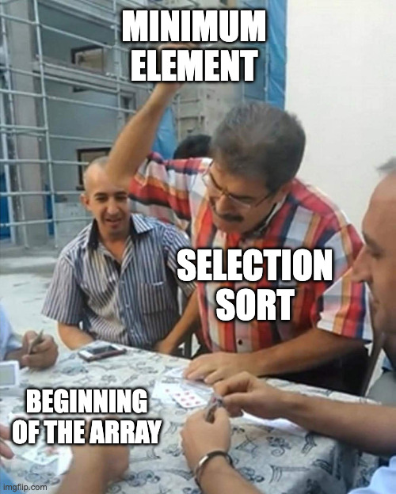
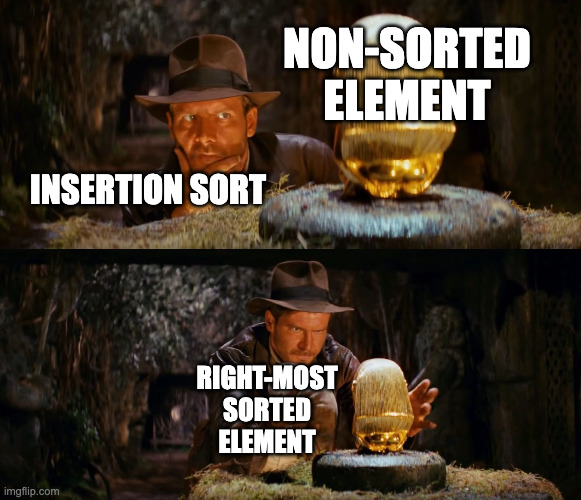
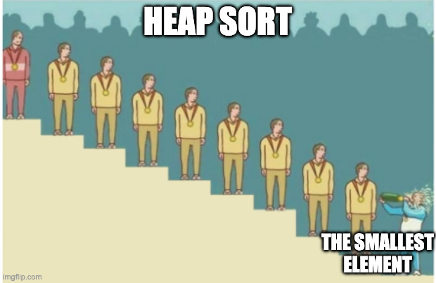

# YZM2031

## Data Structures and Algorithms

### Week 9: Sorting Algorithms

**Instructor:** Ekrem Çetinkaya
**Date:** 10.12.2025

---

# Recap

## Priority Queues (Heaps)

- **Structure Property:** Complete Binary Tree (filled left-to-right).
- **Heap Order Property:** Parent is always $\le$ Children (Min-Heap).
- **Operations:**
  - `insert`: Percolate Up ($O(\log N)$)
  - `deleteMin`: Percolate Down ($O(\log N)$)
  - `findMin`: Root ($O(1)$)
- **Array Representation:** No pointers needed. Index arithmetic.

---

# Introduction to Sorting

### Sorting is possibly the most frequently executed operation in computing

**Sorting** is the process of arranging a collection of items in a specific order.

- Sorting can be applied to any type of (comparable) object

### Why do we sort?

1.  **Searching becomes faster:** Binary Search ($O(\log N)$) vs Linear Search ($O(N)$).
2.  **Matching items:** Finding duplicates or common elements in two lists.
3.  **Data Analysis:** Finding median, percentiles, or top-k items.
4.  **AI Applications:** Preparing data for models, Top-K logits (Softmax), Ranking systems.

---

# Introduction to Sorting

The keys of the items to be sorted come from an essentially infinite domain and can be compared with **> and <**

Important parameters

- Number of item comparisons
- Number of item assignments
- What happens to equal items?

---

# Introduction to Sorting

- Several simple algorithms that sort in $O(N^2)$ time
  - Insertion sort
- Shellsort runs in time $o(N^2)$
  - Very efficient in practice
- Slightly more complicated algorithms sort in $O(N \log N)$
- Any general purpose sorting algorithm requires $\Omega(N \log N)$ comparisons.
- The **best** algorithm is QuickSort, which has an average time of $O(N \log N)$ but a worst case time of $O(N^2)$
- Among the $O(N \log N)$ algorithms, the difference is in the constant factors
  - e.g., T(N) = $k_1 N \log N$ vs. T(N) = $k_2 N \log N$

---

# The Impact of Algorithm Choice

Why do we study $O(N \log N)$ when $O(N^2)$ is easier to write?

| N (Items) | $O(N^2)$ (Bubble) | $O(N \log N)$ (Quick) | Ratio       |
| :-------- | :---------------- | :-------------------- | :---------- |
| 10        | 100 ops           | 33 ops                | 3x          |
| 1,000     | 1,000,000 ops     | 10,000 ops            | 100x        |
| 1,000,000 | $10^{12}$ ops     | $2 \cdot 10^7$ ops    | **50,000x** |

**Real World:**

- Sorting 1M items with Bubble Sort: **~16 minutes** (assuming $10^9$ ops/sec).
- Sorting 1M items with Quick Sort: **~0.02 seconds**.

---

# Sorting Terminology & Concepts

Before diving into algorithms, let's define key properties.

<div class="columns">

<div>

### 1. Stability

A sort is **stable** if it preserves the relative order of equal elements.

- **Input:** `[(Bob, 80), (Alice, 90), (Charlie, 80)]`
- **Unstable Sort:** `[(Alice, 90), (Charlie, 80), (Bob, 80)]` (Bob and Charlie flipped)
- **Stable Sort:** `[(Alice, 90), (Bob, 80), (Charlie, 80)]` (Bob stays before Charlie)

</div>

<div>

### 2. In-Place Sorting

An algorithm is **in-place** if it uses a small, constant amount of extra memory ($O(1)$ or $O(\log N)$ stack space). It modifies the array directly.

- **In-Place:** Quick Sort, Heap Sort, Insertion Sort
- **Not In-Place:** Merge Sort (needs $O(N)$ buffer)

### 3. Adaptivity

An adaptive sort gets faster if the data is already partially sorted.

- **Adaptive:** Insertion Sort ($O(N)$ for sorted)
- **Not Adaptive:** Selection Sort (Always $O(N^2)$)

</div>

</div>

---

# Overview of Algorithms for Today

<div class="columns">

<div>

**Elementary ($O(N^2)$)**

1. Bubble Sort
2. Selection Sort
3. Insertion Sort
4. Shell Sort

</div>

<div>

**Efficient ($O(N \log N)$)**

5. Merge Sort
6. Quick Sort
7. Heap Sort

</div>

</div>

---

<!-- _footer: "" -->
<!-- _header: "" -->
<!-- _paginate: false -->

<style scoped>
p { text-align: center}
h1 {text-align: center; font-size: 72px}
</style>

# Elementary Sorts - $O(N^2)$

---

# Elementary Sorts - $O(N^2)$

Simple, but inefficient for large datasets.

1.  **Bubble Sort**
2.  **Selection Sort**
3.  **Insertion Sort**
4.  **Shell Sort**

---

# 1. Bubble Sort - Concept


**Analogy:** Imagine air bubbles in a water tank. Heavier bubbles (larger numbers) don't rise as fast as lighter bubbles (smaller numbers). Or conversely, think of heavy stones sinking to the bottom.

**Idea:** Repeatedly swap adjacent elements if they are in the wrong order. Large elements "bubble" to the end of the array.

### Mechanism

1. Compare `arr[j]` with `arr[j+1]`.
2. If `arr[j] > arr[j+1]`, swap them.
3. Repeat this process for every adjacent pair.
4. After one full pass, the **largest element** is guaranteed to be at the end.
5. Repeat for `N-1` passes.

---

# Bubble Sort - Example Trace

**Input:** `[5, 1, 4, 2, 8]`

**Pass 1 (Bubble up the largest element):**

- `[5, 1, 4, 2, 8]` -> Compare 5, 1. Swap. -> `[1, 5, 4, 2, 8]`
- `[1, 5, 4, 2, 8]` -> Compare 5, 4. Swap. -> `[1, 4, 5, 2, 8]`
- `[1, 4, 5, 2, 8]` -> Compare 5, 2. Swap. -> `[1, 4, 2, 5, 8]`
- `[1, 4, 2, 5, 8]` -> Compare 5, 8. No Swap. -> `[1, 4, 2, 5, | 8]` (8 is sorted)

**Pass 2 (Bubble up the 2nd largest):**

- `[1, 4, 2, 5, 8]` -> Compare 1, 4. No Swap. -> `[1, 4, 2, 5, 8]`
- `[1, 4, 2, 5, 8]` -> Compare 4, 2. Swap. -> `[1, 2, 4, 5, 8]`
- `[1, 2, 4, 5, 8]` -> Compare 4, 5. No Swap. -> `[1, 2, 4, | 5, 8]` (5, 8 are sorted)

**Pass 3:**

- `[1, 2, 4, 5, 8]` -> Compare 1, 2. No Swap.
- `[1, 2, 4, 5, 8]` -> Compare 2, 4. No Swap. -> `[1, 2, 4 | 5, 8]` (Done!)

---

# Bubble Sort - Edge Case Trace (Duplicates)

**Input:** `[3, 2, 3, 1]`

**Pass 1:**

- `[3, 2, 3, 1]` -> Swap(3,2) -> `[2, 3, 3, 1]`
- `[2, 3, 3, 1]` -> Swap(3,3)? No! (Equal elements don't swap -> Stable) -> `[2, 3, 3, 1]`
- `[2, 3, 3, 1]` -> Swap(3,1) -> `[2, 3, 1, | 3]`

**Pass 2:**

- `[2, 3, 1, 3]` -> Swap(2,3)? No.
- `[2, 3, 1, 3]` -> Swap(3,1) -> `[2, 1, | 3, 3]`

**Pass 3:**

- `[2, 1, 3, 3]` -> Swap(2,1) -> `[1, 2, | 3, 3]`

Sorted: `[1, 2, 3, 3]`

---

# Bubble Sort - Implementation & Analysis

<div class="columns">

<div>

```cpp
void bubbleSort(vector<int>& arr) {
    int n = arr.size();
    bool swapped;
    for (int i = 0; i < n-1; i++) {
        swapped = false;
        // Last i elements are already sorted
        for (int j = 0; j < n-i-1; j++) {
            if (arr[j] > arr[j+1]) {
                swap(arr[j], arr[j+1]);
                swapped = true;
            }
        }
        // Optimization: If no swaps occurred in a pass,
        // the array is already sorted!
        if (!swapped) break;
    }
}
```

</div>

<div>

### Complexity

- **Worst Case:** $O(N^2)$ (Reverse sorted)
- **Average Case:** $O(N^2)$
- **Best Case:** $O(N)$ (Already sorted, thanks to `swapped` flag)
- **Space:** $O(1)$

### Properties

- **Stable:** Yes
- **Verdict:** Very slow. Only good for teaching or extremely small/nearly sorted data.

</div>

</div>

---

# 2. Selection Sort - Concept



**Analogy:** Imagine organizing a hand of cards. You scan all cards, find the smallest one (Ace), and move it to the front. Then you scan the remaining cards for the next smallest (2), and put it next to the Ace.

**Idea:** Divide the array into two parts: sorted (left) and unsorted (right). Repeatedly **select** the smallest element from the unsorted part and move it to the end of the sorted part.

### Mechanism

1. Find the minimum element in `arr[0...n-1]`.
2. Swap it with `arr[0]`.
3. Find the minimum element in `arr[1...n-1]`.
4. Swap it with `arr[1]`.
5. Repeat until sorted.

---

# Selection Sort - Example Trace

**Input:** `[64, 25, 12, 22, 11]`

**Pass 1 (i=0):**

- Current Min Index: 0 (Val: 64)
- Scan: 25 < 64? Yes (Min: 25) -> 12 < 25? Yes (Min: 12) -> 22 < 12? No -> 11 < 12? Yes (Min: 11).
- Swap `arr[0]` (64) with `arr[Min]` (11).
- Array: `[11 | 25, 12, 22, 64]`

**Pass 2 (i=1):**

- Current Min Index: 1 (Val: 25)
- Scan: 12 < 25? Yes (Min: 12) -> 22 < 12? No -> 64 < 12? No.
- Swap `arr[1]` (25) with `arr[Min]` (12).
- Array: `[11, 12 | 25, 22, 64]`

**Pass 3 (i=2):**

- Scan remainder `[25, 22, 64]`. Min is 22.
- Swap `arr[2]` (25) with 22.
- Array: `[11, 12, 22 | 25, 64]`

---

# Selection Sort - Implementation & Analysis

<div class="columns">

<div>

```cpp
void selectionSort(vector<int>& arr) {
    int n = arr.size();
    for (int i = 0; i < n-1; i++) {
        int min_idx = i;
        // Search for min in unsorted part
        for (int j = i+1; j < n; j++)
            if (arr[j] < arr[min_idx])
                min_idx = j;

        // Swap found min with first element
        // Note: Even if min_idx == i, we swap (no-op)
        swap(arr[min_idx], arr[i]);
    }
}
```

</div>

<div>

### Complexity

- **Time:** $O(N^2)$ (Always! Even if sorted).
- **Space:** $O(1)$

### Properties

- **Stable:** **No** (Swapping can jump over elements). -`[5(a), 5(b), 1]`. Min is 1. Swap 5(a) with 1 -`[1, 5(b), 5(a)]`. 5(a) is now after 5(b).
- **Verdict:** Good when **writes** are expensive (it does max $N$ swaps).

</div>

</div>

---

# 3. Insertion Sort - Concept



**Analogy:** Sorting playing cards in your hand. You pick up a new card, look at the cards already in your hand (which are sorted), and slide the new card into the correct slot.

**Idea:** Build the sorted array **one item** at a time. Pick the next element and **insert** it into its correct position among the cards you've already sorted.

### Mechanism

1. Start with the second element (index 1).
2. Compare it with elements before it (index 0).
3. If smaller, shift the larger elements to the right.
4. Insert the element into the empty spot.
5. Move to the next element and repeat.

---

# Insertion Sort - Example Trace

**Input:** `[8, 4, 2, 9, 3]`

**Pass 1 (i=1, Key=4):**

- Compare 4 with 8 -> $4 < 8$.
- Shift 8 to right: `[8, 8, 2, 9, 3]`
- Insert 4 at pos 0.
- Array: `[4, 8 | 2, 9, 3]`

**Pass 2 (i=2, Key=2):**

- Compare 2 with 8 -> $2 < 8$ -> Shift 8: `[4, 8, 8, 9, 3]`
- Compare 2 with 4 -> $2 < 4$ -> Shift 4: `[4, 4, 8, 9, 3]`
- Insert 2 at pos 0.
- Array: `[2, 4, 8 | 9, 3]`

**Pass 3 (i=3, Key=9):**

- Compare 9 with 8 -> $9 > 8$ -> No shifts.
- Array: `[2, 4, 8, 9 | 3]`

---

# Insertion Sort - Example Trace

**Array:** `[2, 4, 8, 9 | 3]`

**Pass 4 (i=4, Key=3):**

- Compare 3 with 9 -> $3 < 9$ -> Shift 9: `[2, 4, 8, 9, 9]`
- Compare 3 with 8 -> $3 < 8$ -> Shift 8: `[2, 4, 8, 8, 9]`
- Compare 3 with 4 -> $3 < 4$ -> Shift 4: `[2, 4, 4, 8, 9]`
- Compare 3 with 2 -> $3 > 2$ -> Stop.
- Insert 3 at pos 1.
- **Final:** `[2, 3, 4, 8, 9]`

---

# Insertion Sort - Implementation & Analysis

<div class="columns">

<div>

```cpp
void insertionSort(vector<int>& arr) {
    int n = arr.size();
    for (int i = 1; i < n; i++) {
        int key = arr[i];
        int j = i - 1;

        // Shift elements greater than key
        // to make space for key
        while (j >= 0 && arr[j] > key) {
            arr[j + 1] = arr[j];
            j--;
        }
        arr[j + 1] = key;
    }
}
```

</div>

<div>

### Complexity

- **Worst Case:** $O(N^2)$ (Reverse sorted)
- **Best Case:** $O(N)$ (Already sorted - loop condition fails immediately)
- **Space:** $O(1)$

### Properties

- **Stable:** Yes
- **Verdict:** **Adaptive**. Excellent for small arrays ($N < 50$) or nearly sorted data.

</div>

</div>

---

# 4. Shell Sort - Concept


**Analogy:** Imagine sorting a large stack of exam papers. Instead of comparing adjacent papers, you first compare papers that are far apart (e.g., every 50th paper). This moves very high or very low grades to their approximate correct sections quickly. Then you compare closer papers (every 20th), and finally adjacent ones.

**Idea:** Allow exchanging **far-apart** elements to produce a partially sorted array, then finish with standard Insertion Sort.

### Mechanism

1. Choose a **Gap** sequence (e.g., $N/2, N/4, \dots, 1$).
2. For each Gap, perform _Insertion Sort_ on sub-arrays defined by the gap.
   - Elements at indices $i, i+gap, i+2*gap, \dots$ are sorted amongst themselves.
3. The final pass (Gap=1) is a standard Insertion Sort, but the array is guaranteed to be nearly sorted by then.

---

# Shell Sort - Example Trace

**Input:** `[35, 33, 42, 10, 14, 19, 27, 44]`
**Gaps:** `[4, 2, 1]`

**Pass 1 (Gap=4):** Compare elements 4 steps apart (e.g., indices 0 & 4, 1 & 5).

- Compare `35` & `14`. `35 > 14`, swap. -> `[14, 33, 42, 10, 35, 19, 27, 44]`
- Compare `33` & `19`. `33 > 19`, swap. -> `[14, 19, 42, 10, 35, 33, 27, 44]`
- Compare `42` & `27`. `42 > 27`, swap. -> `[14, 19, 27, 10, 35, 33, 42, 44]`
- Compare `10` & `44`. `10 < 44`, no swap.

**Pass 2 (Gap=2):** Compare elements 2 steps apart (Insertion Sort on sub-arrays).

- The array is now "4-sorted". We sort indices `0, 2, 4, 6` and `1, 3, 5, 7`.
- Result: `[14, 10, 27, 19, 35, 33, 42, 44]`

**Pass 3 (Gap=1):** Standard Insertion Sort.

- The array is nearly sorted. Elements are close to their final positions.
- Final: `[10, 14, 19, 27, 33, 35, 42, 44]`

---

# Shell Sort - Implementation & Analysis

<div class="columns">

<div>

```cpp
void shellSort(vector<int>& arr) {
    int n = arr.size();
    // Start with a big gap, then reduce the gap
    for (int gap = n/2; gap > 0; gap /= 2) {
        // Do a gapped insertion sort for this gap size.
        // The first gap elements a[0..gap-1] are already in gapped order
        // keep adding one more element until the entire array is
        // gap sorted
        for (int i = gap; i < n; i += 1) {
            int temp = arr[i];
            int j;
            for (j = i; j >= gap && arr[j - gap] > temp; j -= gap)
                arr[j] = arr[j - gap];
            arr[j] = temp;
        }
    }
}
```

</div>

<div>

### Complexity

- Depends heavily on the **Gap Sequence**.
- **Original (N/2):** Worst Case $O(N^2)$.
- **Knuth's Gap:** $O(N^{1.5})$.
- **Sedgewick's Gap:** $O(N^{4/3})$.
- **Space:** $O(1)$.

### Properties

- **Stable:** No (Long distance swaps jump over elements).
- **Verdict:** Much faster than Insertion Sort for medium arrays.

</div>

</div>
ƒ
---

<!-- _footer: "" -->
<!-- _header: "" -->
<!-- _paginate: false -->

<style scoped>
p { text-align: center}
h1 {text-align: center; font-size: 72px}
</style>

# Efficient Sorts ($O(N \log N)$)

---

# Efficient Sorts ($O(N \log N)$)

To break the $O(N^2)$ barrier, we use **Divide and Conquer**.

5.  **Merge Sort**
6.  **Quick Sort**
7.  **Heap Sort**

---

# 5. Merge Sort - Concept


**Analogy:** You have two sorted stacks of playing cards. To combine them into one sorted stack, you just look at the top card of each stack, pick the smaller one, and place it face down. Repeat until both stacks are empty.

**Idea:** Divide the problem into smaller subproblems, solve them, and combine the results (**Divide and Conquer**).

### Mechanism

1.  **Divide:** Split the array into two equal halves.
2.  **Conquer:** Recursively sort the two halves.
    - Base case: If size is 1, it's sorted.
3.  **Combine:** Merge the two sorted halves into a single sorted array.

---

# Merge Sort - The Merge Step

**Goal:** Combine `A:[2, 5, 8]` and `B:[3, 6, 9]` into `C`.

1. **Compare Heads:** `A[0]=2` vs `B[0]=3`.
   - 2 is smaller. Put 2 in C. Advance A pointer.
   - `C:[2]`, `A:[5, 8]`, `B:[3, 6, 9]`
2. **Compare Heads:** `A[1]=5` vs `B[0]=3`.
   - 3 is smaller. Put 3 in C. Advance B pointer.
   - `C:[2, 3]`, `A:[5, 8]`, `B:[6, 9]`
3. **Compare Heads:** `A[1]=5` vs `B[1]=6`.
   - 5 is smaller. Put 5 in C. Advance A pointer.
   - `C:[2, 3, 5]`, `A:[8]`, `B:[6, 9]`
4. **Compare Heads:** `A[2]=8` vs `B[1]=6`.
   - 6 is smaller. Put 6 in C. Advance B pointer.
   - `C:[2, 3, 5, 6]`, `A:[8]`, `B:[9]`

... Continue until one list is empty, then copy the rest.

---

# Merge Sort - Example Trace

**Input:** `[38, 27, 43, 3]`

**Level 0:** `[38, 27, 43, 3]` (Split)
**Level 1:** `[38, 27]` and `[43, 3]` (Split)
**Level 2:** `[38]`, `[27]`, `[43]`, `[3]` (Base cases - Sorted!)

**Merge Phase (Going Up):**
**Level 1:**

- Merge `[38]` & `[27]` -> `[27, 38]`
- Merge `[43]` & `[3]` -> `[3, 43]`

**Level 0:**

- Merge `[27, 38]` & `[3, 43]`
- 3 < 27 -> `[3]`
- 27 < 43 -> `[3, 27]`
- 38 < 43 -> `[3, 27, 38]`
- 43 left -> `[3, 27, 38, 43]`

---

# Merge Sort - Implementation & Analysis

<div class="columns">

<div>

```cpp
void merge(vector<int>& arr, int l, int m, int r) {
    int n1 = m - l + 1; int n2 = r - m;
    vector<int> L(n1), R(n2);
    for (int i = 0; i < n1; i++) L[i] = arr[l + i];
    for (int j = 0; j < n2; j++) R[j] = arr[m + 1 + j];

    int i = 0, j = 0, k = l;
    while (i < n1 && j < n2) {
        if (L[i] <= R[j]) arr[k++] = L[i++]; // <= ensures stability
        else arr[k++] = R[j++];
    }
    while (i < n1) arr[k++] = L[i++];
    while (j < n2) arr[k++] = R[j++];
}

void mergeSort(vector<int>& arr, int l, int r) {
    if (l >= r) return;
    int m = l + (r - l) / 2;
    mergeSort(arr, l, m);
    mergeSort(arr, m + 1, r);
    merge(arr, l, m, r);
}
```

</div>

<div>

### Complexity

- **Time:** $O(N \log N)$
  - Splitting: $\log N$ levels
  - Merging: $O(N)$ per level
- **Space:** $O(N)$
  - Requires auxiliary array for merging.
  - **Not in-place.**

### Properties

- **Stable:** Yes (if merge logic respects order).
- **Pros:** Guaranteed performance, parallelizable, good for Linked Lists (no random access needed).
- **Cons:** Memory usage.

</div>

</div>

---

# 6. Quick Sort - Concept


**Analogy:** A teacher wants to line up students by height. She picks one student (the "pivot") and says: "Everyone shorter than Sam go to the left, everyone taller go to the right." Now Sam is in his correct final spot. She then repeats this for the left group and the right group.

**Idea:** Pick an element (pivot) and place it in its correct sorted position by partitioning the array around it.

### Mechanism

1.  **Pick Pivot:** Choose one element (e.g., last element).
2.  **Partition:** Rearrange the array so that:
    - All elements < Pivot go to **Left**.
    - All elements > Pivot go to **Right**.
    - Pivot goes to the **Middle**.
3.  **Recurse:** Sort the Left and Right sub-arrays.

---

# Quick Sort - How to Pick Pivot

**1. Pick the First Element as Pivot**

- **Pros:** Easiest to implement.
- **Cons:**
  - Works OK if input is random.
  - **Terrible** if input is sorted or reverse sorted ($O(N^2)$).
  - All elements go to one side, recursion depth becomes $N$.
- **Verdict:** Do NOT use this strategy in production

**2. Pick a Random Element as Pivot**

- **Pros:** Generally safe. Avoiding worst-case patterns is highly probable.
- **Cons:** Random number generation has a small cost.
- **Verdict:** Good default choice if you want simplicity.

---

# Quick Sort - Median-of-Three Partitioning

**3. Median-of-Three Partitioning**

- **Idea:** The ideal pivot is the true median of the array (splits it perfectly in half).
- **Problem:** Finding the true median takes time.
- **Approximation:** Pick three elements (First, Middle, Last) and use their **median** as the pivot.

**Example:**
Array: `[8, 1, 4, 9, 6, 3, 5, 2, 7, 0]`

- First: 8, Middle: 6, Last: 0.
- Median of {8, 6, 0} is **6**. Use 6 as pivot.

**Verdict:**

- Eliminates the bad behavior for sorted inputs.
- Commonly used in standard library implementations (e.g., `std::sort`).

---

# Quick Sort - Example Trace

**Input:** `[5, 1, 4, 2, 8]`
**Pivot:** 4 (Middle element for example)

1. Move pivot to end: `[5, 1, 8, 2, | 4]`
2. Scan from left for item > 4 (Found 5).
3. Scan from right for item < 4 (Found 2).
4. Swap 5 and 2: `[2, 1, 8, 5, | 4]`
5. Continue scan. Left ptr meets Right ptr.
6. Swap Pivot (4) with Left ptr (8).
7. **Result:** `[2, 1, 4, 5, 8]`
   - Left: `[2, 1]` (All < 4)
   - Pivot: `4` (Sorted!)
   - Right: `[5, 8]` (All > 4)

---

# Quick Sort - Implementation & Analysis

<div class="columns">

<div>

```cpp
int partition(vector<int>& arr, int low, int high) {
    int pivot = arr[high]; // Picking last as pivot
    int i = (low - 1); // Index of smaller element

    for (int j = low; j <= high - 1; j++) {
        // If current element is smaller than pivot
        if (arr[j] < pivot) {
            i++;
            swap(arr[i], arr[j]);
        }
    }
    swap(arr[i + 1], arr[high]);
    return (i + 1);
}

void quickSort(vector<int>& arr, int low, int high) {
    if (low < high) {
        int pi = partition(arr, low, high);
        quickSort(arr, low, pi - 1);
        quickSort(arr, pi + 1, high);
    }
}
```

</div>

<div>

### Complexity

- **Best/Avg Case:** $O(N \log N)$
- **Worst Case:** $O(N^2)$
  - Occurs if Pivot is always Min or Max (e.g., sorted array).
- **Space:** $O(\log N)$ (Recursion stack).

### Properties

- **Stable:** No.
- **In-Place:** Yes.
- **Verdict:** Fastest general-purpose sort in practice.

</div>

</div>

---

# 7. Heap Sort - Concept



**Analogy:** Organizing a tournament. You put everyone in a bracket (Heap). The winner (largest element) pops out at the top. You take the winner, give them the gold medal (place at end of array), and then run the tournament again for the remaining participants to find the silver medalist.

**Idea:** Use a **Binary Heap** data structure to efficiently find the maximum element and move it to the sorted region.

### Mechanism

1.  **Build Heap:** Treat the array as a Max-Heap. Fix the heap order. ($O(N)$)
2.  **Extract Max:**
    - Swap the Root (Max) with the Last element.
    - Decrease heap size by 1.
    - Max element is now at the end (sorted position).
    - `percolateDown(root)` to fix the heap.
3.  **Repeat:** Do this $N$ times.

---

# Heap Sort - Example Trace

**Array:** `[4, 10, 3, 5, 1]`

1. **Build Max-Heap:** `[10, 5, 3, 4, 1]` (10 is root)
2. **Swap Root(10) & Last(1):** `[1, 5, 3, 4 | 10]`
   - 10 is now fixed at end. Heap size decreased.
   - Root is 1. Violates heap property.
3. **Percolate Down 1:** `[5, 4, 3, 1 | 10]` (5 becomes root)
4. **Swap Root(5) & Last(1):** `[1, 4, 3 | 5, 10]`
   - 5 is fixed. Root is 1.
5. **Percolate Down 1:** `[4, 1, 3 | 5, 10]` (4 becomes root)
6. **Swap Root(4) & Last(3):** `[3, 1 | 4, 5, 10]`
   ...
7. **Final:** `[1, 3, 4, 5, 10]`

---

# Heap Sort - Implementation & Analysis

<div class="columns">

<div>

```cpp
void heapify(vector<int>& arr, int n, int i) {
    int largest = i;
    int l = 2 * i + 1; // Left Child
    int r = 2 * i + 2; // Right Child
    if (l < n && arr[l] > arr[largest]) largest = l;
    if (r < n && arr[r] > arr[largest]) largest = r;
    if (largest != i) {
        swap(arr[i], arr[largest]);
        heapify(arr, n, largest);
    }
}

void heapSort(vector<int>& arr) {
    int n = arr.size();
    // Build heap (rearrange array)
    for (int i = n / 2 - 1; i >= 0; i--) heapify(arr, n, i);
    // Extract element from heap one by one
    for (int i = n - 1; i > 0; i--) {
        swap(arr[0], arr[i]); // Move root to end
        heapify(arr, i, 0);   // Fix reduced heap
    }
}
```

</div>

<div>

### Complexity

- **Time:** $O(N \log N)$ (Always).
- **Space:** $O(1)$ (In-place).

### Comparison

- vs Merge Sort: Uses less memory.
- vs Quick Sort: Guaranteed $O(N \log N)$ worst case.
- **Downside:** Slower than Quick Sort in practice.
  - Poor **Cache Locality** (jumps between indices $i$ and $2i$).
  - Not Stable.

</div>

</div>

---

<!-- _footer: "" -->
<!-- _header: "" -->
<!-- _paginate: false -->

<style scoped>
p { text-align: center}
h1 {text-align: center; font-size: 72px}
</style>

# Specialized Sorting Algorithms & AI Applications

---

# 8. External Sorting (Big Data)

**Problem:** You need to sort 1TB of data. You only have 16GB RAM.
You cannot load the array into memory.

**Solution:** **K-Way Merge Sort**.

1.  **Chunking:** Read 10GB, sort in memory (QuickSort), write to disk as `chunk_1.tmp`. Repeat until 100 chunks.
2.  **Streaming:** Open all 100 files as input streams.
3.  **Merging:** Use a **Min-Heap** of size 100.
    - Insert first item of each chunk into Heap.
    - Pop Min, write to `sorted_final.dat`.
    - Read next item from the chunk that provided the Min.
    - Repeat.

---

# 9. Bitonic Sort (Parallel / GPU)

**Context:** Modern AI relies on GPUs (CUDA). Standard sorts (Quick/Merge) rely on branching (`if x < y`), which is slow on GPUs.

**Solution:** **Bitonic Sort**.

- It is a **Sorting Network**.
- The sequence of comparisons is fixed (data-independent).
- Highly parallelizable ($O(\log^2 N)$ latency).

**Application:** `torch.sort` or `torch.topk` on GPU often uses Bitonic or Radix sort variants.

---

# 10. Top-K Sampling (LLMs)

**Scenario:** ChatGPT predicting the next word.

- Vocabulary: 50,000 words.
- Model outputs: 50,000 probabilities (logits).
- We want: Top 5 probabilities to sample from.

**Do we sort all 50,000?** ($N \log N$) -> **No.**

**Better:**

1.  **Top-K Heap:** Scan array, maintain heap of size 5. ($N \log K$).
2.  **QuickSelect (ArgPartition):** Modified QuickSort. Only recurse into the side with the K-th element. Average $O(N)$.

**Result:** Much faster inference time.

---

# Practical Tip - Custom Comparators

In real life, we rarely sort integers. We sort **Objects**.

```cpp
struct Student {
    string name;
    int grade;
};

// Comparator Function
bool compareStudents(const Student& a, const Student& b) {
    if (a.grade != b.grade) {
        return a.grade > b.grade; // Descending Grade
    }
    return a.name < b.name; // Ascending Name (Tie-breaker)
}

sort(students.begin(), students.end(), compareStudents);
```

**Common Pitfall:** Returning `true` for equal elements in QuickSort can cause infinite loops or bad performance. Use strict inequality.

---

# Summary

1.  **Bubble Sort:** Repeatedly swap adjacent elements if wrong order - $O(N^2)$ - Teaching concepts
2.  **Selection Sort:** Repeatedly pick smallest element for next position - $O(N^2)$ - Minimizing memory writes
3.  **Insertion Sort:** Slide new element into correct sorted position - $O(N^2)$ - Small or nearly sorted data
4.  **Shell Sort:** Insertion sort with diminishing gaps (long-range swaps) - $O(N^{1.5})$ - Medium-sized arrays
5.  **Merge Sort:** Divide in half, sort recursively, merge sorted halves - $O(N \log N)$ - Stable sort & Linked Lists
6.  **Quick Sort:** Partition around pivot, sort left/right recursively - $O(N \log N)$ - General purpose performance
7.  **Heap Sort:** Build Max-Heap, repeatedly extract max to end - $O(N \log N)$ - Memory constrained systems ($O(1)$ space)

---

# Thank You!

## Contact Information

- **Email:** ekrem.cetinkaya@yildiz.edu.tr
- **Office Hours:** Tuesday 14:00-16:00 - Room F-B21
- **Course Repo:** [GitHub Link](https://github.com/ekremcet/yzm2031-data-structures-and-algorithms)
